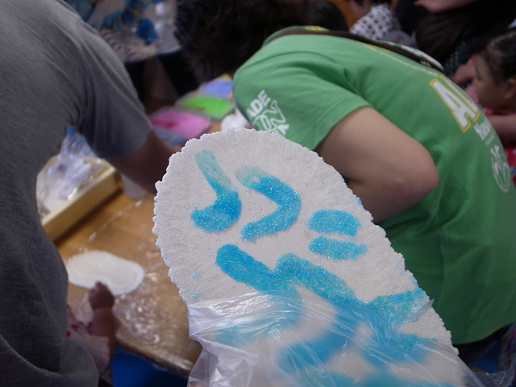
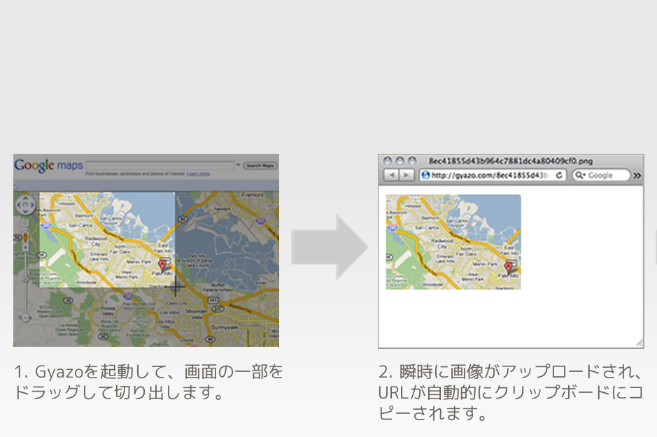
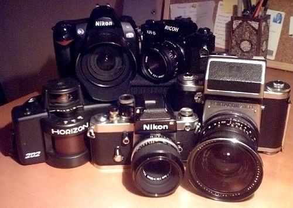
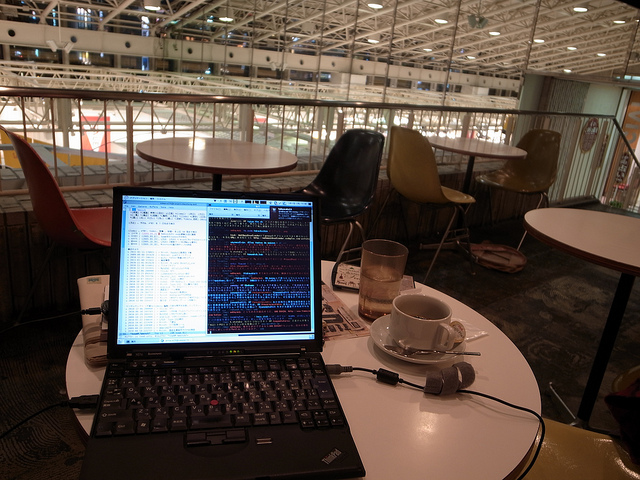

# Gyazoっぽい何か

Kiwamu Okabe

# 自己紹介

* twitter: @master_q
* 職業: コピペプログラマ
* Haskellerめざして修行中

# Gyazoってありますよね

スクリーンショットを取ると公開URLがひょい

# でもGyazoサーバ画像管理できない

flickrみたいに写真を管理したい

# テキトーに作ればいいんじゃネ？

。。。できました!

https://gitorious.org/masterq-utils/

masterq-utils/blobs/master/fyazo

# 使い方

* "fyazo"とコンソールから打って起動
* 3秒後に領域選択モードになる
* マウスでエリア選択
* スクリーンショットがFlickrにアップロード
* FlickrのURLがブラウザで開く

# その他: 画面

* 1: 左:Emacs + 右:mlterm
* 2: chromium
* 3: その他
* 4: rdesktopでWindows (会社だけ)

あ、あとDebian使ってます。

# その他: Emacs

* Lotus Notesリンク対応
* Howm + Dropbox
* ghc-mod + flymake

# その他: 仮想環境

* kvm + qemu + gdb = ソフトウェアICE

http://d.masterq.net/?date=20110207

にgdbの使い方書いたよ!

# その他: プレゼンツール

https://gitorious.org/carettah

* このプレゼンもCarettahでお送りしてます
* markdown形式で書く
* Wiiリモコンで操作もできるよ!

# 宣伝: コミケで関数型同人誌が出る!

http://www.paraiso-lang.org/ikmsm/

からサンプルpdfが見れます。

* 4章: 加速しなイカ？ <= GPGPUの話

が注目記事ですヨ!
