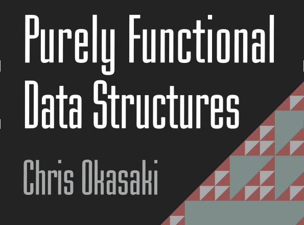

# PFDS読書会 #1

Kiwamu Okabe

# 自己紹介

* twitter: @master_q
* 職業: コピペプログラマ
* Haskellerめざして修行中

# なぜこの本を読むのか？

* (ぼくは)遅延評価を生かせてない
* たぶんセオリーを理解していないから
* containersパッケージとか理解したい

# 2章 Persistence

* 関数型は破壊的代入がない
* 過去の構造を壊さずに新しい構造を作る
* 参照がなくなればオブジェクトが消える
* gitのバージョン管理みたい？

# 2-1章 Lists

# 2-2章 Binary Search Trees

# 3-1章 Leftist Heaps

