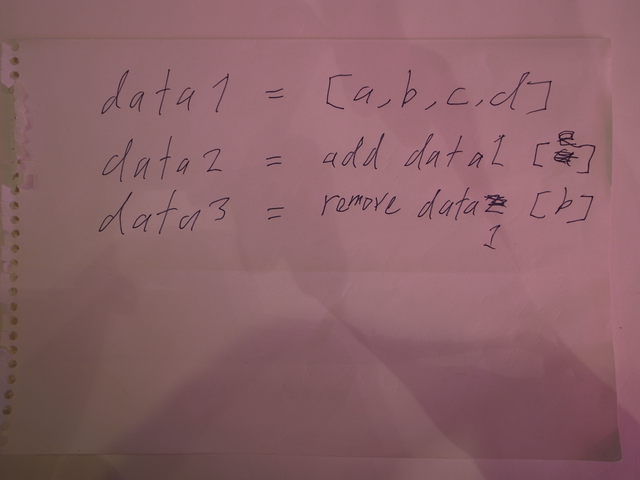
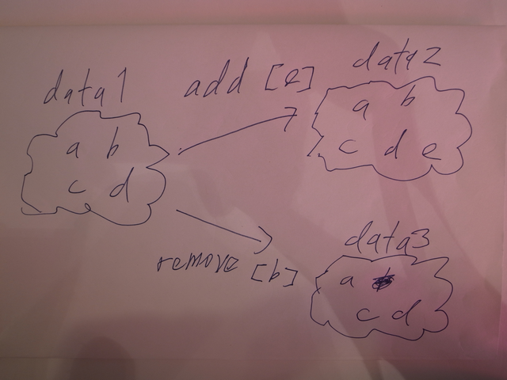
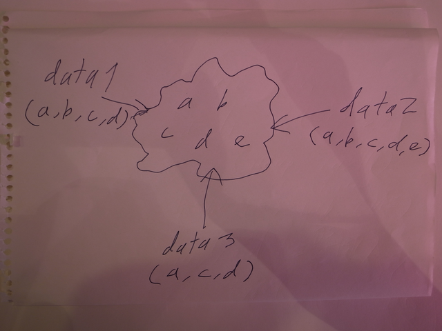
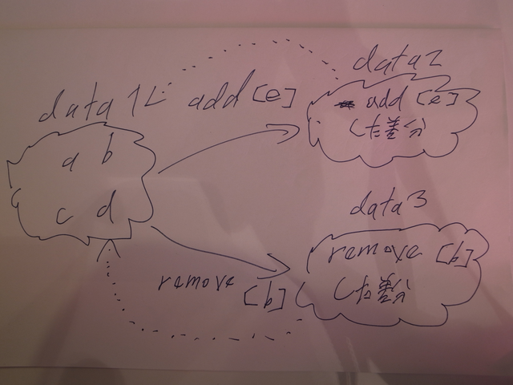
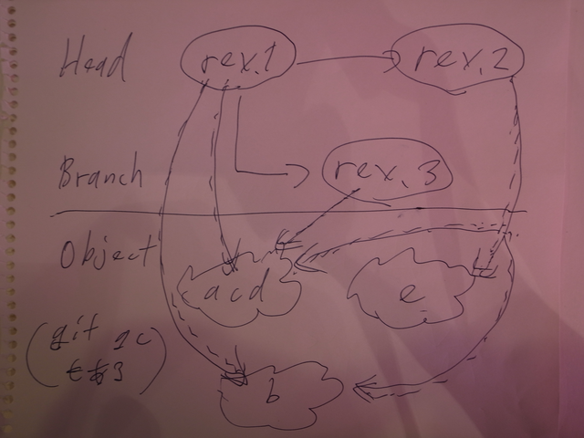
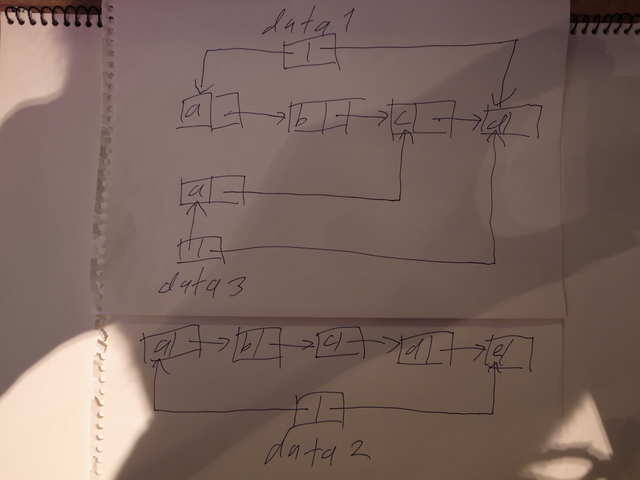
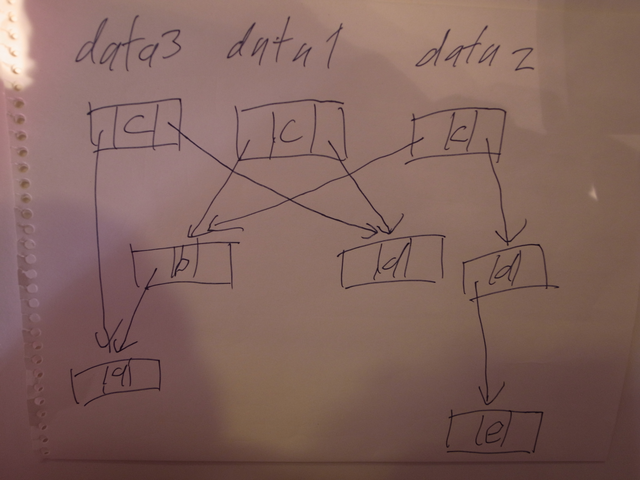

# PFDS読書会 #1

Kiwamu Okabe

# 自己紹介

* twitter: @master_q
* 職業: コピペプログラマ
* Haskellerめざして修行中

# なぜこの本を読むのか？

* (ぼくは)遅延評価を生かせてない
* たぶんセオリーを理解していないから
* containersパッケージとか理解したい
* 遅延評価を生かしたデータ構造を作りたい

# 2章 Persistence

* 関数型は破壊的代入がない
* 過去の構造を壊さずに新しい構造を作る
* 参照がなくなればオブジェクトを消す(GC)

# データ構造を更新する場合

# 頭わるいとコピペしちゃう。。。

# 一つのデータ構造を皆が参照する

# じゃー差分管理すればいいんじゃネ？

# gitオブジェクトモデルと似てる？

# 2-1章 Lists

* 2つのリストを連結すると旧ver壊れる
* 更新したオブジェクトへの参照元をコピペ
* そうすれば旧ver壊れない

# あんまり空間効率いくない

# 2-2章 Binary Search Trees

* 更新したオブジェクトへの参照元をコピペ
* (たぶんこの法則はどんな構造でも不変)

# リストより空間効率がイイ!

# この調子で考えれば...

* 空間効率が良い
* persistentな

最強のデータ構造を作れるんじゃなイカ？

# 3-1章 Leftist Heaps

@propellaさんのステキ記事

* Leftist Heap - 言語ゲーム
* http://bit.ly/nf5Qlk

persistentになってる？
