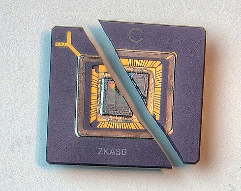
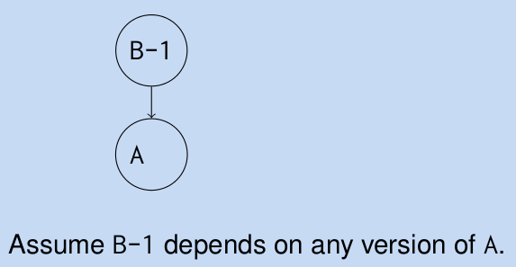
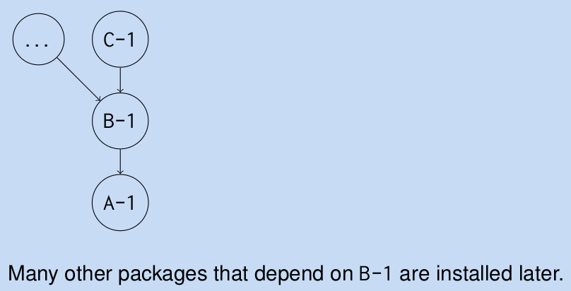
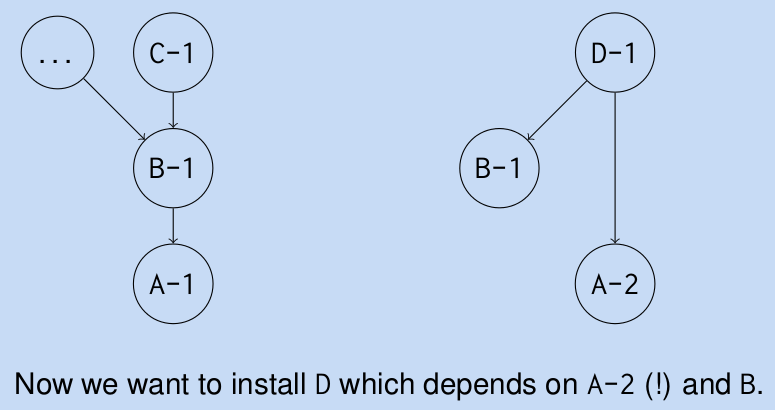
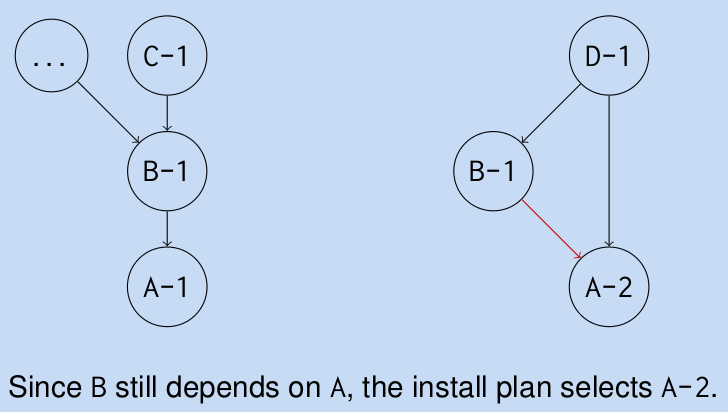
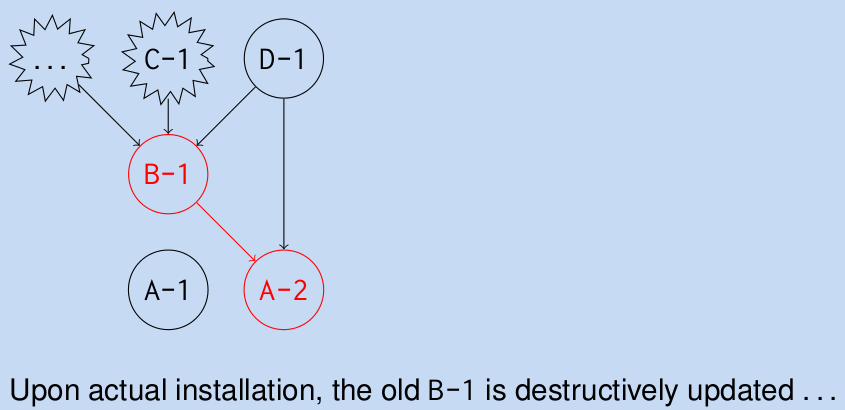
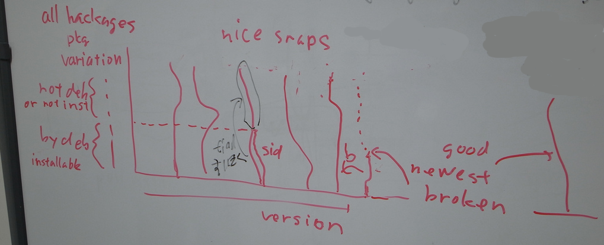
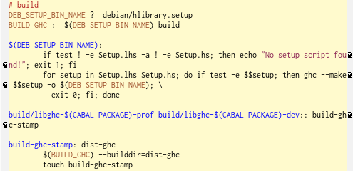
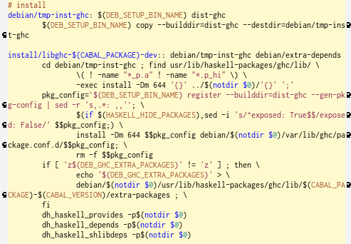

# HaskellとDebianの辛くて甘い関係

Kiwamu Okabe

# 自己紹介

* twitter: @master_q
* http://www.masterq.net/
* 職業: コピペプログラマ
* Haskell忍者になるべく修行中
* (NINJA:=No Income No Job or Asset)
* あとPerl忍者リスペクト

# Haskellを知っていますか？

いくつもの特徴を持った関数型言語です。

ちょっとだけ解説します。

# 静的型付け

* 全てのデータ/関数には型がついている
* 型が合わないとエラー
* 暗黙の型変換なんてもんはない
* "型による設計"
* 今まで動作時エラーだったものが、、、
* コンパイル時エラーになる。やった!

# 型推論

* 全部の関数に型書かなくてもOK
* たまーに推論失敗するけど。。。
* 公開関数には型書こう
* where内の非公開関数は省略がいいかも
* hlintの言うことは聞いとけ

# 型クラス

returnとか作れるよ

~~~ { .haskell }
class Functor f => Applicative f where
  return :: a -> f a
instance Applicative [] where
  return a = [a]
instance Applicative Maybe where
  return a = Just a
~~~

おっしゃれー

# パターンマッチ

* 型 + パターンマッチ = 表現力∞

もうこんなの嫌

~~~ { .c }
switch (l->l_stat) {
case LSRUN:
        if (l->l_swtime > outpri2) {
                outl2 = l;
                outpri2 = l->l_swtime;
        }
        break;
~~~

# 遅延評価

* 本当に必要になるまで評価されない
* 無限再帰構造を持つ純粋世界は作れる
* 現実世界(=IOモナド)が純粋世界を手招き
* 手招きされた分のみ純粋世界が評価される
* 使用上の注意をよく読み用法用量を守って

# コンパイルして実行

* runhaskellでインタプリタ的にも使える
* でもコンパイルしてしまえば環境を選ばない
* Haskell環境のないサーバに直バイナリOK
* コンパイラだから最適化によっては速いかも

# 読みやすく、書きやすい文法

where厨になることうけあいです

~~~ { .haskell }
data Tree a   = Node { rootLabel :: a,
                                   subForest :: Forest a }
type Forest a = [Tree a]
flatten :: Tree a -> [a]
flatten t = squish t []
   where squish (Node x ts) xs = x:foldr squish xs ts
~~~

# ghciでインタラクティブ ラブ

~~~
$ sudo apt-get install haskell-platform
$ rehash
$ ghci
GHCi, version 7.0.4: http://www.haskell.org/ghc/ :? for help
Loading package ghc-prim ... linking ... done.
Loading package integer-gmp ... linking ... done.
Loading package base ... linking ... done.
Prelude> print $ fmap \
               (foldr (++) "" . flip replicate "hoge") [1..3]
["hoge","hogehoge","hogehogehoge"]
~~~

# cabalを使えばよりどり緑

* Hackage := Haskellのライブラリ
* Ruby gemみたいな感じ
* 使い方: "cabal install ライブラリ名"
* 依存したHackageを芋蔓式にインストール

# Debianならcabal使うのも簡単!

~~~
$ sudo apt-get install cabal-install
$ rehash
$ cabal update
$ cabal install carettah
$ ~/.cabal/bin/carettah
carettah version 0.0.4
~~~

haskell-platformをインストールすれば

cabal-installは自動でインストールされるけど

# でもcabalには色々不都合が...

Ruby gemとか使ってればよくある日常

~~~
$ sudo gem update
$ sudo gem install earchquake
# 月日は流れ、 、そしてある日、 、
$ sudo gem update
~~~

これで以前インストールしていたearchquake

パッケージは依存ライブラリを含めて最新版に

なる

# yesod hackageのあるある (続く)

~~~
$ cabal update # ローカルの Hackage データベースを更新
$ cabal install yesod
# 後日 yesod を最新版に更新しようと思いたつ
$ cabal upgrade
--snip--
The 'cabal upgrade' command has been removed
because people found it confusing and it often
led to broken packages.
--snip-- # なにこれーーーーー!？
~~~

# yesod hackageのあるある (完)

~~~
# しょうがない、必要なパッケージだけ更新しよう
$ cabal install yesod
# yesod が動作しなかったり、依存関係を cabal が自動解決しない
# とりあえず cabal でインストールした Hackage を全部消そう
$ rm -rf ~/.ghc ~/.cabal
$ cabal update
$ cabal install yesod
# さっきの yesod のバグが再現しない。ふつーに動いとる。
# なぜだーーーーーーーーーーーーーーーー!?
~~~

# これじゃあ、、、 #orz

せっかくセットアップしても

経年変化で環境がもくずと消える。。。

* orz
* orz orz
* orz orz orz
* orz orz orz orz
* orz orz orz orz orz

# どーしてcabalはこんななの？

それはそれはいくつもの問題があるんじゃよ

* cabalのしくみの問題
* Hackage作者達の文化の問題

の2つに大別されます。

# Hackage 作成の文化的問題

~~~
$ cabal info yesod
--snip--
    Versions available: 0.6.7, 0.7.2, 0.7.3, 0.8.0, 0.8.1, 0.8.2,
                        0.8.2.1, 0.9.1, 0.9.1.1 (and 35 others)
--snip--
    Dependencies:  yesod-core >=0.9.1.1 && <0.10, yesod-auth ==0.7.*,
                   yesod-json ==0.2.*, yesod-persistent ==0.2.*,
                   yesod-form ==0.3.*, monad-control ==0.2.*,
~~~

上限バージョンを決めてしまうんだ。。。 #orz

# cabal の実装上の問題 #1

B-1パッケージがAパッケージに依存

# cabal の実装上の問題 #2

B-1をインストールするとA-1も一緒に入る

# cabal の実装上の問題 #3

B-1に依存したHackage群をインストール

# cabal の実装上の問題 #4

A-2に依存しているD-1をインストール...

# cabal の実装上の問題 #5

A-1のかわりにA-2をインストールすることに

# cabal の実装上の問題 #6

B-1に依存していたHackageが依存が壊れる

# Haskellの外をcabalは感知しない

hcwiid hackageを例に取ると...

* hcwiid hackageはlibcwiid-devに依存
* cabal install hcwiidしても...
* 自動でapt-get install libcwiid-dev？
* するワケない。。。auto-aptたん。。。 orz

# Hackage群全てを最新にはできない

yesod, hakyll, hamletを例に取ると...

* yesod-0.9.2はhamlet-0.10.*に依存
* hakyll-3.2.0.8はhamlet-0.{7,8}.*に依存
* yesodとhakyllを同時に使えない？
* orz (今は改善されました)

# 妄想: @khibinoさんのアイデア

可能性の中から最新を選択してくれたらイイナ

そしたらcabalさん最強!

# そこでDebian DEATHよ!

* 最強のcabalができるまでどうすれば、、、
* cabalダメならdeb化しちゃえばイイじゃない
* Haskell以外のライブラリに紐づけ可だし

# Hackageのdeb化 #1

Haskellパッケージ化環境整備

~~~
$ sudo apt-get install \
   haskell-debian-utils haskell-devscripts
~~~

debhelperななにかがインストールされる。

# Hackageのdeb化 #2

cabal-debianでdebianディレクトリ作成

~~~
$ wget http://hackage.haskell.org/packages/archive/\
   hcwiid/0.0.1/hcwiid-0.0.1.tar.gz
$ tar xfz hcwiid-0.0.1.tar.gz
$ cd hcwiid-0.0.1/
$ cabal-debian --debianize --ghc \
   --maintainer="Kiwamu Okabe <kiwamu@debian.or.jp>"
$ ls debian
changelog compat control copyright rules
~~~

# Hackageのdeb化 #3

~~~
$ debuild -rfakeroot -us -uc
$ ls ../*hcwiid*deb
../libghc-hcwiid-dev_0.0.1-1~hackage1_amd64.deb
../libghc-hcwiid-doc_0.0.1-1~hackage1_all.deb
../libghc-hcwiid-prof_0.0.1-1~hackage1_amd64.deb
~~~

* 通常使用するライブラリ
* Haddockで生成されたドキュメント
* プロファイラ対応ライブラリ　　がでけた!

# どうしてこんなに簡単なの？

debhelperの力です。

~~~
$ cat debian/rules
#!/usr/bin/make -f
include /usr/share/cdbs/1/rules/debhelper.mk
include /usr/share/cdbs/1/class/hlibrary.mk
$
~~~

ご覧の通りincludeしかないです。

# hlibrary.mk #build

cabalが普段やっていることと同じ

# hlibrary.mk #install

# どーせなら本家にdebをアップロード

* 複数台PCの環境同期めんどい
* そのうちubuntuも取り込むかもしれんし
* やっちまえ! やっちまえ!

# とりあえずDMになりましょう

* DDにならなくてもできることはアル
* 結構簡単になれる
* こちらからドゾ

http://wiki.debian.org/DebianMaintainer

# aliothのアカウントを作りましょう

* アカウントの作り方は日記に書いた
* 読んでちょ

http://d.masterq.net/?date=20100325

(あんま詳しくないかも。。。)

# pkg-haskellチームにjoinセヨ!

ボスは

* Joachim Breitner
* E-mail: nomeata@debian.org

debian-haskell@lists.debian.org 常駐？

頼まなくても活動してると勝手に登録される

# さて作りますか

http://wiki.debian.org/Haskell

をまずは熟読のこと。とりあえずITPメール。

~~~
Package: wnpp
Severity: wishlist
Owner: Kiwamu Okabe <kiwamu@debian.or.jp>
* Package name    : haskell-ansi-wl-pprint
 Version         : 0.6.3
 Upstream Author : Daan Leijen, Max Bolingbroke
* URL             : http://github.com/batterseapower/ansi-wl-pprint
* License         : BSD3
~~~

# cabal-debianコマンドでdeb化

この時、debian/controlをpkg-haskell風に

~~~
$ vi debian/control
Maintainer: Debian Haskell Group \
  <pkg-haskell-maintainers@lists.alioth.debian.org>
Uploaders: Kiwamu Okabe <kiwamu@debian.or.jp>
Vcs-Darcs: \
  http://darcs.debian.org/pkg-haskell/haskell-ansi-wl-pprint
Vcs-Browser: http://darcs.debian.org/cgi-bin/\
  darcsweb.cgi?r=pkg-haskell/haskell-ansi-wl-pprint
~~~

# debian/changelogにも注意

リリースしていないバージョンには

とりあえずUNRELEASEDマークをつけとく

~~~
haskell-ansi-wl-pprint (0.6.3-2) UNRELEASED; urgency=low

  * ITP (Closes: #644376)

 -- Kiwamu Okabe <kiwamu@debian.or.jp>  Wed, 12 Oct 2011 22:45:11 +0900

haskell-ansi-wl-pprint (0.6.3-1) UNRELEASED; urgency=low

  * Debianization generated by cabal-debian

 -- Kiwamu Okabe <kiwamu@debian.or.jp>  Wed, 05 Oct 2011 11:09:01 +0900
~~~

# darcsリポジトリを作る

debianディレクトリだけバージョン管理

~~~
$ pwd
/home/kiwamu/deb/haskell-ansi-wl-pprint/debian
$ darcs init --darcs-2
$ darcs record -a -l -m "Initial Check-In"
Finished recording patch 'Initial Check-In'
$ darcs put kiwamu-guest@darcs.debian.org:/darcs\
  /pkg-haskell/haskell-ansi-wl-pprint
Finished applying...
Put successful.
~~~

# darcsフックを設定

~~~
$ ssh kiwamu-guest@darcs.debian.org \
  /darcs/pkg-haskell/tools/add-hooks.sh \
  haskell-ansi-wl-pprint
~~~

これでコミットログが

~~~
pkg-haskell-commits@lists.alioth.debian.org
~~~

に流れるようになる。

# リリースを前提にしたお付き合い

リリース対象バージョンを決める。

debian/changelogの行を

~~~
UNRELEASED => unstable
~~~

に変更。そしてdarcs push。

~~~
$ darcs record -a
$ darcs push
~~~

さっきのフックで通報されるはず。

# するとトラッカーが検出!

~~~
http://pkg-haskell.alioth.debian.org/cgi-bin/pet.cgi
~~~

"Ready for upload"状態になる。

xxxxxxx スクリーンショット

# sponsor uploadを誰かにお願い

debian-haskell@lists.debian.org

にお願いメールすると、、、

、、、たぶんJoachimが反応する。

無事dputされてしまえば、次回からは

自分でdputできますね :)

# ということで合言葉は

お前の

* ~/.cabal
* ~/.ghc

もカラッポにしてやろか！？

# 宣伝: プレゼンツール作ってます

* http://carettah.masterq.net/
* Haskell製
* このプレゼンもCarettah使ってます!
