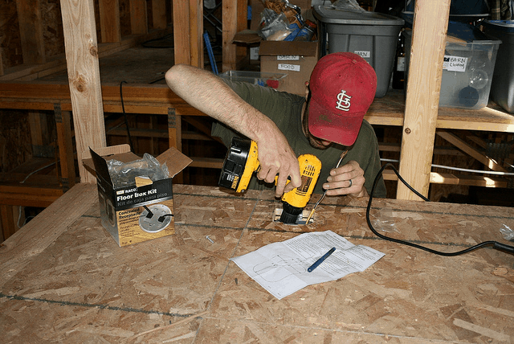
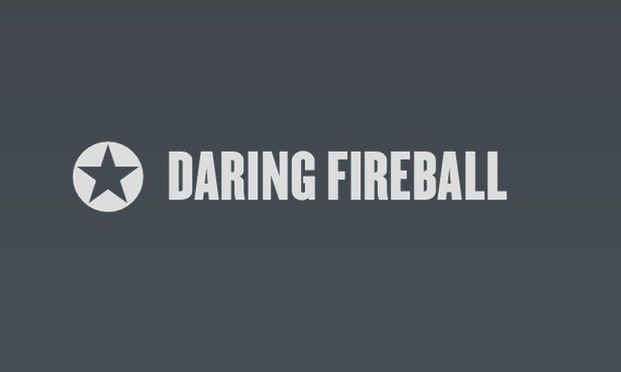
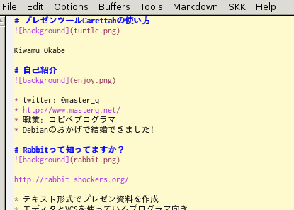
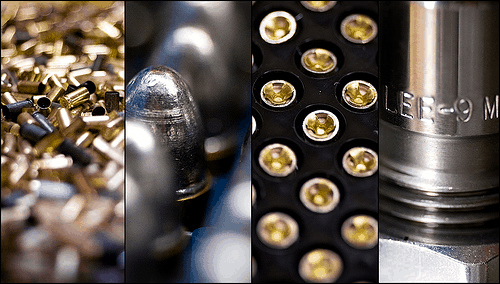
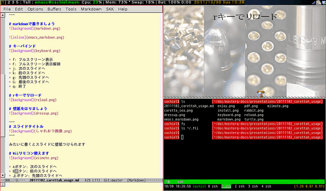
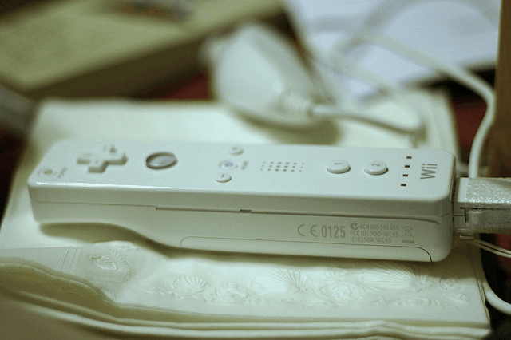

# プレゼンツールCarettahの使い方

Kiwamu Okabe

# 自己紹介

* twitter: @master_q
* http://www.masterq.net/
* 職業: コピペプログラマ
* Debianのおかげで結婚できました(5年前)

# Rabbitって知ってますか？

http://rabbit-shockers.org/

* テキスト形式でプレゼン資料を作成
* エディタとVCSを使っているプログラマ向き
* スライドの見た目をRubyでカスタマイズ

Rubyistのためのプレゼンツールなんですね

ぼくも使ってましたー

# Haskellerのためのプレゼンツール

を作りました!

* 命名 : Carettah
* http://carettah.masterq.net/

Rabbitはウサギさんだったので、亀の名前

# インストールしてみましょう

~~~
$ sudo apt-get install carettah
~~~

だけです。

。。。え？ Debian sid使ってないんですか？

~~~
http://www.debian.org/releases/sid/
~~~

そーゆー場合は以下のように手動インストール

~~~
* http://www.haskell.org/platform をインストール
* http://www.haskell.org/haskellwiki/Gtk2Hs をインストール
* http://abstrakraft.org/cwiid/ をインストール
* cabal update; cabal install carettah
~~~

# スライドひな形作成

てきとーなディレクトリで-nオプション起動

~~~
$ carettah -n hoge.md & # プレゼンウィンドウ起動
$ cat hoge.md
# Presentation Title

Your Name

# Slide Title
* item1
* item2
* item3

~~~

# markdownで書きましょう

# キーバインド

* f: フルスクリーン表示
* F: フルスクリーン表示解除
* j: 次のスライドへ
* k: 前のスライドへ
* g: 先頭のスライドへ
* G: 最後のスライドへ
* q: 終了

# rキーでリロード

# 壁紙をはりましょう

~~~
# スライドタイトル

~~~

みたいに書くとスライドに壁紙つけられます

~~~

~~~

みたいに書くとその場所に画像がはりつきます

# Wiiリモコン使えます

* Aボタン: 次のスライドへ
* Bボタン: 前のスライドへ
* 上ボタン: 先頭のスライドへ
* 下ボタン: 最後のスライドへ
* +ボタン: フルスクリーン表示
* -ボタン: フルスクリーン表示解除

# pdf化

~~~
$ carettah -o sample.md
$ evince output.pdf
~~~

これだけ。

slideshareとかにアップロードできますね

# ----- デモ -----

* デモをご覧ください

# ちょっとだけ実装の紹介

* ソース見たいところ聞いて聞いて!
