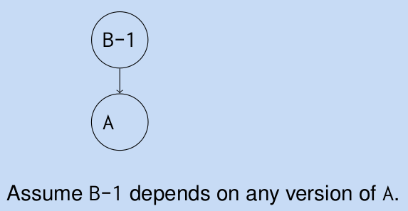
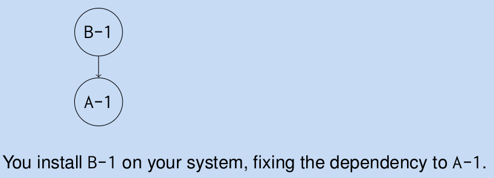
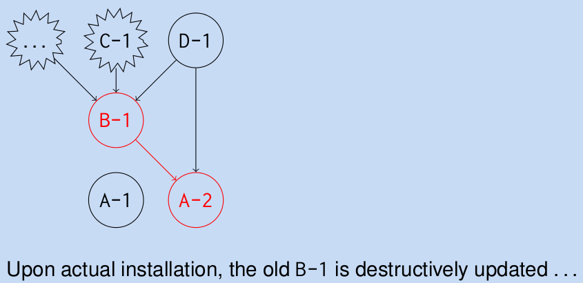
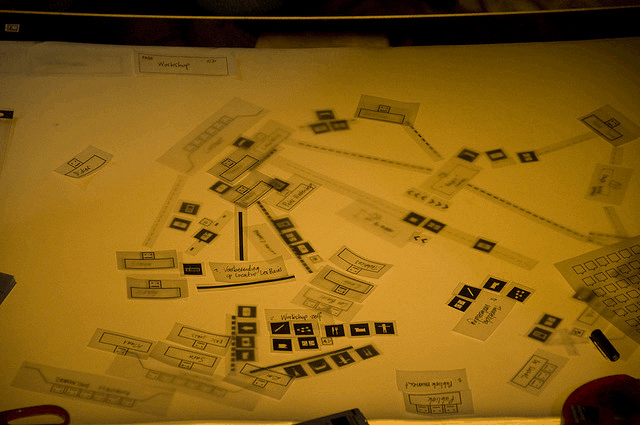
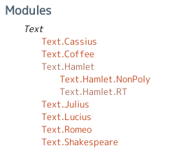
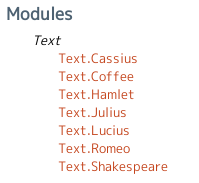
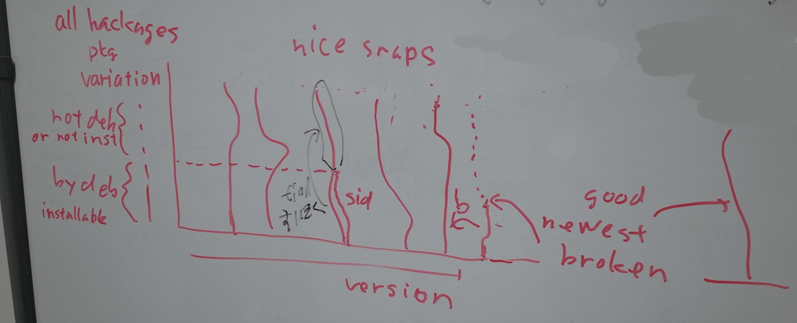
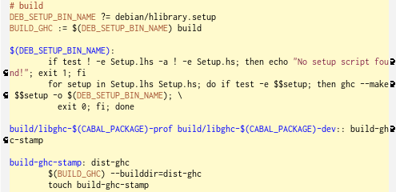

# Debian loves Haskell

Kiwamu Okabe

# Who am I?

* Name: Kiwamu Okabe
* Twitter ID: @master_q
* Web: http://www.masterq.net/
* I am a Debian Maintainer.
* I am a Haskell NINJA.
* (NINJA:=No Income No Job or Asset)

# Do you like Haskell?

* Do you like Haskell? YES!
* Do you like Hackages? YES!
* Do you like Hoogle? YES!
* Do you like Cabal? ............. no ...

You know, Cabal has many problems.....

# About Cabal

* Hackage := packaged Haskell code
* Cabal := installer of Hackage
* Cabal is like Perl's CPAN.
* Usage: "cabal install HACKAGE"
* Cabal will install Hackages depended.

# Using Cabal on Debian is easy.

~~~
$ sudo apt-get install cabal-install haskell-platform
$ cabal update
$ cabal install carettah
# ...cabal compiles the hackages...
$ ~/.cabal/bin/carettah
carettah version 0.0.4
~~~

Easy!

# In case: Ruby's gem

If you use Ruby gem,

~~~
$ sudo gem update
$ sudo gem install earthquake
# ...After some days...
$ sudo gem update
~~~

Always, you use latest applications.

# In case: Haskell's Cabal #1

~~~
$ cabal update # update Hackage database on local
$ cabal install yesod
# After some days, you will try to upgrade yesod.
$ cabal upgrade
--snip--
The 'cabal upgrade' command has been removed
because people found it confusing and it often
led to broken packages.
--snip--
~~~

...What you say?????

# In case: Haskell's Cabal #2

...OK, I try to upgrade Hackages needed.

~~~
$ cabal install yesod
# Yesod runs with BUG, or Cabal doesn't solve dependency.
# ...OK. Let's try install yesod from scratch.
$ rm -rf ~/.ghc ~/.cabal
$ cabal update
$ cabal install yesod
~~~

Yesod upgraded has problems.

Yesod installed from scratch is no BUG.

Why?????

# Why Cabal support no upgrade?

There are two types of problems.

* Problem of Hackage author's culture
* Problem of Cabal mechanism

# Problem of Hackage culture

~~~
$ cabal info yesod
--snip--
    Versions available: 0.6.7, 0.7.2, 0.7.3, 0.8.0, 0.8.1, 0.8.2,
                        0.8.2.1, 0.9.1, 0.9.1.1 (and 35 others)
--snip--
    Dependencies:  yesod-core >=0.9.1.1 && <0.10,
                   yesod-auth ==0.7.*, yesod-json ==0.2.*,
                   yesod-persistent ==0.2.*, yesod-form ==0.3.*,
                   monad-control ==0.2.*, ...
~~~

It defines upper limit of Hackage.

I think who never know future...

# Hackage versioning policy

~~~
"http://www.haskell.org/haskellwiki/
Package_versioning_policy"
~~~

Above URL explain versioning poliy.

* Example: 2.1.0.4 (A=2, B=1, C=0)
* A.B is major version number.
* C is minor version number.
* Change major version if change API.

# Problem of implementation #1

# Problem of implementation #2

# Problem of implementation #3

# Problem of implementation #4

# Problem of implementation #5

# Problem of implementation #6

# Cabal know only Haskell world.

Example: "hcwiid" Hackage

* The hcwiid depends on libcwiid-dev.
* If you run "cabal install hcwiid",
* not install libcwiid-dev automatically.
* Should we use auto-apt?

# Use latest Hackages sametime.

Example: yesod, hakyll, hamlet

* Yesod-0.9.2 depends on hamlet-0.10.*
* Hakyll-3.2.0.8 depends hamlet-0.{7,8}.*
* Can't use yesod and hakyll sametime?
* Hakyll is orphaned? No. No. No.

# hakyll used hamlet old API. #1

Hakyll use Text.Hamlet.RT API.

Hamlet 0.8.2.1 provided it.

# hakyll used hamlet old API. #2

But, Text.Hamlet.RT is removed on

hamlet 0.9.0. Hakyll can't use it.

# A dream: @khibino's idea

Upgrade is to search installable strings.

# Let's Debianize!

* We can't wait better Cabal born.
* How about Debianize Hackage?
* Debian can maintain non Haskell libs.

# Debianize Hackage #1

Setup environment to debianize Hackage.

~~~
$ sudo apt-get install \
   haskell-debian-utils haskell-devscripts
~~~

Will be installed debhelpers.

# Debianize Hackage #2

Create "debian" dir with cabal-debian.

~~~
$ wget http://hackage.haskell.org/packages/archive/\
hcwiid/0.0.1/hcwiid-0.0.1.tar.gz
$ tar xfz hcwiid-0.0.1.tar.gz
$ cd hcwiid-0.0.1/
$ cabal-debian --debianize --ghc \
   --maintainer="Kiwamu Okabe <kiwamu@debian.or.jp>"
$ ls debian
changelog compat control copyright rules
~~~

# Debianize Hackage #3

~~~
$ debuild -rfakeroot -us -uc
$ ls ../*hcwiid*deb
../libghc-hcwiid-dev_0.0.1-1~hackage1_amd64.deb
../libghc-hcwiid-doc_0.0.1-1~hackage1_all.deb
../libghc-hcwiid-prof_0.0.1-1~hackage1_amd64.deb
~~~

* Library in general use
* Document created Haddock
* Library for profiler

3 packages are builded.

# Why is it easy?

It's debhelper's power.

~~~
$ cat debian/rules
#!/usr/bin/make -f
include /usr/share/cdbs/1/rules/debhelper.mk
include /usr/share/cdbs/1/class/hlibrary.mk
$
~~~

Makefile has only 2 lines.

# hlibrary.mk #build

Above is same as Cabal's builder.

# hlibrary.mk #install

# Why don't you upload to Debian?

* Many PC setup/install is messy.
* Use apt-get, if it's uploaded in Debian.
* Perhaps, Ubuntu may pickup it.
* Go ahead! Go ahead!

# Become Debian Maintainer(DM)

* DM can upload the Debian package,
* that is already uploaded by DD.
* (DD := Debian Developer)

http://wiki.debian.org/DebianMaintainer

~~~
Note) Joachim (pkg-haskell team member) say below.
>> [Q] Can the person as not DM (Debian Maintainer) join
>> pkg-haskell team? Or they should become DM, first?
> No need to be a DM, as there are DDs around that can
> do the sponsoring.
~~~

# Get alioth account.

* Open http://alioth.debian.org/.
* Press "New Account".
* Fill form.
* You'll get guest account.

# Let's join pkg-haskell team.

Our boss is

* Joachim Breitner
* E-mail: nomeata@debian.org

Live in debian-haskell@lists.debian.org.

He'll accept you as pkg-haskell team,

if you send mail to debian-haskell ML.

# Well, debianize it for upload.

Read http://wiki.debian.org/Haskell.

Send ITP mail.

~~~
Package: wnpp
Severity: wishlist
Owner: Kiwamu Okabe <kiwamu@debian.or.jp>

* Package name    : haskell-ansi-wl-pprint
 Version         : 0.6.3
 Upstream Author : Daan Leijen, Max Bolingbroke
<batterseapower@hotmail.com>
* URL             : http://github.com/batterseapower/ansi-wl-pprint
 Vcs-Browser     :
http://anonscm.debian.org/gitweb/?p=collab-maint/haskell-ansi-wl-pprint.git
* License         : BSD3
~~~

# Debianize with cabal-debian

Write debian/control as below.

~~~
$ vi debian/control
Maintainer: Debian Haskell Group \
<pkg-haskell-maintainers@lists.alioth.debian.org>
Uploaders: Kiwamu Okabe <kiwamu@debian.or.jp>
Vcs-Darcs: \
http://darcs.debian.org/pkg-haskell/haskell-ansi-wl-pprint
Vcs-Browser: http://darcs.debian.org/cgi-bin/\
darcsweb.cgi?r=pkg-haskell/haskell-ansi-wl-pprint
DM-Upload-Allowed: yes
~~~

DM can upload DM-Upload-Allowed deb.

# And write debian/changelog

Mark changelog lines are not released,

as "UNRELEASED".

~~~
haskell-ansi-wl-pprint (0.6.3-2) UNRELEASED; urgency=low

  * repo is moved to darcs.
  * change Vcs-* lines on debian/control.

 -- Kiwamu Okabe <kiwamu@debian.or.jp>  Wed, 12 Oct 2011 22:45:11 +0900

haskell-ansi-wl-pprint (0.6.3-1) UNRELEASED; urgency=low

  * Debianization generated by cabal-debian

 -- Kiwamu Okabe <kiwamu@debian.or.jp>  Wed, 05 Oct 2011 11:14:50 +0900
~~~

# Create darcs repository

~~~
$ sudo apt-get install darcs
$ pwd
/home/kiwamu/deb/haskell-ansi-wl-pprint/debian
$ darcs init --darcs-2
$ darcs record -a -l -m "Initial Check-In"
Finished recording patch 'Initial Check-In'
$ darcs put kiwamu-guest@darcs.debian.org:/darcs\
  /pkg-haskell/haskell-ansi-wl-pprint
Finished applying...
Put successful.
~~~

Maintain only debian directory.

...Gentoo?

# Setup darcs hook

~~~
$ ssh kiwamu-guest@darcs.debian.org \
  /darcs/pkg-haskell/tools/add-hooks.sh \
  haskell-ansi-wl-pprint
~~~

Automatically commit log is sended to

~~~
pkg-haskell-commits@lists.alioth.debian.org
~~~

# Ready for release

Fix version number for release.

Mark latest line as "unstable".

~~~
$ dch -v VERSION_NUM # will be opened with editor.
~~~

And darcs push it.

~~~
$ darcs record -a
$ darcs push
Sending mail to pkg-haskell-commits@lists.alioth.debian.org...
~~~

The hook sends mail automatically.

# Package Entropy Tracker detect

~~~
http://pkg-haskell.alioth.debian.org/cgi-bin/pet.cgi
~~~

Changed to "Ready for upload" state.

# Find sponsor to upload it

If you send mail to

* debian-haskell@lists.debian.org

... Joachim will reply it.

Once it's upload by sponsor,

next time you can upload it.

# Sponsor will upload it

~~~
$ darcs get darcs.debian.org:/darcs/pkg-haskell/tools
$ tools/pkg-haskell-checkout haskell-ansi-wl-pprint
$ cd haskell-ansi-wl-pprint/
$ debuild -i -I
$ debrelease
$ debuild clean
$ cd debian/
$ darcs tag $(dpkg-parsechangelog -lchangelog |\
  grep-dctrl -n -s Version .)
$ darcs push -a
~~~

But is pkg-haskell-checkout broken?

And darcs http has bug. Use ssh plz.

# Then, let's say...

Can I remove your

* $HOME/.cabal
* $HOME/.ghc

directories?

# PR: My presentation tool

* http://carettah.masterq.net/
* made with Haskell
* A clone of http://rabbit-shockers.org/
* Now you see Carettah's presentation!
* Can "apt-get install carettah" on sid.
