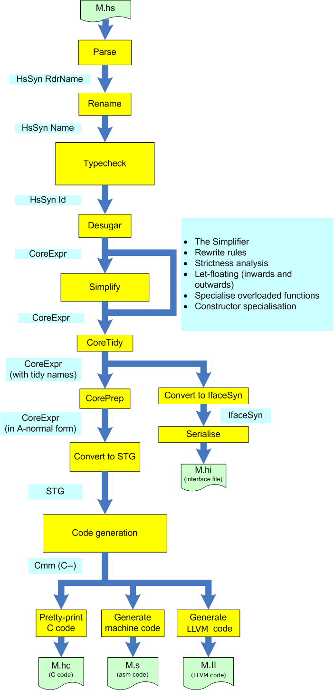
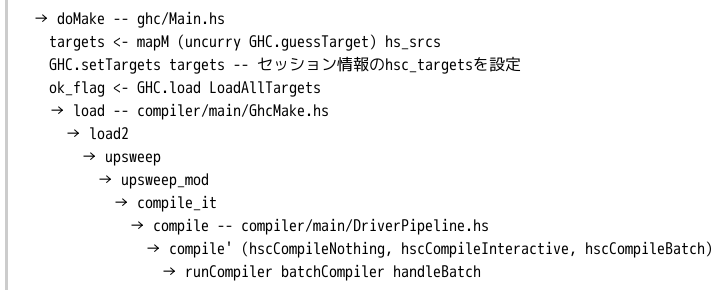
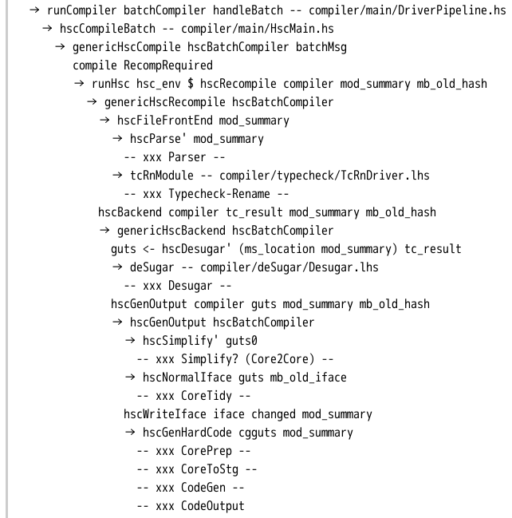
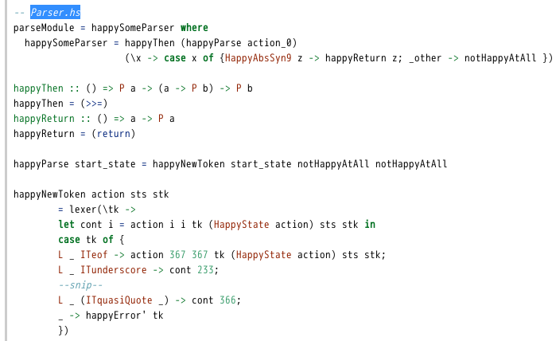
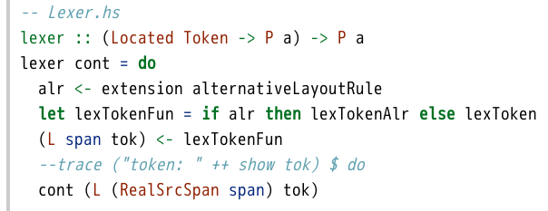

# GHCソースコード読みのススメ

Kiwamu Okabe

# なぜ人はGHCを読むのでしょう

* もっと速いコードを吐かせたい
* JVMの上で動かしたい
* libcの無い空間で動くコードを吐きたい
* 論文を書きたい

などなどの野望があるからだよ!

# GHCパイプライン

# コールグラフ1

ghc --makeした場合のコールグラフ

# コールグラフ2

# 手始めにParseが何してるのか

調べましょう!

# Parseの開始はどこ？

~~~
-- compiler/main/HscMain.hs hscParse'関数
hscParse' mod_summary = do
    dflags <- getDynFlags
    let src_filename  = ms_hspp_file mod_summary
        maybe_src_buf = ms_hspp_buf  mod_summary

    liftIO $ showPass dflags "Parser"
    {-# SCC "Parser" #-} do
    buf <- case maybe_src_buf of
               Just b  -> return b
               Nothing -> liftIO $ hGetStringBuffer src_filename

    let loc = mkRealSrcLoc (mkFastString src_filename) 1 1
    case unP parseModule (mkPState dflags buf loc) of
        PFailed span err ->
~~~

# .oO (読みすすめる上でのヒント1)

showPassとか出てきたらデカい処理

* showPass関数: verboseメッセージ表示

~~~
    liftIO $ showPass dflags "Parser"
~~~

ghc -v2 --makeした場合上記のコードは

以下のようなメッセージをコンソールに出力。

~~~
*** Parser:
~~~

# .oO (読みすすめる上でのヒント2)

{-# SCC "HOGE" #-}出てきたらデカい処理

* SCC: コスト集約点を手動で挿入

GHC開発者がコスト集約点だと思ってる、

ということは重い処理=重要な処理のはず

~~~
詳細:
http://www.kotha.net/ghcguide_ja/7.0.4/\
profiling.html#idp19148320
~~~

# .oO (読みすすめる上でのヒント3)

* dumpIfSet*関数: ダンプ表示

~~~
liftIO $ dumpIfSet_dyn dflags Opt_D_dump_parsed
       	 	       "Parser" $ ppr rdr_module
~~~

ghc -v4 --makeした場合上記のコードは

以下のようなメッセージをコンソールに出力。

~~~
==================== Parser ====================
module Queue (
        Queue(..)
    ) where
import Prelude hiding ( head, tail )
class Queue q where {
    empty :: q a;
    isEmpty :: q a -> Bool;
    snoc :: q a -> a -> q a;
    head :: q a -> a;
    tail :: q a -> q a;
    }
~~~

# Parse結果はrdr_module

~~~
hscParse' :: ModSummary -> Hsc HsParsedModule
hscParse' mod_summary = do
    dflags <- getDynFlags
--snip--
    case unP parseModule (mkPState dflags buf loc) of
        PFailed span err ->
            liftIO $ throwOneError (mkPlainErrMsg span err)

        POk pst rdr_module -> do
            logWarningsReportErrors (getMessages pst)
--snip--
            return HsParsedModule {
                      hpm_module    = rdr_module,
                      hpm_src_files = srcs2
                   }
~~~

# parseModuleがParser本体!

~~~
unP parseModule (mkPState dflags buf loc)
~~~

に注目すると、

~~~
* unP: compiler/parser/Lexer.xで定義
* parseModule: compiler/parser/Parser.y.ppで定義
* mkPState: compiler/parser/Lexer.xで定義
~~~

.xとか.y.ppとかこれらの拡張は何？

# AlexとHappy

* Lexer.x: Alexのソースコード
* Parser.y.pp: Happyのソースコード

Alexはflexみたいなlexical analyser

Happyはyaccみたいなparser generator

~~~
http://www.haskell.org/alex/
http://www.haskell.org/happy/
~~~

# GHCはMonadic Parserを使う

~~~
-- Parser.y.pp
%monad { P } { >>= } { return }
%lexer { lexer } { L _ ITeof }
%name parseModule module
%name parseStmt   maybe_stmt
%name parseIdentifier  identifier
%name parseType ctype
%partial parseHeader header
%tokentype { (Located Token) }
~~~

LexerとParserが協調動作します。(詳細は↓)

~~~
http://www.haskell.org/happy/doc/html/sec-monads.html
~~~

# Parser.hsから抜粋

# Lexer.hsから抜粋

lexer関数が継続渡しで呼び出されて、

ファイル終端までTokenをParserに渡し続ける

# Parser.y.ppの中身

~~~
module  :: { Located (HsModule RdrName) }
        : maybedocheader 'module' modid maybemodwarning \
                              maybeexports 'where' body
                {% fileSrcSpan >>= \ loc ->
                   return (L loc (HsModule (Just $3) $5 (fst $7)
                                          (snd $7) $4 $1) )}
        | body2
                {% fileSrcSpan >>= \ loc ->
                   return (L loc (HsModule Nothing Nothing
                          (fst $1) (snd $1) Nothing Nothing
                          )) }
~~~

"{% fileSrcSpan"の部分がMonadic Parser

。。。らしい。。。

# まだよくわかっていないこと

* Lexer.xの詳細
* Parser.y.ppの詳細
* Locatedって何？
