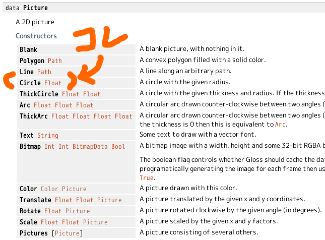

# ミラクルはすける勉強会 #0

Kiwamu Okabe

# この勉強会でやること

* Haskellってなんだか知る
* プログラミングができるようになる
* 型について知る
* Hackageを使ってみる
* Hackageに自分でパッケージ登録
* ＼（＾ｏ＾）／ 卒業！

# Haskellって何ですか？

関数型言語です。

。。。などということはどーでも良くて、

使ってみましょう!

# どうしてHaskellなんですか？

それをこの勉強会で実感するんですよ!

利点としては、、、

* コンパイラで実行速度速い
* ソースコードの行数が短かくなる
* コンパイルエラーが増えて
* ランタイムエラーが少なくなる # <= 重要!

# Haskell製プログラムあるの？

ありますってば!

~~~
* Attoparsec - 高速パーサコンビネータ
* Gitit - VCSバックエンドWiki
* Gtk2hs - Haskellから使えるGtkラッパ
* Hakyll - 静的Webサイト生成
* House - Haskell製OS
* Mighttpd - nginxぐらい速いWebサーバ
* Monadius - グラディウスっぽいゲーム
* Pandoc - ドキュメントフォーマット変換
* Yesod - RailsっぽいWebフレームワーク

その他↓にたくさん登録されてます
http://hackage.haskell.org/packages/archive/pkg-list.html
~~~

# 使ってる会社あるの？

ありますってば!

~~~
* Bluespec: SystemVerilogとSystemCのツール実装に使ってる
* Bump Technologies: モバイル向け連絡先交換のサーバサイド
* Microsoft Research: GHC(Haskellコンパイラ)の研究開発
* Qualcomm: LuaのBREWバインディングジェネレータ
* Standard Chartered Bank: デリバティブリスク分析
* Tsuru Capital: 株式トレーディング

その他:
 http://www.haskell.org/haskellwiki/Haskell_in_industry
~~~

# とりあえず本で勉強しましょう

「すごいHaskellたのしく学ぼう！」

~~~
http://www.ohmsha.co.jp/kaihatsu/archive/\
2012/03/21160230.html

"Learn You a Haskell for Great Good!: A Beginner's Guide"
の翻訳書。2012年5月新刊予定。
~~~

あれ？まだ売ってないの？？？

# じゃ5月まで何すんの？

お絵描きして遊んでみましょう!

http://gloss.ouroborus.net/

~~~
Gloss hides the pain of drawing simple vector graphics
behind a nice data type and a few display functions.
Gloss uses OpenGL under the hood, but you won't need
to worry about any of that.
Get something cool on the screen in under 10 minutes.
~~~

なにやらOpenGLでお絵描きできるそうです。

# Haskellのインストール

Debian GNU/Linux sidをお使いの方

~~~
$ sudo apt-get install haskell-platform
~~~

それ以外のディストリビューション/OSの方は

~~~
http://hackage.haskell.org/platform/linux.html
http://wiki.haskell.jp/Workshop/StartHaskell/0
~~~

から入れてみてください。

# Glossのインストール

~~~
$ cabal update
$ cabal install gloss
$ cabal install gloss-examples
~~~

cabalというコマンドが

http://hackage.haskell.org/

からGlossが依存するパッケージも取ってきて

くれます。Rubyのgemみたいな感じです。

# エディタの設定

Emacs + ghc-mod がおすすめです!

Debian GNU/Linux sidをお使いの方

~~~
$ sudo apt-get install ghc-mod
~~~

それ以外のディストリビューション/OSの方は

~~~
$ cabal install ghc-mod
~~~

した後、Emacs lispの設定をしてください。

# Gloss最初の一歩

~~~
$ ghci
GHCi, version 7.4.1: http://www.haskell.org/ghc/  :? for help
Loading package ghc-prim ... linking ... done.
Loading package integer-gmp ... linking ... done.
Loading package base ... linking ... done.
Prelude> import Graphics.Gloss
Prelude Graphics.Gloss> display (InWindow "Hoge" \
                       (200, 200) (10, 10)) white (Circle 80)
~~~

インタプリタ実行してみました。

さて。。。何が表示されるでしょうか？

# こんなウィンドウが出てきました？

xxxxxxスクリーンショット貼るxxxxxx

# コンパイルすることもできます

~~~
$ cat hellogloss.hs
import Graphics.Gloss

main :: IO ()
main = display (InWindow "Hoge" (200, 200) (10, 10))
       white (Circle 80)
$ ghc hellogloss.hs
[1 of 1] Compiling Main             ( hellogloss.hs, hellogloss.o )
Linking hellogloss ...
$ ./hellogloss
~~~

さっきと同じウィンドウが出てくるはず。

# ソース解説 #0

~~~
$ cat hellogloss.hs
import Graphics.Gloss

main :: IO ()
main = display (InWindow "Hoge" (200, 200) (10, 10))
       white (Circle 80)
~~~

部分ごとに分けて解説します。

# ソース解説:import #1

~~~
import Graphics.Gloss
~~~

Moduleのimportです。

別の名前空間にあるライブラリを

使えるようにします。

Moduleの説明はWebでも見れます。

~~~
http://hackage.haskell.org/packages/archive/gloss/latest/\
doc/html/Graphics-Gloss.html
~~~

# ソース解説:関数の型宣言 #2

~~~
main :: IO ()
~~~

最初に実行されるmain関数の型は

IO ()

ってのです。

今のところ呪文だと思ってください。

型宣言は書かなくても特に問題はありません。

# ソース解説:関数定義 #3

~~~
main = display (InWindow "Hoge" (200, 200) (10, 10))
       white (Circle 80)
~~~

main関数の中身を定義します。

* display関数の
* 第一引数に(InWindow "Hoge"...)
* 第二引数にwhite
* 第三引数に(Circle 80) を食わせてます

# ソース解説:display関数 #4

display関数ってなんぞ？

~~~
Prelude Graphics.Gloss> :t display
display :: Display -> Color -> Picture -> IO ()
~~~

* 第一引数にDisplay型の値を
* 第二引数にColor型の値を
* 第三引数にPicture型の値を突っ込むと
* IO ()型を返す # <= main関数の型と同じ!

# ソース解説:display関数 #5

実はHaddockでも型を調べられます。

# ソース解説:Display型 #6

なるほど! それで

~~~
(InWindow "Hoge" (200, 200) (10, 10))
~~~

がDisplay型になるんですね!

# ソース解説:Color型 #7

whiteは定義済みでColor型みたい。

~~~
Prelude Graphics.Gloss> :t white
white :: Color
~~~

好みの色を定義するにはmakeColor関数で。

# ソース解説:Picture型 #8

# で、結局どーなってんのよ？

