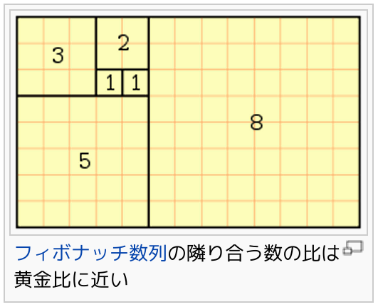

# EmacsとGlossでお絵描きしてみるよ

Kiwamu Okabe

# わたしはだれ？

* Twitter: @master_q
* Haskellはあんまり上達してない。。。
* ミラクル・リナックス株式会社 勤務
* Linuxでデジタルサイネージを作ってるー

# 今日のお題

* Emacsエディタ上の
* ghc-modという編集モードで

~~~
http://www.mew.org/~kazu/proj/ghc-mod/en/
~~~

* Glossというパッケージを使って

~~~
http://hackage.haskell.org/package/gloss
~~~

* 二次元萌え画像を作成せよ

# 環境設定: Debian sidの場合

$ sudo apt-get install ghc-mod

$ cabal install gloss

簡単〜

# 環境設定: それ以外の方

たぶんこんな感じ？

~~~
$ cabal install gloss ghc-mod
$ export PATH=$HOME/.cabal/bin:$PATH
$ cd ~/.cabal/share/ghc-mod-1.10.15
$ make
$ ls
Makefile         ghc-doc.el       ghc-func.elc    ghc-ins-mod.el
ghc-command.el   ghc-doc.elc      ghc-indent.el   ghc-ins-mod.elc
ghc-command.elc  ghc-flymake.el   ghc-indent.elc  ghc.el
ghc-comp.el      ghc-flymake.elc  ghc-info.el     ghc.elc
ghc-comp.elc     ghc-func.el      ghc-info.elc
$ vi ~/.emacs
(setq load-path (cons "/home/kiwamu/.cabal/share/ghc-mod-1.10.15"
                      load-path))
(autoload 'ghc-init "ghc" nil t)
(add-hook 'haskell-mode-hook (lambda () (ghc-init) (flymake-mode)))
~~~

@kazu_yamamoto さんに聞いて!

# 参考書

* Preludeのhaddock

~~~
http://hackage.haskell.org/packages/archive/base/latest/doc/html/Prelude.html
~~~

* Glossのhaddock

~~~
http://hackage.haskell.org/packages/archive/gloss/latest/doc/html/Graphics-Gloss.html
~~~

* Hoogle

~~~
http://www.haskell.org/hoogle/
~~~

があればなんとかなるんじゃなイカ？

# ライブコーディング開始です

Glossのhaddockに書かれている例から始めましょー

~~~ {.haskell}
import Graphics.Gloss
main = display (InWindow "Nice Window" (200, 200) (10, 10)) white (Circle 80)
~~~

# 今日作ったコード #1

~~~ {.haskell}
import Graphics.Gloss

fib :: [Float]
fib = 1:1:zipWith (+) fib (tail fib)

data Way = WLeft | WRight | WUp | WDown
next :: Way -> Way
next WLeft  = WDown
next WDown  = WRight
next WRight = WUp
next WUp    = WLeft

jumpTo :: Num t => Way -> t -> t -> (t, t)
jumpTo WLeft a b  = (-b - a, -b + a)
jumpTo WDown a b  = (b - a, -b - a)
jumpTo WRight a b = (b + a, b - a)
jumpTo WUp a b    = (-b + a, b + a)
~~~

(次ページに続く)

# 今日作ったコード #2

~~~ {.haskell}
position :: Num b => [b] -> [(b, b)]
position l = pos (0, 0) WDown (0 : l)
  where 
    pos p w (x:xs) = let p' = p `tplus` jumpTo w x (head xs)
                     in p' : pos p' (next w) xs
    pos _ _ [] = []
    tplus a b = let (f, s) = unzip [a, b] in (sum f, sum s)

putCircle :: (Float, Float) -> Float -> Picture
putCircle (x, y) r = Translate x y $ Circle r

circles :: [Float] -> Float -> Picture
circles l t = Scale s s . Pictures . take (truncate t) $ c
  where r = fmap (*5) l
        s = 10 / (1.4 ** t)
        c = zipWith putCircle (position r) r

main :: IO ()
main = animate win white $ circles fib
  where win = InWindow "MyGlossApp" (1024 `div` 2, 768 `div` 2) (0, 0)
~~~

# ちょっとウンチク

http://ja.wikipedia.org/wiki/黄金長方形

# 宣伝: HaskellやるならDebian!

* 次のリリースではghc 7.4が使えるよ
* (実はUbuntuのHaskellパッケージはDebian開発者がメンテしてるんだよ!)
* プロジェクトリーダーはOCaml使いだよ
* 関数型ならDebianだね!
* Debian勉強会やってるらしいよ
* http://tokyodebian.alioth.debian.org/
