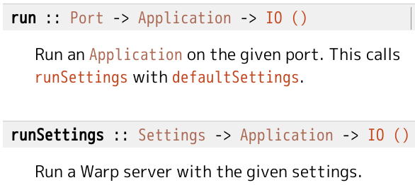
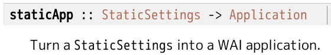
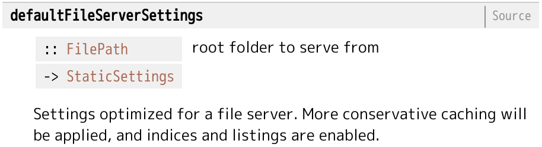

# みんなでWAIWAI Webアプリ

Kiwamu Okabe

# Web流行ってますね

猫も杓子もWebアプリ。

WebアプリをHaskellでも作れると

=> モテモテ？

# WebアプリといえばRails

近年のWebアプリは↓の連携で設計するみたい。

* Webアプリ
* Webアプリケーションフレームワーク
* Webサーバ

# アプリとサーバの連携はどうやる？

WSGIとかRackが有名みたい。

~~~
* http://www.python.org/dev/peps/pep-0333/
* http://rack.github.com/
~~~

* Webアプリケーションフレームワーク
* Webサーバ

の界面をAPI化したものらしい。

CGIしかなかった20世紀からずいぶん遠くへ。

# アプリとサーバを分離(Rackの場合)

~~~ {.ruby}
require 'rubygems'
require 'rack'

class HelloWorld
  def call(env)
    [200, {"Content-Type" => "text/html"}, "Hello Rack!"]
  end
end

Rack::Handler::Mongrel.run HelloWorld.new, :Port => 9292
~~~

みごとにcallメソッドで分離されてます。

# そーゆーのHaskellにないの？

WAIってのがありますよ。

# WAIのインターフェイス

Webアプリケーションフレームワークの例

~~~ {.haskell}
-- wai-app-static
staticApp :: StaticSettings -> Application
-- wai-app-file-cgi
cgiApp :: ClassicAppSpec -> CgiAppSpec -> CgiRoute -> Application
~~~

Webサーバの例

~~~ {.haskell}
-- warp
run :: Port -> Application -> IO ()
-- wai-extra
runSendfile :: B.ByteString -> Application -> IO ()
-- wai-handler-webkit
run :: String -> Application -> IO ()
~~~

Application型がキモ。

# じゃあ作ってみよう

ファイルの中身返すだけのWebサーバ。
使用ライブラリは以下。

* フレームワーク: wai-app-static
* サーバ: Warp

# 材料1: Warp

run関数を使えば簡単そう。

# 材料2: wai-app-static その1

Application作りたいんだけど、StaticSettingsってのはどこから？

# 材料3: wai-app-static その2

ルートディレクトリを指定したらイイ感じなStaticSettingsを作ってくれる関数発見。

# できたコード

~~~ {.haskell}
{-# LANGUAGE OverloadedStrings #-}
import Network.Wai
import Network.Wai.Handler.Warp
import Network.Wai.Application.Static

myWaiApp :: Application
myWaiApp = staticApp $ defaultFileServerSettings "."

main :: IO ()
main = run 9191 myWaiApp
~~~

http://localhost:9191 をWebブラウザで見てみましょう。

# Webサーバをすげ替えることも

~~~ {.haskell}
{-# LANGUAGE OverloadedStrings #-}
import Network.Wai
import Network.Wai.Handler.Webkit
import Network.Wai.Application.Static

myWaiApp :: Application
myWaiApp = staticApp $ defaultFileServerSettings "."

main :: IO ()
main = run "MyWaiApp" myWaiApp
~~~

Webkitのウィンドウが起動して、その中でWebアプリが動く。

# ちょっとまともなApplication

~~~ {.haskell}
{-# LANGUAGE OverloadedStrings #-}
import qualified Network.Wai as W
import qualified Network.HTTP.Types as H
import qualified Network.Wai.Handler.Warp as WP
import qualified Data.ByteString.Lazy as L

header :: H.ResponseHeaders -- [(HeaderName, ByteString)]
header = [("Content-Type", "text/plain")]

myWaiApp :: W.Application -- Request -> ResourceT IO Response
myWaiApp req | W.requestMethod req /= "GET" = return r
  where
    r = W.responseLBS H.status405 header "Only GET is supported"
myWaiApp req = return r
  where
    s = "Path:" `L.append` L.fromChunks [W.rawPathInfo req]
    r = W.responseLBS H.status200 header s

main :: IO ()
main = WP.run 9191 myWaiApp
~~~

# 参考資料

~~~
* 「(続) Haskell で Web サーバーを実装してみました」 山本和彦
  http://www.mew.org/~kazu/material/2011-mighttpd2.pdf
* 「WAI」パッケージ
  http://hackage.haskell.org/package/wai
* 「Warp」パッケージ
  http://hackage.haskell.org/package/warp
* 「wai-app-static」パッケージ
  http://hackage.haskell.org/package/wai-app-static
~~~
