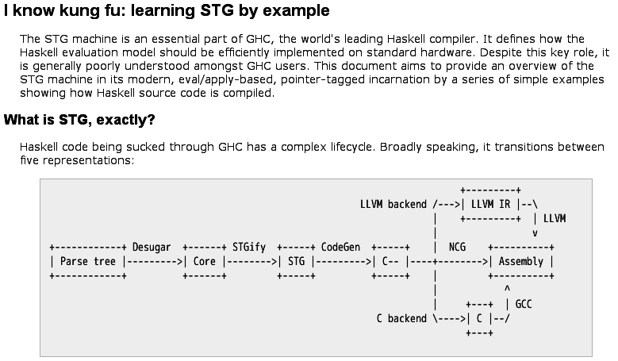
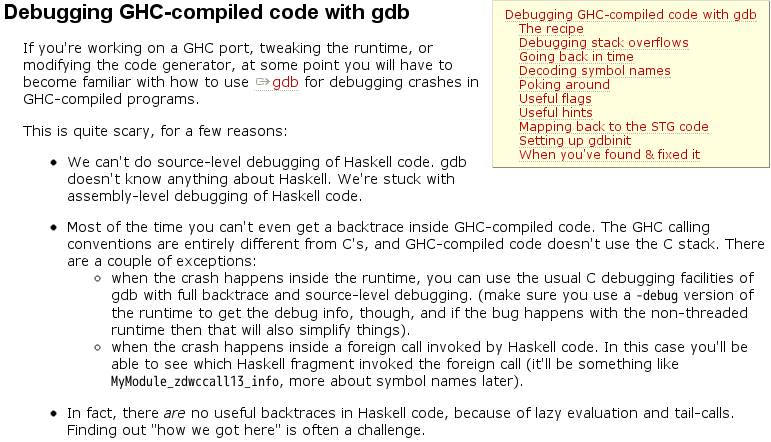
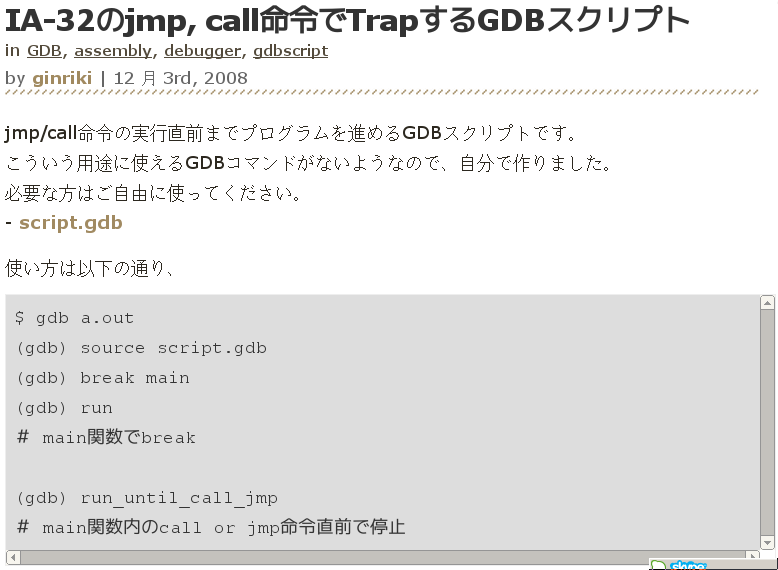

# Dive into RTS - another side

Kiwamu Okabe

# 宣伝:同人誌にRTSの話を書きました

~~~
http://www.paraiso-lang.org/ikmsm/books/c82.html
~~~

とらのあな通販で買ってね!

# 今日もRTSの話をするのですが

せっかくなので、同人誌とは別方面からRTSの解析をすすめてみようと思います。

このプレゼンでの想定環境は以下の通りです。

~~~
$ cat /etc/debian_version 
wheezy/sid
$ uname -a
Linux casper 3.2.0-3-amd64 #1 SMP Mon Jul 23 02:45:17 UTC 2012 x86_64 GNU/Linux
$ /usr/local/ghc7.4.1/bin/ghc --version
The Glorious Glasgow Haskell Compilation System, version 7.4.1
~~~

# 別方面、、、それは、、、GDB!

GHCが吐き出す実行バイナリはGDBを使って解析できます。

# GHCをソースコードからインストール

RTSにデバッグシンボルが付いてきます。

~~~
$ objdump -x /usr/local/ghc7.4.1/lib/ghc-7.4.1/libHSrts.a
--snip--
  5 .debug_info   00003a7b  0000000000000000  0000000000000000  000070dd  2**0
                  CONTENTS, RELOC, READONLY, DEBUGGING
  6 .debug_abbrev 000002eb  0000000000000000  0000000000000000  0000ab58  2**0
                  CONTENTS, READONLY, DEBUGGING
  7 .debug_loc    00001140  0000000000000000  0000000000000000  0000ae43  2**0
                  CONTENTS, READONLY, DEBUGGING
  8 .debug_aranges 00000030  0000000000000000  0000000000000000  0000bf83  2**0
                  CONTENTS, RELOC, READONLY, DEBUGGING
  9 .debug_ranges 000002f0  0000000000000000  0000000000000000  0000bfb3  2**0
                  CONTENTS, READONLY, DEBUGGING
~~~

# 適当なコードをコンパイル

~~~
$ cat Main.hs
main :: IO ()
main = putChar 'H'
$ /usr/local/ghc7.4.1/bin/ghc -eventlog -debug -rtsopts Main.hs
[1 of 1] Compiling Main             ( Main.hs, Main.o )
Linking Main ...
$ ./Main
H
~~~

ふつーのHaskellコードです。

# 天下り的にブレークポイントを決める

~~~
$ uname -a
Linux casper 3.2.0-3-amd64 #1 SMP Mon Jul 23 02:45:17 UTC 2012 x86_64 GNU/Linux
$ gdb Main
GNU gdb (GDB) 7.4.1-debian
Copyright (C) 2012 Free Software Foundation, Inc.
License GPLv3+: GNU GPL version 3 or later <http://gnu.org/licenses/gpl.html>
This is free software: you are free to change and redistribute it.
There is NO WARRANTY, to the extent permitted by law.  Type "show copying"
and "show warranty" for details.
This GDB was configured as "x86_64-linux-gnu".
For bug reporting instructions, please see:
<http://www.gnu.org/software/gdb/bugs/>...
Reading symbols from /home/kiwamu/src/DiveIntoRTS/Main...done.
(gdb) b StgRun # 天下り!
Breakpoint 1 at 0x68c9cc: file rts/StgCRun.c, line 236.
~~~

# バックトレースを取ってみると。。。

~~~
(gdb) run
Starting program: /home/kiwamu/src/DiveIntoRTS/Main
[Thread debugging using libthread_db enabled]
Using host libthread_db library "/lib/x86_64-linux-gnu/libthread_db.so.1".

Breakpoint 1, StgRunIsImplementedInAssembler () at rts/StgCRun.c:236
236         __asm__ volatile (
(gdb) bt
#0  StgRunIsImplementedInAssembler () at rts/StgCRun.c:236
#1  0x0000000000689ef5 in scheduleWaitThread (tso=0x7ffff6c05390, ret=0x0, pcap=0x7fffffffe040) at rts/Schedule.c:2154
#2  0x00000000006c75a6 in rts_evalLazyIO (cap=0x7fffffffe040, p=0x90c8a0, ret=0x0) at rts/RtsAPI.c:497
#3  0x0000000000683688 in real_main () at rts/RtsMain.c:63
#4  0x0000000000683784 in hs_main (argc=1, argv=0x7fffffffe1a8, main_closure=0x90c8a0, rts_config=...) at rts/RtsMain.c:115
#5  0x0000000000404347 in main ()
(gdb)
~~~

# なにが起きたの？

C言語のmain関数から、RTS内のStgRunという関数までのバックトレースが取れました。

RTSのC言語で書かれた部分であれば、GDBでバックトレースが取れるんです。

StgRun関数の先のコードはC言語ではなく、Cmmで記述されます。

スタックトレースを頼りにC言語部分のRTSを追ってみましょう。

# C言語のmain関数

~~~
$ /usr/local/ghc7.4.1/bin/ghc -o Main_keeptmp -keep-tmp-files -tmpdir ./tmp -eventlog -debug -rtsopts Main.hs
[1 of 1] Compiling Main             ( Main.hs, Main.o )
Linking Main_keeptmp ...
$ cat tmp/ghc20669_0/ghc20669_0.c
~~~

~~~ {.c}
#include "Rts.h"
extern StgClosure ZCMain_main_closure;
int main(int argc, char *argv[])
{
    RtsConfig __conf = defaultRtsConfig;
    __conf.rts_opts_enabled = RtsOptsAll;
    return hs_main(argc, argv, &ZCMain_main_closure,__conf);
}
__asm__("\t.section .debug-ghc-link-info,\"\",@note\n\t.ascii \"([\\\"-lHSbase-4.5.0.0\\\",\\\"-lHSinteger-gmp-0.4.0.0\\\",\\\"-lgmp
--snip--
~~~

つまりhs_main関数を呼び出すだけですね。

# C言語のhs_main関数

~~~ {.c}
int hs_main (int argc, char *argv[],     // program args
             StgClosure *main_closure,   // closure for Main.main
             RtsConfig rts_config)       // RTS configuration
{
    progargc = argc;
    progargv = argv;
    progmain_closure = main_closure;
    rtsconfig = rts_config;

#if defined(mingw32_HOST_OS)
    BEGIN_CATCH
#endif
    real_main();
#if defined(mingw32_HOST_OS)
    END_CATCH
#endif
}
~~~

これまたreal_main関数を呼び出すだけ。

# C言語のreal_main関数 前半

~~~ {.c}
static void real_main(void)
{
    int exit_status;
    SchedulerStatus status;

    hs_init_ghc(&progargc, &progargv, rtsconfig); // RTS初期化

    {
	Capability *cap = rts_lock();
        rts_evalLazyIO(&cap,progmain_closure, NULL); // main実行
	status = rts_getSchedStatus(cap);
	taskTimeStamp(myTask());
	rts_unlock(cap);
    }
~~~

RTSの初期化をしてから、rts_evalLazyIO関数でHaskellのmainクロージャーを実行。

# C言語のreal_main関数 後半

~~~ {.c}
    switch (status) { // プログラム終了要因判定
    case Killed:
      errorBelch("main thread exited (uncaught exception)");
      exit_status = EXIT_KILLED;
      break;
    case Interrupted:
      errorBelch("interrupted");
      exit_status = EXIT_INTERRUPTED;
      break;
    case HeapExhausted:
      exit_status = EXIT_HEAPOVERFLOW;
      break;
    case Success:
      exit_status = EXIT_SUCCESS;
      break;
    default:
      barf("main thread completed with invalid status");
    }
    shutdownHaskellAndExit(exit_status); // 後始末
}
~~~

# C言語のrts_evalLazyIO関数

えっと、pushClosure関数って何？

~~~ {.c}
StgTSO *createIOThread (Capability *cap, nat stack_size,  StgClosure *closure)
{
  StgTSO *t;
  t = createThread (cap, stack_size);
  pushClosure(t, (W_)&stg_ap_v_info);
  pushClosure(t, (W_)closure);
  pushClosure(t, (W_)&stg_enter_info);
  return t;
}

void rts_evalLazyIO (/* inout */ Capability **cap,
                     /* in    */ HaskellObj p,
                     /* out */   HaskellObj *ret)
{
    StgTSO *tso;
    tso = createIOThread(*cap, RtsFlags.GcFlags.initialStkSize, p);
    scheduleWaitThread(tso,ret,cap); // スレッド実行開始
}
~~~

# C言語のpushClosure関数

~~~ {.c}
INLINE_HEADER void pushClosure   (StgTSO *tso, StgWord c) {
  tso->stackobj->sp--;
  tso->stackobj->sp[0] = (W_) c;
}
~~~

なんかスタックのようなものにStgWordを積んでいる。。。そもそもStgTSOって何？

StgTSOはHaskellの世界におけるpthread_tのようなものです。
つまりpthreadのスレッドではなく、Haskellのスレッドを管理するための構造体です。

# StgTSO (Thread State Object)

Haskellスレッドのコンテキストを保存している

~~~ {.c}
typedef struct StgTSO_ {
    StgHeader          header;
    struct StgTSO_*   _link;
    struct StgTSO_*   global_link;
    struct StgStack_* stackobj; // Haskellスレッドのスタック
    StgWord16          what_next;
    StgWord16          why_blocked;
    StgWord32          flags;
    StgTSOBlockInfo    block_info;
    StgThreadID        id;
    StgWord32          saved_errno;
    StgWord32          dirty;
    struct InCall_*   bound;
    struct Capability_*       cap;
    struct StgTRecHeader_*    trec;
    struct MessageThrowTo_*   blocked_exceptions;
    struct StgBlockingQueue_* bq;
    StgWord32          tot_stack_size;
} *StgTSOPtr;
~~~

# C言語のscheduleWaitThread関数

~~~ {.c}
void
scheduleWaitThread (StgTSO* tso, /*[out]*/HaskellObj* ret, Capability **pcap)
{
    Task *task;
    Capability *cap; // Capability := 仮想CPU

    cap = *pcap;
    task = cap->running_task;
    tso->bound = task->incall;
    tso->cap = cap;
    task->incall->tso = tso;
    task->incall->ret = ret;
    task->incall->stat = NoStatus;

    appendToRunQueue(cap,tso); //CapabilityのrunqueueにStgTSOを繋ぐ
    cap = schedule(cap,task); // Capabilityをスケジュール実行

    ASSERT(task->incall->stat != NoStatus);
    ASSERT_FULL_CAPABILITY_INVARIANTS(cap,task);

    *pcap = cap;
}
~~~

# C言語のschedule関数 (cont.)

~~~ {.c}
static Capability *
schedule (Capability *initialCapability, Task *task)
{
  StgTSO *t;
  Capability *cap;
  StgThreadReturnCode ret;
  nat prev_what_next;
  rtsBool ready_to_gc;
  cap = initialCapability;
  while (1) { // main関数が終了するまでループ
    switch (sched_state) {
    case SCHED_RUNNING:
	break;
    case SCHED_INTERRUPTING:
	cap = scheduleDoGC(cap,task,rtsFalse);
    case SCHED_SHUTTING_DOWN:
	if (!isBoundTask(task) && emptyRunQueue(cap)) {
	    return cap;
	}
	break;
    default:
	barf("sched_state: %d", sched_state);
    }
~~~

# C言語のschedule関数 (cont.)

~~~ {.c}
    scheduleFindWork(cap);
    schedulePushWork(cap,task);
    scheduleDetectDeadlock(cap,task);

    t = popRunQueue(cap); // CapabilityのrunqueueからStgTSOをpop

    if (sched_state >= SCHED_INTERRUPTING &&
        !(t->what_next == ThreadComplete || t->what_next == ThreadKilled)) {
        deleteThread(cap,t);
    }
    if (RtsFlags.ConcFlags.ctxtSwitchTicks == 0
	&& !emptyThreadQueues(cap)) {
	cap->context_switch = 1;
    }

run_thread:
    cap->r.rCurrentTSO = t;
    prev_what_next = t->what_next; // このTSOが次何をすべきか？
    cap->interrupt = 0;
    cap->in_haskell = rtsTrue;
    dirty_TSO(cap,t);
    dirty_STACK(cap,t->stackobj);
~~~

# C言語のschedule関数 (cont.)

~~~ {.c}
    switch (prev_what_next) {
    case ThreadKilled:
    case ThreadComplete: // プログラム終了
	/* Thread already finished, return to scheduler. */
	ret = ThreadFinished;
	break;
    case ThreadRunGHC: // STG machineを走らせる
    {
	StgRegTable *r;
	r = StgRun((StgFunPtr) stg_returnToStackTop, &cap->r);
	cap = regTableToCapability(r);
	ret = r->rRet;
	break;
    }
    case ThreadInterpret:
	cap = interpretBCO(cap);
	ret = cap->r.rRet;
	break;
    default:
	barf("schedule: invalid what_next field");
    }
~~~

# C言語のschedule関数 (cont.)

~~~ {.c}
    cap->in_haskell = rtsFalse;
    t = cap->r.rCurrentTSO;

    if (ret == ThreadBlocked) {
        if (t->why_blocked == BlockedOnBlackHole) {
            StgTSO *owner = blackHoleOwner(t->block_info.bh->bh);
            traceEventStopThread(cap, t, t->why_blocked + 6,
                                 owner != NULL ? owner->id : 0);
        } else {
            traceEventStopThread(cap, t, t->why_blocked + 6, 0);
        }
    } else {
        traceEventStopThread(cap, t, ret, 0);
    }
    schedulePostRunThread(cap,t);
    ready_to_gc = rtsFalse;
~~~

# C言語のschedule関数 (cont.)

~~~ {.c}
    switch (ret) {
    case HeapOverflow:
	ready_to_gc = scheduleHandleHeapOverflow(cap,t);
	break;
    case StackOverflow:
        threadStackOverflow(cap, t);
        pushOnRunQueue(cap,t);
        break;
    case ThreadYielding:
        if (scheduleHandleYield(cap, t, prev_what_next)) {
	    goto run_thread;
	}
	break;
    case ThreadBlocked:
	scheduleHandleThreadBlocked(t);
	break;
    case ThreadFinished: // whileループを抜ける
	if (scheduleHandleThreadFinished(cap, task, t)) return cap; break;
    }
    if (ready_to_gc || scheduleNeedHeapProfile(ready_to_gc)) {
      cap = scheduleDoGC(cap,task,rtsFalse);
    } /* end of while() */
~~~

# StgRun: C言語 → Cmm言語

~~~ {.c}
__asm__ volatile (
    /* save callee-saves registers on behalf of the STG code. */
    ".globl " STG_RUN "\n"
    STG_RUN ":\n\t"
    "subq %0, %%rsp\n\t"
    "movq %%rsp, %%rax\n\t"
    "addq %0-48, %%rax\n\t"
    "movq %%rbx,0(%%rax)\n\t"
    "movq %%rbp,8(%%rax)\n\t"
    "movq %%r12,16(%%rax)\n\t"
    "movq %%r13,24(%%rax)\n\t"
    "movq %%r14,32(%%rax)\n\t"
    "movq %%r15,40(%%rax)\n\t"
    /* Set BaseReg */
    "movq %%rsi,%%r13\n\t"
    /* grab the function argument from the stack, and jump to it.*/
    "movq %%rdi,%%rax\n\t"
    "jmp *%%rax\n\t"
~~~

# StgReturn: Cmm言語 → C言語

~~~ {.c}
".globl " STG_RETURN "\n"
 STG_RETURN ":\n\t"
"movq %%rbx, %%rax\n\t" /* Return value in R1  */
/* restore callee-saves registers.  (Don't stomp on %%rax!) */
"movq %%rsp, %%rdx\n\t"
"addq %0-48, %%rdx\n\t"
"movq 0(%%rdx),%%rbx\n\t" /* restore the registers saved above */
"movq 8(%%rdx),%%rbp\n\t"
"movq 16(%%rdx),%%r12\n\t"
"movq 24(%%rdx),%%r13\n\t"
"movq 32(%%rdx),%%r14\n\t"
"movq 40(%%rdx),%%r15\n\t"
"addq %0, %%rsp\n\t"
"retq"
: : "i"(RESERVED_C_STACK_BYTES + 48 /*stack frame size*/));
~~~

この2つの関数でC言語<=>Cmm言語を行き来できます

# RTSのC言語部分は解った(かも)

StgRunの先、つまりCmmで書かれた部分はどうやって動くのでしょうか？

知りたい! 知りたい!

# STG Kung Fuを身に付けよう!

CmmとSTG machineの挙動については、
論文読んでもコード読んでも実感わかないので、例を見てみましょう。

功夫を覚えてばっさばっさCmmコードをなぎ倒そうぜ!

# このページの例を順番に読みましょう

~~~
http://hackage.haskell.org/trac/ghc/wiki/Commentary/Compiler/GeneratedCode
~~~

# 例1 スタックが十分確保済みの場合

~~~ {.haskell}
module KnownFun (knownApp, knownFun) where
{-# NOINLINE knownFun #-}

knownFun :: a -> a
knownFun x = x

knownApp :: () -> Int
knownApp _ = knownFun 10
~~~

↑ようなHaskellコードが↓のようなCmmに

~~~ {.c}
KnownFun_knownApp_info() {
     cdh:
         R2 = stg_INTLIKE_closure+417;
         jump KnownFun_knownFun_info ();
}
~~~

単にR2レジスタに即値を入れてジャンプ

# 例1 stg_INTLIKE_closureは何？

~~~ {.c}
#define Int_hash_static_info ghczmprim_GHCziTypes_Izh_static_info
#define INTLIKE_HDR(n)   CLOSURE(Int_hash_static_info, n)

section "data" {
 stg_INTLIKE_closure:
    INTLIKE_HDR(-16) /* MIN_INTLIKE == -16 */
    INTLIKE_HDR(-15)
    INTLIKE_HDR(-14)
/* snip */
    INTLIKE_HDR(14)
    INTLIKE_HDR(15)
    INTLIKE_HDR(16)  /* MAX_INTLIKE == 16 */
}
~~~

あ!
これghciで見たことある!
Int型だ!

~~~ {.haskell}
Prelude> :i Int
data Int = GHC.Types.I# GHC.Prim.Int#   -- Defined in `GHC.Types'
~~~

# 例2 スタックが不足している場合

~~~ {.haskell}
module KnownFun (knownApp2, knownFun2) where
{-# NOINLINE knownFun2 #-}
knownFun2 :: a -> a -> a
knownFun2 x _ = x

knownApp2 :: () -> Int
knownApp2 _ = knownFun2 10 10
~~~

↑ようなHaskellコードが↓のようなCmmに

~~~ {.c}
KnownFun_knownApp2_info() {
     cdn:
         R2 = stg_INTLIKE_closure+417;
         R3 = stg_INTLIKE_closure+417;
         jump KnownFun_knownFun2_info ();
}
~~~

ってあれ？

# 例2 Wikiに書いたるのと違う……

Wikiに書いてある時代のGHCは引数をスタック渡ししていた。

けれど、どうやらGHC 7.4.1ではレジスタ渡しになっているみたい。

~~~
＿人人 人人 人＿
＞ 突然の進化! ＜
￣Y^Y^Y^Y^Y^Y￣
~~~

もしかするとamd64版GHCを使っているからかもしれない。。。

# 例3 known functionへの部分適用

~~~ {.haskell}
module KnownFun (knownUndersaturatedApp, knownFun2) where
{-# NOINLINE knownFun2 #-}

knownFun2 :: a -> a -> a
knownFun2 x _ = x

knownUndersaturatedApp :: () -> Int -> Int
knownUndersaturatedApp _ = knownFun2 10
~~~

~~~ {.c}
KnownFun_knownUndersaturatedApp_info() {
     cdm:
         R2 = stg_INTLIKE_closure+417;
         jump KnownFun_knownFun2_info ();
}
~~~

knownUndersaturatedAppの引数は2なので部分適用でもknownFun2の引数は足りてる

# 例4 unknown function

~~~ {.haskell}
module Main where
import KnownFun

main :: IO ()
main = do
  return $! unknownApp id 10
  return ()

module KnownFun (unknownApp) where
{-# NOINLINE unknownApp #-}

unknownApp :: (Int -> Int) -> Int -> Int
unknownApp f x = f x -- fがどんな関数かコンパイル時に判別できない
~~~

~~~ {.c}
KnownFun_unknownApp_info() {
     c9Y:
         R1 = R2; // <= 何入ってるの？
         R2 = R3; // <=
         jump stg_ap_p_fast ();
}
~~~

# 例4 Cmmが使うレジスタについて

~~~
-- x86(i386)の場合
#define REG_Base  ebx
#define REG_Sp	  ebp
#define REG_R1	  esi
#define REG_Hp    edi
-- x86-64(amd64)の場合 <= 力は正義! 迷わずamd64使おう!
#define REG_Base  r13
#define REG_Sp    rbp
#define REG_Hp    r12
#define REG_R1    rbx
#define REG_R2    r14
#define REG_R3    rsi
#define REG_R4    rdi
#define REG_R5    r8
#define REG_R6    r9
#define REG_SpLim r15
#define REG_F1    xmm1
#define REG_F2    xmm2
#define REG_F3    xmm3
#define REG_F4    xmm4
#define REG_D1    xmm5
#define REG_D2    xmm6
~~~

# 例4 gdbで追ってみよう!

~~~
(gdb) b KnownFun_unknownApp_info
Breakpoint 1 at 0x4041d8
(gdb) run +RTS -V0 # タイマーシグナル無効化
Starting program: /home/kiwamu/src/DiveIntoRTS/iKnowKungFu/Example4/Main +RTS -V0
[Thread debugging using libthread_db enabled]
Using host libthread_db library "/lib/x86_64-linux-gnu/libthread_db.so.1".

Breakpoint 1, 0x00000000004041d8 in KnownFun_unknownApp_info ()
(gdb) x $r14 # REG_R2
0x8fe9d0 <base_GHCziBase_id_closure>:   0x00404cd0
(gdb) x $rsi # REG_R3
0x93db81 <stg_INTLIKE_closure+417>:     0x0000672f
~~~

R2のid関数にR3レジスタのIntの10を適用するのがstg_ap_p_fast関数(generic apply)

# 例5 見掛け引数が多すぎる場合

~~~ {.haskell}
module KnownFun (knownOversatApp, knownFun2) where
{-# NOINLINE knownFun2 #-}

knownFun2 :: a -> a -> a
knownFun2 x _ = x

knownOversatApp :: () -> Int
knownOversatApp _ = knownFun2 id id 10
~~~

~~~ {.c}
KnownFun_knownOversatApp_info() {
     cdl:
         if (Sp - 16 < SpLim) goto cdo;
         I64[Sp - 8] = stg_INTLIKE_closure+417;
         I64[Sp - 16] = stg_ap_p_info;
         R2 = base_GHCziBase_id_closure;
         R3 = base_GHCziBase_id_closure;
         Sp = Sp - 16;
         jump KnownFun_knownFun2_info ();
     cdo:
         R1 = KnownFun_knownOversatApp_closure;
         jump stg_gc_fun ();
}
~~~

# 例5 ついにスタック使ったね!

* R2とR3のみが引数レジスタみたい
* 残りはスタック渡しになるみたい(7.4.1は)
* knownFun2はid関数を2つ食う
* その後stg_ap_p_infoへジャンプ
* knownFun2が返したid関数をIntの10に適用

なんか不思議

# 例6 thunkとdataの割り当て

~~~ {.haskell}
module KnownFun (buildData) where
{-# NOINLINE buildData #-}
buildData :: Int -> Maybe Int
buildData x = Just (x + 1)
~~~

~~~ {.c}
KnownFun_buildData_info() {
     cbW:
         Hp = Hp + 40;
         if (Hp > HpLim) goto cbZ;
         I64[Hp - 32] = sbJ_info;
         I64[Hp - 16] = R2;
         I64[Hp - 8] = base_DataziMaybe_Just_con_info;
         I64[Hp + 0] = Hp - 32;
         R1 = Hp - 6;
         jump (I64[Sp + 0]) (); // どこ行くの？
     cc0:
         R1 = KnownFun_buildData_closure;
         jump stg_gc_fun ();
     cbZ:
         HpAlloc = 40;
         goto cc0;
}
~~~

# 例6 gdbで追ってみよう! (cont.)

~~~
(gdb) b KnownFun_buildData_info
Breakpoint 1 at 0x404238
(gdb) run +RTS -V0
Starting program: /home/kiwamu/src/DiveIntoRTS/iKnowKungFu/Example6/Main +RTS -V0
[Thread debugging using libthread_db enabled]
Using host libthread_db library "/lib/x86_64-linux-gnu/libthread_db.so.1".

Breakpoint 1, 0x0000000000404238 in KnownFun_buildData_info ()
(gdb) stg_step # <= 後で解説します
0x000000000040423c in KnownFun_buildData_info ()
0x0000000000404243 in KnownFun_buildData_info ()
0x0000000000404245 in KnownFun_buildData_info ()
0x000000000040424e in KnownFun_buildData_info ()
0x0000000000404253 in KnownFun_buildData_info ()
0x000000000040425c in KnownFun_buildData_info ()
0x0000000000404261 in KnownFun_buildData_info ()
0x0000000000404265 in KnownFun_buildData_info ()
0x000000000040426a in KnownFun_buildData_info ()
0x000000000069b4a0 in stg_upd_frame_info ()
(gdb) # 目的地到着。
~~~

# 例6 gdbで追ってみよう!

~~~
(gdb) x/g $rbp # REG_Sp
0x7ffff6c05328: 0x000000000069b4a0
(gdb) x/g 0x000000000069b4a0
0x69b4a0 <stg_upd_frame_info>:  0x10c5834808458b48
(gdb) x/g $rbx # REG_R1
0x7ffff6c0425a: 0x4240000000000050
(gdb) x/g $r12 # REG_Hp
0x7ffff6c04260: 0x00007ffff6c04240
(gdb) x/5g 0x7ffff6c04240 # HP - 32
0x7ffff6c04240: 0x00000000004041d8      0x0000000000000000
0x7ffff6c04250: 0x000000000093dba1      0x0000000000505f18
0x7ffff6c04260: 0x00007ffff6c04240
(gdb) x/g 0x00000000004041d8
0x4041d8 <sbJ_info>:    0x72f8394cd8458d48
(gdb) x/g 0x000000000093dba1
0x93dba1 <stg_INTLIKE_closure+417>:     0x0a00000000006730
(gdb) x/g 0x0000000000505f18
0x505f18 <base_DataziMaybe_Just_con_info>:      0x900065ff02c38348
~~~

# 例7 case式 (cont.)

~~~ {.haskell}
module KnownFun (caseScrut) where
{-# NOINLINE caseScrut #-}

caseScrut :: Maybe Int -> Int
caseScrut x = case x of Just j -> j
                        Nothing -> 10
~~~

~~~ {.c}
KnownFun_caseScrut_info() {
     cbo:
         if (Sp - 8 < SpLim) goto cbq;
         R1 = R2;
         I64[Sp - 8] = sba_info;
         Sp = Sp - 8;
         if (R1 & 7 != 0) goto cbt;
         jump I64[R1] ();
     cbq:
         R1 = KnownFun_caseScrut_closure;
         jump stg_gc_fun ();
     cbt: jump sba_info ();
}
~~~

# 例7 case式

~~~ {.c}
sba_ret() { // = sda_info
     cbk:
         _cbl::I64 = R1 & 7;
         if (_cbl::I64 >= 2) goto cbm;
         R1 = stg_INTLIKE_closure+417;
         Sp = Sp + 8;
         jump (I64[Sp + 0]) ();
     cbm:
         R1 = I64[R1 + 6];
         Sp = Sp + 8;
         R1 = R1 & (-8);
         jump I64[R1] ();
}
~~~

だんだん長くなってきた。。

# 例8 thunkのアップデート (cont.)

~~~ {.haskell}
module KnownFun (buildData) where
{-# NOINLINE buildData #-}
buildData :: Int -> Maybe Int
buildData x = Just (x + 1)
~~~

~~~ {.c}
KnownFun_buildData_info() {
     cbW:
         Hp = Hp + 40;
         if (Hp > HpLim) goto cbZ;
         I64[Hp - 32] = sbJ_info;
         I64[Hp - 16] = R2;
         I64[Hp - 8] = base_DataziMaybe_Just_con_info;
         I64[Hp + 0] = Hp - 32;
         R1 = Hp - 6;
         jump (I64[Sp + 0]) ();
     cc0:
         R1 = KnownFun_buildData_closure;
         jump stg_gc_fun ();
     cbZ:
         HpAlloc = 40;
         goto cc0;
}
~~~

# 例8 thunkのアップデート

~~~ {.c}
sbJ_info() {
     cbS:
         if (Sp - 40 < SpLim) goto cbU;
         I64[Sp - 16] = stg_upd_frame_info;
         I64[Sp - 8] = R1;
         I64[Sp - 24] = stg_INTLIKE_closure+273;
         I64[Sp - 32] = I64[R1 + 16];
         I64[Sp - 40] = stg_ap_pp_info;
         R2 = base_GHCziNum_zdfNumInt_closure;
         Sp = Sp - 40;
         jump base_GHCziNum_zp_info ();
     cbU: jump stg_gc_enter_1 ();
}
~~~

# gdb便利。もっと便利になりたい

~~~
http://hackage.haskell.org/trac/ghc/wiki/Debugging/CompiledCode
~~~

# ジャンプ手前で停止するコマンド

~~~
http://www.ginriki.net/wd/2008/12/03/48/
~~~

# 応用: STG machineステップ実行

もっと機能増やしたいですね。妄想ふくらむ

~~~
$ wget https://github.com/master-q/DiveIntoRTS/blob/master/script.gdb
$ head -15 script.gdb
define stg_startup
  break Main_main_info
  run +RTS -V0
end

define stg_step
  run_until_call_jmp
  stepi
end
--snip--
~~~

# さらに先に進むために

* もっと色々なコードを例に解析しましょう
* gdbスクリプトを整備して解析効率UP
* stg_ap_p_fastのようなapply関数の実装を調べましょう
* マルチスレッドでの挙動を調べましょう

今日使ったソースコードは↓に置いてあります。

~~~
https://github.com/master-q/DiveIntoRTS
~~~

# スライドで使用した画像について

~~~
-- ライセンスについてはリンク先を参照してください
Diving | Flickr
  http://www.flickr.com/photos/stevenworster/7984634155/
Bruce Lee | Flickr
  http://www.flickr.com/photos/ryan_fors/2230311347/
footsteps | Flickr
  http://www.flickr.com/photos/penguincakes/3341325038/
Spotlight on the M's | Flickr
  http://www.flickr.com/photos/scooty/116414915/
flickr Badges | Flickr
  http://www.flickr.com/photos/poolie/2271154446/
DSC_0404 | Flickr
  http://www.flickr.com/photos/ctomer/3766260707/
Cherry Avenue bridge is open | Flickr
  http://www.flickr.com/photos/jamesbondsv/3838186953/
sunrise | Flickr
  http://www.flickr.com/photos/smemon/5783321374/
Lightning McQueen at Radiator Springs | Flickr
  http://www.flickr.com/photos/lorenjavier/4450314484/
DebianArt.org - debian clear
  http://www.debianart.org/cchost/?ccm=/files/mdh3ll/1204
~~~
