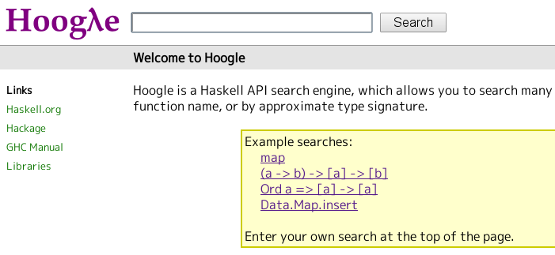
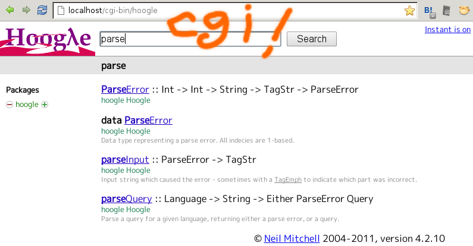
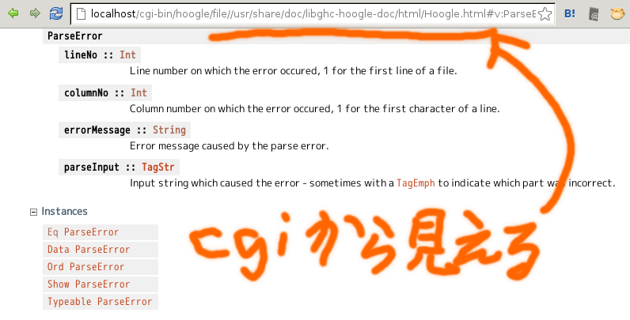
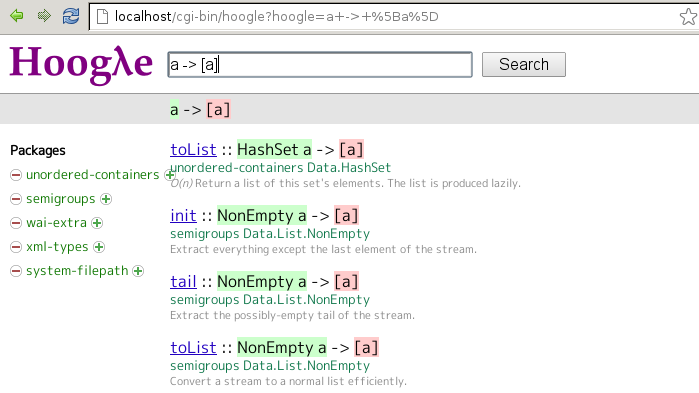

# Offline Hoogleで何処でもはすはす

Kiwamu Okabe

# フグってますか？

もちろんですよ!
毎日がエブリディ!

# でもちょっと不満が。。。

* インターネット不通でも使いたい
* 自作ライブラリを検索したい
* hoogleプロセス起動するのが面倒

とかとか

# そこでDebian!

Offline対応Hoogleパッケージが入るらしい。

~~~
$ sudo apt-get install apache2
$ sudo dpkg -i hoogle_4.2.10-2_amd64.deb
以前に未選択のパッケージ hoogle を選択しています。
(データベースを読み込んでいます ... 現在 598057 個のファイルとディレクトリがインストールされています。)
(hoogle_4.2.10-2_amd64.deb から) hoogle を展開しています...
hoogle (4.2.10-2) を設定しています ...
Starting keyword
Converting keyword... done
Finished keyword
Data generation complete
Converting databases... done
Combining 3 databases
~~~

apache2とhoogleパッケージをインストールするだけで...

# パッケージ入れるだけでフグれちゃう!

# ローカルドキュメント読めちゃう!

# いやーDebianっていいもんですね!

おわり

# だとヒドすぎるので

しくみを解説します。

まず、Offline対応Hoogleをgit cloneしましょう。

~~~
$ pwd
/home/kiwamu/src
$ git clone git://github.com/master-q/hoogle.git
$ cd hoogle/
$ git checkout -b cgi_application origin/feature/cgi_application
~~~

# ちょっと危険なpatchをあてます

ローカルのファイル群が全部CGI経由で読めちゃう。危険!

~~~ {.patch}
$ git diff
diff --git a/src/Web/All.hs b/src/Web/All.hs
index 97295bf..d9755d1 100644
--- a/src/Web/All.hs
+++ b/src/Web/All.hs
@@ -24,7 +24,7 @@ action q = do
     where
       go t d p | "/res/" `isPrefixOf` p =
         serveFile True $ d </> "resources" </> takeFileName p
-      go t d p | "/file/usr/share/doc/" `isPrefixOf` p =
+      go t d p | "/file/" `isPrefixOf` p =
         let p' = if "/" `isSuffixOf` p then p ++ "index.html" else p
         in rewriteRootLinks =<< serveFile False (fromJust (stripPrefix "/file" p'))
       go t _ _ = rewriteRootLinks =<< response responseArgs{templates=t} q
~~~

# Hoogleをビルドしまっしょ

~~~
$ pwd
/home/kiwamu/src/hoogle
$ cabal install
--snip--
$ ls ~/.cabal/bin/hoogle
/home/kiwamu/.cabal/bin/hoogle*
$ ls ~/.cabal/share/hoogle-4.2.13
resources/
~~~

その後テンプレートをCGI対応させましょう。

~~~
$ ./misc/template-for-cgi
~~~

# Hoogle Databaseを生成

~~~
$ ./misc/update-hoogle
--2012-10-13 16:54:50--  http://www.haskell.org/haskellwiki/Keywords
www.haskell.org (www.haskell.org) をDNSに問いあわせています... 78.46.100.180
www.haskell.org (www.haskell.org)|78.46.100.180|:80 に接続しています... 接続しました。
--snip--
2012-10-13 16:54:52 (48.8 KB/s) - `download/keyword.txt' へ保存終了 [81442]

Starting keyword
Converting keyword... done
Finished keyword
Data generation complete
Converting databases........................................ done
Combining 137 databases
~~~

keyword.txtを取得するのだけネット使う

# CGIの設定

たぶんこんな感じ。

~~~
$ cd /usr/lib/cgi-bin
$ sudo cp ~/.cabal/bin/hoogle ./
$ ls -l hoogle
-rwxr-xr-x 1 root root 17085624 10月 13 17:04 hoogle*
~~~

あと/etc/apache2/apache2.confとかいじらないといけないかもしれない。

# 後はブラウザで読みまくるだけさー

やったね!

