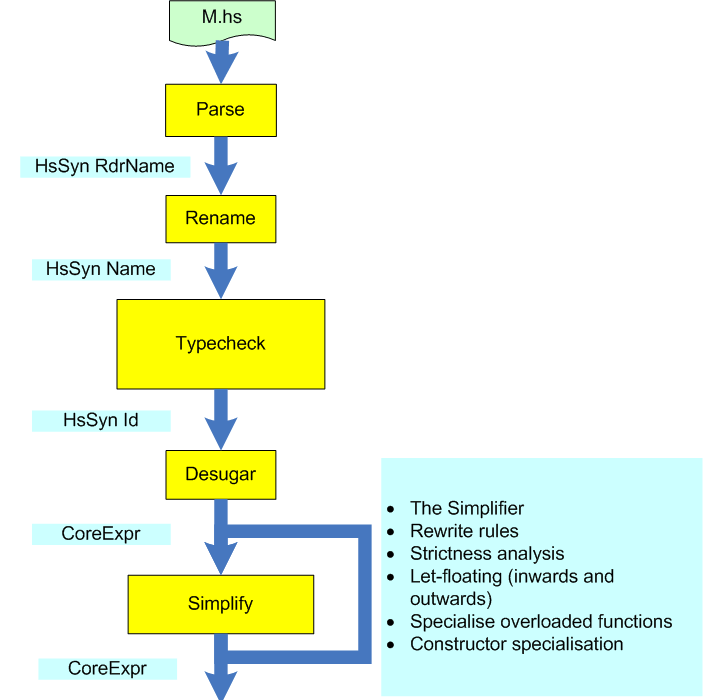
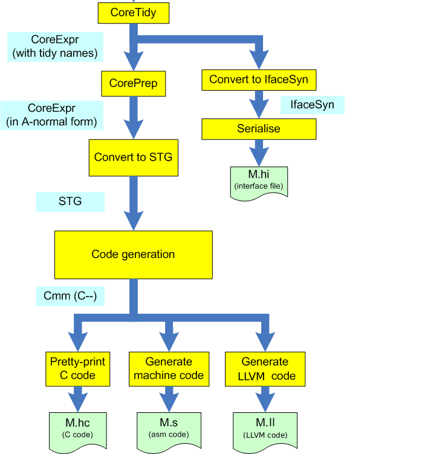
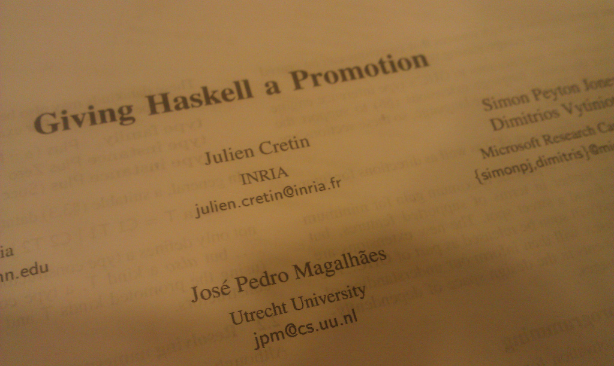
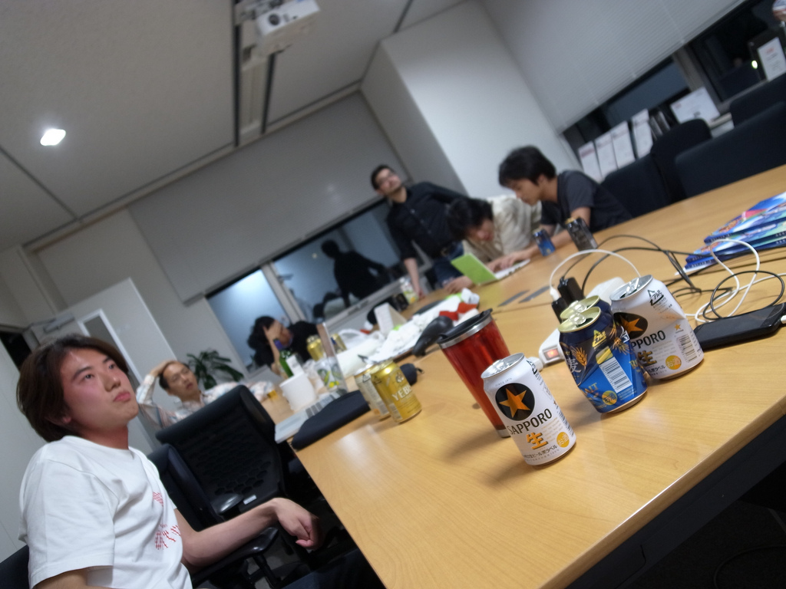
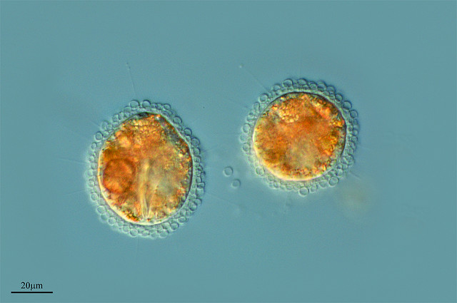

# #readghc なう

Kiwamu Okabe

# あんた誰？

* Twitter: @master_q
* ミラクル・リナックス勤務
* 前はコピー機のOSをNetBSDで作ってた
* デジタルサイネージのソフト開発してます
* OSSに興味のある{エンジニア,インターン}募集中です!

# readghcって？

GHCというHaskellのコンパイラのソースコードを読む勉強会です。

* コンパイラ!
* 関数型!
* Haskell!

萌え死ぬー

# GHCの内部構造(cont.)

# GHCの内部構造

# 第0回なうed

* パーサ部分を読んでみたよ
* GHCの改造をしたことがある研究者を読んで発表してもらったよ

# 第1回なうed

* GCを読んでわかったとこだけ発表したよ
* LLVM IRのコード生成器の詳細を解説してもらったよ
* コンパイラにヲレヲレコード最適化を仕込む方法を教えてもらったよ
* ランタイムについてわかったとこだけ発表したよ

# 順調に発表が増えている

倍増!

# この成長(=なう)を維持するために

* あなたの力が必要です!
* 発表者が確保できないと"なう"できません
* @master_q まで連絡お待ちしています!

~~~
http://wiki.haskell.jp/Workshop/ReadGHC/
~~~
