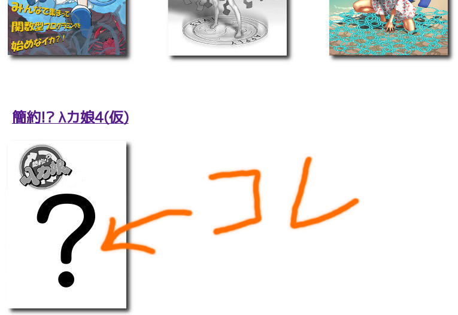
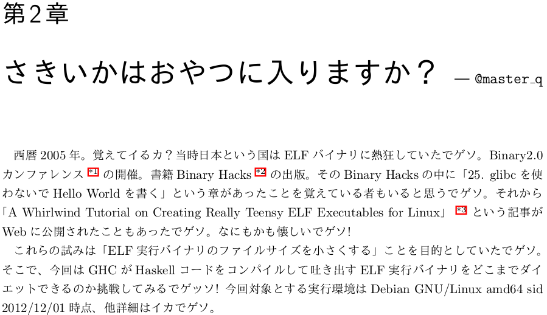
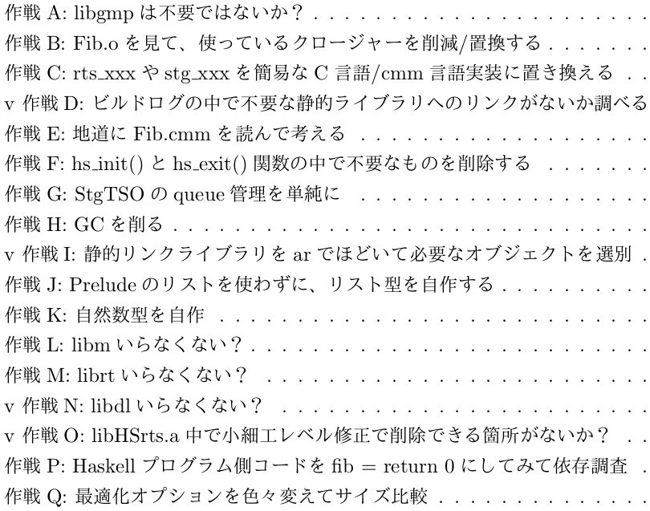
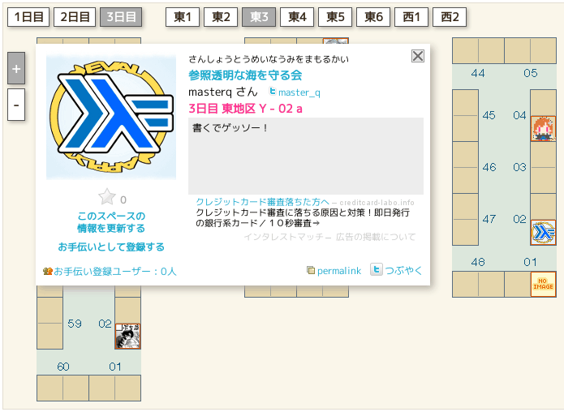

# C83 λカ娘の販促にやってきました

Kiwamu Okabe

# あんた誰？

* Twitter: @master_q
* ミラクル・リナックス勤務
* 前はコピー機のOSをNetBSDで作ってた
* デジタルサイネージのソフト開発してます
* OSSに興味のある{エンジニア,インターン}募集中です!

# 参照透明な海を守る会メンバーは

λカ娘4巻を今執筆中です。
コミックマーケット83にて配布予定です。

~~~
http://www.paraiso-lang.org/ikmsm/books/c83.html
~~~

# どんな記事になりそう？

ぼくの記事だけさらっと紹介します

# はじまり

# 今の体型 Haskellサイド

~~~ {.haskell}
-- File: Fib.hs
module Fib where
import Foreign.C.Types

foreign export ccall fib :: CInt -> IO CInt

fibonacci :: [CInt]
fibonacci = 1:1:zipWith (+) fibonacci (tail fibonacci)

fib :: CInt -> IO CInt
fib n | 0 <= n && n <= 40 = return $ fibonacci !! fromIntegral n
      | otherwise = return 0
~~~

# 今の体型 C言語サイド

~~~ {.c}
/* File: CMain.c */
#include <stdio.h>
#include "HsFFI.h"
#ifdef __GLASGOW_HASKELL__
#include "Fib_stub.h"
#endif

int main(int argc, char *argv[])
{
	int i;

	hs_init(&argc, &argv);
	for (i = 0; i < 30; i++) {
		printf("%d\n", fib(i));
	}
	hs_exit();
	return 0;
}
~~~

# ダイエット指標1

text/data/bssセクションの合計サイズをダイエット

~~~
$ make
gcc -I/usr/lib/ghc/include -c CMain.c
/usr/local/ghc7.6.1/bin/ghc -O2 -c Fib.hs
/usr/local/ghc7.6.1/bin/ghc -O2 -no-hs-main CMain.o Fib.o -o FibHs
$ size FibHs
   text    data     bss     dec     hex filename
2784310  290592   47960 3122862  2fa6ae FibHs
~~~

# ダイエット指標2

実行バイナリがリンクしているライブラリ数をダイエット

~~~
$ ldd FibHs
  linux-vdso.so.1 =>  (0x00007fffaefff000)
  libgmp.so.10 => /usr/lib/x86_64-linux-gnu/libgmp.so.10 (0x00007f625b0ee000)
  libm.so.6 => /lib/x86_64-linux-gnu/libm.so.6 (0x00007f625ae6c000)
  librt.so.1 => /lib/x86_64-linux-gnu/librt.so.1 (0x00007f625ac63000)
  libdl.so.2 => /lib/x86_64-linux-gnu/libdl.so.2 (0x00007f625aa5f000)
  libgcc_s.so.1 => /lib/x86_64-linux-gnu/libgcc_s.so.1 (0x00007f625a849000)
  libc.so.6 => /lib/x86_64-linux-gnu/libc.so.6 (0x00007f625a4be000)
  libpthread.so.0 => /lib/x86_64-linux-gnu/libpthread.so.0 (0x00007f625a2a2000)
  /lib64/ld-linux-x86-64.so.2 (0x00007f625b394000)
$ ldd FibHs | wc -l
9
~~~

# ダイエット指標3

実行バイナリ内の未解決シンボル数をダイエット

~~~
$ nm FibHs
--snip--
0000000000669d8e t dlmmap_locked
000000000066a08b t dlmunmap
                 U dlopen@@GLIBC_2.2.5
00000000006698a8 t dlpvalloc
000000000066978a t dlrealloc
                 U dlsym@@GLIBC_2.2.5
0000000000669877 t dlvalloc
--snip--
$ nm FibHs | grep -c "U "
175
~~~

# RTSの中で不要コード削除したよ

* セクション合計サイズ(Byte):

3122862 => 3046840

* 動的リンクライブラリ数:

9 => 8 (libdl.so.2へのリンク削除)

* 未解決シンボル数:

175 => 145

# ダイエット作戦はまだまだある!

# 是非 参照透明な海を守る会ブースへ!

~~~
http://twitcmap.jp/?id=0083-3-YYa-02-a
~~~

