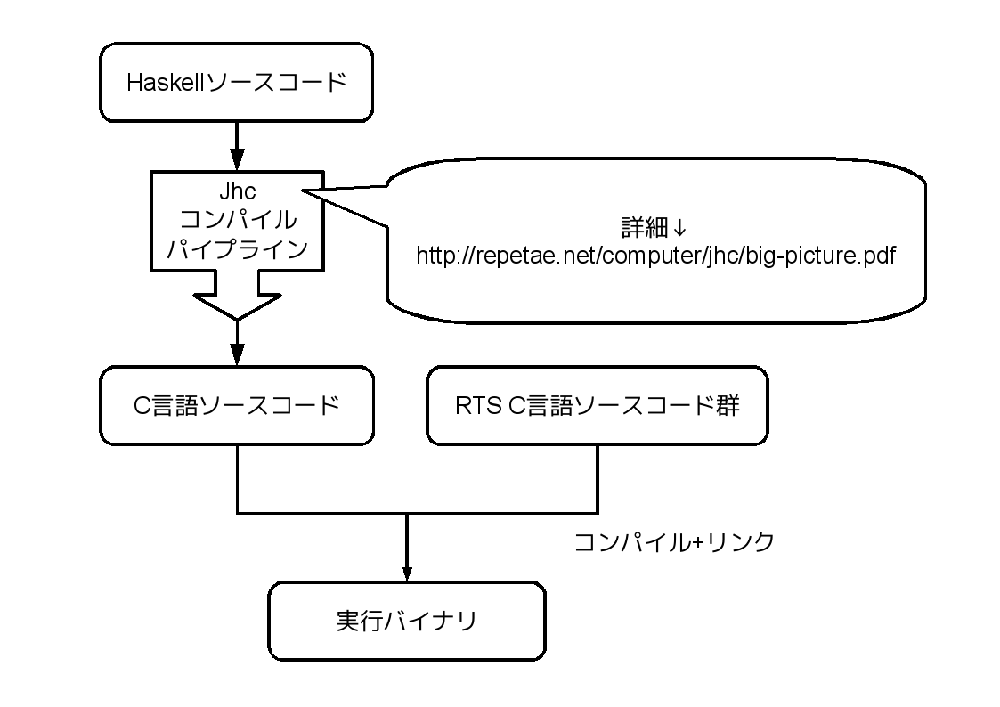
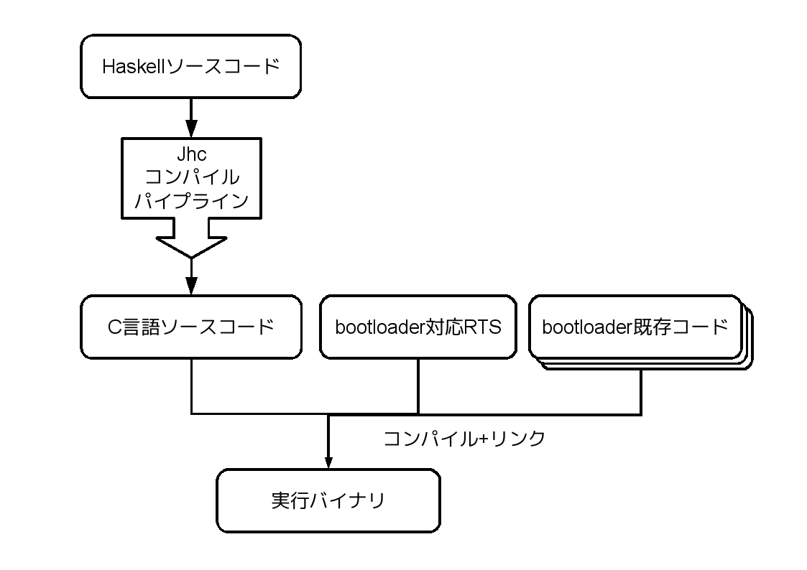

# How do you like jhc?

Kiwamu Okabe

# HaskellのコンパイラといえばGHC

ですよね!

# でもお困りではないですか？

* 吐き出す実行バイナリのサイズがデカい
* 実行バイナリの依存ライブラリ多い
* RTSが何やってるのかさっぱり
* ソースがフェイの最終問題レベルのデカさ

# それならjhcはどうでしょう

http://repetae.net/computer/jhc/

* フィボナッチなら17kBぐらいのサイズ
* libcにしか依存しない
* RTSは合計3000行ぐらいのC言語コード
* Haskell=>Cへの変換なのでポータブル

# 作者はJohn Meachamさんです

# jhcでのコンパイルの流れ

# ある程度ライブラリも使えます

~~~
$ ls /usr/local/share/jhc-0.8/
Diff-0.1.2.hl            html-1.0.1.2.hl
HUnit-1.2.2.1.hl         include/
QuickCheck-1.2.0.0.hl    jhc-1.0.hl
applicative-1.0.hl       jhc-prim-1.0.hl
containers-0.3.0.0.hl    parsec-2.1.0.1.hl
deepseq-1.1.0.2.hl       pretty-1.0.1.1.hl
filepath-1.2.0.0.hl      safe-0.2.hl
flat-foreign-1.0.hl      smallcheck-0.4.hl
haskell-extras-0.8.1.hl  transformers-0.2.1.0.hl
haskell2010-0.8.1.hl     xhtml-3000.2.0.1.hl
haskell98-1.0.hl
~~~

ちょっとバージョン古いけどね!

# なんかに使ってみましょう

NetBSD bootloaderに組み込んでみました。

~~~
https://gitorious.org/metasepi/netbsd-arafura
~~~

Debianなら上記リポジトリをcloneしたら、"make qemu"で自動コンパイルされてqemu上で起動できるはず。

なにはともあれデモりましょう。

# どうやってHaskell組み込んだの？

# jhc面白い!

readjhcやりたいですね!

# 宣伝: C83参照透明な海を守る会へ!

12/31(3日目) 東地区 Y-02a 会場で是非!

~~~
http://twitcmap.jp/?id=0083-3-YYa-02-a
~~~

