# What is Metasepi?
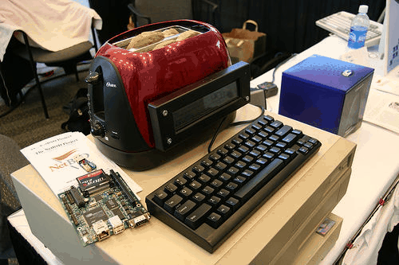

Kiwamu Okabe

# プロローグ (cont.)

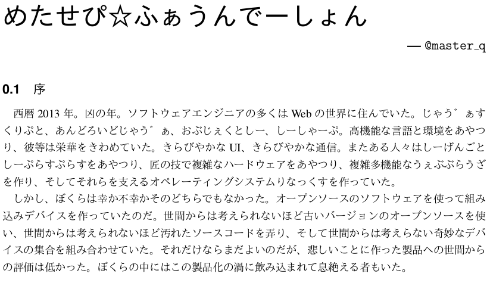

# プロローグ

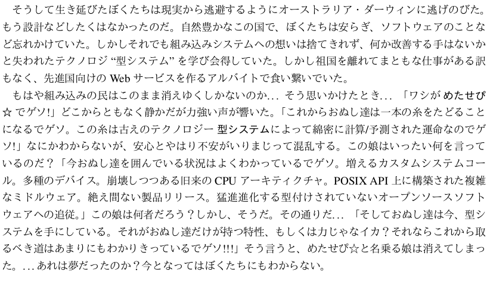

# おしながき

* Metasepiとは何か
* なぜMetasepiを作るのか
* 開発の戦略 (POSIX互換、スナッチ開発)
* 実現方法 (NetBSDとjhcの採用)
* デモ
* Metasepiの今後

# Metasepiって何？

* http://metasepi.masterq.net/
* UNIXモドキkernelを型によって設計する
* C言語での記述はできるかぎり小さく
* 設計言語はHaskellでもOCamlでも
* とにかく早くドッグフード可能にしよう!

# 名前の由来

* コウイカの一種 Metasepia pfefferi
* コウイカは大きな骨を持つ (型システム)
* 墨はセピア色の原料 (古いOS領域に光を)
* 威嚇のために体色を変える (最適な設計に)
* λカ娘がイカちゃんだから

http://www.paraiso-lang.org/ikmsm/

# どうしてMetasepiを作るの？

* C言語より進化した言語を設計に使いたい
* 既存設計を安全に改造できるようにしたい

# C言語より進化した機能って？

* パターンマッチ
* パッケージ
* 名前空間
* 型推論
* 対話環境
* 高階関数
* GC

# そんな言語あるの？

以下の言語はコンパイラで型推論を持つ。

* Clean - http://clean.cs.ru.nl/
* Coq - http://coq.inria.fr/
* Haskell - http://www.haskell.org/
* OCaml - http://caml.inria.fr/
* SML/NJ - http://www.smlnj.org/

などなど

# 安全に改造？

OSSをほぼそのまま製品搭載できれば良いのですが、
機能を追加して製品設計するハメになることはありませんか？

* システムコール追加
* 起動時間改善
* 気色わるいメモリマップ
* ソフトリアルタイムスケジューラ

などなど

# OSS改造あるある: fork

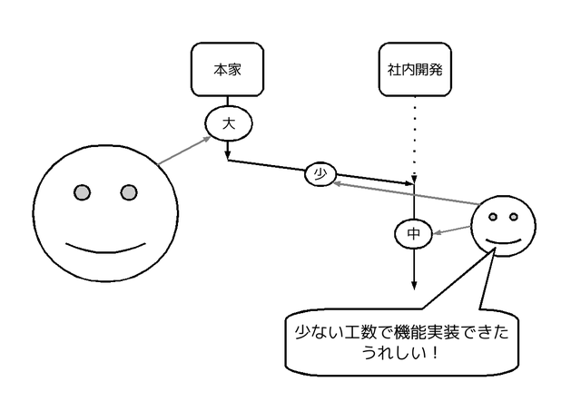

# OSS改造あるある: merge

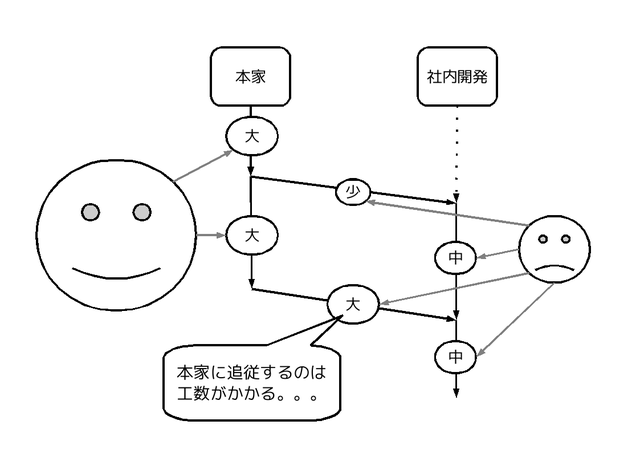

# OSS改造あるある: 完全fork

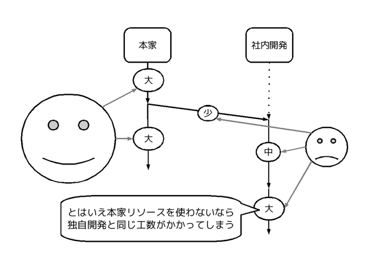

# なぜこんなことに？

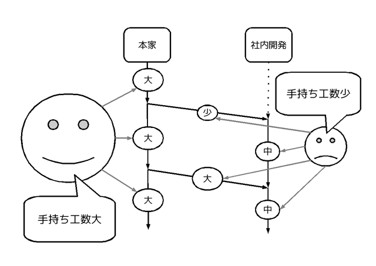

# でも改造するのは本家も同じ

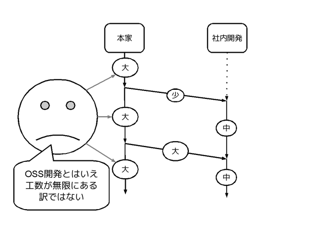

# 既存コード改造工数を減らさねば

* マネージャにmergeタイミング説得できない
* 数々のforkが生まれるだけ？
* このままではOSS社会は崩壊しまう...

# 一方MSは着々と手を打っている #1

デバイスドライバに対する静的検証ツールをWDKで配布。

~~~
http://msdn.microsoft.com/ja-jp/library/windows/hardware/gg487498.aspx

"Static Driver Verifier (SDV) は、カーネル モード ドライバー用に設計されている、コンパイル時用の徹底した静的な検証ツールで、 徹底したテストでも発見されない可能性がある重大なエラーを検出します。 SDV は、C および C++ で記述されている Windows ドライバーのソース コードを体系的に分析します。 一連のインターフェイスの規則とオペレーティング システムのモデルを使用して、ドライバーが Windows オペレーティング システムと適切に動作しているかどうかを判断します。"
~~~

# 一方MSは着々と手を打っている #2

~~~
http://research.microsoft.com/en-us/projects/singularity/
~~~

"Singularity は マイクロソフトリサーチ が2003年から実験的に開発しているオペレーティングシステム (OS)。高度なディペンダブルOSとすることを目標とし、カーネルやデバイスドライバ、アプリケーションも全てマネージコードで書かれている。"

"バージョン1.1は2007年3月、バージョン2.0は2008年11月14日にリリースされ、開発は現在も進行中である。"

# 改造工数を小さくする方法はある？
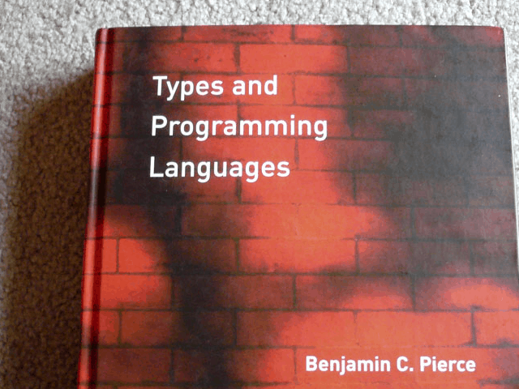

それが型システムです!

# 型システムのうまみ

* ランタイムエラーを少なくできる
* 参考:数理科学的バグ撲滅方法論のすすめ

~~~
http://itpro.nikkeibp.co.jp/article/COLUMN/20060915/248230/
~~~

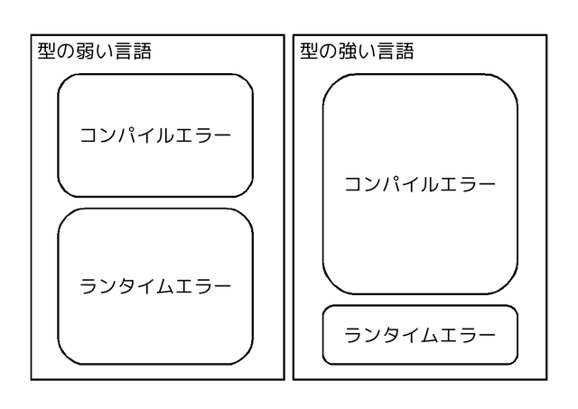

# Metasepiはどうやって設計するの？

* 既存のモノリシックkernelと同じ設計に
* 当然POSIX互換
* 既存kernelを少しずつ型で再設計
* 動作可能状態を保ちながら開発(スナッチ)

この設計をアラフラと呼ぶことにします。

~~~
http://metasepi.masterq.net/posts/2013-01-09-design_arafura.html
~~~

# なぜPOSIX互換に？

早い段階でドッグフード可能にするため!

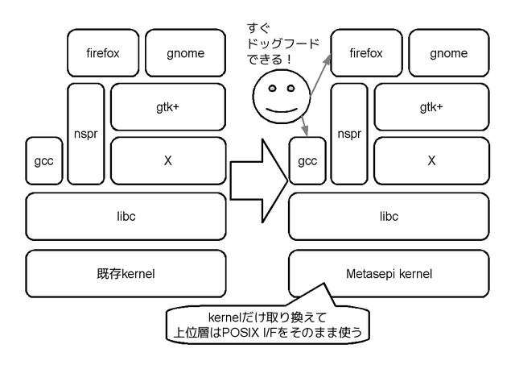

# スナッチ開発

http://ja.wikipedia.org/wiki/スナッチャー

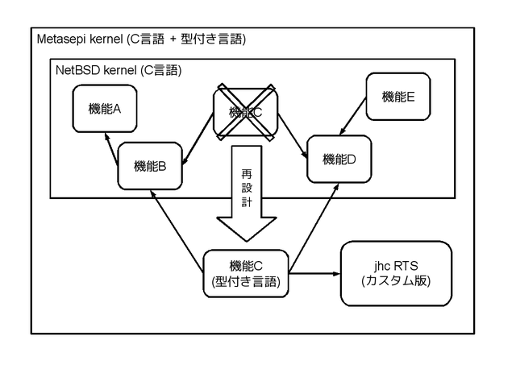

# 実現方法

* 開発言語: Haskell

~~~
http://www.haskell.org/
~~~

* コンパイラ: jhc

~~~
http://repetae.net/computer/jhc/
~~~

* 元にするkernel: NetBSD

~~~
http://netbsd.org/
~~~

# プログラミング言語Haskell

* 純粋関数型プログラミング言語
* 型クラスによる柔軟な表現
* gcc比較で2.36のパフォーマンス

~~~
http://benchmarksgame.alioth.debian.org/u64/which-programs-are-fastest.php
~~~

* 近年はOCamlよりもプログラマが多い？

# jhcコンパイラ

http://repetae.net/computer/jhc/

# jhcはポータブル

libc不要バイナリ吐ける

# jhcのRTSは小さい
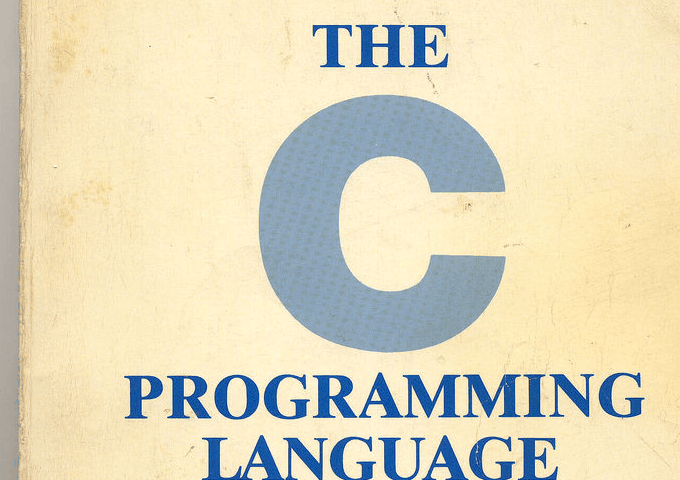

* RTS = ランタイム = VMみたいなもん
* C言語のみで記述されている
* コメント込み3000行
* これなら改造/自作できそう
* 実はプリミティブ型がC言語型
* C言語との相性が良い

# NetBSD kernel

* 移植性高い = 高い抽象化
* POSIX互換モノリシックkernel
* ソースコード読みやすい
* kernel内部APIドキュメント豊富

http://netbsdman.masterq.net/

* @master_q が昔仕事でいじってた

# 技術背景: 過去プロジェクトの失敗

* 同様の試みは他にもある

~~~
* Funk (OCaml製)
  http://home.gna.org/funk/
* snowflake-os (OCaml製)
  http://code.google.com/p/snowflake-os/
* House (Haskell製)
  http://programatica.cs.pdx.edu/House/
* HaLVM (Haskell製)
  http://corp.galois.com/halvm/
~~~

* しかし実用化には至っていない
* スクラッチからkernelを書くのは無謀では？

# 作り方:NetBSD kernelを型で写経

* C言語で書かれた
* NetBSD kernelを
* Haskellで少しずつ再設計して (スナッチ)
* jhcでコンパイルする

# 具体例: bootloader 元

~~~ {.c}
/* https://gitorious.org/metasepi/netbsd-arafura/blobs/arafura/sys/arch/i386/stand/lib/menuutils.c */
const struct bootblk_command commands[] = {
        { "help",       command_help },
        { "boot",       command_boot },
        { NULL,         NULL },
};

void
bootmenu(void)
{
        char input[80];
        for (;;) {
                char *c = input;
                input[0] = '\0';
                printf("> ");
                gets(input);
                while (*c == ' ')
                        c++;
                if (*c)
                        docommand(c);
        }
}
~~~

# 具体例: bootloader スナッチ

~~~ {.haskell}
-- https://gitorious.org/metasepi/netbsd-arafura/blobs/arafura/metasepi-arafura/sys/arch/i386/stand/boot/Boot2Ara.hs
foreign import ccall "glue_netbsdstand.h command_boot" c_command_boot :: Ptr a -> IO ()

commands :: Map String (IO ())
commands = Map.fromList [("help", command_help),
                         ("?", command_help),
                         ("boot", c_command_boot nullPtr)]
main :: IO ()
main = do
  putStrLn "Haskell bootmenu"
  forever $ do
    putStr "> "
    s <- getLine
    fromMaybe (putStr s) $ Map.lookup s commands
~~~

# 具体例: kernel 元 #1

~~~ {.c}
/* https://gitorious.org/metasepi/netbsd-arafura/blobs/arafura/sys/sys/lwp.h */
struct lwp {
	/* --snip-- */
	int		l_flag;
	int		l_stat;
	/* --snip-- */
};
/* These flags are kept in l_flag. */
#define	LW_IDLE		0x00000001
#define	LW_LWPCTL	0x00000002
#define	LW_SINTR	0x00000080
#define	LW_SA_SWITCHING	0x00000100
#define	LW_SYSTEM	0x00000200
#define	LW_SA		0x00000400
#define	LW_WSUSPEND	0x00020000
/* Status values. */
#define	LSIDL		1
#define	LSRUN		2
#define	LSSLEEP		3
#define	LSSTOP		4
#define	LSZOMB		5
~~~

# 具体例: kernel 元 #2

~~~ {.c}
/* https://gitorious.org/metasepi/netbsd-arafura/blobs/arafura/sys/kern/kern_lwp.c */
	switch (t->l_stat) {
	case LSRUN:
	case LSONPROC:
		t->l_flag |= LW_WSUSPEND;
		lwp_need_userret(t);
		lwp_unlock(t);
		break;
	case LSSLEEP:
		t->l_flag |= LW_WSUSPEND;
		if ((t->l_flag & LW_SINTR) != 0)
			setrunnable(t);
		else
			lwp_unlock(t);
		break;
	case LSSUSPENDED:
		lwp_unlock(t);
		break;
	case LSSTOP:
		t->l_flag |= LW_WSUSPEND;
		setrunnable(t);
		break;
~~~

# 具体例: kernel スナッチ #1

~~~ {.haskell}
data Lflag = Lflag { lwIdle        :: Bool
                   , lwLwpctl      :: Bool
                   , lwSintr       :: Bool
                   , lwSaSwitching :: Bool
                   , lwSystem      :: Bool
                   , lwSa          :: Bool
                   , lwWsuspend    :: Bool }
data Lstat = LsIdl | LsRun | LsSleep | LsStop | LsZomb | LsOnProc
           | LsSuspended

data Lwp = Lwp { lflag :: Lflag
               , lstat :: Lstat
                 {-- ...... --} }

data ErrNo = Eperm | Enoent | Esrch | Eintr | Eio | Enxio | E2big
           | Enoexec | Ebadf | Echild | Edeadlk
~~~

# 具体例: kernel スナッチ #2

~~~ {.haskell}
lwpSuspend :: Lwp -> Lwp -> IO (Either ErrNo ())
lwpSuspend curl t = go $ lstat t
  where go LsRun       = fRunOnproc
        go LsOnProc    = fRunOnproc
        go LsSleep     = do lwpSetFlag lwWsuspend
                            if lwSintr . lflag $ t
                              then setRunnable t
                              else lwpUnlock t
                            return $ Right ()
        go LsSuspended = do lwpUnlock t
                            return $ Right ()
        go LsStop      = do lwpSetFlag lwWsuspend
                            setRunnable t
                            return $ Right ()
        go LsIdl       = fIdlZomb
        go LsZomb      = fIdlZomb
        fRunOnproc     = do lwpSetFlag lwWsuspend
                            lwpNeedUserret t
                            lwpUnlock t
                            return $ Right ()
        fIdlZomb       = do lwpUnlock t
                            return $ Left Eintr
~~~

# 具体例: デバドラ 元

xxx bus_spaceを使ったデバドラスニペット

xxx intr文脈がいい？

# 具体例: デバドラ スナッチ

xxx bus_spaceをモナドにしてみる？他はlift？

# この作り方のメリット/デメリット
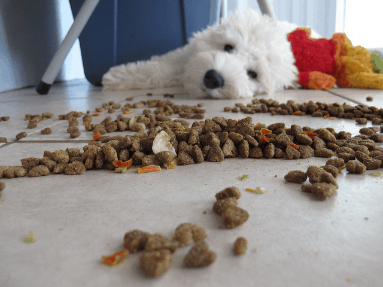

メリット

* 動作可能な状態を保ったまま型づけ可能
* つまりドッグフードできる
* C言語コードと共存可能

デメリット

* 関数型言語を生かした設計にはならない

# 現状

jhcでbootloaderの一部をHaskellで書けた

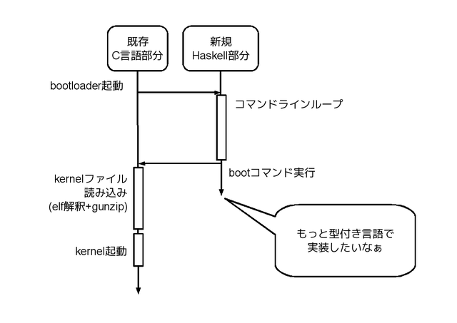

# デモ
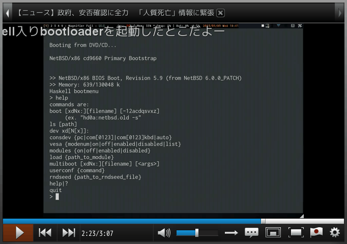

* 動画

http://www.nicovideo.jp/watch/sm19788831

* ソースコード

https://gitorious.org/metasepi/netbsd-arafura

# これからの調査/実装計画

* bootloaderを使った型づけトレーニング
* jhcのソースコード解析
* jhcのGCを組み込み向けに改造
* jhcが吐くコードの再入/並列実行
* kernelの型づけ手法の確立

# Metasepiがもたらす副産物

* Haskellコンパイラ内部詳細理解
* NetBSD kernelの深い理解
* 組み込みHaskell分野開拓

# その他Metasepiプロジェクト近傍

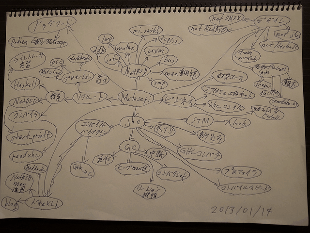
