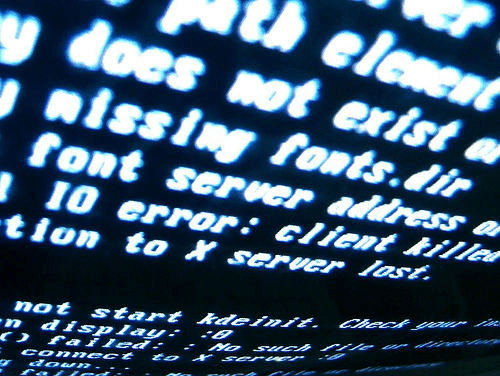
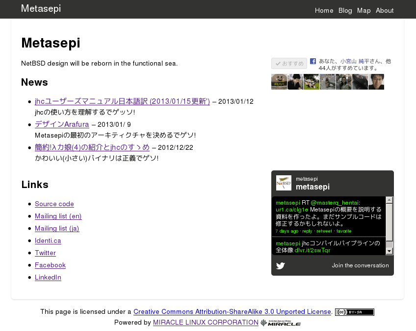
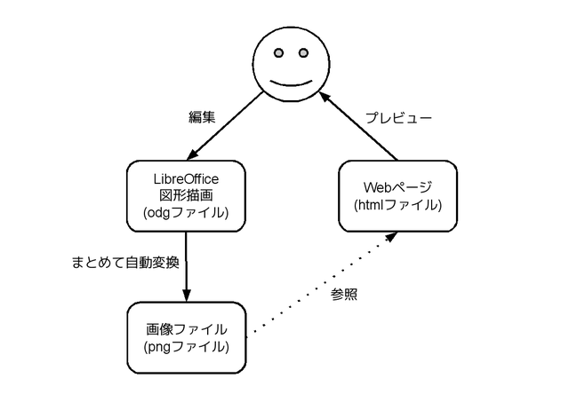

# コマンドライン使いもLibreOffice

Kiwamu Okabe

# 私は誰？

* Twitter: @master_q
* ミラクル・リナックス勤務
* 前はコピー機のOSをNetBSDで作ってた
* デジタルサイネージのソフト開発してます
* OSSに興味のある{エンジニア,インターン}募集中です!

# 最近よくWebページ作るんです

# ややこしい表現には図が効きます

* でも世の中良いドローソフトが不足
* tgifとかにはもう耐えられないんです
* コネクタも使えないドローソフトって...
* LibreOfficeをドローソフトとして使おう

# でも図を貼り付けるの面倒...

* LibreOfficeで描く
* png化
* Webブラウザで見た目チェック
* ...なんかうまくない...
* 最初に戻る

# こんなことできますか？

# つまり一発で変換したい

~~~
$ tree ./draw # ビフォワー
./draw
|-- 2012-12-22-jhc_compile.odg
|-- 2012-12-27-arafura_design.odg
|-- 2012-12-27-compile.odg
|-- 2013-01-09-sequence_diagram.odg
`-- 2013-01-25-jhc_compile_flow.odg

↓↓ 変換 ↓↓

$ tree ./draw # アフター
./draw
|-- 2012-12-22-jhc_compile.odg
|-- 2012-12-22-jhc_compile.png
|-- 2012-12-27-arafura_design.odg
|-- 2012-12-27-arafura_design.png
|-- 2012-12-27-compile.odg
|-- 2012-12-27-compile.png
|-- 2013-01-09-sequence_diagram.odg
|-- 2013-01-09-sequence_diagram.png
|-- 2013-01-25-jhc_compile_flow.odg
`-- 2013-01-25-jhc_compile_flow.png
~~~

# できました!

make一発でdrawディレクトリにあるodgファイルをpngファイル化

~~~ {.makefile}
ODGS := $(wildcard draw/*.odg)
PNGS := $(patsubst %.odg,%.png,${ODGS})

all: ${PNGS}

%.png: %.odg
	unoconv -n -f png -o $@.tmp $< 2> /dev/null   || \
          unoconv -f png -o $@.tmp $<                 || \
	  unoconv -n -f png -o $@.tmp $< 2> /dev/null || \
          unoconv -f png -o $@.tmp $<
	convert -resize 640x $@.tmp $@
	rm -f $@.tmp

clean:
	rm -f draw/*.png draw/*.tmp

.PHONY: clean
~~~

# えっとなんで4回もunoconv呼ぶの？

* libreofficeが既に起動している場合には-nオプションを付ける必要がある
* unoconvがなぜかエラー終了する...

この2つを防止するために成功するまで最大4回呼びます。

将来後者は改善されるといいなー(他力本願)

# ところでjekyllとかHakyllとか

* http://jekyllrb.com/
* http://jaspervdj.be/hakyll/

を使うと静的はWebページを少ない労力で作れます。

図の貼り付けも楽したい!

# 応用: unoconv + Hakyll

~~~ {.makefile}
ODGS := $(wildcard draw/*.odg)
PNGS := $(patsubst %.odg,%.png,${ODGS})

all: build ${PNGS}

%.png: %.odg
	unoconv -n -f png -o $@.tmp $< 2> /dev/null   || \
          unoconv -f png -o $@.tmp $<                 || \
	  unoconv -n -f png -o $@.tmp $< 2> /dev/null || \
          unoconv -f png -o $@.tmp $<
	convert -resize 500x $@.tmp $@
	rm -f $@.tmp

hakyll: hakyll.hs
	ghc --make -Wall -Werror hakyll.hs -o hakyll

build: hakyll
	./hakyll build

server: build
	./hakyll server
~~~

# 応用色々素敵なunoconv

TeXと組み合わせてもいいかもしれませんね!

おわり。
