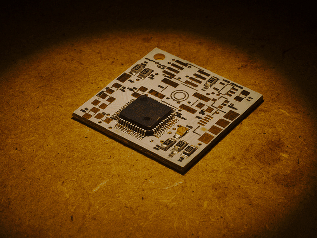
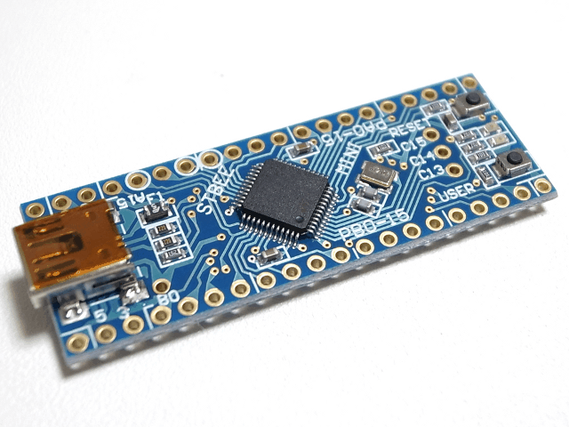
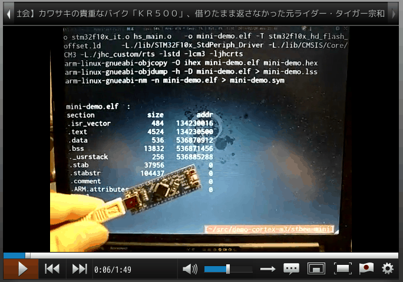

# HaskellではじめるCortex-M3　　　　組込みプログラミング

Kiwamu Okabe

# 私は誰？

* Twitter: @master_q
* ミラクル・リナックス勤務
* 前はコピー機のOSをNetBSDで作ってた
* デジタルサイネージのソフト開発してます
* OSSに興味のある{エンジニア,インターン}募集中です!

# Haskell流行ってますよね!

# でも何に使ってるの？

~~~
* Attoparsec         - 高速パーサコンビネータ
* Bluespec           - SystemVerilogとSystemCのツール実装に使ってる
* Bump Technologies  - モバイル向け連絡先交換のサーバサイド
* Gitit              - VCSバックエンドWiki
* Gtk2hs             - Haskellから使えるGtkラッパ
* Hakyll             - 静的Webサイト生成
* Microsoft Research - GHC(Haskellコンパイラ)の研究開発
* Mighttpd           - nginxぐらい速いWebサーバ
* Monadius           - グラディウスっぽいゲーム
* Pandoc             - ドキュメントフォーマット変換
* Qualcomm           - LuaのBREWバインディングジェネレータ
* Standard Chartered Bank - デリバティブリスク分析
* Tsuru Capital      - 株式トレーディング
* Yesod              - RailsっぽいWebアプリケーションフレームワーク
~~~

でもこれってみんなPOSIX APIの上でしか動かせませんね...

# 小さい機器をHaskellで書きたい!

マイコンでLEDチカチカしてみましょう

* STBee Mini
* CPU: STM32 (Cortex-M3)
* クロック: 72MHz
* フラッシュROM: 128kB
* RAM: 20kB

# そこでjhcコンパイラ

# Haskellコードを食わせると

~~~ {.haskell}
-- snip Imports --

foreign import ccall "c_extern.h Delay" c_delay :: Word32 -> IO ()

gpioPtr :: Ptr Word32
gpioPtr = odr
  where periphBase     = nullPtr        `plusPtr` 0x40000000
        arb2periphBase = periphBase     `plusPtr` 0x10000
        gpioaBase      = arb2periphBase `plusPtr` 0x0800
        odr            = gpioaBase      `plusPtr` 12

gpioOut :: Word32 -> IO ()
gpioOut v = do
  poke gpioPtr v
  c_delay 500000

main :: IO ()
main = forever $ do
  gpioOut $ (1 `shiftL` 13)
  gpioOut $ (1 `shiftL` 13) .|. (1 `shiftL` 15)
  gpioOut $ (1 `shiftL` 15)
  gpioOut $ 0
~~~

# C言語コードに変換してくれる!

~~~ {.c}
static void A_STD
ftheMain(gc_t gc)
{
   fR$__fControl_Monad_forever__2:;
   {  *((volatile uint32_t *)(1073809420)) = 1 << 13;
      saved_gc = gc;
      (void)Delay((uint32_t)500000);
      *((volatile uint32_t *)(1073809420)) = (1 << 13) | (1 << 15);
      saved_gc = gc;
      (void)Delay((uint32_t)500000);
      *((volatile uint32_t *)(1073809420)) = 1 << 15;
      saved_gc = gc;
      (void)Delay((uint32_t)500000);
      *((volatile uint32_t *)(1073809420)) = 0;
      saved_gc = gc;
      (void)Delay((uint32_t)500000);
      goto fR$__fControl_Monad_forever__2;
   }
   return;
}
~~~

# 実機デモ

動画でご覧ください

~~~
http://www.nicovideo.jp/watch/sm20143937
~~~

# PR:HaskellでOSを作るプロジェクト

はじめました。

http://metasepi.masterq.net/

乞御期待!

# PR:関数型同人誌出してます!

http://www.paraiso-lang.org/ikmsm/

# 参考資料

~~~
* 本デモのソースコード
  <https://gitorious.org/metasepi/demo-cortex-m3>

* Patch適用済みjhcソースコード
  <https://gitorious.org/metasepi/jhc-arafura>

* STM32マイコンボード 『STBee Mini』
  <http://strawberry-linux.com/catalog/items?code=32105>
~~~
