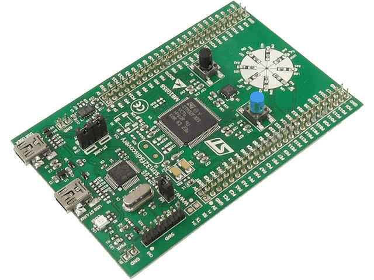

# Ajhcコンパイラの押売りに来ました

Kiwamu Okabe

# [1] 自己紹介

* http://www.masterq.net/
* ミラクル・リナックス勤務
* 前はコピー機のOSをNetBSDで作ってた
* Debianメンテナ
* デジタルサイネージのソフト開発してます
* OSSに興味のあるエンジニア募集中です!

# 経歴

* 2001年: 東京都立大学 修士卒業
* 専攻: 電気・電子工学
* 2001ー2012年: コピー機メーカー勤務
* 2012年ー: 現職

# 宣伝:λカ娘に記事を書きませんか？

http://www.paraiso-lang.org/ikmsm/

* 関数型プログラミングに関する同人誌
* これまで4巻出しました
* 結構好評みたいです
* ネタある人は @xhl_kogitsune さんまで!
* Call For Articlesはイカ

~~~
http://www.paraiso-lang.org/ikmsm/books/c84.html
~~~

# おしながき

* 自己紹介

# [2] Ajhcコンパイラとは

http://ajhc.metasepi.org/

* Ajhc := A fork of jhc
* http://repetae.net/computer/jhc/
* jhcはフットプリントが小さく、
* 高速な実行バイナリを吐くらしい
* 組み込みに向いてるかも

# どうしてAjhcコンパイラを作るの？

* Metasepiというkernelを作るため
* UNIXモドキkernelを強い型によって設計
* 言語: HaskellとかOCamlとかMLtonとか

# [3] kernelに強い型が必要なのか
# kernelにこそ型安全が必要
# 改造工数を小さくしたい
# C言語の表現力は非力
# 型付けされていれば未来は広がる
# なぜGHCを使わないのか
# 型で設計されたOSは他にないのか
# 実用化に辿りつくために

# [4] Ajhcコンパイラとマイコン

使い方は以下のような感じ

~~~
$ cabal install ajhc
$ ajhc --version
ajhc 0.8.0.1 (80aa12fb9b57622bba2f0e911d7ebc0c04ddb662)
compiled by ghc-7.4 on a x86_64 running linux
$ echo 'main = print "hoge"' > Hoge.hs
$ ajhc Hoge.hs
$ ./hs.out
"hoge"
~~~

* このままだと面白くない
* クロスコンパイルして、
* マイコンでHaskellコード実行してみる？

# まずはデモでもどうぞ

~~~
デモ動画: http://www.nicovideo.jp/watch/sm20336813
デモソースコード: https://github.com/ajhc/demo-cortex-m3
~~~

* LEDをぐりんぐりん
* LEDにモールス信号

# デモソースコード

なんじゃこりゃ...

~~~ {.haskell}
foreign import ccall "c_extern.h Delay" c_delay :: Word32 -> IO ()
foreign import ccall "c_extern.h &jhc_zeroAddress" c_jhc_zeroAddress16 :: Ptr Word16

gpioPin8, gpioPin9, gpioPin10, gpioPin11, gpioPin12, gpioPin13, gpioPin14, gpioPin15, led3, led4, led5, led6, led7, led8, led9, led10 :: Word16
gpioPin8  = 0x0100
--snip--
led3  = gpioPin9
--snip--

brrPtr, bsrrPtr :: Ptr Word16
brrPtr  = c_jhc_zeroAddress16 `plusPtr` 0x48001028
bsrrPtr = c_jhc_zeroAddress16 `plusPtr` 0x48001018

ledOff, ledOn :: Word16 -> IO ()
ledOff = poke brrPtr
ledOn  = poke bsrrPtr
~~~

# 図にしましょう: 起動シーケンス

# 図にしましょう: Haskellコードの動き

# 図にしましょう: もっと簡単に

# AjhcはC言語への変換器

# クロスコンパイル

# ランタイム

* C言語コメント込み3000行 小さい!
* 組み込み用途に向いている

# マイコンデモでのメモリマップ

モールス信号デモの場合

# GC

~~~
http://www.slideshare.net/dec9ue/gc-16298437
~~~

* @dec9ue という人がすごい詳しい
* マークオンリーGCらしい
* GCのくせにmalloc使う
* AjhcではGCを修正して省メモリ化

# デモ: GC頻度をgdbで調べる

* GCを実行する関数にbreak pointはる
* どれぐらいGCが起きてるかな？

# 不足している機能/不具合

* Haskell Platform移植
* GHCコンパチ
* 再入
* 並列実行
* GC中の割り込み
* リージョン推論

研究開発テーマの山ですね!

# [5] Ajhcのすゝめ

* Ajhc使ってみませんか？
* マニュアルはイカ

http://ajhc.github.io/manual_ja.html

* バグ/機能要望ありましたらイカまで

https://github.com/ajhc/ajhc/issues

* もちろんpull requestも大歓迎です!

https://github.com/ajhc/ajhc
