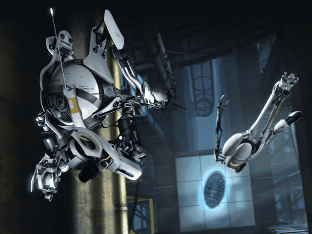
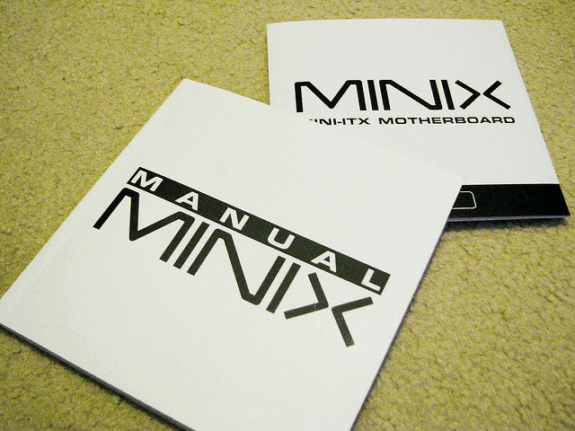
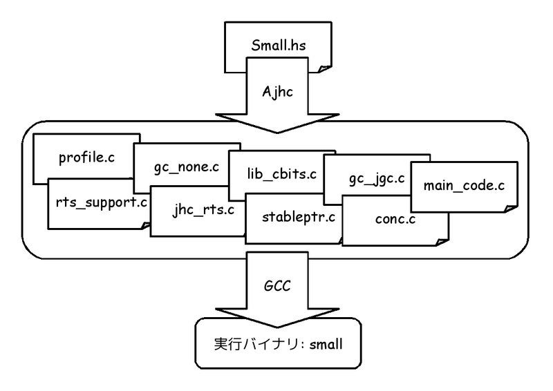
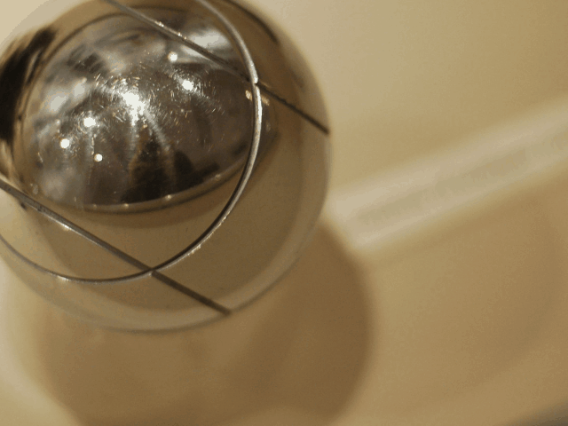

# 組込向けHaskellコンパイラAjhc　POSIX依存から脱出しよう編

Kiwamu Okabe

# 私は誰？

* Twitter: @master_q
* Metasepiプロジェクト主催
* Ajhc Haskellコンパイラ開発者
* Debian Maintainer
* 前はデジタルサイネージの開発してました
* その昔はコピー機のOSをNetBSDで

# おしながき

* [1] Ajhcコンパイラとは
* [2] Metasepi kernelとは
* [3] OS開発向けコンパイラとは
* [4] Ajhcのインストールと使い方
* [5] AjhcコンパイラでPOSIXの外へ
* [6] これまでのAjhcコンパイラ
* [7] Ajhcコンパイラの未来

# [1] Ajhcコンパイラとは

http://ajhc.metasepi.org/

* Ajhc := A fork of jhc
* jhc := John's Haskell Compiler
* http://repetae.net/computer/jhc/
* jhcはフットプリントが小さく、
* 高速な実行バイナリを吐くらしい
* 組み込みに向いてるかも

# どうしてAjhcコンパイラ作るの？

* HaskellコミュニティではGHCがデファクト
* GHC := Glasgow Haskell Compiler
* http://www.haskell.org/ghc/
* なぜ別のHaskellコンパイラが必要？
* Metasepiというkernelを作るため

# [2] Metasepi kernelとは

http://metasepi.org/

* UNIXモドキkernelを強い型によって設計
* ML同等以上に強い型を持つ言語を使う

Haskell http://www.haskell.org/

OCaml http://caml.inria.fr/

MLton http://mlton.org/

などなど

# どうしてMetasepiが必要？

* LinuxやWindowsが既にあるのでは？
* しかし組込開発は苦しんでいる
* kernelをカスタマイズして使用
* kernelのランタイムエラー
* 再現することでさえ困難

# 既存OSSの品質は高いのでは？

* OSSは品質が高いと言われている
* 伽藍とバザール
* 「目玉の数さえ十分あれば、どんなバグも深刻ではない」

~~~
http://cruel.org/freeware/cathedral.html
~~~

* ところが社内開発は...

# 主開発からそれると品質急降下

# 型安全とは

* ランタイムエラーを少なくできる
* 参考:数理科学的バグ撲滅方法論のすすめ

~~~
http://itpro.nikkeibp.co.jp/article/COLUMN/20060915/248230/
~~~

# kernelにこそ型安全が必要

* ほとんどのkernelはC言語で設計される
* ユーザー空間でエラー → SEGV
* kernel空間でエラー → システム停止
* kernelの設計には細心の注意が必要
* C言語は安全なのか？

# [3] OS開発向けコンパイラとは

* 強い型が使えてOSを作れるコンパイラは？
* C言語のような使い勝手が必要
* ないみたいなので作りましょう!
* スクラッチから作るのはツライ
* 要求に近いコンパイラはないかな？

# POSIX外で使いやすいコンパイラ

各数値が小さいほどPOSIX APIへの依存度が小さい

# jhcバイナリは未定義シンボル20個

~~~
$ nm hs.out | grep "U "
                 U _IO_putc@@GLIBC_2.2.5
                 U __libc_start_main@@GLIBC_2.2.5
                 U _setjmp@@GLIBC_2.2.5
                 U abort@@GLIBC_2.2.5
                 U ctime@@GLIBC_2.2.5
                 U exit@@GLIBC_2.2.5
                 U fflush@@GLIBC_2.2.5
                 U fprintf@@GLIBC_2.2.5
                 U fputc@@GLIBC_2.2.5
                 U fputs@@GLIBC_2.2.5
                 U free@@GLIBC_2.2.5
                 U fwrite@@GLIBC_2.2.5
                 U getenv@@GLIBC_2.2.5
                 U malloc@@GLIBC_2.2.5
                 U memset@@GLIBC_2.2.5
                 U posix_memalign@@GLIBC_2.2.5
                 U realloc@@GLIBC_2.2.5
                 U setlocale@@GLIBC_2.2.5
                 U sysconf@@GLIBC_2.2.5
                 U times@@GLIBC_2.2.5
~~~

# jhcはC言語への変換器

# クロスコンパイルも簡単

# 実用化に辿りつくために

* 実行可能状態を維持しながら開発

# [4] Ajhcのインストールと使い方

* インストールしてみましょう

Ubuntu 12.04 amd64 の場合

~~~
$ sudo apt-get install haskell-platform libncurses5-dev libwww-perl gcc m4
$ cabal update
$ cabal install ajhc
$ export PATH=$HOME/.cabal/bin/:$PATH
$ which ajhc
/home/ユーザ名/.cabal/bin/ajhc
$ ajhc --version
ajhc 0.8.0.8 (f6c3f4b070acad8a5012682810f0f4d7b7b9ed44)
compiled by ghc-7.4 on a x86_64 running linux
~~~

あっさりですね!

# 簡単なプログラムを作ってみましょう

~~~
$ vi MyDiff.hs
~~~

~~~ {.haskell}
import System.Environment
import Data.Algorithm.Diff

main :: IO ()
main = do [s1, s2] <- getArgs
          c1 <- readFile s1
          c2 <- readFile s2
          print . filter f $ getDiff c1 c2
  where
    f (Both _ _) = False
    f _ = True
~~~

~~~
$ ajhc -p Diff -o mydiff MyDiff.hs
$ echo "hoge"  > s1.txt
$ echo "hofe0" > s2.txt
$ ./mydiff s1.txt s2.txt
[Second 'f',First 'g',Second '0']
~~~

# 使い方詳細

「Ajhcユーザーズマニュアル」

ajhc.metasepi.org/manual_ja.html

を読んでみてください!

# [5] AjhcコンパイラでPOSIXの外へ

* 「何もしないプログラム」を作りましょう

~~~
$ vi Small.hs
~~~

~~~ {.haskell}
main :: IO ()
main = return ()
~~~

~~~
$ ajhc -o small Small.hs
$ ./small
~~~

* ではPOSIX依存を少なくしてみましょう
* 現状では未定義シンボルは19個です

~~~
$ nm small | grep -c "U "
19
~~~

# 現状のコンパイルフロー

簡単ですね

# GCCコンパイルオプションを調べる

~~~
$ ajhc --tdir rtsdir Small.hs
$ ls
Small.hs  hs.out*  rtsdir/
$ head -1 rtsdir/main_code.c
char jhc_c_compile[] = "gcc rtsdir/rts/profile.c rtsdir/rts/rts_support.c rtsdir/rts/gc_none.c rtsdir/rts/jhc_rts.c rtsdir/lib/lib_cbits.c rtsdir/rts/gc_jgc.c rtsdir/rts/stableptr.c rtsdir/rts/conc.c -Irtsdir/cbits -Irtsdir rtsdir/main_code.c '-std=gnu99' -D_GNU_SOURCE '-falign-functions=4' -ffast-math -Wextra -Wall -Wno-unused-parameter -fno-strict-aliasing -DNDEBUG -O3 '-D_JHC_GC=_JHC_GC_JGC' '-D_JHC_CONC=_JHC_CONC_NONE'";
~~~

jhc_c_compile文字列からGCCのコンパイルオプションがわかる

# Makefileを使ってコンパイル

# Makefileを使ってコンパイル(詳細)

~~~
$ vi Makefile
~~~

~~~ {.makefile}
small: rtsdir/main_code.c
	gcc rtsdir/rts/profile.c rtsdir/rts/rts_support.c rtsdir/rts/gc_none.c rtsdir/rts/jhc_rts.c rtsdir/lib/lib_cbits.c rtsdir/rts/gc_jgc.c rtsdir/rts/stableptr.c rtsdir/rts/conc.c -Irtsdir/cbits -Irtsdir rtsdir/main_code.c '-std=gnu99' -D_GNU_SOURCE '-falign-functions=4' -ffast-math -Wextra -Wall -Wno-unused-parameter -fno-strict-aliasing -DNDEBUG -O3 '-D_JHC_GC=_JHC_GC_JGC' '-D_JHC_CONC=_JHC_CONC_NONE' -o small

rtsdir/main_code.c: Small.hs
	ajhc --tdir rtsdir -C Small.hs

clean:
	rm -rf rtsdir small *~
~~~

~~~
$ make
$ nm small | grep -c "U "
19 # <= 依存度は変化なし
~~~

# ランタイムのソースを限定

# ランタイムのソースを限定(詳細)

~~~
$ vi Makefile
~~~

~~~ {.makefile}
small: rtsdir/main_code.c dummy.c
	gcc rtsdir/rts/rts_support.c rtsdir/rts/jhc_rts.c rtsdir/rts/gc_jgc.c rtsdir/rts/stableptr.c rtsdir/rts/conc.c dummy.c -Irtsdir/cbits -Irtsdir rtsdir/main_code.c '-std=gnu99' -D_GNU_SOURCE '-falign-functions=4' -ffast-math -Wextra -Wall -Wno-unused-parameter -fno-strict-aliasing -DNDEBUG -O3 '-D_JHC_GC=_JHC_GC_JGC' '-D_JHC_CONC=_JHC_CONC_NONE' -o small
# --snip--
~~~

~~~
$ vi dummy.c
~~~

~~~ {.c}
#include "jhc_rts_header.h"

void jhc_print_profile(void) {}
~~~

~~~
$ make
$ nm small | grep -c "U "
15 # <= 依存度が4減少
~~~

# ダミー関数をさらに投入

# ダミー関数をさらに投入(詳細)

~~~
$ vi dummy.c
~~~

~~~ {.c}
#include "jhc_rts_header.h"

void abort() {for (;;);}
char *setlocale(int category, const char *locale) {return NULL;}
int fputc(int c, FILE *stream) {return 0;}
int fputs(const char *s, FILE *stream) {return 0;}
int fprintf(FILE *stream, const char *format, ...) {return 0;}
int fflush(FILE* stream) {return 0;}
size_t fwrite(const void *ptr, size_t size, size_t nmemb, FILE *stream) {return 0;}
void jhc_print_profile(void) {}
~~~

~~~
$ make
$ nm small | grep -c "U "
8 # <= 依存度が7減少
~~~

# 例外を無視する

# 例外を無視する(詳細)

~~~
$ vi Makefile
small: rtsdir/main_code.c dummy.c main.c
	gcc rtsdir/rts/rts_support.c rtsdir/rts/jhc_rts.c rtsdir/rts/gc_jgc.c rtsdir/rts/stableptr.c rtsdir/rts/conc.c dummy.c main.c -Irtsdir/cbits -Irtsdir rtsdir/main_code.c '-std=gnu99' -D_GNU_SOURCE '-falign-functions=4' -ffast-math -Wextra -Wall -Wno-unused-parameter -fno-strict-aliasing -DNDEBUG -O3 '-D_JHC_GC=_JHC_GC_JGC' '-D_JHC_CONC=_JHC_CONC_NONE' '-D_JHC_STANDALONE=0' -o small
$ vi main.c
#include "jhc_rts_header.h"

int
main(int argc, char *argv[])
{
        hs_init(&argc,&argv);
	_amain();
        hs_exit();
        return 0;
}
$ nm small | grep -c "U "
7 # <= 依存度が1減少
~~~

# 残ったPOSIX依存は何？

~~~
$ nm small | grep "U "
                 U __libc_start_main@@GLIBC_2.2.5
                 U exit@@GLIBC_2.2.5
                 U free@@GLIBC_2.2.5
                 U malloc@@GLIBC_2.2.5
                 U memset@@GLIBC_2.2.5
                 U posix_memalign@@GLIBC_2.2.5
                 U realloc@@GLIBC_2.2.5
~~~

* mallocなどのメモリ管理だけが実行に必要
* mallocのない環境ではNetBSD alloc.cを流用するのがおすすめ

# これでプログラミングできるの？

以下2つのしくみを使ってC言語側を触れます

* Foreign Function Interface (FFI)
* Foreign.Storableクラス

# FFIでお互いの関数を呼びあえる

# Storableでメモリ直読み書き

# [6] これまでのAjhcコンパイラ

* ユーザーズマニュアルの翻訳

~~~
http://ajhc.metasepi.org/manual_ja.html
~~~

* Cortex-M4マイコンへの移植

~~~
https://github.com/ajhc/demo-cortex-m3
~~~

* cabalによるインストール
* 省メモリGC
* 再入可能とスレッドの実現

# [7] Ajhcコンパイラの未来

* 内部仕様ドキュメント作成中

~~~
https://github.com/ajhc/ajhc-hacking-guide
~~~

* 型によるスレッド間状態共有
* GHCのライブラリを移植
* さらなる応用例の提案
* 小さな組み込みOSを型によって再設計
* NetBSD kernelを型によって再設計

# 宣伝:λカ娘に記事を書きませんか？

* http://www.paraiso-lang.org/ikmsm/
* 関数型言語の同人誌
* HaskellとかOCamlとか圏論とか
* 囲碁AIの記事まで、なんでもあり？
* C84にはAjhcの解説記事を投稿しました
* Call For Articlesはイカ

~~~
http://www.paraiso-lang.org/ikmsm/books/c85.html
~~~

# 本スライドで使用した画像 #1

~~~
* sunny side up | Flickr - Photo Sharing!
  http://www.flickr.com/photos/97335141@N00/4623354472/
* Mud Slide | Flickr - Photo Sharing!
  http://www.flickr.com/photos/ben_salter/2676953286/
* Feelin' Safe | Flickr - Photo Sharing!
  http://www.flickr.com/photos/mstyne/3654056683/
* STOP ALL WAY | Flickr - Photo Sharing!
  http://www.flickr.com/photos/peterkaminski/1510724/
* Bungee jump | Flickr - Photo Sharing!
  http://www.flickr.com/photos/gj_thewhite/8855033499/
* The C Programming Language | Flickr - Photo Sharing!
  http://www.flickr.com/photos/mrbill/2482009942/
* The 20 Yard Line | Flickr - Photo Sharing!
  http://www.flickr.com/photos/eschipul/2957264066/
* _MG_3881 | Flickr - Photo Sharing!
  http://www.flickr.com/photos/63209717@N05/6873025064/
* Mini Cross | Flickr - Photo Sharing!
  http://www.flickr.com/photos/hdrexperience/6727601691/
* Goal for the Sky | Flickr - Photo Sharing!
  http://www.flickr.com/photos/giantsqurl/5165392772/
* Manual and driver disc | Flickr - Photo Sharing!
  http://www.flickr.com/photos/tseedmund/3859079008/
~~~

# 本スライドで使用した画像 #2

~~~
* Simple Heart | Flickr - Photo Sharing!
  http://www.flickr.com/photos/21148821@N02/2055189101/
* GNU Wallpaper | Flickr - Photo Sharing!
  http://www.flickr.com/photos/jeffpro/8603895629/
* The core | Flickr - Photo Sharing!
  http://www.flickr.com/photos/mukluk/484631726/
* Dummies. Someday they'll take over the world. They already have.
  http://www.flickr.com/photos/keoni101/5244610841/
* Michael Caputo, "just tryin' to break the ice, with nothin'...
  http://www.flickr.com/photos/sixteen-miles/3757672365/
* Groundskeeper sweeping, Citi Field | Flickr - Photo Sharing!
  http://www.flickr.com/photos/48913243@N00/4605448536/
* Carrier Pigeon | Flickr - Photo Sharing!
  http://www.flickr.com/photos/enzymedesign/4983070657/
* Arrows showing up (Blender) | Flickr - Photo Sharing!
  http://www.flickr.com/photos/61423903@N06/7382239368/
* Handshakes | Flickr - Photo Sharing!
  http://www.flickr.com/photos/ndanger/4425413794/
* STM32 Development Board | Flickr - Photo Sharing!
  http://www.flickr.com/photos/randomskk/3920434183/
* Hiking | Flickr - Photo Sharing!
  http://www.flickr.com/photos/aigle_dore/5824862885/
~~~

# 本スライドで使用した画像 #3

~~~
* Next Kyoto 懐石 | Flickr - Photo Sharing!
  http://www.flickr.com/photos/edsel_/8330803003/
* Portal 2 fly | Flickr - Photo Sharing!
  http://www.flickr.com/photos/warvan/4984607550/
* Sticker Nation - 8 | Flickr - Photo Sharing!
  http://www.flickr.com/photos/oskay/411003747/
* I love flickr | Flickr - Photo Sharing!
  http://www.flickr.com/photos/theresasthompson/3279837886/
* flickr | Flickr - Photo Sharing!
  http://www.flickr.com/photos/zanastardust/145197704/
* flickr was here | Flickr - Photo Sharing!
  http://www.flickr.com/photos/sarahrosenau/185196442/
~~~
