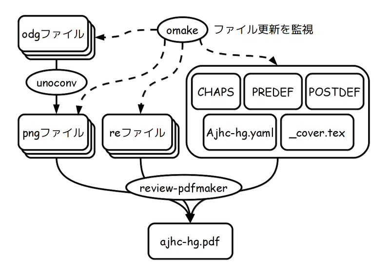

# ReVIEWとLibreOfficeとOMakeで本を書きましょう！

Kiwamu Okabe

# 私は誰？

* Twitter: @master_q
* Metasepiプロジェクト主催
* Ajhc Haskellコンパイラ開発者
* Debian Maintainer
* 前はデジタルサイネージの開発してました
* その昔はコピー機のOSをNetBSDで

# まとまったドキュメント書くはめに

なることがありますよね

* 設計書
* リファレンス
* ハウツー
* 本
* 翻訳
* 雑誌記事

# 方法はいろいろ

* Word ？
* LaTeX ？
* Sphinx ？
* Wiki ？

いろいろあるんだけど...

# ドキュメント作成には手間がかかる

* 元ファイルの管理
* 修正→プレビューに手間がかかる
* 図の画像フォーマットの変換
* 最終的にはPDFが欲しい
* HTMLでも公開したい
* EPUB？おいしい？

# そこで複数の技術を組み合わせよう

* ReVIEW + LaTeX
* LibreOffice + unoconv
* OMake

インストール方法とか説明します

あ、環境はDebianを想定しています

# ReVIEW + LaTeX

https://github.com/kmuto/review

* Wikiのような簡易フォーマットから
* LaTeX、HTML、XML、EPUBに変換
* LaTeXからPDFを作れる

[ インストール手順 ]

~~~
$ sudo apt-get install texlive-lang-cjk texlive-fonts-recommended
$ sudo apt-get install ruby-full rake bundler
$ git clone https://github.com/kmuto/review.git
$ cd review
$ sudo rake install
~~~

# LibreOffice + unoconv

https://www.libreoffice.org/

* LibreOfficeをドローソフトとして使う
* unoconvコマンドでpngファイル化

[ インストール手順 ]

$ apt-get install libreoffice unoconv

# OMake

http://omake.metaprl.org/

* GNU makeみたいなもの
* -Pオプションでファイル更新を自動検出
* 検出したら自動的に再ビルドが走る

[ インストール手順 ]

$ apt-get install omake

# で、どんな感じなの？

ぼくが書いている本のリポジトリがあります

~~~
$ git clone https://github.com/ajhc/ajhc-hacking-guide.git
$ cd ajhc-hacking-guide
$ ls
OMakefile  OMakefile.omc  OMakeroot  OMakeroot.omc  README.md  ja/
$ ls ja
CHAPS          PREDEF        final.re            preface.re
OMakefile      _cover.tex    images/             sty/
OMakefile.omc  ajhc-hg.css   overview.re         whats_ajhc.re
POSTDEF        ajhc-hg.yaml  pipeline_parser.re
$ ls ja/images/overview
ajhc_compile.odg
$ omake
$ okular ja/ajhc-hg.pdf &
$ omake -P
~~~

reファイルやodgファイルを編集すると自動的にPDFが更新されます

# いちおうOMakefileの中身

~~~ {.makefile}
RE_FILES    = $(glob *.re)
ODG_FILES   = $(glob images/*/*.odg)
PNG_FILES   = $(replacesuffixes .odg, .png, $(ODG_FILES))
OTHER_FILES = ajhc-hg.yaml CHAPS PREDEF POSTDEF _cover.tex

ajhc-hg.pdf: $(RE_FILES) $(PNG_FILES) $(OTHER_FILES)
      rm -f ajhc-hg.pdf
      rm -rf ajhc-hg-pdf
      review-pdfmaker ajhc-hg.yaml

.SUBDIRS: $(glob images/*/)
      %.png: %.odg
           unoconv -f png -o $@ $< || unoconv -n -f png -o $@ $< \
           || unoconv -f png -o $@ $< || unoconv -n -f png -o $@ $<

.DEFAULT: ajhc-hg.pdf
# --ship--
~~~

# OMakefileは何やってんの？

# 宣伝: 組込HaskellコンパイラAjhc

* を作っています
* http://ajhc.metasepi.org/
* メモリ40kBのマイコン上でさえ動くよ
* 将来はAjhcでOSを書きたい!
* 詳しくは同人誌「λカ娘 Go!」を読んでね!
* http://www.paraiso-lang.org/ikmsm/
