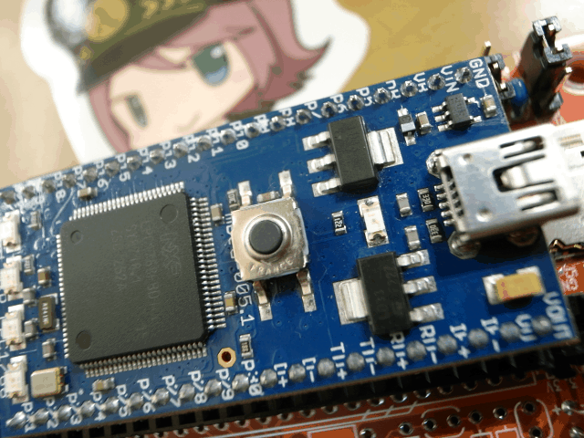
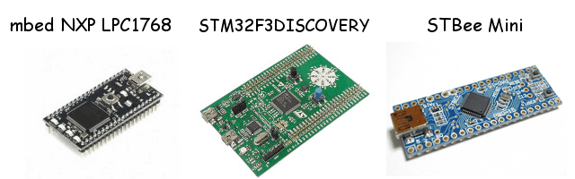
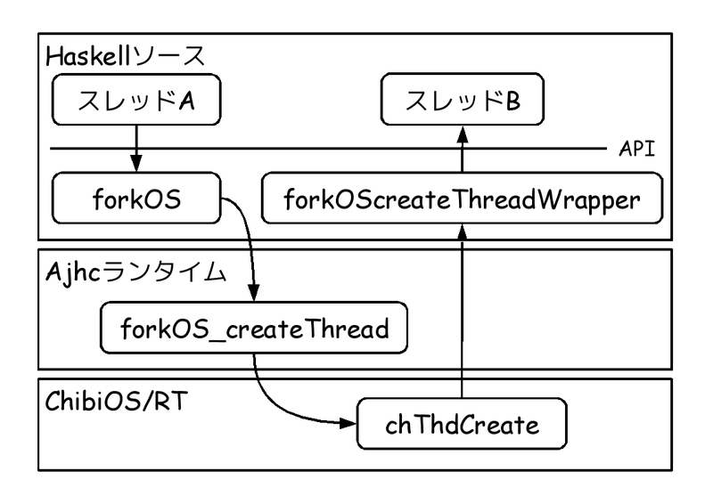

# 組込Haskellとλカ娘本の紹介

Kiwamu Okabe

# 私は誰？

* Twitter: @master_q
* Metasepiプロジェクト主催
* Ajhc Haskellコンパイラ開発者
* Debian Maintainer
* 前はデジタルサイネージの開発してました
* その昔はNetBSDでコピー機作ってた

# 名古屋といえば...関数型！

* 組込でも関数型しませんか？
* しましょう！
* Haskellなんてイカが？

# 組込Haskell？ オイシイの？

* OSにも強い型をつけたい！
* Ajhc http://ajhc.metasepi.org/
* ランタイムエラーを少なくできるのでは？

# AjhcはGHCと何が違うの？

* Ajhcは Haskell→C言語 への変換器
* バイナリサイズ小さく、POSIX依存少ない

# 応用例: POSIX API

* スレッドセーフ/再入可能/パラレルGC
* pthreadを使ったスレッドが使えます
* でも対応ライブラリは少ない...

~~~
$ ls ~/.cabal/share/ajhc-0.8.0.8/lib
Diff-0.2.0.hl            haskell98-1.0.hl
HUnit-1.2.5.1.hl         html-1.0.1.2.hl
QuickCheck-1.2.0.1.hl    jhc-1.0.hl
applicative-1.0.hl       jhc-prim-1.0.hl
containers-0.3.0.0.hl    parsec-2.1.0.1.hl
deepseq-1.2.0.1.hl       pretty-1.0.1.2.hl
filepath-1.3.0.1.hl      safe-0.3.3.hl
flat-foreign-1.0.hl      smallcheck-0.6.1.hl
haskell-extras-0.8.1.hl  transformers-0.2.1.0.hl
haskell2010-0.8.1.hl     xhtml-3000.2.1.hl
~~~

# 応用例: mbedマイコン (ARM)

~~~
https://github.com/ajhc/demo-cortex-m3
~~~

* mbed NXP LPC1768 (RAM 32kB)
* 他にもCortex-Mシリーズマイコンに対応
* OSなしで動作可能
* 割り込みハンドラもHaskellで

# 応用例: 非POSIXなOS上でのアプリ

~~~
https://github.com/metasepi/chibios-arafura
~~~

* ChibiOS/RTに対応
* FreeRTOSやμITRONでも (要やる気)

# 応用例: Android NDK

~~~
https://github.com/ajhc/demo-android-ndk
~~~

* 現在開発中
* OpenGL ESでGUIできるとイイネ
* pthreadがあるのでスレッド使える
* Haskellゲームをマーケットで売りさばこう!

# まずは使ってみてみて！

~~~
日本語マニュアル: http://ajhc.metasepi.org/manual_ja.html
~~~

* インストールは簡単

~~~
$ sudo apt-get install haskell-platform gcc make m4
$ cabal install ajhc
$ export PATH=$HOME/.cabal/bin:$PATH
~~~

* 使い方も簡単

~~~
$ echo 'main = print "hoge"' > Hoge.hs
$ ajhc Hoge.hs
$ ./hs.out
"hoge"
~~~

* C言語吐き出させてみよう

~~~
$ ajhc -C -o Hoge.c Hoge.hs
$ file Hoge.c
Hoge.c: C source, ASCII text, with very long lines
~~~

# 「簡約!?λカ娘 Go!」はイカが？

http://www.paraiso-lang.org/ikmsm/

* Lensライブラリの解説
* パーサの解説
* 圏論とモナド
* 囲碁AI
* Ajhcコンパイラの開発秘話

ちょっとだけ中身のご紹介！

