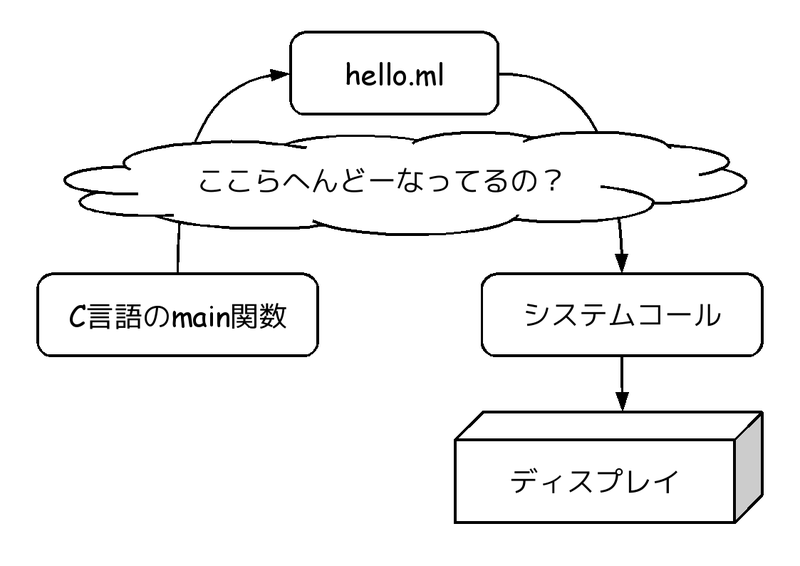
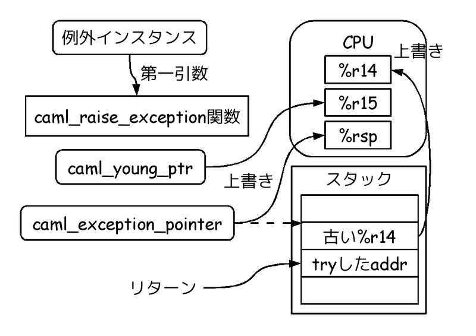
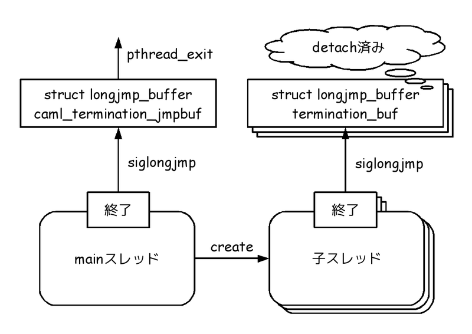
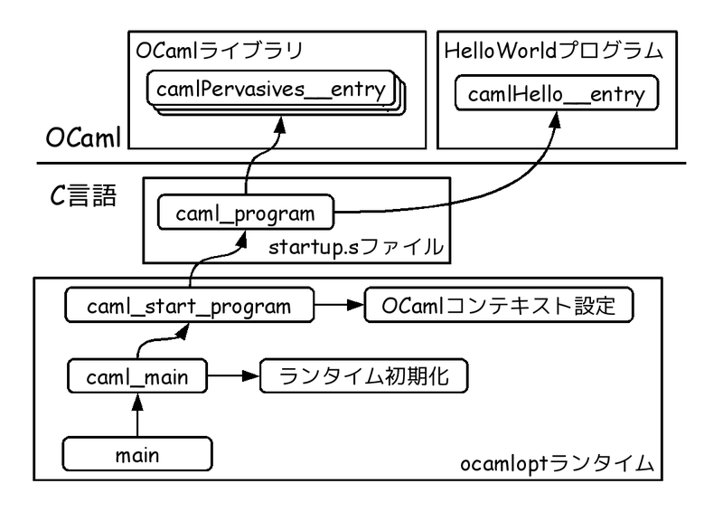
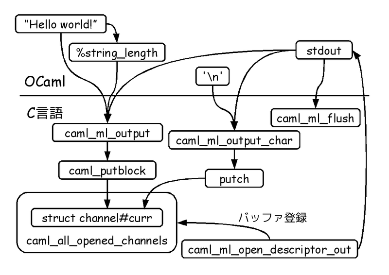

# ocamloptの全体像

Kiwamu Okabe

# 私は誰？

* Twitter: @master_q
* Metasepiプロジェクト主催
* Ajhc Haskellコンパイラ開発者
* Debian Maintainer
* 前はデジタルサイネージの開発してました
* その昔はNetBSDでコピー機作ってた

# ぼくとOCaml

* 最初の会社で社内勉強会
* letの嵐にとまどう
* 数年後にPFDSを読む
* lazyきもちいい!
* camloebaさんに脅されてocamlopt読む
* OCamlコードわかりやすい! <= イマココ

# 今日のもくじ

* [1] ocamloptについて簡単に
* [2] ソース探検のシナリオ
* [3] プログラムの起動
* [4] 文字列を画面に印字

# [1] ocamloptについて簡単に

まずはOCaml 4.00.1をインストール

~~~
$ git clone git@github.com:ocaml/ocaml.git
$ cd ocaml
$ git checkout 4.00.1
$ sudo apt-get build-dep ocaml
$ ./configure -with-debug-runtime
$ make world.opt
$ sudo make install
$ which ocamlopt
/usr/local/bin/ocamlopt
$ ocamlopt -version
4.00.1
~~~

想定環境

* Debian GNU/Linux sid amd64

# ocamloptってなんどすか？

OCamlソースを実行バイナリにするコンパイラ

~~~
$ cat hello.ml
let hello _ = print_endline "Hello world!";;
let _ = hello ();
$ ocamlopt -g -runtime-variant d -o hello.bin hello.ml
$ file hello.bin
hello.bin: ELF 64-bit LSB  executable, x86-64, version 1 (SYSV), dynamically linked (uses shared libs), for GNU/Linux 2.6.32, BuildID[sha1]=402030a9bb82606a9d38f73e6ec25455f96d3caf, not stripped
$ ./hello.bin
### OCaml runtime: debug mode ###
Initial minor heap size: 2048k bytes
Initial major heap size: 992k bytes
Initial space overhead: 80%
Initial max overhead: 500%
Initial heap increment: 992k bytes
Initial allocation policy: 0
Hello world!
~~~

# -with-debug-runtime？ -g？

* objdump -S hello.bin してみると...

# どーいうことだってばよ!？

* objdumpやgdbで
* 実行バイナリの中の
* コンパイル結果マシン語と
* ランタイムのマシン語の両方を
* ソースコードレベルデバッグできる

すばらしい!

# [2] ソース探検のシナリオ

# [3] プログラムの起動

* main関数から実行が開始されて
* camlHello__entry関数がプログラム入口

~~~
$ ocamlopt -o hello.bin hello.ml
$ gdb hello.bin
(gdb) b camlHello__entry 
Breakpoint 1 at 0x402260
(gdb) run
...
Breakpoint 1, 0x0000000000402260 in camlHello__entry ()
(gdb) bt
#0  0x0000000000402260 in camlHello__entry ()
#1  0x0000000000401e89 in caml_program ()
#2  0x0000000000410d82 in caml_start_program ()
#3  0x0000000000411245 in caml_main ()
#4  0x000000000040414e in main ()
~~~

# main関数はどこに？

* "byterun/main.c"です
* え？バイトコード？
* "{byte,asm}run"のディレクトリがある
* でもなんかきっちり分離されていない
* バイナリでも適宜byterunの下を使います

# main関数ソース

デバッグ機能なしだとこんなん

~~~ {.c}
/* File: byterun/main.c */
int main(int argc, char **argv)
{
  caml_main(argv);
  caml_sys_exit(Val_int(0));
  return 0;
}
~~~

むちゃくちゃ簡単です

# caml_main関数

# caml_init_ieee_floats関数

~~~ {.c}
/* File: byterun/floats.c */
/* The [caml_init_ieee_float] function should initialize
   floating-point hardware so that it behaves as much as possible
   like the IEEE standard.
   In particular, return special numbers like Infinity and NaN
   instead of signalling exceptions.  Currently, everyone is in
   IEEE mode at program startup, except FreeBSD prior to 4.0R. */
/* --snip-- */
void caml_init_ieee_floats(void)
{
#if defined(__FreeBSD__) && (__FreeBSD_version < 400017)
  fpsetmask(0);
#endif
}
~~~

* FreeBSDへのバグ対策？
* 気にしないことにしましょう

# caml_init_custom_operations #1

ボックス化されたintのプリミティブ関数を登録

~~~ {.c}
/* File: byterun/custom.c */
void caml_init_custom_operations(void)
{
  caml_register_custom_operations(&caml_int32_ops);
  caml_register_custom_operations(&caml_nativeint_ops);
  caml_register_custom_operations(&caml_int64_ops);
}
~~~

# caml_init_custom_operations #2

でもたぶんこれバイトコードでだけ必要なんだと思う

~~~
$ grep "caml_.*_ops" asmcomp/cmmgen.ml
    Pnativeint -> "caml_nativeint_ops"
  | Pint32 -> "caml_int32_ops"
  | Pint64 -> "caml_int64_ops"
    Csymbol_address("caml_int32_ops") :: Cint32 n :: Cint32 0n :: cont
    Csymbol_address("caml_int32_ops") :: Cint n :: cont
  Csymbol_address("caml_nativeint_ops") :: Cint n :: cont
    Csymbol_address("caml_int64_ops") :: Cint lo :: cont
      Csymbol_address("caml_int64_ops") :: Cint hi :: Cint lo :: cont
      Csymbol_address("caml_int64_ops") :: Cint lo :: Cint hi :: cont
~~~

ocamloptではシンボルから直接呼び出しに

# parse_camlrunparam関数

OCAMLRUNPARAM環境変数を見るだけ

~~~
http://caml.inria.fr/pub/docs/manual-ocaml/manual024.html
~~~

~~~ {.c}
/* File: asmrun/startup.c */
static void parse_camlrunparam(void)
{
  char *opt = getenv ("OCAMLRUNPARAM");
  uintnat p;

  if (opt == NULL) opt = getenv ("CAMLRUNPARAM");

  if (opt != NULL){
    while (*opt != '\0'){
      switch (*opt++){
      case 's': scanmult (opt, &minor_heap_init); break;
      case 'i': scanmult (opt, &heap_chunk_init); break;
      case 'h': scanmult (opt, &heap_size_init); break;
      case 'l': scanmult (opt, &max_stack_init); break;
      case 'o': scanmult (opt, &percent_free_init); break;
      case 'O': scanmult (opt, &max_percent_free_init); break;
      case 'v': scanmult (opt, &caml_verb_gc); break;
      case 'b': caml_record_backtrace(Val_true); break;
      case 'p': caml_parser_trace = 1; break;
      case 'a': scanmult (opt, &p); caml_set_allocation_policy (p); break;
      }
    }
  }
}
~~~

# caml_init_gc関数

* メジャー/マイナーGC用のヒープ初期化
* Real World OCaml読んだ方がいいかも!

# init_atoms関数

* これよくわからなかったです
* caml_data_segmentsと
* caml_code_segmentsを解析している？
* 目的がよくわからない...

# caml_init_signals関数

SEGVシグナルハンドラを通常コンテキストとは別のスタックで実行するように設定

~~~ {.c}
/* File: asmrun/signals_asm.c */
void caml_init_signals(void)
{
  /* Stack overflow handling */
    stack_t stk;
    struct sigaction act;
    stk.ss_sp = sig_alt_stack;
    stk.ss_size = SIGSTKSZ;
    stk.ss_flags = 0;
    SET_SIGACT(act, segv_handler);
    act.sa_flags |= SA_ONSTACK | SA_NODEFER;
    sigemptyset(&act.sa_mask);
    system_stack_top = (char *) &act;
    if (sigaltstack(&stk, NULL) == 0) {
      sigaction(SIGSEGV, &act, NULL);
    }
}
~~~

# segv_handler関数

* SEGVシグナルで起動
* スタック溢れが起きていたら例外発生
* 最終的にcaml_raise_exceptionを呼ぶ

# OCamlの例外キャッチ

# OCamlの例外スロー

# つまり？

OCamlサイド

* r14レジスタ: try時スタック
* r15レジスタ: GCヒープへのポインタ

C言語サイド

* caml_exception_pointer: try時スタック
* caml_young_ptr: GCヒープへのポインタ

いつでも戻れますね

# caml_debugger_init関数

CAML_DEBUG_SOCKET環境変数が定義されていたらBSDソケットを使ったデバッグ環境を設定

~~~
http://caml.inria.fr/pub/docs/manual-ocaml/manual030.html
~~~

そんなものがあったのか...

# caml_sys_init関数

プログラム名と引数の保管

~~~ {.c}
/* File: byterun/sys.c */
void caml_sys_init(char * exe_name, char **argv)
{
  caml_exe_name = exe_name;
  caml_main_argv = argv;
}
~~~

まぁありがち

# sigsetjmp

スレッドが終了するとlongjmpする。
mainスレッドじゃなければ、caml_termination_jmpbufには飛ばない。

# caml_start_program関数

* calleeのレジスタ退避
* caml_gc_regsをpush
* caml_last_return_addressをpush
* caml_bottom_of_stackをpush
* caml_young_ptrを%r15に
* caml_exception_pointerを%r14に
* caml_program関数呼び出し

# caml_program

コンパイル時に生成されるstartup.sで定義

# camlPervasives__entry

* Pervasivesモジュール初期化

# メジャーGCタイミングで全flush

# camlHello__entry

最初のゴールに到着しました

# [4] 文字列を画面に印字

* print_endlineが開始

# print_endlineはバッファへ書き込む

# blocking_sectionって何？

~~~ {.c}
/* File: byterun/io.c */
CAMLexport struct channel * caml_open_descriptor_in(int fd)
{
  struct channel * channel;

  channel = (struct channel *)
              caml_stat_alloc(sizeof(struct channel));
  channel->fd = fd;
  caml_enter_blocking_section();
  channel->offset = lseek(fd, 0, SEEK_CUR);
  caml_leave_blocking_section();
  channel->curr = channel->max = channel->buff;
  channel->end = channel->buff + IO_BUFFER_SIZE;
~~~

システムコールを囲むように配置されている...

# caml_enter_blocking_section()のしくみ

~~~ {.c}
/* File: byterun/signals.c */
CAMLexport intnat volatile caml_signals_are_pending = 0;

void caml_record_signal(int signal_number)
{
  caml_pending_signals[signal_number] = 1;
  caml_signals_are_pending = 1;
  caml_something_to_do = 1;
}

void caml_process_pending_signals(void)
{
  int i;

  if (caml_signals_are_pending) {
    caml_signals_are_pending = 0;
    for (i = 0; i < NSIG; i++) {
      if (caml_pending_signals[i]) {
        caml_pending_signals[i] = 0;
        caml_execute_signal(i, 0);
      }
    }
  }
}

CAMLexport void caml_enter_blocking_section(void)
{
  while (1){
    /* Process all pending signals now */
    caml_process_pending_signals();
    caml_enter_blocking_section_hook ();
    /* Check again for pending signals.
       If none, done; otherwise, try again */
    if (! caml_signals_are_pending) break;
    caml_leave_blocking_section_hook ();
  }
}

CAMLexport void caml_leave_blocking_section(void)
{
  caml_leave_blocking_section_hook ();
  caml_process_pending_signals();
}
~~~

pendingしているsignalを実行し終わってからblocking_sectionに入るみたい。

# シグナルを受けるのは誰？

~~~ {.c}
/* File: asmrun/signals_asm.c */
DECLARE_SIGNAL_HANDLER(handle_signal)
{
#if !defined(POSIX_SIGNALS) && !defined(BSD_SIGNALS)
  signal(sig, handle_signal);
#endif
  if (sig < 0 || sig >= NSIG) return;
  if (caml_try_leave_blocking_section_hook ()) {
    caml_execute_signal(sig, 1);
    caml_enter_blocking_section_hook();
  } else {
    caml_record_signal(sig);
  /* Some ports cache [caml_young_limit] in a register.
     Use the signal context to modify that register too, but only if
     we are inside OCaml code (not inside C code). */
#if defined(CONTEXT_PC) && defined(CONTEXT_YOUNG_LIMIT)
    if (Is_in_code_area(CONTEXT_PC))
      CONTEXT_YOUNG_LIMIT = (context_reg) caml_young_limit;
#endif
  }
}

// <= call from caml_install_signal_handler <= OCamlコード
int caml_set_signal_action(int signo, int action)
{
  signal_handler oldact;
  struct sigaction sigact, oldsigact;

  switch(action) {
  case 0:
    sigact.sa_handler = SIG_DFL;
    sigact.sa_flags = 0;
    break;
  case 1:
    sigact.sa_handler = SIG_IGN;
    sigact.sa_flags = 0;
    break;
  default:
    SET_SIGACT(sigact, handle_signal);
    break;
  }
  sigemptyset(&sigact.sa_mask);
  if (sigaction(signo, &sigact, &oldsigact) == -1) return -1;
  oldact = oldsigact.sa_handler;
  if (oldact == (signal_handler) handle_signal)
    return 2;
  else if (oldact == SIG_IGN)
    return 1;
  else
    return 0;
}
~~~

~~~ {.ocaml}
(* File: stdlib/sys.mlp *)
external signal : int -> signal_behavior -> signal_behavior
                = "caml_install_signal_handler"
~~~
