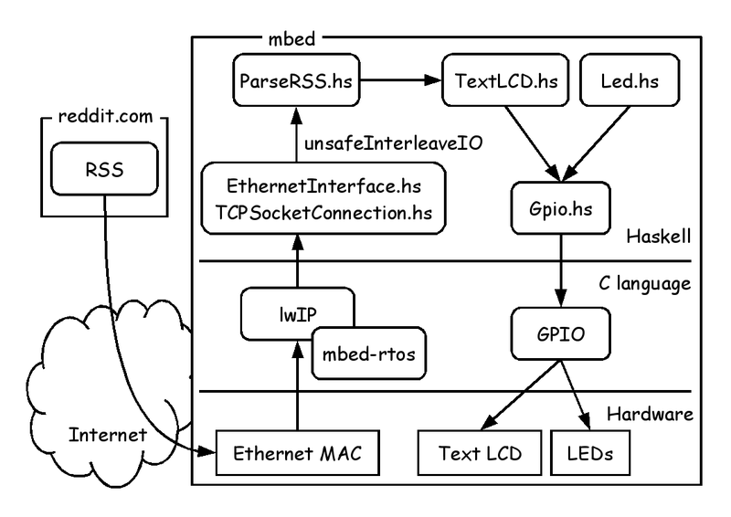
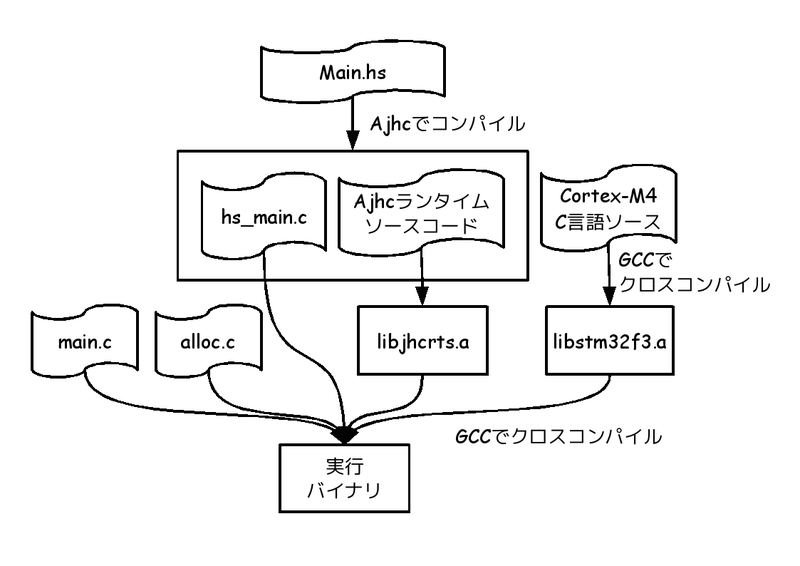

# 組込向けHaskellコンパイラAjhc　mbedマイコンどうでしょう編

Kiwamu Okabe

# 私は誰？

* Twitter: @master_q
* Metasepiプロジェクト主催
* Ajhc Haskellコンパイラ開発者
* Debian Maintainer
* 前はデジタルサイネージの開発してました
* その昔はコピー機のOSをNetBSDで

# ようこそ、ピストルMetasepiへ

* [1] まずはデモでも
* [2] Ajhcコンパイラとは
* [3] Metasepi kernelとは
* [4] OS開発向けコンパイラとは
* [5] Ajhcのインストールと使い方
* [6] mbedマイコン上でのHaskell
* [7] Ajhcコンパイラの過去と未来

# [1] まずはデモでも

xxx youtube URL

* mbedでRSSリーダーを作ってみました
* redditのRSSをLCDにヘッドライン表示

# ハードウェア構成

アーキティクチャ: ARM Cortex-M3

デバイス: Ethernet, LED, LCD, SDカード, USBホスト/デバイス, シリアル

xxx mbedボードとオレンジボードの写真

# ソフトウェア構成

# ソースコードツリー

~~~
demo-cortex-m3
`-- mbed-nxp-lpc1768
    |-- BuildShell                 <= コンパイル環境設定
    |-- build
    |   `-- mbed.ld                <= リンカスクリプト
    |-- external
    |   `-- mbed
    |       `-- LPC1768
    |           `-- GCC_ARM
    |               `-- libmbed.a  <= コンパイル済みmbedライブラリ
    |-- linux_install              <= コンパイル環境構築スクリプト
    |-- samples
    |   `-- Haskell_Http
    |       |-- EthernetInterface  <= TCP/IPプロトコルスタック
    |       |-- c_extern.h
    |       |-- dummy4jhc.c        <= Haskell用C言語スタブ
    |       |-- hs_src
    |       |   `-- *.hs           <= Haskellソースコード
    |       |-- main.c             <= C言語main関数
    |       `-- mbed-rtos          <= mbed-rtos OS
    `-- src
        `-- gcc4mbed.c
~~~

# [2] Ajhcコンパイラとは

http://ajhc.metasepi.org/

* Ajhc := A fork of jhc
* jhc := John's Haskell Compiler
* http://repetae.net/computer/jhc/
* jhcはフットプリントが小さく、
* 高速な実行バイナリを吐くらしい
* 組み込みに向いてるかも

# どうしてAjhcコンパイラ作るの？

* HaskellコミュニティではGHCがデファクト
* GHC := Glasgow Haskell Compiler
* http://www.haskell.org/ghc/
* なぜ別のHaskellコンパイラが必要？
* Metasepiというkernelを作るため

# [3] Metasepi kernelとは

http://metasepi.org/

* UNIXモドキkernelを強い型によって設計
* ML同等以上に強い型を持つ言語を使う

Haskell http://www.haskell.org/

OCaml http://caml.inria.fr/

MLton http://mlton.org/

などなど

# どうしてMetasepiが必要？

* LinuxやWindowsが既にあるのでは？
* しかし組込開発は苦しんでいる
* kernelをカスタマイズして使用
* kernelのランタイムエラー
* 再現することでさえ困難

# 既存OSSの品質は高いのでは？

* OSSは品質が高いと言われている
* 伽藍とバザール
* 「目玉の数さえ十分あれば、どんなバグも深刻ではない」

~~~
http://cruel.org/freeware/cathedral.html
~~~

* ところが社内開発は...

# 主開発からそれると品質急降下

# 型安全とは

* ランタイムエラーを少なくできる
* 参考:数理科学的バグ撲滅方法論のすすめ

~~~
http://itpro.nikkeibp.co.jp/article/COLUMN/20060915/248230/
~~~

# kernelにこそ型安全が必要

* ほとんどのkernelはC言語で設計される
* ユーザー空間でエラー → SEGV
* kernel空間でエラー → システム停止
* kernelの設計には細心の注意が必要
* C言語は安全なのか？

# [4] OS開発向けコンパイラとは

* 強い型が使えてOSを作れるコンパイラは？
* C言語のような使い勝手が必要
* ないみたいなので作りましょう!
* スクラッチから作るのはツライ
* 要求に近いコンパイラはないかな？

# POSIX外で使いやすいコンパイラ

各数値が小さいほどPOSIX APIへの依存度が小さい

# jhcバイナリは未定義シンボル20個

~~~
$ nm hs.out | grep "U "
                 U _IO_putc@@GLIBC_2.2.5
                 U __libc_start_main@@GLIBC_2.2.5
                 U _setjmp@@GLIBC_2.2.5
                 U abort@@GLIBC_2.2.5
                 U ctime@@GLIBC_2.2.5
                 U exit@@GLIBC_2.2.5
                 U fflush@@GLIBC_2.2.5
                 U fprintf@@GLIBC_2.2.5
                 U fputc@@GLIBC_2.2.5
                 U fputs@@GLIBC_2.2.5
                 U free@@GLIBC_2.2.5
                 U fwrite@@GLIBC_2.2.5
                 U getenv@@GLIBC_2.2.5
                 U malloc@@GLIBC_2.2.5
                 U memset@@GLIBC_2.2.5
                 U posix_memalign@@GLIBC_2.2.5
                 U realloc@@GLIBC_2.2.5
                 U setlocale@@GLIBC_2.2.5
                 U sysconf@@GLIBC_2.2.5
                 U times@@GLIBC_2.2.5
~~~

# jhcはC言語への変換器

# クロスコンパイルも簡単

# 実用化に辿りつくために

実行可能状態を維持しながら開発 (スナッチ)

# [5] Ajhcのインストールと使い方

* インストールしてみましょう

Ubuntu 12.04 amd64 の場合

~~~
$ sudo apt-get install haskell-platform libncurses5-dev gcc m4
$ cabal update
$ export PATH=$HOME/.cabal/bin/:$PATH
$ cabal install ajhc
$ which ajhc
/home/ユーザ名/.cabal/bin/ajhc
$ ajhc --version
ajhc 0.8.0.8 (f6c3f4b070acad8a5012682810f0f4d7b7b9ed44)
compiled by ghc-7.4 on a x86_64 running linux
~~~

バージョン0.8.0.9からはWindowsとOS Xでもインストール可能になる予定です

# 使い方詳細

「Ajhcユーザーズマニュアル」

ajhc.metasepi.org/manual_ja.html

を読んでみてください!

# [6] mbedマイコン上でのHaskell

mbedマイコン上でHaskellコードを動かす手順をステップ毎に説明します

* 前半: C言語の開発環境構築
* 後半: Haskellの開発環境構築

の大きく二つに分かれています

# ベースとなるソースコードを入手

githubにmbedのC言語プロジェクトがあったので、これをベースに開発をはじめます

~~~
https://github.com/adamgreen/gcc4mbed
~~~

# ビルド手順を確認

クロスコンパイル環境構築

~~~
$ cd gcc4mbed
$ ./linux_install
~~~

設定したクロスコンパイラを使うには...

~~~
$ cd gcc4mbed
$ ./BuildShell
$ cd samples/Blink
$ ls
main.c  makefile
$ make
$ ls
Blink.bin  Blink.elf  Blink.hex  LPC176x  main.c  makefile
~~~

Blink.elfがコンパイル結果です

# mbedにプログラムを書き込む #1

プログラム書き込み環境を作りましょう

* mbedファームウェアを更新

~~~
http://mbed.org/handbook/Firmware-LPC1768-LPC11U24
~~~

rev.141212以降のファームウェアが必要です

* pyOCDのインストール

~~~
$ sudo apt-get install python libusb-1.0-0-dev
$ git clone git@github.com:walac/pyusb.git
$ cd pyusb
$ sudo python setup.py install
$ git clone git@github.com:mbedmicro/mbed.git
$ cd mbed/workspace_tools/debugger
$ sudo python setup.py install
~~~

# mbedにプログラムを書き込む #2

* 書き込みスクリプト設定

~~~
$ cd gcc4mbed
$ cp ~/mbed/workspace_tools/debugger/test/gdb_test.py gdbserver.py
~~~

* Makefileにgdbターゲット追加

~~~
$ vi gcc4mbed/samples/Blink/makefile
--snip--
gdbwrite: all
        @echo '################################################'
        @echo '# Use me after running "sudo ./gdbserver4.py". #'
        @echo '################################################'
        $(GDB) -x ../../gdbwrite.boot $(PROJECT).elf
~~~

# mbedにプログラムを書き込む #3

* mbedとPCをUSBケーブルで接続
* 一つ目のターミナルで以下を実行

~~~
$ cd gcc4mbed
$ sudo python gdbserver.py
~~~

* 別のターミナルを開き以下を実行

~~~
$ cd gcc4mbed
$ ./BuildShell
$ cd samples/Blink
$ make gdbwrite
(gdb) c
~~~

# 完成したC言語開発環境

# 完成したHaskell開発環境

xxx 概要図

# [7] Ajhcコンパイラの過去と未来

* Ajhcの開発をはじめて9ヶ月
* いろいろありました...
* 振り返りと今後の展望をざっくりと

# これまでのAjhcコンパイラ

* ユーザーズマニュアルの翻訳

~~~
http://ajhc.metasepi.org/manual_ja.html
~~~

* Cortex-M3マイコンへの移植

~~~
https://github.com/ajhc/demo-cortex-m3
~~~

* 省メモリGC
* 再入可能とスレッドの実現
* ChibiOS/RT上でのHaskellスレッド
* mbed-rtos上でのTCP/IPプログラミング

# Ajhcにまつわる発表資料

# Ajhcコンパイラの未来

* 内部仕様ドキュメント作成中

~~~
https://github.com/ajhc/ajhc-hacking-guide
~~~

* 型によるスレッド間状態共有
* GHCのライブラリを移植
* さらなる応用例の提案
* NetBSD kernelを型によって再設計
* Metasepi上でMetasepi開発を可能に

# 宣伝:λカ娘に記事を書きませんか？

* http://www.paraiso-lang.org/ikmsm/
* 関数型言語の同人誌
* HaskellとかOCamlとか圏論とか
* C84にはAjhcの解説記事を投稿しました
* 立ち読みしたい方は声かけて!
* Call For Articlesはイカ

~~~
http://www.paraiso-lang.org/ikmsm/books/c85.html
~~~

# 本スライドで使用した画像 #1

~~~
* sunny side up | Flickr - Photo Sharing!
  http://www.flickr.com/photos/97335141@N00/4623354472/
* Mud Slide | Flickr - Photo Sharing!
  http://www.flickr.com/photos/ben_salter/2676953286/
* Feelin' Safe | Flickr - Photo Sharing!
  http://www.flickr.com/photos/mstyne/3654056683/
* STOP ALL WAY | Flickr - Photo Sharing!
  http://www.flickr.com/photos/peterkaminski/1510724/
* Bungee jump | Flickr - Photo Sharing!
  http://www.flickr.com/photos/gj_thewhite/8855033499/
* The C Programming Language | Flickr - Photo Sharing!
  http://www.flickr.com/photos/mrbill/2482009942/
* The 20 Yard Line | Flickr - Photo Sharing!
  http://www.flickr.com/photos/eschipul/2957264066/
* _MG_3881 | Flickr - Photo Sharing!
  http://www.flickr.com/photos/63209717@N05/6873025064/
* Mini Cross | Flickr - Photo Sharing!
  http://www.flickr.com/photos/hdrexperience/6727601691/
* Goal for the Sky | Flickr - Photo Sharing!
  http://www.flickr.com/photos/giantsqurl/5165392772/
* Manual and driver disc | Flickr - Photo Sharing!
  http://www.flickr.com/photos/tseedmund/3859079008/
~~~

# 本スライドで使用した画像 #2

~~~
* Simple Heart | Flickr - Photo Sharing!
  http://www.flickr.com/photos/21148821@N02/2055189101/
* GNU Wallpaper | Flickr - Photo Sharing!
  http://www.flickr.com/photos/jeffpro/8603895629/
* The core | Flickr - Photo Sharing!
  http://www.flickr.com/photos/mukluk/484631726/
* Dummies. Someday they'll take over the world. They already have.
  http://www.flickr.com/photos/keoni101/5244610841/
* Michael Caputo, "just tryin' to break the ice, with nothin'...
  http://www.flickr.com/photos/sixteen-miles/3757672365/
* Groundskeeper sweeping, Citi Field | Flickr - Photo Sharing!
  http://www.flickr.com/photos/48913243@N00/4605448536/
* Carrier Pigeon | Flickr - Photo Sharing!
  http://www.flickr.com/photos/enzymedesign/4983070657/
* Arrows showing up (Blender) | Flickr - Photo Sharing!
  http://www.flickr.com/photos/61423903@N06/7382239368/
* Handshakes | Flickr - Photo Sharing!
  http://www.flickr.com/photos/ndanger/4425413794/
* STM32 Development Board | Flickr - Photo Sharing!
  http://www.flickr.com/photos/randomskk/3920434183/
* Hiking | Flickr - Photo Sharing!
  http://www.flickr.com/photos/aigle_dore/5824862885/
~~~

# 本スライドで使用した画像 #3

~~~
* Next Kyoto 懐石 | Flickr - Photo Sharing!
  http://www.flickr.com/photos/edsel_/8330803003/
* Portal 2 fly | Flickr - Photo Sharing!
  http://www.flickr.com/photos/warvan/4984607550/
* Sticker Nation - 8 | Flickr - Photo Sharing!
  http://www.flickr.com/photos/oskay/411003747/
* I love flickr | Flickr - Photo Sharing!
  http://www.flickr.com/photos/theresasthompson/3279837886/
* flickr | Flickr - Photo Sharing!
  http://www.flickr.com/photos/zanastardust/145197704/
* flickr was here | Flickr - Photo Sharing!
  http://www.flickr.com/photos/sarahrosenau/185196442/
* Hooded Cuttlefish | Flickr - Photo Sharing!
  http://www.flickr.com/photos/silkebaron/931381358/
* Hooded Cuttlefish | Flickr - Photo Sharing!
  http://www.flickr.com/photos/silkebaron/931247866/
~~~
