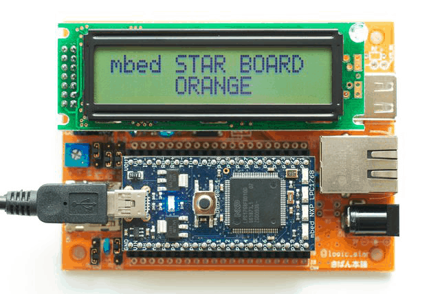

# mbed+Haskellどうでしょう

Kiwamu Okabe

# 私は誰？

* Twitter: @master_q
* Metasepiプロジェクト主催
* Ajhc Haskellコンパイラ開発者
* Debian Maintainer
* 前はデジタルサイネージの開発してました
* その昔はコピー機のOSをNetBSDで

# mbedって？

http://mbed.org/

* プロトタイピング用ワンボードマイコン
* ARM Cortex-M3などのマイコンを使用
* Arduinoみたいなのの32bit CPU版
* Webブラウザだけで開発できる
* もちろんGCCを使った開発も可能

# Haskellって？

http://www.haskell.org/

* 純粋関数型プログラミング言語らしい
* Javaよりも強い型
* 型推論で型を書く手間を軽減
* コンパイラをそなえる

えーと、ぼくは"強い型"が使えるところが気に入っています

# 組込Haskell？ オイシイの？

* 低レイヤーにも強い型をつけたい！
* Ajhc http://ajhc.metasepi.org/
* ランタイムエラーを少なくできるのでは？

# デモります!

* いちおう動画リンク付けておきますね
* ネットワーク不調で動かなかった時用に

http://bit.ly/mbedmov

# Ajhcコンパイラ使ってみてみて！

~~~
日本語マニュアル: http://ajhc.metasepi.org/manual_ja.html
~~~

* インストールは簡単

~~~
$ sudo apt-get install haskell-platform gcc make m4
$ cabal install ajhc
$ export PATH=$HOME/.cabal/bin:$PATH
~~~

* 使い方も簡単

~~~
$ echo 'main = print "hoge"' > Hoge.hs
$ ajhc Hoge.hs
$ ./hs.out
"hoge"
~~~

* C言語吐き出させてみよう

~~~
$ ajhc -C -o Hoge.c Hoge.hs
$ file Hoge.c
Hoge.c: C source, ASCII text, with very long lines
~~~

# 「簡約!?λカ娘 Go!」に記事書いたよ

http://www.paraiso-lang.org/ikmsm/

* Lensライブラリの解説
* パーサの解説
* 圏論とモナド
* 囲碁AI
* Ajhcコンパイラの開発秘話 <= コレ書いた

立ち読みしたい方はぼくに声かけて!
