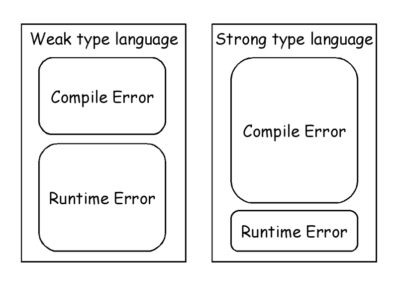
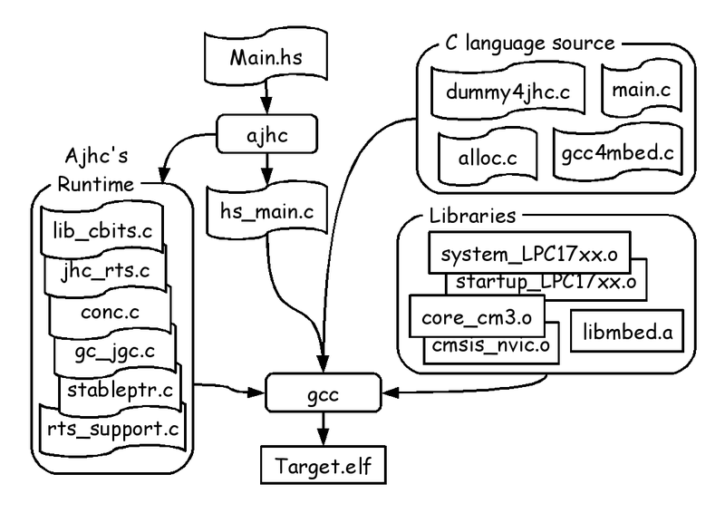
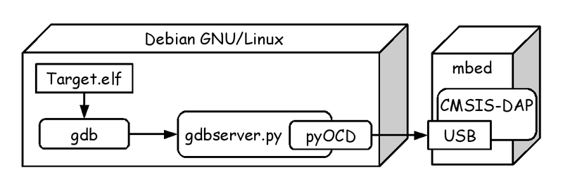
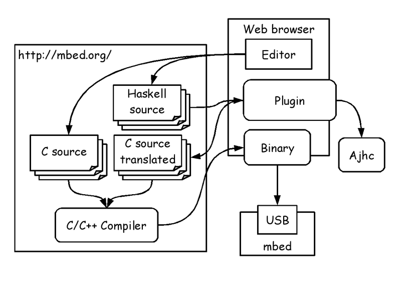

# mbed ではじめる組み込み Haskell プログラミング

Kiwamu Okabe

# わたしはだれ？

* Twitter: @master_q
* Metasepiプロジェクト主催
* Ajhc Haskellコンパイラ開発者
* Debian Maintainer
* 前はデジタルサイネージの開発してました
* その昔はコピー機のOSをNetBSDで

# 今日はmbedに焦点をあてます

* 一昨日OSC Hokkaidoが開催されました
* Haskellの話はその時の資料をどうぞ!

http://bit.ly/mbedhask

* 今日はmbed側の話をさせてください

# おしながき

* [1] 

# 突然ですがHaskellご存知ですか？

* 強い型を使えるプログラミング言語
* コンパイルエラー↑ / 実行時エラー↓

~~~
参考:「数理科学的バグ撲滅方法論のすすめ」
     http://itpro.nikkeibp.co.jp/article/COLUMN/20060915/248230/
~~~

# なんでまたHaskell組み込み？

* アプリでエラー → SEGV → 再起動できる
* 低レイヤーでエラー → システム停止
* 低レイヤーを強い型で安全に設計したい!
* Ajhc Haskellコンパイラを開発中
* http://ajhc.metasepi.org/

# このプレゼンで前提とする環境

* Debian GNU/Linux sid amd64
* 他のディストリでも大丈夫だと思います
* WindowsとMacもひょっとしたら同じ？

# mbed+Haskell開発環境

詳細: http://bit.ly/mbedhask

# ファームウェア書き込み

~~~
http://mbed.org/blog/entry/Debugging-from-GDB-using-pyOCD/
https://github.com/mbedmicro/mbed/tree/master/workspace_tools/debugger
~~~

ぼくは"make gdbwrite"一発でビルド+ファーム書込ができるように設定しています

# クラウドコンパイラは使えないの？

いくつか課題があって実現していません

* AjhcコンパイラがGCCに依存している
* クラウドコンパイラがコマンドを呼べない

# 妄想: クラウドコンパイラ+Ajhc

mbed.org側修正が必要になってしまいます...

# ちょっと休憩にデモ見てみましょー

* mbedでRSSリーダーを作ってみました
* redditのRSSをLCDにヘッドライン表示
* 動画は以下のURLから観れます

http://bit.ly/mbedmov

# デモの実装概要

# デモの実装を詳細に見てみましょう

ソースコードはこちら

~~~
https://github.com/ajhc/demo-cortex-m3/tree/master/mbed-nxp-lpc1768/samples/Haskell_Http
~~~

# Haskell→C言語 呼び出し

~~~ {.haskell}
foreign import ccall "c_extern.h wait_us" delayUs :: Int -> IO ()
~~~
