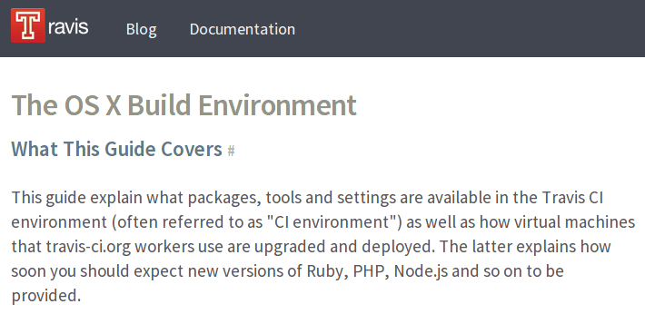
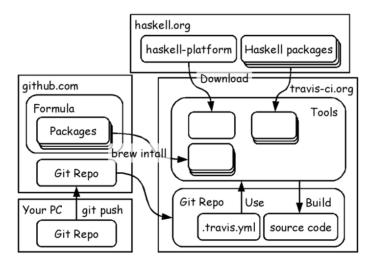

# Build OS X Apps on Travis CI

Kiwamu Okabe

# Who am I?

* http://www.masterq.net/
* Twitter: @master_q
* Organizer of Metasepi project
* A developer of Ajhc Haskell compiler
* A Debian Maintainer
* 10 years' experience in developing OS using NetBSD.

# Do you use Travis CI?

# Ajhc is tested on Travis CI

* Travis CI is a continuous integration service.
* It builds code on Ubuntu Linux.
* But some people use Mac OS X.
* Are there CI services for OS X Apps?

# Travis CI can build iOS apps

If so, also can build Mac OS X apps?

~~~
http://about.travis-ci.org/docs/user/osx-ci-environment/
~~~

# Detail to build Mac OS X Apps

~~~
Detail: https://github.com/ajhc/ajhc/tree/arafura-ci4osx
~~~

# Setting to build OS X Apps #1

~~~{.yaml}
# .travis.yml
language: objective-c

before_install:
  - date
  - export PATH="$HOME/Library/Haskell/bin:$PATH"
  - ./travis-ci/setup_osx.sh
  - git fetch --tags
  - ./travis-ci/show_setting_osx.sh
script:
  - ./travis-ci/build.sh
  - make selftest
  - make rtstest
after_script:
  - date
~~~

# Setting to build OS X Apps #2

~~~{.sh}
# travis-ci/setup_osx.sh
#!/usr/bin/env sh
wget "http://lambda.haskell.org/platform/download/2013.2.0.0/Haskell Platform 2013.2.0.0 32bit.pkg"
sudo installer -pkg "Haskell Platform 2013.2.0.0 32bit.pkg" -target /
brew update
brew install valgrind
echo "yes" | sudo cpan install YAML
cabal update
export HSPACKS="derive temporary haskeline utf8-string HsSyck cpphs test-framework-th test-framework-hunit test-framework-quickcheck2 uniplate"
export HSOPTS="-j --disable-documentation --disable-library-profiling --disable-executable-profiling"
cabal install $HSOPTS cabal-install
cabal install $HSOPTS $HSPACKS
~~~

# Demonstration

We have a time to watch demo?

# PR: Ajhc Haskell compiler

* http://ajhc.metasepi.org/
* Ajhc apps are able to running on tiny CPU has only 40kB RAM.
* Ajhc also build Android NDK apps.
* In future, would like to rewrite NetBSD kernel with Ajhc!

# PR: Call For Articles

* http://www.paraiso-lang.org/ikmsm/
* Fanzine of functional programming.
* About Haskell or OCaml or . . .
* Article about Ajhc in C84 book.
* Call me if you read it!

~~~
http://www.paraiso-lang.org/ikmsm/books/c85.html
~~~
