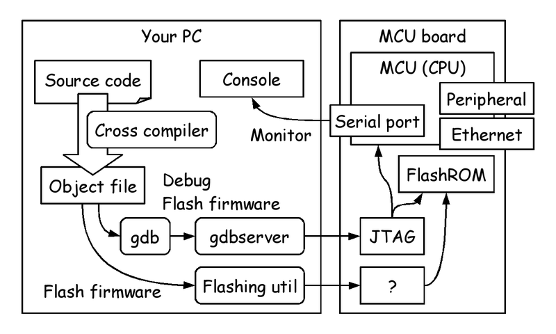
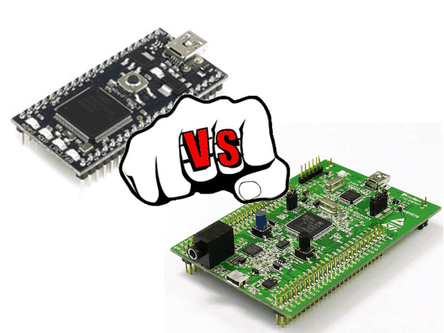
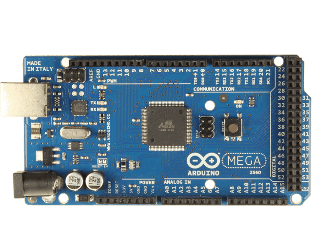
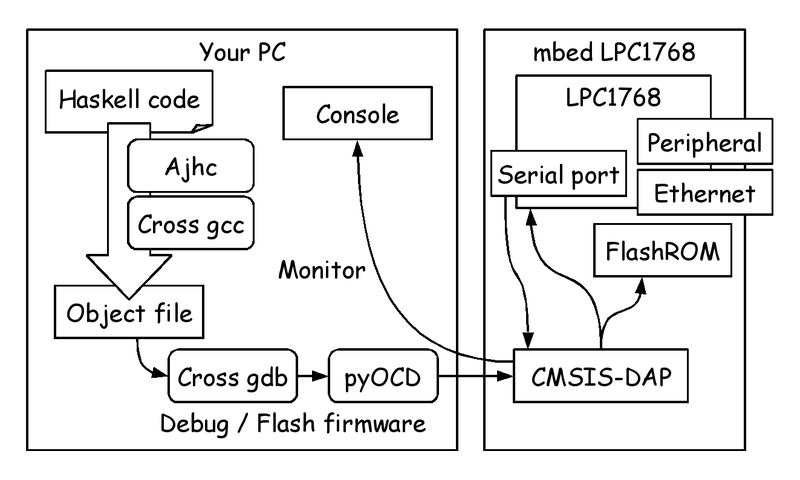

# Functional MCU programming #0: Development environment

Metasepi Project / Kiwamu Okabe

# Who am I ?

* http://www.masterq.net/
* Twitter: @master_q
* Organizer of Metasepi Project
* A developer of Ajhc Haskell compiler
* A Debian Maintainer
* 10 years' experience in developing OS using NetBSD.

# Why functional lang for MCU?

* We will live in IoT world
* Can't debug IoT device on field
* Should avoid runtime error
* We need strong type !

# Overview

# MCU (Microcontroller)

Many architecture are on the earth.

# MCU: ARM Cortex-M

* Major
* 32bit
* Large memory size (> 20kB)

Good MCU Board is ...

* mbed LPC1768 (5,200 YEN)

~~~
https://mbed.org/platforms/mbed-LPC1768/
~~~

* STM32F4DISCOVERY (1,650 YEN)

~~~
http://www.st.com/web/catalog/tools/FM116/SC959/SS1532/PF252419
~~~

# MCU: TI MSP430

* Minor
* 16bit
* Small memory size (< 4kB)

Good MCU Board is ...

* MSP-EXP430G2 (1,202 YEN)

http://www.ti.com/tool/msp-exp430g2

# MCU: Atmel AVR

* Major
* 8bit and Harvard architecture
* Small memory size (< 8kB)

Good MCU Board is ...

* Arduino Mega 2560 compat board (2,690 YEN)

~~~
http://www.amazon.co.jp/dp/B00CF2REXC
~~~

# Cross compiler

* Functional language implementation
* many many many ...
* Which language good for MCU ?

# Cross compiler: (A)jhc

http://ajhc.metasepi.org/

* Language: Haskell
* Haskell is major !
* Need GC heap = Need more memory
* Experience running on MCU

~~~
ARM Cortex-M
https://github.com/ajhc/demo-cortex-m3
~~~

# Cross compiler: ATS

http://www.ats-lang.org/

http://jats-ug.metasepi.org/

* Language: ML
* Optional GC = Need low memory
* No experience running on MCU

# Cross compiler: Rust

http://www.rust-lang.org/

* Language: Own syntax like C or JS
* Optional GC = Need low memory
* Experience running on MCU

~~~
ARM Cortex-M
https://github.com/neykov/armboot
~~~

* @pirapira knows detail of it

# gdbserver (Debugger)

* Gdb is major debugger
* But gdb is only for the program running on your PC
* How debug program running on MCU ?
* Gdbserver is good for the use case
* There are many implementation

# gdbserver: OpenOCD

http://openocd.sourceforge.net/

* Support many MCU

ARM7, ARM9, ARM11, ARM Cortex-M, XScale, MIPS m4k, Orion SoC

* Support many JTAG
* Need config file

# gdbserver: pyOCD

https://github.com/mbedmicro/pyOCD

* Only for MCU using CMSIS-DAP
* But now support only mbed LPC1768
* In future, support more board ?

Seeeduino Arch Pro ($43.41)

~~~
http://www.seeedstudio.com/depot/arch-pro-p-1677.html
~~~

FRDM-KL46Z (1,634 YEN)

~~~
http://www.freescale.com/webapp/sps/site/prod_summary.jsp?code=FRDM-KL46Z
~~~

# gdbserver: STLINK

https://github.com/texane/stlink

* Only for STM32 MCU
* STM32 is based on ARM Cortex-M
* No config is good config

# gdbserver: AVaRICE

http://avarice.sourceforge.net/

* Only for Atmel AVR

# Serial console

* Some MCU boards support "USB Virtual Serial Port"
* If not, need USB serial converter

# Peripheral

* GPIO
* I2C / SMBus
* USB host / device
* Bluetooth (LE)
* Sensor
* LCD Display

......

# Ethernet

Use lwIP TCP/IP stack.

~~~
http://savannah.nongnu.org/projects/lwip/
~~~

But it needs thread supported by OS.

# OS: FreeRTOS

http://www.freertos.org/

* Major
* Bad document ?

# OS: ChibiOS/RT

http://www.chibios.org/

* Support  ARM7, ARM Cortex-M, AVR, PPC, MSP430
* OS is written by C
* Small
* Good document
* Used by gniibe

# OS: mbed RTOS

http://mbed.org/handbook/RTOS

* Only for mbed
* OS core is written by C
* C++ wrapper for API

# Choose our environment set

# Setup Ajhc

http://ajhc.metasepi.org/

~~~
$ sudo apt-get install haskell-platform
$ sudo apt-get install gcc m4 patch libncurses5-dev
$ cabal install drift
$ export PATH=$PATH:$HOME/.cabal/bin
$ cabal install ajhc
~~~

Able to use it on Windows/Mac OS X ?

# Setup cross gcc and gdb

* Use summon-arm-toolchain

~~~
$ git clone https://github.com/vedderb/summon-arm-toolchain.git
$ sudo apt-get install flex bison git python-yaml autoconf
$ sudo apt-get install texinfo build-essential git
$ sudo apt-get install libgmp3-dev libmpfr-dev libncurses5-dev
$ sudo apt-get install libmpc-dev libftdi-dev zlib1g-dev
$ cd summon-arm-toolchain/
$ ./summon-arm-toolchain
$ export PATH=$HOME/sat/bin:$PATH
~~~

* Use GCC ARM Embedded

~~~
https://launchpad.net/gcc-arm-embedded/
~~~

# Setup pyOCD

* Upgrade mbed firmware

~~~
http://mbed.org/handbook/Firmware-LPC1768-LPC11U24
~~~

Use rev 141212 or later firmware, to support CMSIS-DAP.

* Install pyOCD

~~~
http://mbed.org/blog/entry/Debugging-from-GDB-using-pyOCD/
~~~

~~~
$ sudo apt-get install python libusb-1.0-0-dev
$ git clone https://github.com/walac/pyusb.git
$ cd pyusb
$ sudo python setup.py install
$ git clone https://github.com/mbedmicro/pyOCD.git
$ cd pyOCD
$ sudo python setup.py install
~~~

# Compile example

~~~
https://github.com/ajhc/demo-cortex-m3/tree/master/mbed-nxp-lpc1768
~~~

~~~
$ git clone https://github.com/ajhc/demo-cortex-m3.git
$ cd demo-cortex-m3/mbed-nxp-lpc1768
$ cd samples/Haskell
$ make
~~~

# Get mbed LPC1768 !

* マルツパーツ館

~~~
http://www.marutsu.co.jp/shohin_72981/
~~~

* スイッチサイエンス

~~~
http://www.switch-science.com/catalog/250/
~~~

* 秋月電子通商

~~~
http://akizukidenshi.com/catalog/g/gM-03596/
~~~
