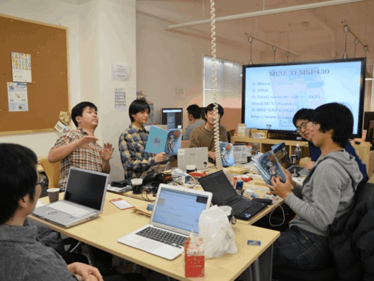
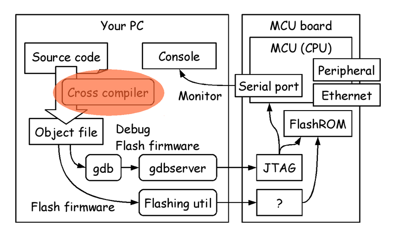
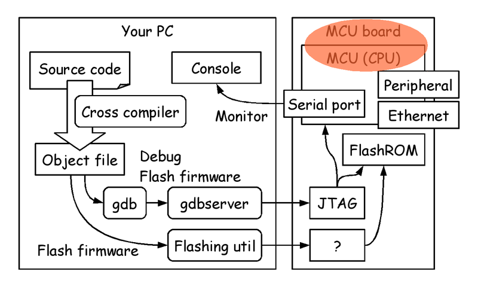
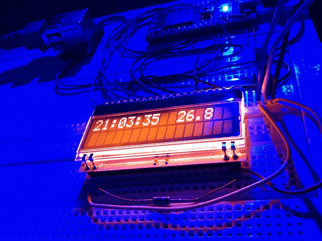
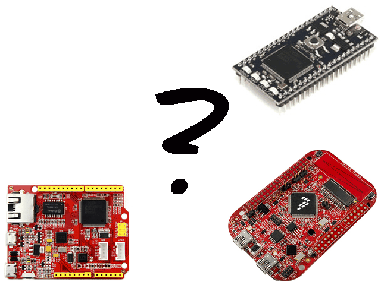
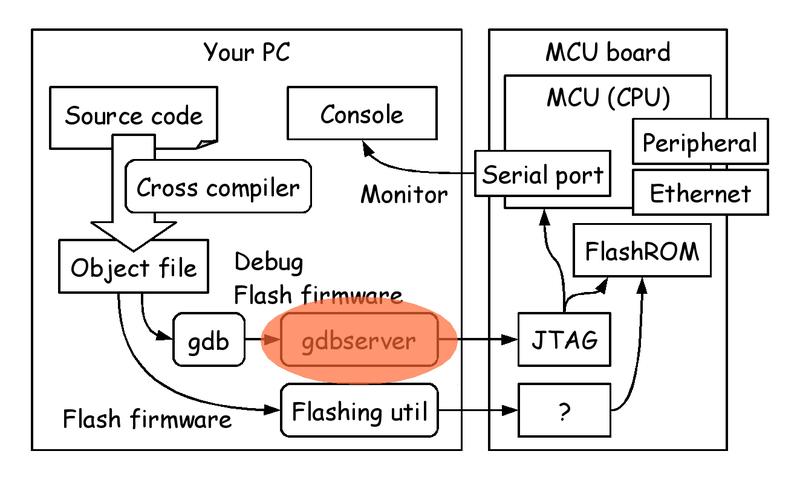
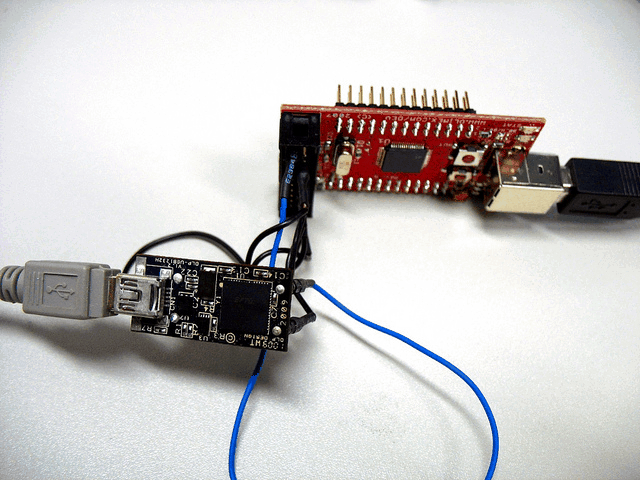
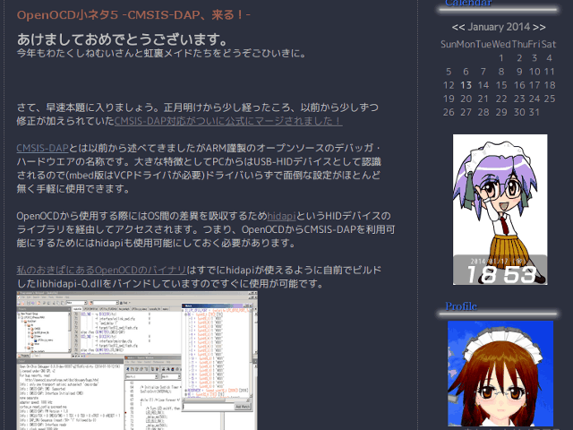

# Functional MCU programming

Metasepi Project / Kiwamu Okabe

# Who am I ?

* http://www.masterq.net/
* Twitter: @master_q
* Organizer of Metasepi Project
* A developer of Ajhc Haskell compiler
* A Debian Maintainer
* 10 years' experience in developing OS using NetBSD

# Kick off workshop at Nagoya !

Functional MCU programing workshop

* At Nagoya
* Meeting minutes

~~~
http://metasepi.org/posts/2014-01-05-mbed_fp_0.html
~~~

* Now planning the next workshop...

# Why functional lang for MCU?

* Internet of Things (IoT)
* We will live in IoT world
* Can't debug IoT device on the field
* Should avoid runtime error
* We need strong type !

# Choice of cross compiler

# Cross compiler: (A)jhc

http://ajhc.metasepi.org/

* Language: Haskell
* Haskell language is major !
* Need GC heap = Need more memory
* Experience running on MCU

~~~
ARM Cortex-M
https://github.com/ajhc/demo-cortex-m3
~~~

# Cross compiler: ATS

http://www.ats-lang.org/

* Language: ML
* Optional GC = Need low memory
* No experience running on MCU
* Document translated into Japanese

http://jats-ug.metasepi.org/

# Cross compiler: Rust

http://www.rust-lang.org/

* Language: Own syntax like C or JS
* Optional GC = Need low memory
* Experience running on MCU

~~~
ARM Cortex-M
https://github.com/neykov/armboot
~~~

* Developing by Mozilla
* @pirapira knows the detail of it

# Choice of MCU board

# Which MCU? Of course mbed!?

Why?

* Major
* 32bit
* Large memory size (> 20kB)
* Debugger
* Ethernet

# Which board is good for us...

* mbed LPC1768 (￥5,200)

~~~
RAM 32kB+32kB
Ethernet
https://mbed.org/platforms/mbed-LPC1768/
~~~

* Seeeduino Arch Pro ($43.41)

~~~
RAM 32kB+32kB
Ethernet
http://www.seeedstudio.com/depot/arch-pro-p-1677.html
~~~

* FRDM-KL46Z (￥1,634)

~~~
RAM 32kB
No Ethernet
http://www.freescale.com/webapp/sps/site/prod_summary.jsp?code=FRDM-KL46Z
~~~

# Choice of debugger

# gdbserver: pyOCD

https://github.com/mbedmicro/pyOCD

* Only for MCU using CMSIS-DAP
* But now support only mbed LPC1768
* In future, support more board ?

# gdbserver: OpenOCD

http://openocd.sourceforge.net/

* Comming CMSIS-DAP support!
* Need HIDAPI library

http://www.signal11.us/oss/hidapi/

# OpenOCD enabling CMSIS-DAP

~~~
$ git clone git://github.com/signal11/hidapi.git
$ cd hidapi
$ ./bootstrap
$ ./configure
$ make
$ sudo make install
~~~

~~~
$ git clone git://git.code.sf.net/p/openocd/code openocd
$ cd openocd
$ ./bootstrap
$ ./configure --enable-cmsis-dap
--ship--
Olimex ARM-JTAG-EW Programmer           yes (auto)
CMSIS-DAP Compliant Debugger            yes
$ make
$ sudo make install
~~~

~~~
Some time the following FRDM-KL46Z patch is useful.
http://permalink.gmane.org/gmane.comp.debugging.openocd.devel/24258
~~~

# On mbed LPC1768

~~~
$ sudo /usr/local/bin/openocd -f /usr/local/share/openocd/scripts/board/mbed-lpc1768.cfg
~~~

~~~
$ arm-none-eabi-gdb Blink.elf
(gdb) target remote localhost:3333
(gdb) monitor reset halt
(gdb) load
(gdb) c
~~~

But too slow... and can't trace.

~~~
Transfer rate: 50 bytes/sec, 3818 bytes/write.
~~~

:(

# On Seeeduino Arch Pro
# On FRDM-KL46Z
# Be a hacker such as ねむいさん

http://nemuisan.blog.bai.ne.jp/

There is his patch at following URL.

~~~
https://skydrive.live.com/?cid=36f4d1230f8a673c&id=36F4D1230F8A673C%213043
~~~
