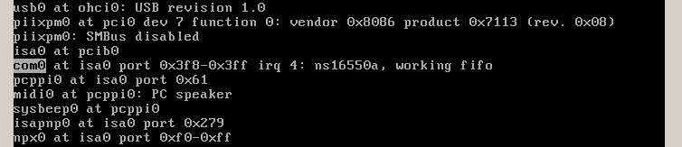

# start_printf: dev/ic/com.c comstart()

Kiwamu Okabe

# Where comstart called?

Who kick "tp->t_oproc"?

~~~ {.c}
// File: sys/dev/ic/com.c
void
com_attach_subr(struct com_softc *sc)
{
// -- snip --
fifodone:

	tp = tty_alloc();
	tp->t_oproc = comstart;
~~~

# com0 attached at isa0

~~~
$ grep 3f8 sys/arch/i386/conf/GENERIC | grep com0
com0    at isa? port 0x3f8 irq 4        # Standard PC serial ports
$ grep -B 1 dev/isa/com_isa.c sys/dev/isa/files.isa
attach  com at isa with com_isa
file    dev/isa/com_isa.c               com_isa
~~~

~~~ {.c}
// File: sys/dev/isa/com_isa.c
void
com_isa_attach(device_t parent, device_t self, void *aux)
{
// -- snip --
	com_attach_subr(sc);
~~~

# com softc has struct tty member

~~~ {.c}
// File: sys/dev/ic/com.c
void
com_attach_subr(struct com_softc *sc)
{
// -- snip --
	tp = tty_alloc();
	tp->t_oproc = comstart;
	tp->t_param = comparam;
	tp->t_hwiflow = comhwiflow;

	sc->sc_tty = tp;
// -- snip --
	tty_attach(tp);
~~~

~~~ {.c}
// File: sys/dev/ic/comvar.h
struct com_softc {
	device_t sc_dev;
	void *sc_si;
	struct tty *sc_tty;
~~~

# Maybe call tree is...

~~~
cdev_write
=> comwrite
   => ttwrite
      => ttstart
         => comstart
~~~

