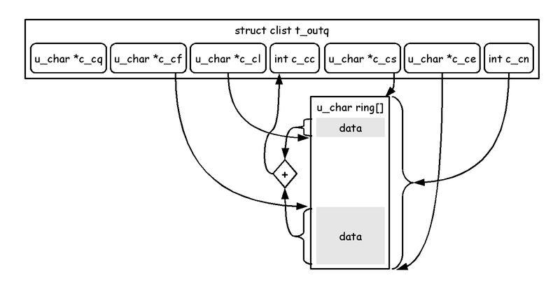
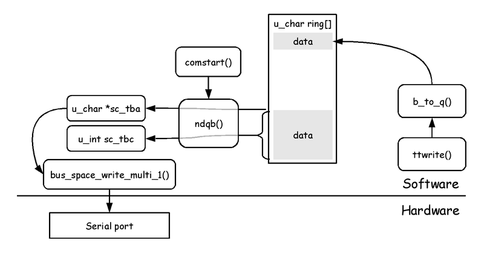

# start_printf: dev/ic/com.c comstart()

Kiwamu Okabe

# Where comstart called?

Who kick "tp->t_oproc"?

~~~ {.c}
// File: sys/dev/ic/com.c
void
com_attach_subr(struct com_softc *sc)
{
// -- snip --
fifodone:

	tp = tty_alloc();
	tp->t_oproc = comstart;
~~~

# com0 attached at isa0

~~~
$ grep 3f8 sys/arch/i386/conf/GENERIC | grep com0
com0    at isa? port 0x3f8 irq 4        # Standard PC serial ports
$ grep -B 1 dev/isa/com_isa.c sys/dev/isa/files.isa
attach  com at isa with com_isa
file    dev/isa/com_isa.c               com_isa
~~~

~~~ {.c}
// File: sys/dev/isa/com_isa.c
void
com_isa_attach(device_t parent, device_t self, void *aux)
{
// -- snip --
	com_attach_subr(sc);
~~~

# com softc has struct tty member

~~~ {.c}
// File: sys/dev/ic/com.c
void
com_attach_subr(struct com_softc *sc)
{
// -- snip --
	tp = tty_alloc();
	tp->t_oproc = comstart;
	tp->t_param = comparam;
	tp->t_hwiflow = comhwiflow;

	sc->sc_tty = tp;
// -- snip --
	tty_attach(tp);
~~~

~~~ {.c}
// File: sys/dev/ic/comvar.h
struct com_softc {
	device_t sc_dev;
	void *sc_si;
	struct tty *sc_tty;
~~~

# Maybe call tree is...

~~~
cdev_write
=> comwrite
   => ttwrite
      => ttstart
         => comstart
~~~

# comwrite()

~~~ {.c}
#define	COM_ISALIVE(sc)	((sc)->enabled != 0 && \
			 device_is_active((sc)->sc_dev))

int
comwrite(dev_t dev, struct uio *uio, int flag)
{
	struct com_softc *sc =
	    device_lookup_private(&com_cd, COMUNIT(dev));
	struct tty *tp = sc->sc_tty;

	if (COM_ISALIVE(sc) == 0)
		return (EIO);

	return ((*tp->t_linesw->l_write)(tp, uio, flag));
}
~~~

# comstart() #1

~~~ {.c}
void
comstart(struct tty *tp)
{
	struct com_softc *sc =
	    device_lookup_private(&com_cd, COMUNIT(tp->t_dev));
	struct com_regs *regsp = &sc->sc_regs;
	int s;

	if (COM_ISALIVE(sc) == 0)
		return;

	s = spltty();
	if (ISSET(tp->t_state, TS_BUSY | TS_TIMEOUT | TS_TTSTOP))
		goto out;
	if (sc->sc_tx_stopped)
		goto out;
	if (!ttypull(tp))
		goto out;
~~~

# ttypull()

~~~ {.c}
/*
 * Try to pull more output from the producer.  Return non-zero if
 * there is output ready to be sent.
 */
bool
ttypull(struct tty *tp)
{

	/* XXXSMP not yet KASSERT(mutex_owned(&tty_lock)); */

	if (tp->t_outq.c_cc <= tp->t_lowat) {
		cv_broadcast(&tp->t_outcv);
		selnotify(&tp->t_wsel, 0, NOTE_SUBMIT);
	}
	return tp->t_outq.c_cc != 0;
}
~~~

# comstart() #2

~~~ {.c}
	/* Grab the first contiguous region of buffer space. */
	{
		u_char *tba;
		int tbc;

		tba = tp->t_outq.c_cf;
		tbc = ndqb(&tp->t_outq, 0);

		mutex_spin_enter(&sc->sc_lock);

		sc->sc_tba = tba;
		sc->sc_tbc = tbc;
	}

	SET(tp->t_state, TS_BUSY);
	sc->sc_tx_busy = 1;
~~~

# ndqb()

~~~ {.c}
/*
 * Return count of contiguous characters in clist.
 * Stop counting if flag&character is non-null.
 */
int
ndqb(struct clist *clp, int flag)
{
	int count = 0;
	int i;
	int cc;
	int s;

	s = spltty();
	if ((cc = clp->c_cc) == 0)
		goto out;
// --snip--
out:
	splx(s);
	return count;
}
~~~

# struct clist

~~~ {.c}
/*
 * Clists are actually ring buffers. The c_cc, c_cf, c_cl fields have
 * exactly the same behaviour as in true clists.
 * if c_cq is NULL, the ring buffer has no TTY_QUOTE functionality
 * (but, saves memory and CPU time)
 *
 * *DON'T* play with c_cs, c_ce, c_cq, or c_cl outside tty_subr.c!!!
 */
struct clist {
	u_char	*c_cf;	/* points to first character */
	u_char	*c_cl;	/* points to next open character */
	u_char	*c_cs;	/* start of ring buffer */
	u_char	*c_ce;	/* c_ce + c_len */
	u_char	*c_cq;	/* N bits/bytes long, see tty_subr.c */
	int	c_cc;	/* count of characters in queue */
	int	c_cn;	/* total ring buffer length */
};
~~~

# struct clist (figure)

# comstart() #3

~~~ {.c}
	/* Enable transmit completion interrupts if necessary. */
	if (!ISSET(sc->sc_ier, IER_ETXRDY)) {
		SET(sc->sc_ier, IER_ETXRDY);
		CSR_WRITE_1(regsp, COM_REG_IER, sc->sc_ier);
	}

	/* Output the first chunk of the contiguous buffer. */
	if (!ISSET(sc->sc_hwflags, COM_HW_NO_TXPRELOAD)) {
		u_int n;

		n = sc->sc_tbc;
		if (n > sc->sc_fifolen)
			n = sc->sc_fifolen;
		CSR_WRITE_MULTI(regsp,COM_REG_TXDATA,sc->sc_tba,n);
		sc->sc_tbc -= n;
		sc->sc_tba += n;
	}

	mutex_spin_exit(&sc->sc_lock);
out:
	splx(s);
	return;
}
~~~

# clist to serial port (figure)

# CSR_WRITE_*()

~~~ {.c}
// arch/i386/compile/GENERIC/opt_com.h:
// /* option `COM_REGMAP' not defined */
#define	CSR_WRITE_1(r, o, v)	\
	bus_space_write_1((r)->cr_iot, (r)->cr_ioh, o, v)
#define	CSR_WRITE_MULTI(r, o, p, n)	\
	bus_space_write_multi_1((r)->cr_iot, (r)->cr_ioh, o, p, n)
#define	COM_REG_IER		com_ier
#define	COM_REG_TXDATA		com_data
~~~

~~~ {.c}
// com.c
// = include => dev/ic/comreg.h
//              = include => dev/ic/ns16550reg.h
#define	com_data	0	/* data register (R/W) */
#define	com_ier		1	/* interrupt enable (W) */
~~~
