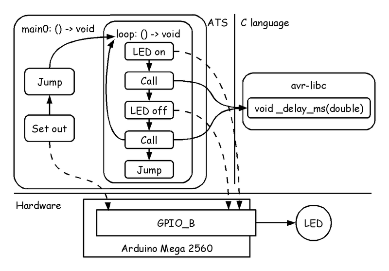
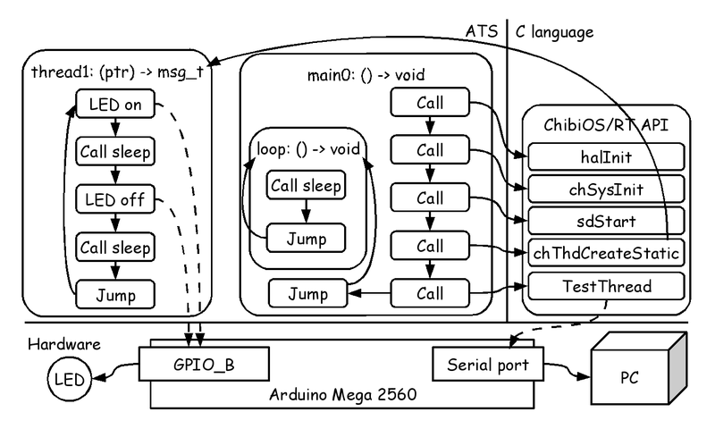
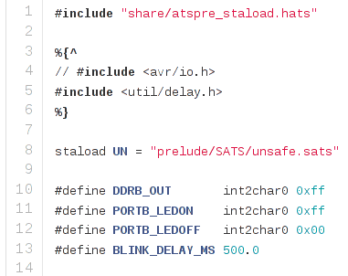
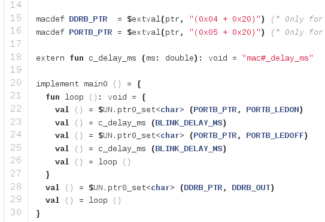
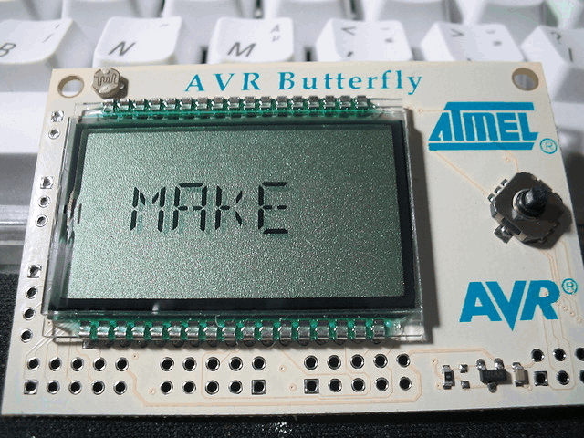
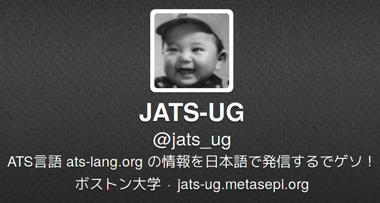
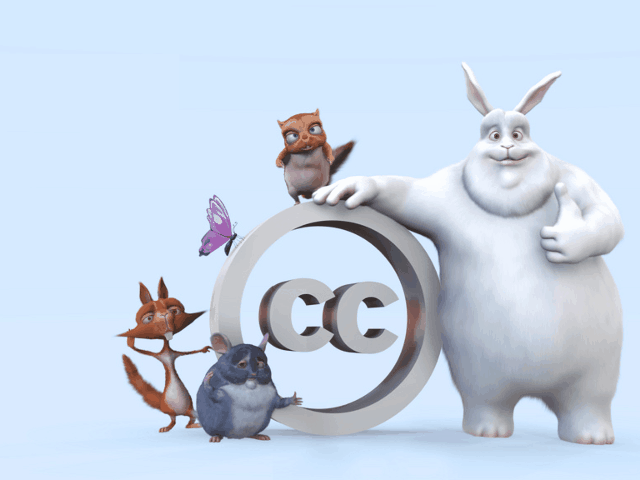

# Start! ATS programming


Kiwamu Okabe @ Metasepi Project

# Who am I?


* http://www.masterq.net/
* Self employed software engineer
* Trade name := METASEPI DESIGN
* Founder of Metasepi Project
* A Debian Maintainer
* 10 years' experience in developing OS using NetBSD

# Remember Heartbleed bug?


Should we use safer language than C?

~~~
== In English ==
"Preventing heartbleed bugs with safe programming languages"
http://bluishcoder.co.nz/2014/04/11/preventing-heartbleed-bugs-with-safe-languages.html

== In Japanease ==
"安全なプログラミング言語を使って heartbleed を防ぐには"
https://github.com/jats-ug/translate/blob/master/Web/bluishcoder.co.nz/2014/04/11/preventing-heartbleed-bugs-with-safe-languages.md
~~~

"A safer systems programming language could have prevented the bug."

# Want the safer language...


It's the ATS http://www.ats-lang.org/ !

* Syntax like ML
* Dependent types
* Linear types
* Without any runtime
* Optional GC

# Demo on BareMetal Arduino

~~~
https://github.com/fpiot/arduino-mega2560-ats
~~~



# Demo using RTOS threads

~~~
https://github.com/fpiot/chibios-ats
~~~



# Where ATS lives in?

# Compile flow

# BareMetal demo source code #1

~~~
https://github.com/fpiot/arduino-mega2560-ats/blob/master/blink_ats/main.dats
~~~



# BareMetal demo source code #2



# Disseminate ATS to Japan


* Trying! Trying!

# Try1: Japan ATS User Group


http://jats-ug.metasepi.org/

* In a parody of http://jaws-ug.jp/
* Translate ATS docs into Japanese
* Push the Facebook like button, now!

# Try2: Functional IoT


http://fpiot.metasepi.org/

* Wrestling mat languages fight on
* Functional programming on tiny chip
* Chip: AVR, MSP430, ARM Cortex-M
* Language: Ajhc, ATS, Rust
* Which language becomes the champion for system programming?

# Follow me!




# License of photos used on slide


```
* Atmel AVR Butterfly (#4) | Flickr - Photo Sharing!
  https://www.flickr.com/photos/41894183508@N01/35437253/
  Copyright: 2005 Bill Bradford / License: CC By 2.0
* Dubai Wingsuit Flying Trip | Flickr - Photo Sharing!
  https://www.flickr.com/photos/picturecorrect/7623578306
  Copyright: 2012 Richard Schneider / License: CC BY-NC 2.0
* salve-a-terra--twitter_4251_1280x800 | Flickr - Photo Sharing!
  https://www.flickr.com/photos/daniloramosweb/3854330282
  Copyright: 2005 Danilo Ramos / License: CC BY-SA 2.0
* File:Heartbleed.svg - Wikimedia Commons
  http://commons.wikimedia.org/wiki/File:Heartbleed.svg
  Copyright: 2014 Leena Snidate, Codenomicon / License: CC0 1.0
* Creative Commons BBB | Flickr - Photo Sharing!
  https://www.flickr.com/photos/steren/2732488224
  Copyright: 2008 Steren Giannini / License: CC BY 2.0
* Start Your Engines | Flickr - Photo Sharing!
  https://www.flickr.com/photos/markwalker/3749673425
  Copyright: 2009 Mark Walker / License: CC BY-SA 2.0
```
