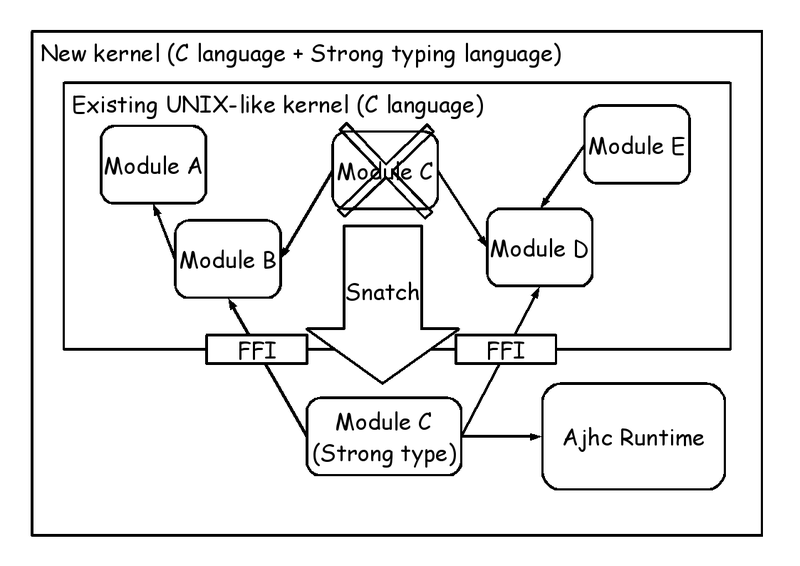
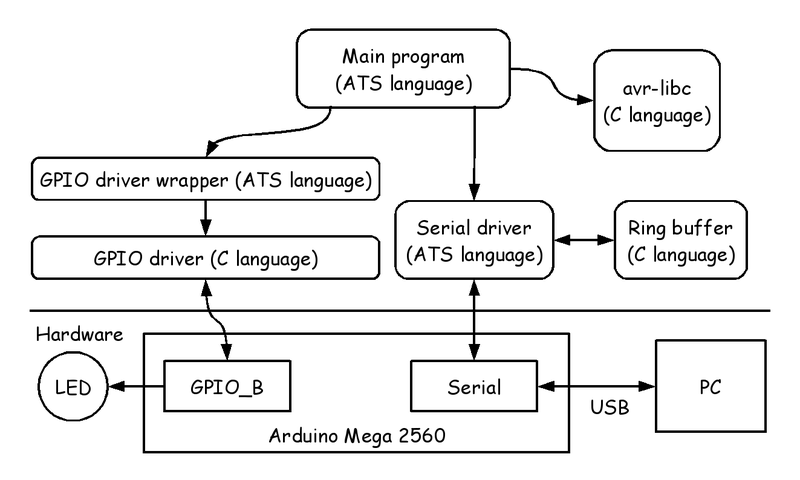
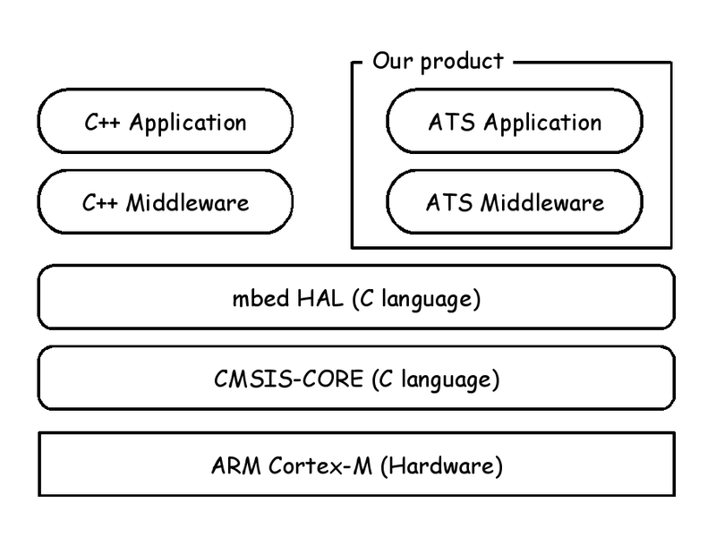

# Metasepi team meeting #14:　ATS programming on MCU

Kiwamu Okabe @ Metasepi Project

# Who am I?

* http://www.masterq.net/
* Self employed software engineer
* Trade name := METASEPI DESIGN
* Founder of Metasepi Project
* A Debian Maintainer
* 10 years' experience in developing OS using NetBSD

# Demo: NetBSD driver in Haskell

* NetBSD audio driver play sound
* The driver's interrupt handler rewrited using Haskell
* Watch the movie at following

~~~
https://www.youtube.com/watch?v=XEYcR5RG5cA
~~~

* Paper for Haskell Symposium 2014

~~~
http://metasepi.org/doc/metasepi-icfp2014.pdf
~~~

# Ajhc Haskell compiler

http://ajhc.metasepi.org/

* Ajhc := Arafura designed jhc
* jhc := John's Haskell Compiler
* http://repetae.net/computer/jhc/
* Jhc outputs binary that has low-memory-footprint and runs fast.
* Good for embedded software.

# Agenda

* [1] What is Ajhc?
* [2] What is Metasepi?
* [3] Demo using ATS language
* [4] What is ATS?
* [5] ATS programming on MCU

# What is Metasepi?

http://metasepi.org/

* Unix-like OS designed by strong type.
* Using ML or more strong type lang.

# Why need Metasepi?

* We have already Linux or Windows.
* But the developers are suffering.
* If use the kernel changed by you,
* you will get many runtime error.
* Difficult even to reproduce it.

# Type safety

* Less runtime errors.
* "数理科学的バグ撲滅方法論のすすめ"

~~~
http://itpro.nikkeibp.co.jp/article/COLUMN/20060915/248230/
~~~

# How create Metasepi?

# Snatch-driven development

Dogfooding style.

# Demo: ATS on raw Arduino

~~~
https://github.com/fpiot/arduino-mega2560-ats
~~~

# Demo: ATS on mbed platform

~~~
https://github.com/fpiot/mbed-ats
~~~

# What is ATS language?

http://www.ats-lang.org/

* Syntax like ML
* Dependent types
* Linear types
* Without any runtime
* Optional GC

# ATS compile flow

# ATS programming on MCU

You can choose the following 2-way.

On BareMetal hardware

* Arduino (8-bit AVR)
* Cortex-M (32-bit ARM)

On RTOS

* mbed
* ChibiOS/RT

# ATS on BareMetal hardware

Read/write memory using pointer.

# ATS on RTOS

Interaction with C.

# Produce/Consume Linear Type

# At-view

# Japan ATS User Group

http://jats-ug.metasepi.org/

* In a parody of http://jaws-ug.jp/
* Translate ATS docs into Japanese
* Push the Facebook like button, now!

# Follow me!

https://twitter.com/jats_ug

