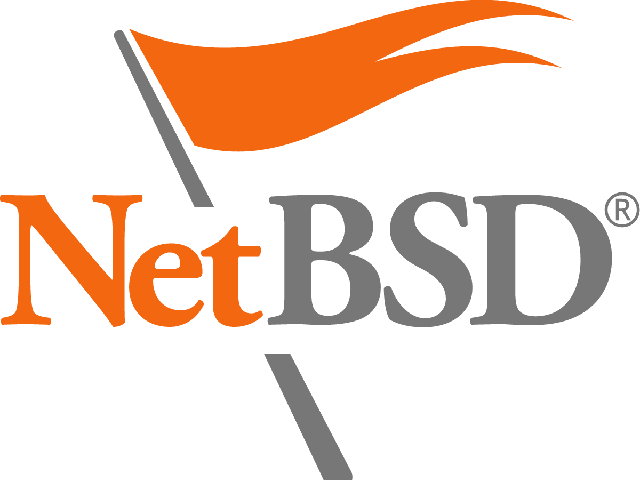
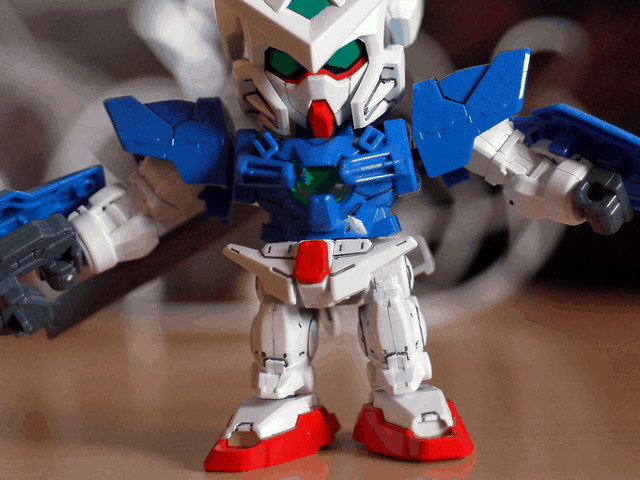
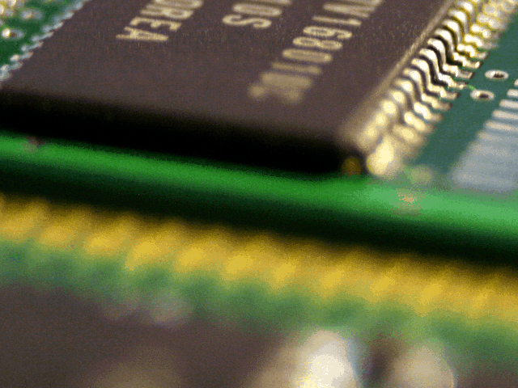
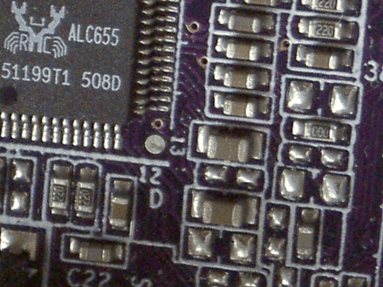
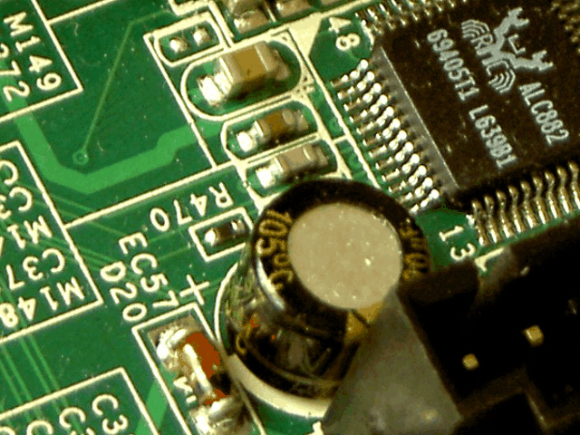
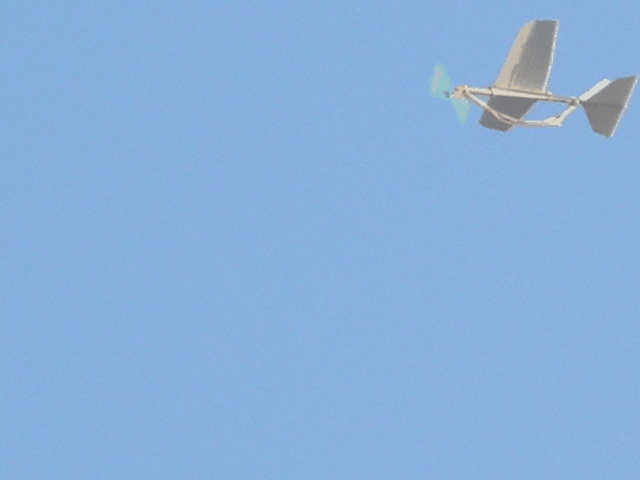

# Ajhc Haskell Compiler with　Reentrant GC


Kiwamu Okabe @ Metasepi Project

# Who am I?


* http://www.masterq.net/
* Self employed software engineer
* Trade name := METASEPI DESIGN
* Founder of Metasepi Project
* A Debian Maintainer
* 10 years' experience in developing OS using NetBSD

# Demo: NetBSD driver in Haskell


* NetBSD audio driver play sound
* The driver's interrupt handler rewrited using Haskell
* GC occurs in interrupt handler
* Watch the movie at following

~~~
https://www.youtube.com/watch?v=XEYcR5RG5cA
~~~

* Paper for Haskell Symposium 2014

~~~
http://metasepi.org/doc/metasepi-icfp2014.pdf
http://metasepi.org/doc/metasepi-icfp2014-demo.pdf
~~~

# Agenda


* [1] Demo: NetBSD driver in Haskell
* [2] What's Metasepi?
* [3] What's Ajhc compiler?
* [4] Reentrancy and Context
* [5] Context Local Heap (CLHs)
* [6] How to write Haskell driver?
* [7] What's coming next?

# [2] What's Metasepi?


http://metasepi.org/

* Unix-like OS designed by strong type.
* Using ML or more strong type lang.

Haskell http://www.haskell.org/

OCaml http://caml.inria.fr/

MLton http://mlton.org/

. . . and suchlike.

# Why need Metasepi?


* We have already Linux or Windows.
* But the developers are suffering.
* If use the kernel changed by you,
* you will get many runtime error.
* Difficult even to reproduce it.

# Doesn't OSS have good quality?


* "The Cathedral and the Bazaar"
* "Given enough eyeballs, all bugs are shallow."

~~~
http://cruel.org/freeware/cathedral.html
~~~

* But if you develop your own product re-using OSS...

# Low quality out of OSS umbrella


# Type safety


* Less runtime errors.
* "数理科学的バグ撲滅方法論のすすめ"

~~~
http://itpro.nikkeibp.co.jp/article/COLUMN/20060915/248230/
~~~


# Kernel wants type desperately


* Kernels are developed with C lang.
* Error on user space => SEGV
* Error on kernel space => Halt!
* Should design kernel with the greatest care.
* C language is safe?

# Remember Heartbleed bug?


Should we use safer language than C?

~~~
== In English ==
"Preventing heartbleed bugs with safe programming languages"
http://bluishcoder.co.nz/2014/04/11/preventing-heartbleed-bugs-with-safe-languages.html

== In Japanease ==
"安全なプログラミング言語を使って heartbleed を防ぐには"
https://github.com/jats-ug/translate/blob/master/Web/bluishcoder.co.nz/2014/04/11/preventing-heartbleed-bugs-with-safe-languages.md
~~~

"A safer systems programming language could have prevented the bug."

# [3] What's Ajhc compiler?


http://ajhc.metasepi.org/

* Ajhc := Arafura designed jhc
* jhc := John's Haskell Compiler
* http://repetae.net/computer/jhc/
* Jhc outputs binary that has low-memory-footprint and runs fast.

# Who is John?


* John Meacham
* http://repetae.net/

# Why choose jhc?


Programs to print "hoge" on terminal. The lesser depends on POSIX, the smaller values.


# Jhc is translator to C language


# [4] Reentrancy and Context


* Metasepi needs language implementation supporting reentrancy.
* Why?

# Why need Reentrancy?


* There are 2 way for multitasking
* [A] Nonpreemptive multitasking
* [B] Preemptive multitasking
* Unix-like OS needs [B]
* [B] needs the hardware interrupts
* Interrupt handler should be reentrant

# What's Reentrancy?


~~~
Reentrant code can be interrupted in the middle of its execution and then safely called again ("re-entered") before its previous invocations complete execution.
~~~


# What's Context on C language?


* A set of registers and call stacks


# Where Context come from?


# What's Context switch?


~~~
The process of storing and restoring the state (context) of a process or thread so that execution can be resumed from the same point at a later time.
~~~


# Support reentrancy with GC


* Metasepi uses strongly typed language
* Strongly typed language sometimes needs GC
* Most languages doesn't support reentrancy with GC
* How to support reentrancy with GC?

# Problem: Interrupt and GC


# [5] Context Local Heap (CLHs)


* Idea: Isolate contexts by local heap


# Isolated contexts are reentrant?



# Let's define "Haskell Context"


# Haskell Context on jhc


# Haskell Context life cycle (jhc)


# Interaction with C on jhc


# Haskell Context on Ajhc


# Haskell Context life cycle (Ajhc)


# Interaction with C on Ajhc


# [6] How to write Haskell driver?


* Language: Ajhc Haskell compiler
* Base code: NetBSD kernel
* Method: Snatch-driven development

# Snatch-driven development #1


http://en.wikipedia.org/wiki/Snatcher


# Snatch-driven development #2


# To access out of GC heep



# Generate code to access C struct

https://github.com/ajhc/struct2hs

~~~
$ struct2hs sys/dev/pci/auich_extern_SNATCHED.h | tail
~~~

~~~ {.haskell}
  offsetOf_Pdevinit_pdev_attach :: Int
p_Pdevinit_pdev_attach :: Ptr Pdevinit -> IO (Ptr (Ptr (FunPtr (Int -> IO ()))))
p_Pdevinit_pdev_attach p = return $ plusPtr p $ offsetOf_Pdevinit_pdev_attach
foreign import ccall "dynamic" call_Pdevinit_pdev_attach ::
  FunPtr (Int -> IO ()) -> Int -> IO ()
foreign import primitive "const.offsetof(struct pdevinit, pdev_count)"
  offsetOf_Pdevinit_pdev_count :: Int
p_Pdevinit_pdev_count :: Ptr Pdevinit -> IO (Ptr Int)
p_Pdevinit_pdev_count p = return $ plusPtr p $ offsetOf_Pdevinit_pdev_count
~~~

# Access C struct in kernel

``` {.c}
/* C code */
static int
auich_set_port(void *v, mixer_ctrl_t *cp)
{
    struct auich_softc *sc;

    sc = v;
    return sc->codec_if->vtbl->mixer_set_port(sc->codec_if, cp);
}
```

``` {.haskell}
-- Haskell code
foreign export ccall "auichSetPort"
  auichSetPort :: Ptr AuichSoftc -> Ptr MixerCtrl -> IO Int
auichSetPort :: Ptr AuichSoftc -> Ptr MixerCtrl -> IO Int
auichSetPort sc cp = do
  codecif <- peek =<< p_AuichSoftc_codec_if sc
  f <- peek =<< p_Ac97CodecIfVtbl_mixer_set_port =<< peek
         =<< p_Ac97CodecIf_vtbl codecif
  call_Ac97CodecIfVtbl_mixer_set_port f codecif cp
```

# AC'97 sound driver



# HD Audio sound driver



# Benchmark


~~~
(O)  Original NetBSD 6.1.2 kernel
(S)  The kernel includes AC'97 and HD Audio driver snatched by Ajhc
(N)  (S) + using naive GC
(B4) (S) + having GC block 16 Byte
(B5) (S) + having GC block 32 Byte
(B6) (S) + having GC block 64 Byte
~~~


# [7] What's coming next?


# What's ATS language?


http://www.ats-lang.org/

* Dependent types
* Linear types
* Without any runtime
* Optional GC
* Developing at Boston University
* Designer := Hongwei Xi

# Hongwei said... (cont.)


~~~
Date: Mon Dec 23 11:40 JST 2013

Hi Metasepi-chan,

I spent quite some time today browsing metasepi.org.

I am really interested in your Metasepi project, partly because I myself wanted to implement NetBSD in ATS about 5 years ago. Unfortunately, I never had time to get the project started as I needed to spend so much time on ATS2. By the way, I had planned to use the very same approach which you call "Snatch". I had also considered Minix but I chose NetBSD because it was a real OS.

I think I know first-handedly the dilemma you are currently in. On one hand, you want to be able to fully focus on writing the kernel. On the other hand, you also need to add features to Ajhc constantly to address all kinds of issues that keep popping up, which undoubtedly makes it very difficult for you to focus.
~~~

# Hongwei said... (cont.)


~~~
I would highly recommend that you use ATS to implement NetBSD kernel. Unlike jhc, there is no semantics gap between ATS and C. In particular, they both use the same native unboxed data representation. Once you become familiar with ATS, you can readily visualize the C code that your ATS source is to be compiled into. ATS is truly an ideal language for the kind of "Snatch" approach you want to take to re-write NetBSD. If you take the lead, then I will be happy to "chip in" :)

I also spent some time reading documentation on jhc. Personally, I feel that there is simply too much uncertainty to use it in real kernel implementation. Features like GC could make the kernel highly unpredictable, scaring away potential users.

I think that we both believe C is the right language for systems programming. The problem with C is that it is too difficult to write correct C programs. ATS is designed to allow the programmer to correctly write the kind of C programs he or she wanted to write in the first place. While jhc generates C code, the kind of C code it generates may not be suited for kernel. This is what I call a semantics gap.
~~~

# Hongwei said...


~~~
I write this message in the hope that we could join effort in doing something that has not been done up to now: Writing a real kernel in (largely) functional style that can truly deliever safety-wise as well as performance-wise.

Cheers,

--Hongwei
~~~

# Follow me!


* http://jats-ug.metasepi.org/
* https://twitter.com/jats_ug


# License of photos used #1


~~~
* ゴミ収集車 | Flickr - Photo Sharing!
  https://www.flickr.com/photos/shuto/8816770503/
  Copyright: 2013 Shuto Araki / License: CC BY 2.0
* Hooded Cuttlefish | Flickr - Photo Sharing!
  https://www.flickr.com/photos/silkebaron/931247866/
  Copyright: 2007 Silke Baron / License: CC BY 2.0
* Hooded Cuttlefish | Flickr - Photo Sharing!
  https://www.flickr.com/photos/silkebaron/931381358/
  Copyright: 2007 Silke Baron / License: CC BY 2.0
* Javi Recio y David Cabrera | Flickr - Photo Sharing!
  https://www.flickr.com/photos/otakumunidad/5787704531/
  Copyright: 2011 Otakumunidad Damned / License: CC BY 2.0
* Obsolete CDs | Flickr - Photo Sharing!
  https://www.flickr.com/photos/automaciej/203064118
  Copyright: 2006 Maciej Bliziński / License: CC BY-SA 2.0
* Рынок / Bazaar | Flickr - Photo Sharing!
  https://www.flickr.com/photos/atbaker/81637
  Copyright: 2004 Adam Baker / License: CC BY 2.0
* Cheonggyecheon Umbrellas | Flickr - Photo Sharing!
  https://www.flickr.com/photos/traveloriented/13436873274
  Copyright: 2014 travel oriented / License: CC BY-SA 2.0
~~~

# License of photos used #2


~~~
* Jordan shooting Jenna with shield | Flickr - Photo Sharing!
  https://www.flickr.com/photos/jasoneppink/80772834
  Copyright: 2005 Jason Eppink / License: CC BY 2.0
* Imagine a world without trees | Flickr - Photo Sharing!
  https://www.flickr.com/photos/aloshbennett/3480223314
  Copyright: 2009 Alosh Bennett / License: CC BY 2.0
* Soyuz TM-19 Re-entry Capsule | Flickr - Photo Sharing!
  https://www.flickr.com/photos/pasukaru76/10543300415
  Copyright: 2013 Pascal / License: CC BY 2.0
* Do You Know Where Your Valves Are? | Flickr - Photo Sharing!
  https://www.flickr.com/photos/thristian/371670597
  Copyright: 2007 Timothy Allen / License: CC BY-SA 2.0
* Whirlpool | Flickr - Photo Sharing!
  https://www.flickr.com/photos/59195512@N00/4697467290
  Copyright: 2010 The Mighty Tim Inconnu / License: CC BY 2.0
* jumping for the sunset | Flickr - Photo Sharing!
  https://www.flickr.com/photos/jorgempf/233188420
  Copyright: 2006 Jorge / License: CC BY-SA 2.0
* DIY: Shutter Release Switch for Canon DSLRs | Flickr - Photo Sharing!
  https://www.flickr.com/photos/ivyfield/4763965911
  Copyright: 2010 Yutaka Tsutano / License: CC BY 2.0
~~~

# License of photos used #3


~~~
* 72C Duna SHEER MADNESS Lab Re-entry | Flickr - Photo Sharing!
  https://www.flickr.com/photos/39416639@N02/12702229414
  Copyright: 2014 TheBullethead / License: CC BY 2.0
* Supernova Remnant W49B | Flickr - Photo Sharing!
  https://www.flickr.com/photos/gsfc/4479812068
  Copyright: 2009 NASA Goddard Space Flight Center / License: CC BY 2.0
* The Great Wall of China | Flickr - Photo Sharing!
  https://www.flickr.com/photos/kk/2149165957
  Copyright: 2007 kris krüg / License: CC BY-SA 2.0
* Headshift business card discussion | Flickr - Photo Sharing!
  https://www.flickr.com/photos/criminalintent/2744040362
  Copyright: 2008 Lars Plougmann / License: CC BY-SA 2.0
* Bali Indonesia | Flickr - Photo Sharing!
  https://www.flickr.com/photos/julzart/9266448615
  Copyright: 2013 julia Chapple / License: CC BY 2.0
* Scuba diving Indonesia - Bali - Komodo - Bunaken 2008 | Flickr - Photo Sharing!
  https://www.flickr.com/photos/39891373@N07/3666275538
  Copyright: 2008 Ilse Reijs and Jan-Noud Hutten / License: CC BY 2.0
~~~

# License of photos used #4


~~~
* Scuba diving Bali Nusa Lembongan | Flickr - Photo Sharing!
  https://www.flickr.com/photos/39891373@N07/4177189387
  Copyright: 2009 Ilse Reijs and Jan-Noud Hutten / License: CC BY 2.0
* Project 365 #56: 250210 Thanks For The Memory | Flickr - Photo Sharing!
  https://www.flickr.com/photos/comedynose/4388430444
  Copyright: 2010 Pete / License: CC BY 2.0
* Audio Codec 97 - Wikipedia
  http://ja.wikipedia.org/wiki/Audio_Codec_97#mediaviewer/%E3%83%95%E3%82%A1%E3%82%A4%E3%83%AB:Realtek_alc655.jpg
  Copyright: 2007 Futase tdkr / License: CC BY-SA 3.0
* 紙飛行機 | Flickr - Photo Sharing!
  https://www.flickr.com/photos/32926922@N08/4281868756
  Copyright: 2010 バイク便八王子立川所沢 / License: CC BY 2.0
* Antares Rocket With Cygnus Spacecraft Launches | Flickr - Photo Sharing!
  https://www.flickr.com/photos/gsfc/9807812154
  Copyright: 2013 NASA Goddard Space Flight Center / License: CC BY 2.0
~~~

# License of photos used #5


~~~
* Boston à l'heure bleue | Flickr - Photo Sharing!
  https://www.flickr.com/photos/ensh/4769294947
  Copyright: 2010 Emmanuel Huybrechts / License: CC BY 2.0
* e-mail symbol | Flickr - Photo Sharing!
  https://www.flickr.com/photos/gsi-r/5341765493
  Copyright: 2007 Micky Aldridge / License: CC BY 2.0
* File:Göteborg in moon light.jpg - Wikipedia, the free encyclopedia
  http://en.wikipedia.org/wiki/File:G%C3%B6teborg_in_moon_light.jpg
  Copyright: 2004 Amjad Sheikh / License: CC BY-SA 3.0
* Creative Commons BBB | Flickr - Photo Sharing!
  https://www.flickr.com/photos/steren/2732488224
  Copyright: 2008 Steren Giannini / License: CC BY 2.0
* Full body | Flickr - Photo Sharing!
  https://www.flickr.com/photos/timothytsuihin/2852272823
  Copyright: 2008 Timothy Tsui / License: CC BY-SA 2.0
~~~
