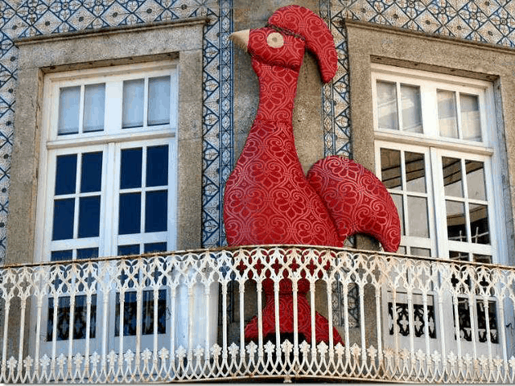
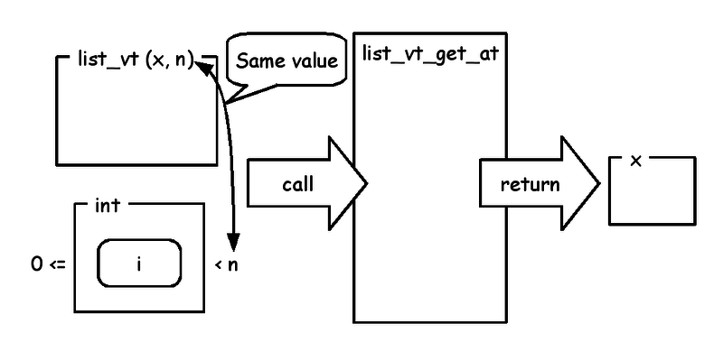
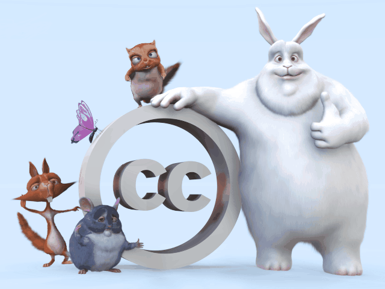

# Metasepi team meeting #17:　Invariant captured by ATS's API

Kiwamu Okabe @ Metasepi Project

# Who am I?

* http://www.masterq.net/
* Self employed software engineer
* Trade name := METASEPI DESIGN
* Founder of Metasepi Project
* A Debian Maintainer
* 10 years' experience in developing OS using NetBSD

# Remember Heartbleed bug?

Should we use safer language than C?

~~~
== In English ==
"Preventing heartbleed bugs with safe programming languages"
http://bluishcoder.co.nz/2014/04/11/preventing-heartbleed-bugs-with-safe-languages.html

== In Japanease ==
"安全なプログラミング言語を使って heartbleed を防ぐには"
https://github.com/jats-ug/translate/blob/master/Web/bluishcoder.co.nz/2014/04/11/preventing-heartbleed-bugs-with-safe-languages.md
~~~

"A safer systems programming language could have prevented the bug."

# Want the safer language...

It's the ATS http://www.ats-lang.org/ !

* Syntax like ML
* Dependent types
* Linear types
* Without any runtime
* Optional GC

# ATS code can run on 8-bit AVR

~~~
https://github.com/fpiot/arduino-mega2560-ats
~~~

# ATS compile flow

# Why ATS language is safe?

* Line is at between caller and callee
* ATS applies type to the line
* Type can enforce invariant in them

# {Dependent,Linear} type

Dependent type

* such like Coq or Agda
* has universal quantification
* has existential quantification

Linear type

* based on linear logic
* manages resource like memory

# Usage of Linear List

~~~
$ vi sample_list.dats
#include "share/atspre_staload.hats"
implement main0 () = {
  val l1 = list_vt_make_pair<int> (1, 2)
  val l2 = list_vt_make_pair<int> (3, 4)
  val l3 = list_vt_append (l1, l2)
  val () = println! ("l3[3] := ", l3[3])
  val l4 = list_vt_reverse l3
  val () = println! ("l4 := [", l4, "]")
  val () = free l4
}
$ patscc -DATS_MEMALLOC_LIBC -o sample_list sample_list.dats
$ ./sample_list
l3[3] := 4
l4 := [4, 3, 2, 1]
$ size sample_list
   text    data     bss     dec     hex filename
   7908     772      32    8712    2208 sample_list
$ ldd sample_list | wc -l
3
$ nm sample_list| grep "U "| wc -l
10
~~~

# Compile error: without free

~~~
$ vi sample_list.dats
#include "share/atspre_staload.hats"
implement main0 () = {
  val l1 = list_vt_make_pair<int> (1, 2)
  val l2 = list_vt_make_pair<int> (3, 4)
  val l3 = list_vt_append (l1, l2)
  val () = println! ("l3[3] := ", l3[3])
  val l4 = list_vt_reverse l3
  val () = println! ("l4 := [", l4, "]")
//  val () = free l4 // <= Changed
}
$ patscc -DATS_MEMALLOC_LIBC -o sample_list sample_list.dats
--snip--
The 2nd translation (binding) of [sample_list.dats] is successfully completed!
/home/kiwamu/tmp/sample_list.dats: 59(line=2, offs=22) -- 312(line=10, offs=2): error(3): the linear dynamic variable [l4$3450(-1)] needs to be consumed but it is preserved with the type [S2Eapp(S2Ecst(list_vt0ype_int_vtype); S2Einvar(S2EVar(4104)), S2EVar(4105))] instead.
~~~

# Compile error: out of range

~~~
$ vi sample_list.dats
#include "share/atspre_staload.hats"
implement main0 () = {
  val l1 = list_vt_make_pair<int> (1, 2)
  val l2 = list_vt_make_pair<int> (3, 4)
  val l3 = list_vt_append (l1, l2)
  val () = println! ("l3[4] := ", l3[4]) // <= Changed
  val l4 = list_vt_reverse l3
  val () = println! ("l4 := [", l4, "]")
  val () = free l4
}
$ patscc -DATS_MEMALLOC_LIBC -o sample_list sample_list.dats
--snip--
The 2nd translation (binding) of [sample_list.dats] is successfully completed!
/home/kiwamu/tmp/sample_list.dats: 215(line=6, offs=38) -- 216(line=6, offs=39): error(3): unsolved constraint: C3NSTRprop(main; S2Eapp(S2Ecst(<); S2EVar(4101->S2Eintinf(4)), S2Eapp(S2Ecst(add_int_int); S2Eintinf(2), S2Eintinf(2))))
typechecking has failed: there are some unsolved constraints: please inspect the above reported error message(s) for information.
~~~

# Compile error: use freed name

~~~
$ vi sample_list.dats
#include "share/atspre_staload.hats"
implement main0 () = {
  val l1 = list_vt_make_pair<int> (1, 2)
  val l2 = list_vt_make_pair<int> (3, 4)
  val l3 = list_vt_append (l1, l2)
  val l4 = list_vt_reverse l3
  val () = println! ("l3[3] := ", l3[3]) // <= Changed
  val () = println! ("l4 := [", l4, "]")
  val () = free l4
}
$ patscc -DATS_MEMALLOC_LIBC -o sample_list sample_list.dats
--snip--
The 2nd translation (binding) of [sample_list.dats] is successfully completed!
/home/kiwamu/tmp/sample_list.dats: 242(line=7, offs=35) -- 245(line=7, offs=38): error(3): the linear dynamic variable [l3$3449(-1)] is no longer available.
~~~

# Type of Linear List

~~~
(* File: prelude/basics_dyn.sats *)
datavtype
list_vt0ype_int_vtype (a:vt@ype+, int) =
  | {n:int | n >= 0}
    list_vt_cons (a, n+1) of (a, list_vt0ype_int_vtype (a, n))
  | list_vt_nil (a, 0) of ()
stadef list_vt = list_vt0ype_int_vtype
~~~

# make_pair

~~~
(* File: prelude/SATS/list_vt.sats *)
fun{x:vt0p}
list_vt_make_pair (x1: x, x2: x):<!wrt> list_vt (x, 2)
~~~

# append

~~~
(* File: prelude/SATS/list_vt.sats *)
fun{
a:vt0p
} list_vt_append
  {n1,n2:int} (
  xs1: list_vt (INV(a), n1), xs2: list_vt (a, n2)
) :<!wrt> list_vt (a, n1+n2)
~~~

# []

~~~
(* File: prelude/SATS/list_vt.sats *)
fun{x:t0p}
list_vt_get_at{n:int}
  (xs: !list_vt (INV(x), n), i: natLt n):<> x
overload [] with list_vt_get_at
(* File: prelude/basics_sta.sats *)
typedef g1intBtw
(tk:tk, lb:int, ub:int) = [i: int | lb <= i; i < ub] g1int (tk, i)
typedef intBtw (lb:int, ub:int) = g1intBtw (int_kind, lb, ub)
typedef natLt (n:int) = intBtw (0, n)
~~~

# reverse

~~~
(* File: prelude/SATS/list_vt.sats *)
fun{x:vt0p}
list_vt_reverse{n:int}
  (xs: list_vt (INV(x), n)):<!wrt> list_vt (x, n)
~~~

# free

~~~
(* File: prelude/basics_dyn.sats *)
vtypedef
List_vt (a:vt0p) = [n:int] list_vt (a, n)

(* File: prelude/SATS/list_vt.sats *)
fun{x:t0p}
list_vt_free (xs: List_vt (INV(x))):<!wrt> void
overload free with list_vt_free
~~~

# Japan ATS User Group

http://jats-ug.metasepi.org/

* In a parody of http://jaws-ug.jp/
* Push the Facebook like button, now!
* We translate ATS docs into Japanese

# "ATSプログラミング入門"

~~~
http://jats-ug.metasepi.org/doc/ATS2/INT2PROGINATS/index.html
~~~

# "ATS公式Wikiの日本語訳"

~~~
https://github.com/jats-ug/ATS-Postiats-wiki
~~~

# "MLプログラマ向けATS言語ガイド"

~~~
https://github.com/jats-ug/translate/blob/master/Web/cs.likai.org/ats/ml-programmers-guide-to-ats.md
~~~

# Paper "Applied Type System"

~~~
https://github.com/jats-ug/translate/raw/master/Paper/ATS-types03/ATS-types03-ja.pdf
~~~

# Follow me!

* https://twitter.com/jats_ug
* https://www.facebook.com/jatsug

# License of photos used

~~~
* Creative Commons BBB | Flickr - Photo Sharing!
  https://www.flickr.com/photos/steren/2732488224
  Copyright: 2008 Steren Giannini / License: CC BY 2.0
* le coq / o galo de Barcelos | Flickr - Photo Sharing!
  https://www.flickr.com/photos/guymoll/311768037
  Copyright: 2006 Guy MOLL / License: CC BY 2.0
* news_twitter_facebook | Flickr - Photo Sharing!
  https://www.flickr.com/photos/lioman/4324501845
  Copyright: 2010 lioman123 / License: CC BY-SA 2.0
* Jordan shooting Jenna with shield | Flickr - Photo Sharing!
  https://www.flickr.com/photos/jasoneppink/80772834
  Copyright: 2005 Jason Eppink / License: CC BY 2.0
* Marsh Plaza, Boston University | Flickr - Photo Sharing!
  https://www.flickr.com/photos/hankzby/14122296866
  Copyright: 2014 Henry Zbyszynski / License: CC BY 2.0
* Love That Binds | Flickr - Photo Sharing!
  https://www.flickr.com/photos/enerva/12525888074
  Copyright: 2014 Sonny Abesamis / License: CC BY 2.0
~~~
