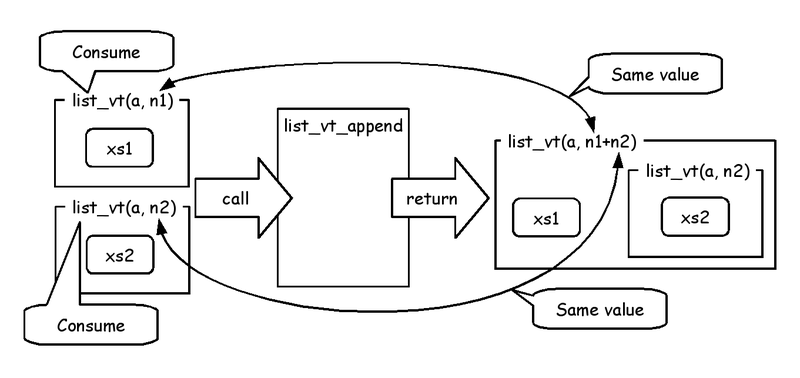
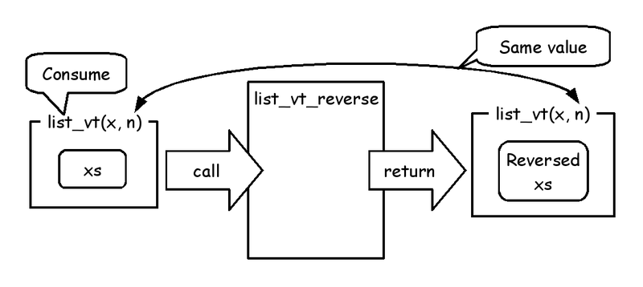
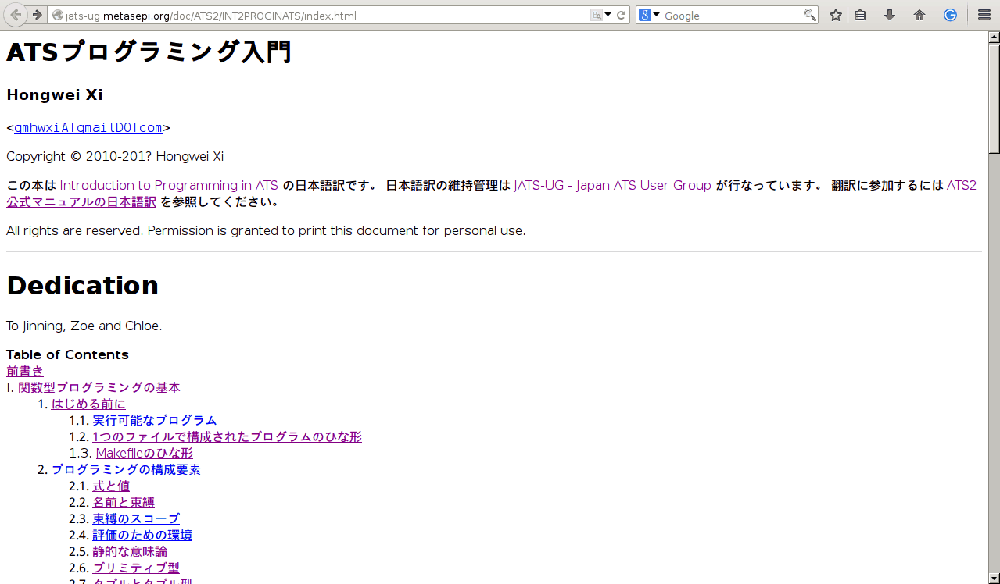
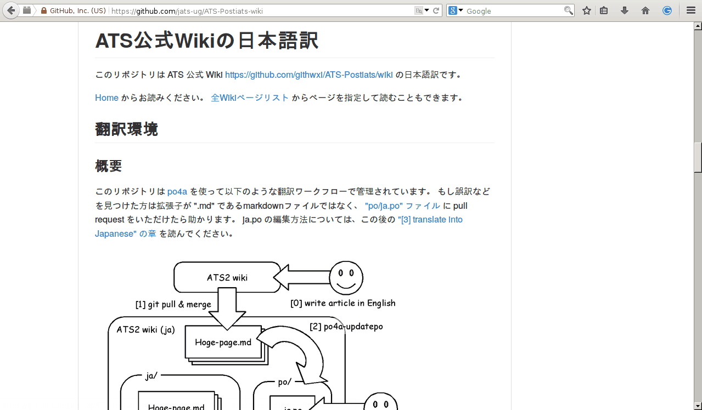
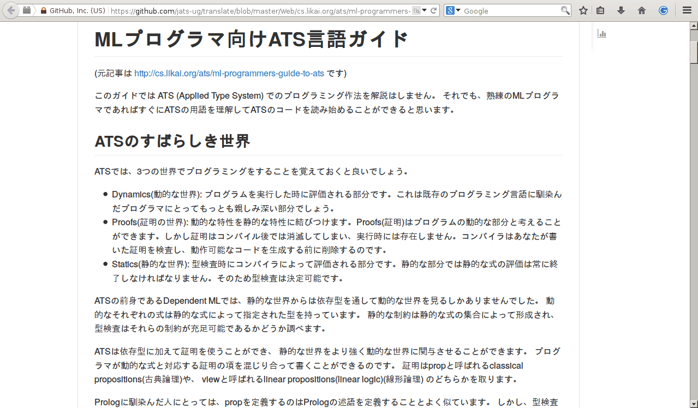
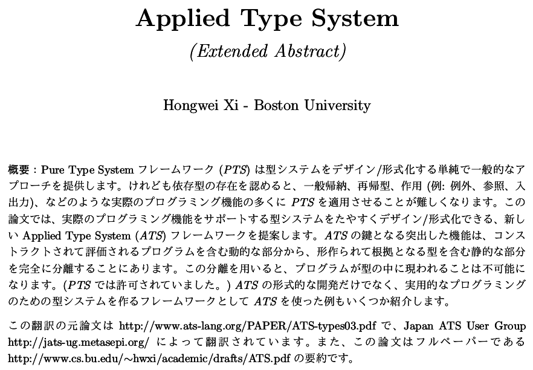

# Metasepi team meeting #17:　API captured invariant by ATS

Kiwamu Okabe @ Metasepi Project

# Who am I?

* http://www.masterq.net/
* Self employed software engineer
* Trade name := METASEPI DESIGN
* Founder of Metasepi Project
* A Debian Maintainer
* 10 years' experience in developing OS using NetBSD

# Remember Heartbleed bug?

Should we use safer language than C?

~~~
== In English ==
"Preventing heartbleed bugs with safe programming languages"
http://bluishcoder.co.nz/2014/04/11/preventing-heartbleed-bugs-with-safe-languages.html

== In Japanease ==
"安全なプログラミング言語を使って heartbleed を防ぐには"
https://github.com/jats-ug/translate/blob/master/Web/bluishcoder.co.nz/2014/04/11/preventing-heartbleed-bugs-with-safe-languages.md
~~~

"A safer systems programming language could have prevented the bug."

# Want the safer language...

It's the ATS http://www.ats-lang.org/ !

* Syntax like ML
* Dependent types
* Linear types
* Without any runtime
* Optional GC

# ATS code can run on 8-bit AVR

~~~
https://github.com/fpiot/arduino-mega2560-ats
~~~

# ATS compile flow

# Why ATS language is safe?

* Line is at between caller and callee
* ATS applies type to the line
* Type can enforce invariant in them

# Usage of Linear List

~~~
$ vi sample_list.dats
#include "share/atspre_staload.hats"
implement main0 () = {
  val l1 = list_vt_make_pair<int> (1, 2)
  val l2 = list_vt_make_pair<int> (3, 4)
  val () = println! ("l1 := [", l1, "] / l2 := [", l2, "]")

  val l3 = list_vt_append (l1, l2)
  val l4 = list_vt_reverse l3
  val () = println! ("l4 := [", l4, "]")
  val () = println! ("length(l4) := ", length l4)
  val () = free l4
}
$ patscc -DATS_MEMALLOC_LIBC -o sample_list sample_list.dats
$ ./sample_list
l1 := [1, 2] / l2 := [3, 4]
l4 := [4, 3, 2, 1]
length(l4) := 4
~~~

# Compile error: without free

~~~
$ vi sample_list.dats
#include "share/atspre_staload.hats"
implement main0 () = {
  val l1 = list_vt_make_pair<int> (1, 2)
  val l2 = list_vt_make_pair<int> (3, 4)
  val () = println! ("l1 := [", l1, "] / l2 := [", l2, "]")

  val l3 = list_vt_append (l1, l2)
  val l4 = list_vt_reverse l3
  val () = println! ("l4 := [", l4, "]")
  val () = println! ("length(l4) := ", length l4)
//  val () = free l4 // <= Changed
}
$ patscc -DATS_MEMALLOC_LIBC -o sample_list sample_list.dats
--snip--
The 2nd translation (binding) of [sample_list.dats] is successfully completed!
/home/kiwamu/tmp/sample_list.dats: 59(line=2, offs=22) -- 396(line=12, offs=2): error(3): the linear dynamic variable [l4$3440(-1)] needs to be consumed but it is preserved with the type [S2Eapp(S2Ecst(list_vt0ype_int_vtype); S2Eapp(S2Ecst(INV); S2EVar(4102)), S2EVar(4103))] instead.
~~~

# Type of Linear List

~~~
(* File: prelude/basics_dyn.sats *)
datavtype
list_vt0ype_int_vtype (a:vt@ype+, int) =
  | {n:int | n >= 0}
    list_vt_cons (a, n+1) of (a, list_vt0ype_int_vtype (a, n))
  | list_vt_nil (a, 0) of ()
stadef list_vt = list_vt0ype_int_vtype
~~~

# make_pair

~~~
(* File: prelude/SATS/list_vt.sats *)
fun{x:vt0p}
list_vt_make_pair (x1: x, x2: x):<!wrt> list_vt (x, 2)
~~~

# length

~~~
(* File: prelude/SATS/list_vt.sats *)
fun{x:vt0p}
list_vt_length{n:int} (xs: !list_vt (INV(x), n)):<> int n
~~~

# append

~~~
(* File: prelude/SATS/list_vt.sats *)
fun{
a:vt0p
} list_vt_append
  {n1,n2:int} (
  xs1: list_vt (INV(a), n1), xs2: list_vt (a, n2)
) :<!wrt> list_vt (a, n1+n2)
~~~

# reverse

~~~
(* File: prelude/SATS/list_vt.sats *)
fun{x:vt0p}
list_vt_reverse{n:int}
  (xs: list_vt (INV(x), n)):<!wrt> list_vt (x, n)
~~~

# free

~~~
(* File: prelude/basics_dyn.sats *)
vtypedef
List_vt (a:vt0p) = [n:int] list_vt (a, n)

(* File: prelude/SATS/list_vt.sats *)
fun{x:t0p}
list_vt_free (xs: List_vt (INV(x))):<!wrt> void
overload free with list_vt_free
~~~

# Japan ATS User Group

http://jats-ug.metasepi.org/

* In a parody of http://jaws-ug.jp/
* Push the Facebook like button, now!
* We translate ATS docs into Japanese

# "ATSプログラミング入門"

~~~
http://jats-ug.metasepi.org/doc/ATS2/INT2PROGINATS/index.html
~~~

# "ATS公式Wikiの日本語訳"

~~~
https://github.com/jats-ug/ATS-Postiats-wiki
~~~

# "MLプログラマ向けATS言語ガイド"

~~~
https://github.com/jats-ug/translate/blob/master/Web/cs.likai.org/ats/ml-programmers-guide-to-ats.md
~~~

# Paper "Applied Type System"

~~~
https://github.com/jats-ug/translate/raw/master/Paper/ATS-types03/ATS-types03-ja.pdf
~~~

# Follow me!

* https://twitter.com/jats_ug
* https://www.facebook.com/jatsug

