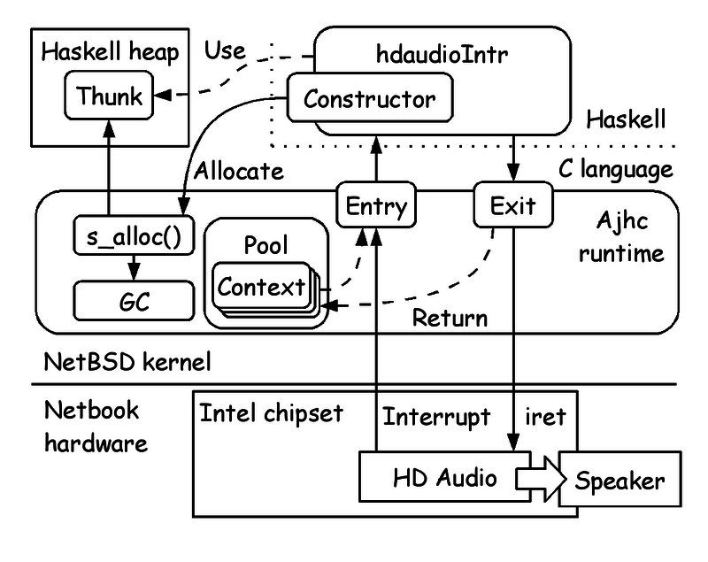
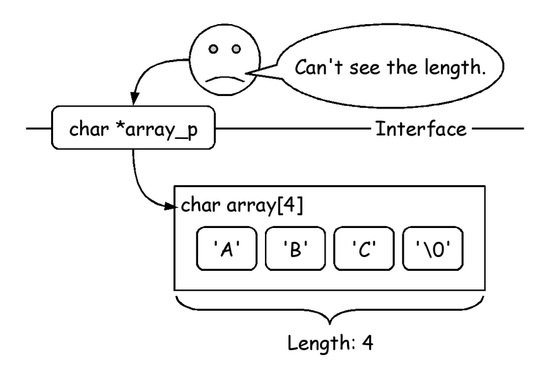
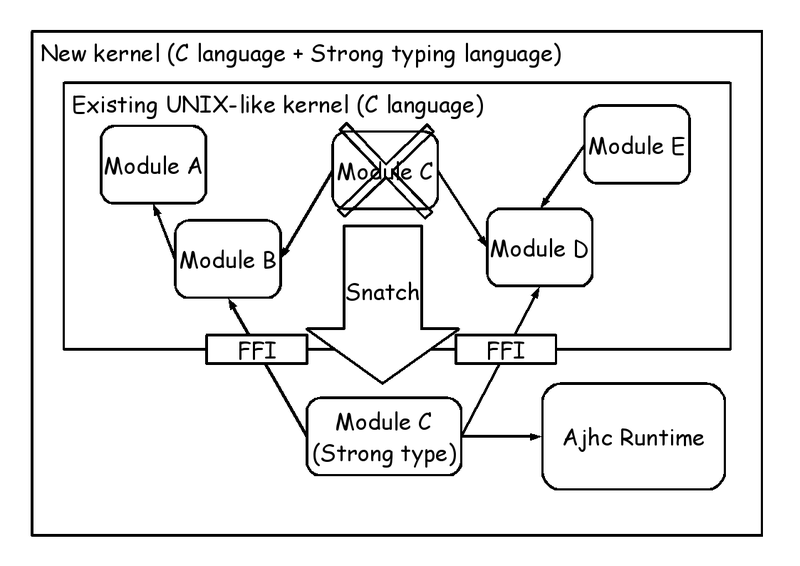
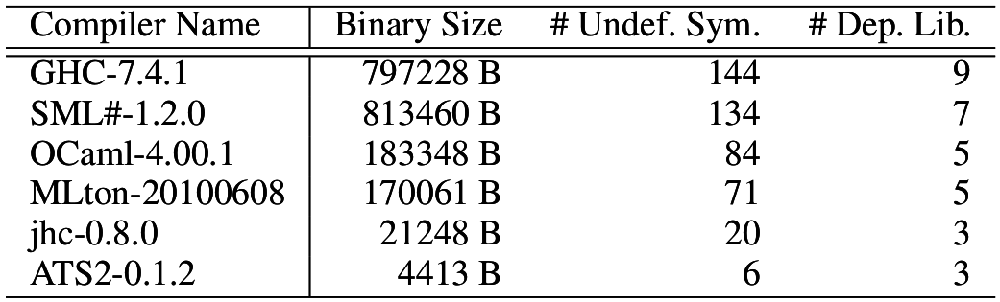
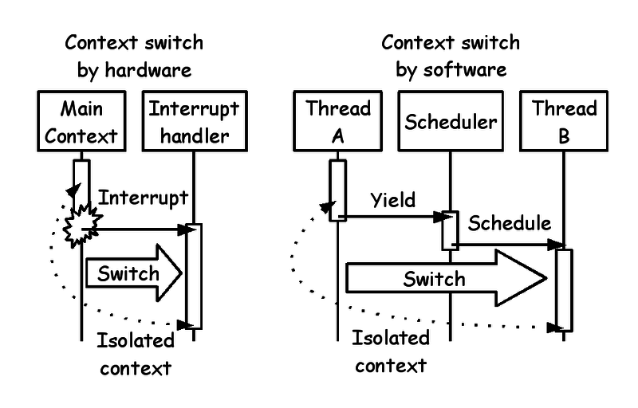
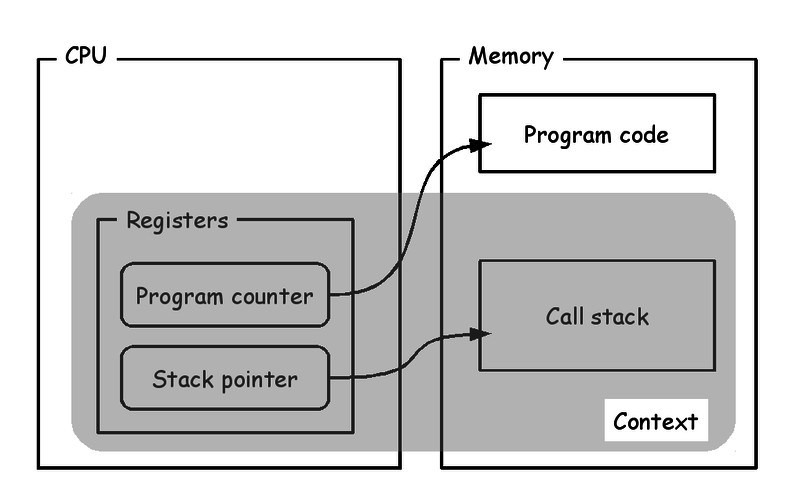
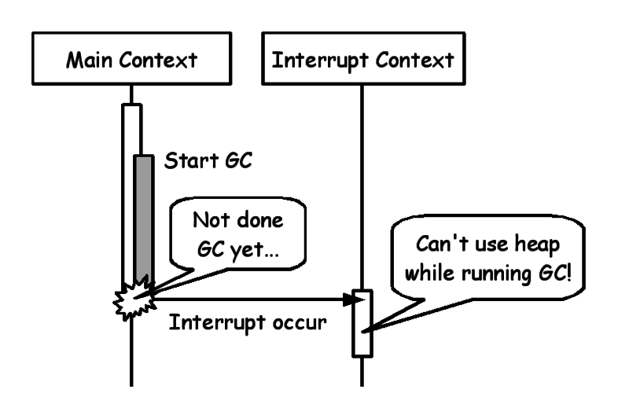
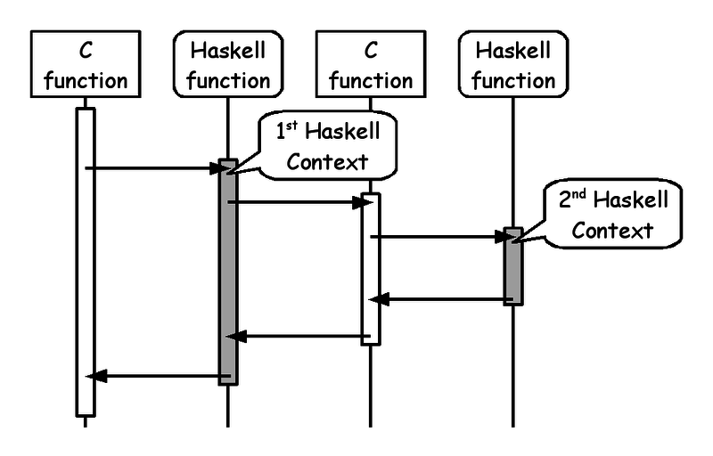
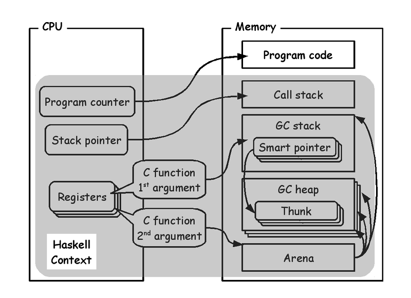
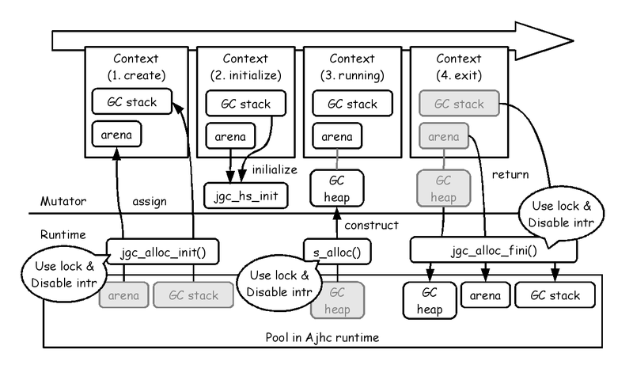

# Writing NetBSD Sound Drivers in Haskell

Kiwamu Okabe @ Metasepi Design & Takayuki Muranushi @ RIKEN AICS

# Demo: NetBSD driver in Haskell

* NetBSD audio driver plays sound.
* The driver's interrupt handler rewrited using Haskell.
* GC occurs in interrupt handler.
* Watch the movie at following.

~~~
https://www.youtube.com/watch?v=XEYcR5RG5cA
~~~

# Demo architecture

# Kernel wants type desperately

* Kernels are developed with C.
* We should design kernel with the greatest care.
* C language is unsafe!

# Kernel problem: Buffer overrun

* Pointer to array doesn't know the length.

# Kernel problem: Page fault

* Page fault in user space => SEGV
* Page fault in kernel space => Halt!

# Kernel problem: Weak type

* Lots of (void *) type
* NetBSD kernel uses it 45130 times!

~~~
$ pwd
/home/kiwamu/src/netbsd/sys
$ grep "void \*" `find . -name "*.c"` | wc -l
45130
~~~

* Kernel developers frequently use (void *) for flexibility. It's realy BAD, but there is no other option.

# Metasepi Project

http://metasepi.org/

* Unix-like OS designed by strong type.
* We want to use Metasepi OS for daily desktop usage (e.g. web browser, programming, office suite, ... etc.)
* We have surveyed may functional languages (e.g. Haskell, OCaml, MLton, ... etc.)

# Scratch or Rewrite

# Snatch-driven development #1

http://en.wikipedia.org/wiki/Snatcher

# Snatch-driven development #2

# Why we use jhc ?

Comparison of programs to print "hoge" on terminal.
The smaller the values, the lesser is the dependency on POSIX,
the more suitable for system programming.

# Unix-like OS needs reentrancy

* Why we need reentrancy?
* Because interrupt handler should be reentrant.
* Why we need interrupt handler?
* Because preemptive multitasking uses it.
* Why we need the multitasking?
* Because Unix-like OS depends on it.

# What's reentrancy ?

~~~
Reentrant code can be interrupted in the middle of its execution and then safely called again ("re-entered") before its previous invocations complete execution.
~~~

# How do we get reentrancy in C ?

* C language contexts are isolated.

# What's C language Context ?

# Problem: Interrupt and GC

# Root of the problem

* GHC's Haskell context is global and single.
* There is only one GC heap on GHC.
* If interrupt occurs while GC is running, the interrupt context can't use GC heap, because the running GC is paused!
* Therefore GHC's binary isn't reentrant.

# How we can fix this problem

We re-define the Haskell Context.

# What's Haskell Context on Ajhc?

# Context-Local Heaps (CLHs)

* Idea: Isolate contexts by local heap

# Haskell Context life cycle (CLHs)

# Isolated contexts are reentrant?

# Benchmark

~~~
(O)  Original NetBSD 6.1.2 kernel
(S)  The kernel includes AC'97 and HD Audio driver snatched by Ajhc
(N)  (S) + using naive GC
(B4) (S) + having GC block 16 Byte
(B5) (S) + having GC block 32 Byte
(B6) (S) + having GC block 64 Byte
~~~

# Thank's for contributors !

# Conclusion

* Can we write Unix in Haskell?
* => Yes!
* How we realize Reentrant GC?
* => With Context-Local Heaps (CLHs)!
* Can we implement CLHs in other compilers?
* => Yes! Of cause, GHC can do it!

# License of used photos #1

~~~
~~~
