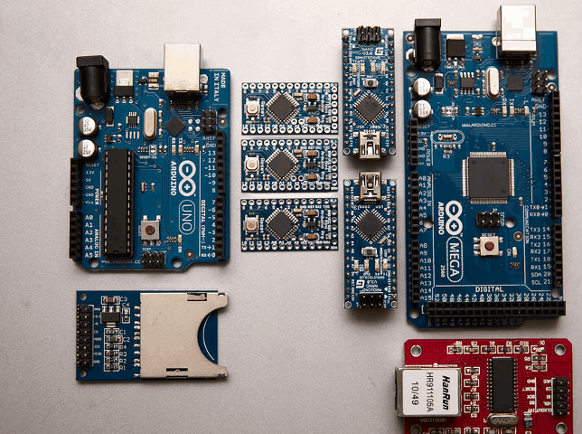
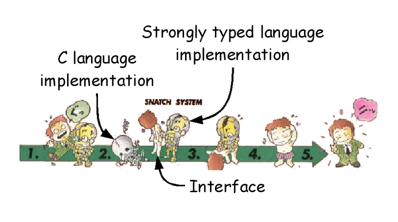
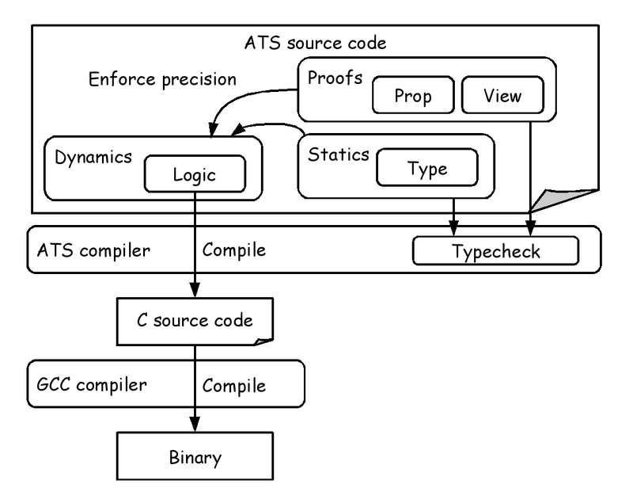
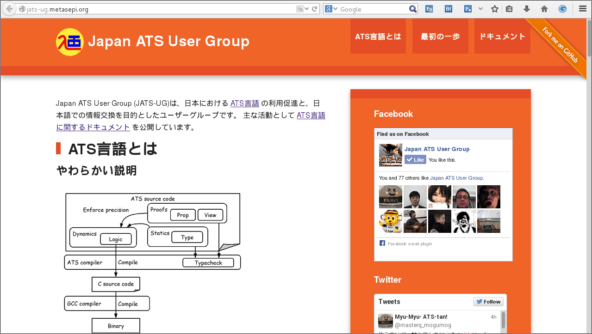
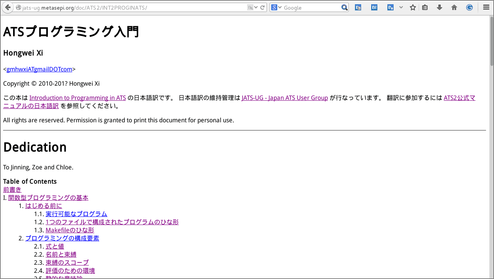
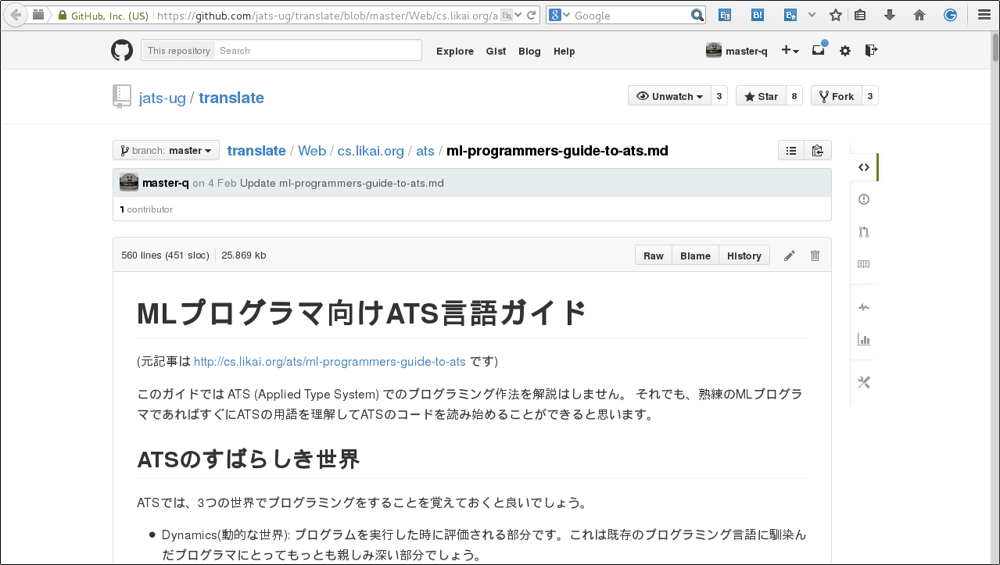
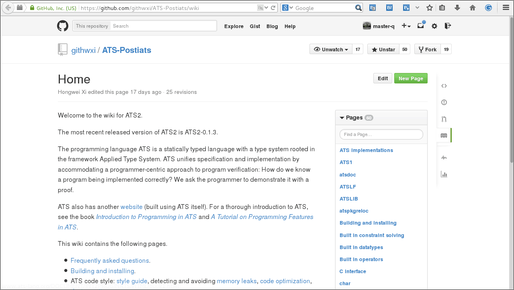

# Metasepi team meeting #20:　Start! ATS programming

Kiwamu Okabe @ Metasepi Project

# Demo: ATS on Arduino Uno

* http://nico.ms/sm24680530
* https://github.com/fpiot/arduino-ats
* Without any GC, and any malloc


# Demo: Arduino Uno

* MCU: ATmega328
* Flash Memory: 32 KB
* SRAM: 2 KB

```
http://arduino.cc/en/Main/ArduinoBoardUno
```


# Demo: LCD Shield

* LinkSprite 16X2 LCD Keypad Shield
* 16x2 LCD
* HD44780 compatible

```
http://store.linksprite.com/linksprite-16x2-lcd-keypad-shield-for-arduino-version-b/
```


# Demo: Software Architecture


# Demo code: main.dats


# Demo code: lcs.sats


# Demo code: lcs.dats

* We don't read it, today.


# Agenda


* [0] ATS application demo
* [1] What is Metasepi?
* [2] What is ATS language?
* [3] Let's read the demo code
* [4] Japan ATS User Group

# [1] What is Metasepi?


http://metasepi.org/

* Unix-like OS designed by strong type.
* We want to use Metasepi OS for daily desktop usage.
* Haskell language was chosen for 1st iteration named "Arafura".
* ATS language is chosen for our 2nd iteration named "Bohai".

# How to create Metasepi?


* Use "Snatch-driven development".

```
http://en.wikipedia.org/wiki/Snatcher
```



# [2] What is ATS language?


http://www.ats-lang.org/

* Syntax like ML
* Dependent types
* Linear types
* Without any runtime
* Optional GC
* Developed at Boston University

# ATS compile flow



# [3] Let's read the demo code

Start from main.dats.

```
arduino-ats
|-- DATS
|   `-- lcd.dats
|-- SATS
|   |-- arduino.sats
|   `-- lcd.sats
|-- avr_prelude
|   |-- DATS
|   |   `-- string0.dats
|   |-- SATS
|   |   `-- string0.sats
|   |-- kernel_prelude.cats
|   `-- kernel_staload.hats
`-- demo
    `-- lcd_ats
        |-- DATS
        |   `-- main.dats # <= Start from here.
        `-- config.hats
```

# main.dats sequence


# lcd.sats


# Power of Dependent Type #1

```
$ pwd
/home/kiwamu/src/arduino-ats/demo/lcd_ats
$ vi DATS/main.dats
$ git diff
diff --git a/demo/lcd_ats/DATS/main.dats b/demo/lcd_ats/DATS/main.dats
index ab94597..f00eccd 100644
--- a/demo/lcd_ats/DATS/main.dats
+++ b/demo/lcd_ats/DATS/main.dats
@@ -13,7 +13,7 @@ val g_str_message = "                 ATS is a statically typed programming lang
 implement main0 () = {
   fun loop {n:int}{i:nat | i < n}
            (lcd: !lcd_t, str: string (n), pos: size_t (i)): void = {
-    val () = if pos + lcd_width <= length str then {
+    val () = if pos + lcd_width <= 1 + length str then {
       val () = lcd_setCursor (lcd, 1, 0)
       val () = lcd_print (lcd, g_str_atsrun, i2sz 0, length g_str_atsrun)
       val () = lcd_setCursor (lcd, 0, 1)
```

# Power of Dependent Type #2

```
$ make
--snip--
patsopt -o DATS/main_dats.c -d DATS/main.dats
/home/kiwamu/src/arduino-ats/demo/lcd_ats/DATS/main.dats: 958(line=20, offs=25) -- 958(line=20, offs=25): error(3): unsolved constraint: C3NSTRprop(main; S2Eapp(S2Ecst(<=); S2Eapp(S2Ecst(+); S2EVar(1830->S2Evar(i(5501))), S2EVar(1831->S2Eintinf(16))), S2EVar(1829->S2Evar(n(5500)))))
typechecking has failed: there are some unsolved constraints: please inspect the above reported error message(s) for information.
```

* ATS2 finds issue at compile time!
* Constraint "i + j <= n" is at lcd.sats
* main.dats violates the constraint

# Power of Linear Type #1

```
$ pwd
/home/kiwamu/src/arduino-ats/demo/lcd_ats
$ vi DATS/main.dats
$ git diff
diff --git a/demo/lcd_ats/DATS/main.dats b/demo/lcd_ats/DATS/main.dats
index ab94597..4c73340 100644
--- a/demo/lcd_ats/DATS/main.dats
+++ b/demo/lcd_ats/DATS/main.dats
@@ -25,6 +25,7 @@ implement main0 () = {
   fun forever {n:int}{i:nat | i < n}
               (lcd: !lcd_t, str: string (n), pos: size_t (i)): void = {
     val () = loop (lcd, str, pos)
+    val () = lcd_close lcd
     val () = forever (lcd, str, pos)
   }
   val lcd = lcd_open (8, 13, 9, 4, 5, 6, 7)
```

# Power of Linear Type #2

```
$ make
--snip--
patsopt -o DATS/main_dats.c -d DATS/main.dats
/home/kiwamu/src/arduino-ats/demo/lcd_ats/DATS/main.dats: 1263(line=29, offs=23) -- 1266(line=29, offs=26): error(3): the linear dynamic variable [lcd$1182(-1)] is no longer available.
/home/kiwamu/src/arduino-ats/demo/lcd_ats/DATS/main.dats: 1263(line=29, offs=23) -- 1266(line=29, offs=26): error(3): the dynamic expression cannot be assigned the type [S2Ecst(lcd_t)].
```

* ATS2 finds issue at compile time!
* Linear value "lcd" is consumed
* However "lcd" is used by "forever"


# [5] Japan ATS User Group

http://jats-ug.metasepi.org/



# Doc: ATSプログラミング入門

```
http://jats-ug.metasepi.org/doc/ATS2/INT2PROGINATS/
```



# Doc: チュートリアル

```
http://jats-ug.metasepi.org/doc/ATS2/ATS2TUTORIAL/
```


# Doc: MLプログラマ向けガイド

```
https://github.com/jats-ug/translate/blob/master/Web/cs.likai.org/ats/ml-programmers-guide-to-ats.md
```



# Doc: ATS2 wiki

```
https://github.com/githwxi/ATS-Postiats/wiki
```



# Paper: Applied Type System

```
https://github.com/jats-ug/translate/raw/master/Paper/ATS-types03/ATS-types03-ja.pdf
```


# ATS IDE on MonoDevelop

```
https://github.com/ashalkhakov/ATS-Postiats-ide
```


# Functional IoT

```
http://fpiot.metasepi.org/
```


# Hongwei said... (cont.)


~~~
Date: Mon Dec 23 11:40 JST 2013

Hi Metasepi-chan,

I spent quite some time today browsing metasepi.org.

I am really interested in your Metasepi project, partly because I myself wanted to implement NetBSD in ATS about 5 years ago. Unfortunately, I never had time to get the project started as I needed to spend so much time on ATS2. By the way, I had planned to use the very same approach which you call "Snatch". I had also considered Minix but I chose NetBSD because it was a real OS.

I think I know first-handedly the dilemma you are currently in. On one hand, you want to be able to fully focus on writing the kernel. On the other hand, you also need to add features to Ajhc constantly to address all kinds of issues that keep popping up, which undoubtedly makes it very difficult for you to focus.
~~~

# Hongwei said... (cont.)


~~~
I would highly recommend that you use ATS to implement NetBSD kernel. Unlike jhc, there is no semantics gap between ATS and C. In particular, they both use the same native unboxed data representation. Once you become familiar with ATS, you can readily visualize the C code that your ATS source is to be compiled into. ATS is truly an ideal language for the kind of "Snatch" approach you want to take to re-write NetBSD. If you take the lead, then I will be happy to "chip in" :)

I also spent some time reading documentation on jhc. Personally, I feel that there is simply too much uncertainty to use it in real kernel implementation. Features like GC could make the kernel highly unpredictable, scaring away potential users.

I think that we both believe C is the right language for systems programming. The problem with C is that it is too difficult to write correct C programs. ATS is designed to allow the programmer to correctly write the kind of C programs he or she wanted to write in the first place. While jhc generates C code, the kind of C code it generates may not be suited for kernel. This is what I call a semantics gap.
~~~

# Hongwei said...


~~~
I write this message in the hope that we could join effort in doing something that has not been done up to now: Writing a real kernel in (largely) functional style that can truly deliever safety-wise as well as performance-wise.

Cheers,

--Hongwei
~~~

# Follow me!

https://twitter.com/jats_ug


