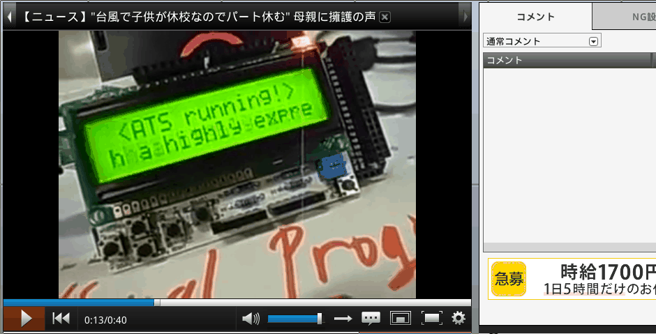
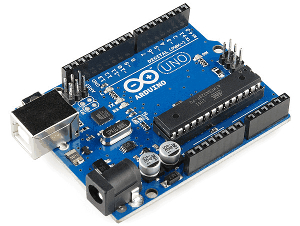
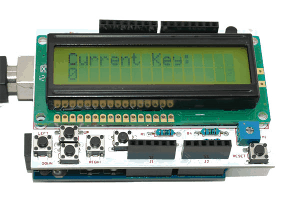
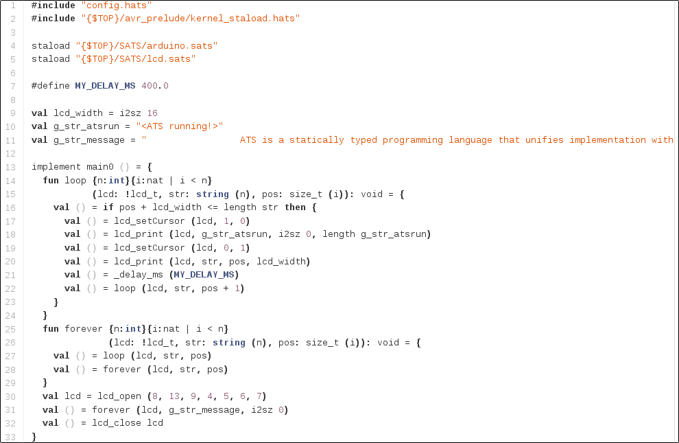
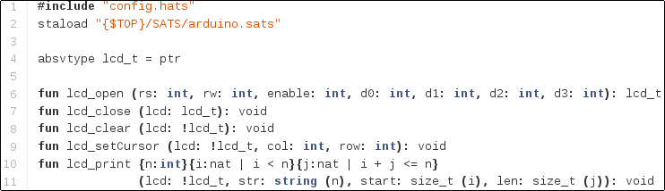
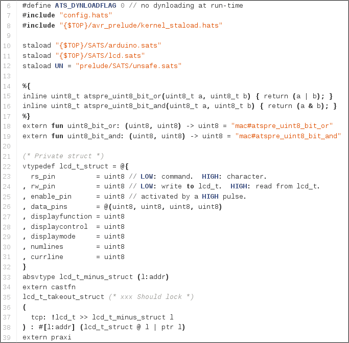
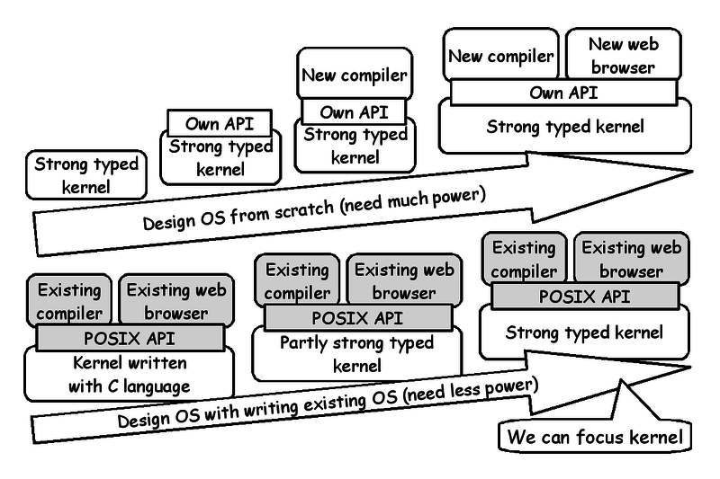

# Metasepi team meeting #19:　ATS application on Arduino

Kiwamu Okabe @ Metasepi Project

# Demo: ATS on Arduino Uno

* Movie: http://nico.ms/sm24680530
* Without any GC, and any malloc



# Demo: Arduino Uno

* MCU: ATmega328
* Flash Memory: 32 KB
* SRAM: 2 KB

```
http://arduino.cc/en/Main/ArduinoBoardUno
```



# Demo: LCD Shield

* LinkSprite 16X2 LCD Keypad Shield
* 16x2 LCD
* HD44780 compatible

```
http://store.linksprite.com/linksprite-16x2-lcd-keypad-shield-for-arduino-version-b/
```



# Demo: Software Architecture

xxx Add figure

# Demo: Source Code #1

* main.dats



# Demo: Source Code #2

* lcs.sats



# Demo: Source Code #3

* lcs.dats # <= We don't read it, today.



# Agenda

* [0] ATS application demo
* [1] What is Metasepi?
* [2] How to create Metasepi?
* [3] What is ATS language?
* [4] Why ATS language is safe?
* [5] Let's read the demo code
* [6] Japan ATS User Group

# [1] What is Metasepi?

http://metasepi.org/

* Unix-like OS designed by strong type.
* We want to use Metasepi OS for daily desktop usage (e.g. web browser, programming, office suite, ... etc.)
* We have surveyed may functional languages (e.g. Haskell, OCaml, MLton, ... etc.)

# Kernel developers want type


* Kernels are developed with C.
* We should design kernel with the greatest care.
* C language is unsafe!

# Kernel Bug #1: Buffer overrun


* Pointer to array doesn't know the length.


# Kernel Bug #2: Page fault


* Page fault in user space => SEGV
* Page fault in kernel space => Halt!


# Kernel Bug #3: Weak type


* Lots of (void *) and unsafe coercion.
* NetBSD kernel uses it 45130 times!

~~~
$ pwd
/home/kiwamu/src/netbsd/sys
$ grep "void \*" `find . -name "*.c"` | wc -l
45130
~~~

* Kernel developers frequently use (void *) for flexibility. It's realy BAD, but there is no other option.

# Scratch or Rewrite




# Snatch-driven development


http://en.wikipedia.org/wiki/Snatcher


# Follow me!

https://twitter.com/jats_ug


