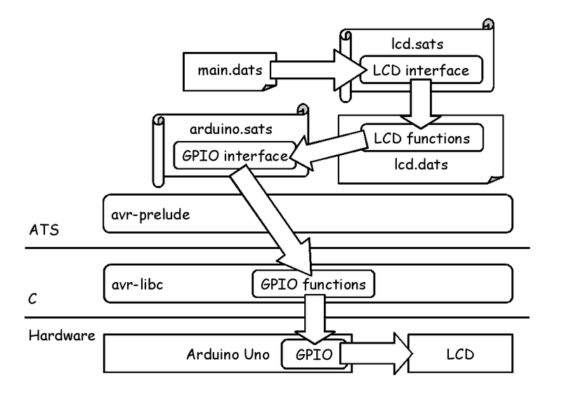
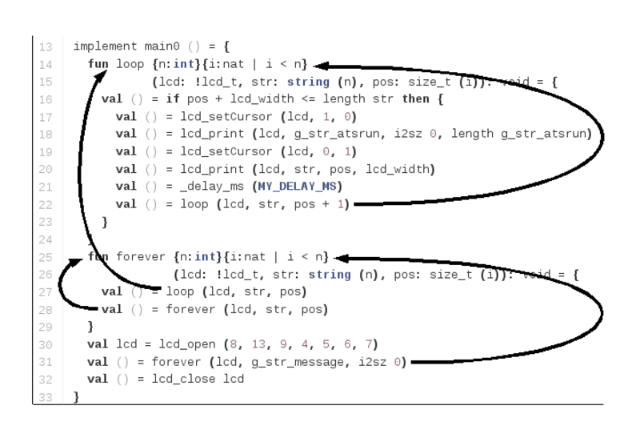
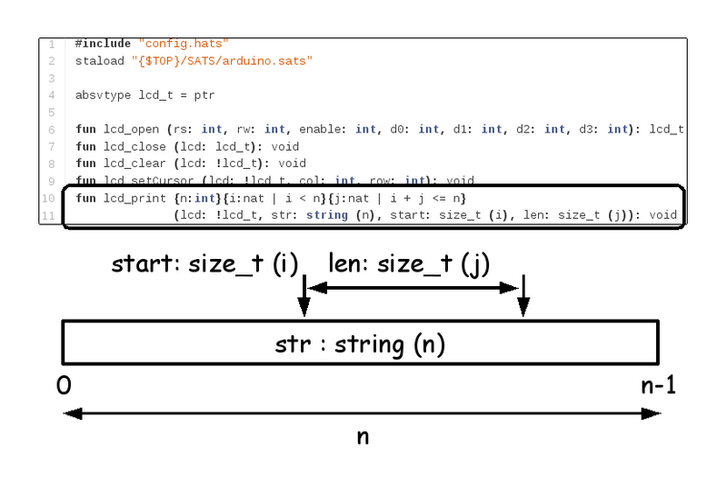
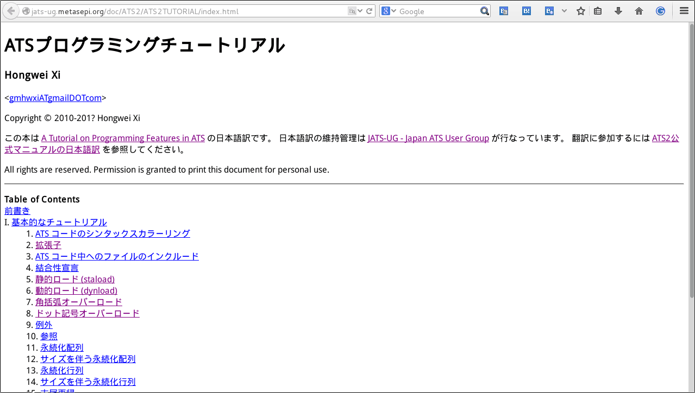

# Metasepi team meeting #19:　ATS application on Arduino

Kiwamu Okabe @ Metasepi Project

# Demo: ATS on Arduino Uno

* http://nico.ms/sm24680530
* https://github.com/fpiot/arduino-ats
* Without any GC, and any malloc


# Demo: Arduino Uno

* MCU: ATmega328
* Flash Memory: 32 KB
* SRAM: 2 KB

```
http://arduino.cc/en/Main/ArduinoBoardUno
```


# Demo: LCD Shield

* LinkSprite 16X2 LCD Keypad Shield
* 16x2 LCD
* HD44780 compatible

```
http://store.linksprite.com/linksprite-16x2-lcd-keypad-shield-for-arduino-version-b/
```


# Demo: Software Architecture



# Demo code: main.dats


# Demo code: lcs.sats


# Demo code: lcs.dats

* We don't read it, today.


# Agenda

* [0] ATS application demo
* [1] What is Metasepi?
* [2] How to create Metasepi?
* [3] What is ATS language?
* [4] Let's read the demo code
* [5] Japan ATS User Group

# [1] What is Metasepi?

http://metasepi.org/

* Unix-like OS designed by strong type.
* We want to use Metasepi OS for daily desktop usage (e.g. web browser, programming, office suite, ... etc.)
* We have surveyed may functional languages (e.g. Haskell, OCaml, MLton, ... etc.)

# Kernel developer wants type


* Kernels are developed with C.
* We should design kernel with the greatest care.
* C language is unsafe!

# Kernel Bug #1: Buffer overrun


* Pointer to array doesn't know the length.


# Kernel Bug #2: Page fault


* Page fault in user space => SEGV
* Page fault in kernel space => Halt!


# Kernel Bug #3: Weak type


* Lots of (void *) and unsafe coercion.
* NetBSD kernel uses it 45130 times!

~~~
$ pwd
/home/kiwamu/src/netbsd/sys
$ grep "void \*" `find . -name "*.c"` | wc -l
45130
~~~

* Kernel developers frequently use (void *) for flexibility. It's realy BAD, but there is no other option.

# [2] How to create Metasepi?

* Scratch or Rewrite


# Snatch-driven development


http://en.wikipedia.org/wiki/Snatcher


# Which language should we use?

* ATS http://www.ats-lang.org/


# [3] What is ATS language?

xxx

# [4] Let's read the demo code

Start from main.dats.

```
arduino-ats
|-- DATS
|   `-- lcd.dats
|-- SATS
|   |-- arduino.sats
|   `-- lcd.sats
|-- avr_prelude
|   |-- DATS
|   |   `-- string0.dats
|   |-- SATS
|   |   `-- string0.sats
|   |-- kernel_prelude.cats
|   `-- kernel_staload.hats
`-- demo
    `-- lcd_ats
        |-- DATS
        |   `-- main.dats # <= Start from here.
        `-- config.hats
```

# main.dats sequence



# lcd.sats



# Power of Dependent Type #1

```
$ pwd
/home/kiwamu/src/arduino-ats/demo/lcd_ats
$ vi DATS/main.dats
$ git diff
diff --git a/demo/lcd_ats/DATS/main.dats b/demo/lcd_ats/DATS/main.dats
index ab94597..f00eccd 100644
--- a/demo/lcd_ats/DATS/main.dats
+++ b/demo/lcd_ats/DATS/main.dats
@@ -13,7 +13,7 @@ val g_str_message = "                 ATS is a statically typed programming lang
 implement main0 () = {
   fun loop {n:int}{i:nat | i < n}
            (lcd: !lcd_t, str: string (n), pos: size_t (i)): void = {
-    val () = if pos + lcd_width <= length str then {
+    val () = if pos + lcd_width <= 1 + length str then {
       val () = lcd_setCursor (lcd, 1, 0)
       val () = lcd_print (lcd, g_str_atsrun, i2sz 0, length g_str_atsrun)
       val () = lcd_setCursor (lcd, 0, 1)
```

# Power of Dependent Type #2

```
$ make
--snip--
patsopt -o DATS/main_dats.c -d DATS/main.dats
/home/kiwamu/src/arduino-ats/demo/lcd_ats/DATS/main.dats: 958(line=20, offs=25) -- 958(line=20, offs=25): error(3): unsolved constraint: C3NSTRprop(main; S2Eapp(S2Ecst(<=); S2Eapp(S2Ecst(+); S2EVar(1830->S2Evar(i(5501))), S2EVar(1831->S2Eintinf(16))), S2EVar(1829->S2Evar(n(5500)))))
typechecking has failed: there are some unsolved constraints: please inspect the above reported error message(s) for information.
```

* ATS2 finds issue at compile time!

# Power of Linear Type #1

```
$ pwd
/home/kiwamu/src/arduino-ats/demo/lcd_ats
$ vi DATS/main.dats
$ git diff
diff --git a/demo/lcd_ats/DATS/main.dats b/demo/lcd_ats/DATS/main.dats
index ab94597..4c73340 100644
--- a/demo/lcd_ats/DATS/main.dats
+++ b/demo/lcd_ats/DATS/main.dats
@@ -25,6 +25,7 @@ implement main0 () = {
   fun forever {n:int}{i:nat | i < n}
               (lcd: !lcd_t, str: string (n), pos: size_t (i)): void = {
     val () = loop (lcd, str, pos)
+    val () = lcd_close lcd
     val () = forever (lcd, str, pos)
   }
   val lcd = lcd_open (8, 13, 9, 4, 5, 6, 7)
```

# Power of Linear Type #2

```
$ make
--snip--
patsopt -o DATS/main_dats.c -d DATS/main.dats
/home/kiwamu/src/arduino-ats/demo/lcd_ats/DATS/main.dats: 1263(line=29, offs=23) -- 1266(line=29, offs=26): error(3): the linear dynamic variable [lcd$1182(-1)] is no longer available.
/home/kiwamu/src/arduino-ats/demo/lcd_ats/DATS/main.dats: 1263(line=29, offs=23) -- 1266(line=29, offs=26): error(3): the dynamic expression cannot be assigned the type [S2Ecst(lcd_t)].
```

* ATS2 finds issue at compile time!


# [5] Japan ATS User Group

http://jats-ug.metasepi.org/


# Doc: ATSプログラミング入門

```
http://jats-ug.metasepi.org/doc/ATS2/INT2PROGINATS/
```


# Doc: チュートリアル

```
http://jats-ug.metasepi.org/doc/ATS2/ATS2TUTORIAL/
```



# Doc: MLプログラマ向けガイド

```
https://github.com/jats-ug/translate/blob/master/Web/cs.likai.org/ats/ml-programmers-guide-to-ats.md
```


# Doc: ATS2 wiki

```
https://github.com/githwxi/ATS-Postiats/wiki
```


# Follow me!

https://twitter.com/jats_ug


