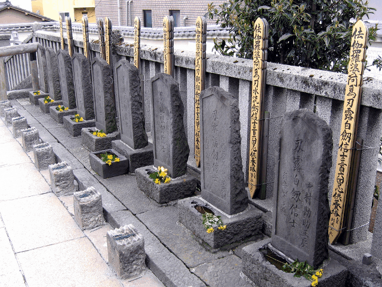

# Play, Slick, play2-authの間で討死

Kiwamu Okabe

# あんた誰？

* http://www.masterq.net/
* 名前: 岡部 究
* Web関連技術初心者
* Scalaは1ヶ月使って挫折
* 今日はその挫折の話をしようと思います

# Playを使ってみようという話に

* 某案件でWebフレームワークを選定
* なにはともあれ型の強い言語を使いたい
* まずはScala+Playをさわってみよう

# どーせならSlick使おう

* 次期PlayではSlickが標準サポートに
* それ以上Slickについて良く知らなかった

# 認証はplay2-authを

* ユーザ/パスワード認証が欲しいだけだった
* SecureSocialはごっつい
* play2-authはマニュアルがわかりやすい

# 振り返り

* みんな認証まわりはどーしてるんだろう？
* 実はSlick使わない方が楽？
