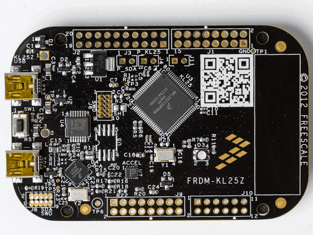
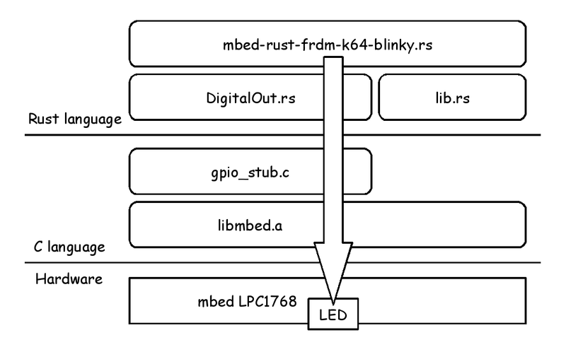

# Embedded Rust and more


Kiwamu Okabe

# Congrats, Rust 1.0!


# Demo: Blink LED using Rust


```
https://github.com/master-q/mbed-rust-frdm-k64f-blinky
```

* Based on 0xc0170's product
* Support hardware: mbed LPC1768


# Demo Architecture




# mbed-rust-frdm-k64-blinky.rs #1


Magic words for no std library.

```rust
#![crate_type = "rlib"]
#![feature(no_std)]
#![no_std]
#![feature(lang_items, asm, core)]

#![allow(dead_code)]
#![allow(non_snake_case)]

extern crate core;
```

It's available for following version.

```
$ rustc --version
rustc 1.1.0-nightly (435622028 2015-05-04) (built 2015-05-05)
```

# mbed-rust-frdm-k64-blinky.rs #2


Blink LED using libmbed.a.

```rust
#[link(name = "mbed", kind = "static")]
extern {
    pub fn wait(sec: f32);
    pub fn mbed_die();
}

#[no_mangle]
pub fn main() {
    let mut led = DigitalOut::DigitalOut::new(0x2009C000 | (32 + 18));
    unsafe {
        loop {
            led.write(1);
            wait(1.0);
            led.write(0);
            wait(1.0);
        }
    }
}
```

# DigitalOut.rs #1


Use "gpio_*" functions on libmbed.a.

```rust
#[link(name = "mbed", kind = "static")]
extern {
    pub fn gpio_write_stub(obj: *mut u8, value: i32);
    pub fn gpio_init_out(obj: *mut u8, pin: u32);
    pub fn gpio_read_stub(obj: *mut u8) -> i32;
    pub fn gpio_mode(obj: *mut u8, mode: i32);
    pub fn gpio_set(pin: i32) -> u32;
}

pub struct DigitalOut {
    gpio : [u8; 24]
}

```

# DigitalOut.rs #2


```rust
impl DigitalOut {
    pub fn new(pin: u32) -> DigitalOut {
        unsafe {
            let mut gpio_out : DigitalOut = init();
            gpio_init_out(gpio_out.gpio.as_mut_ptr(), pin);
            gpio_out
        }
    }

    fn as_mut_ptr(&mut self) -> *mut u8 {
        self.gpio.as_mut_ptr()
    }

    pub fn write(&mut self, value: i32) {
        unsafe {
            gpio_write_stub(self.gpio.as_mut_ptr(), value);
        }
    }

    pub fn read(&mut self, value: i32) -> i32 {
        unsafe {
            gpio_read_stub(self.gpio.as_mut_ptr())
        }
    }
}
```

# Why need embedded language?


To design IoT device. IoT device is:

* connected to the internet
* developed in a short time
* storing personal data
* secure
* more intelligence
* inexpensive

# Functional IoT


The Functional IoT is a wrestling mat that strong typed languages fight on, to become the champion of system programming language.

What language will challenge?

* ATS
* Haskell (jhc)
* Rust
