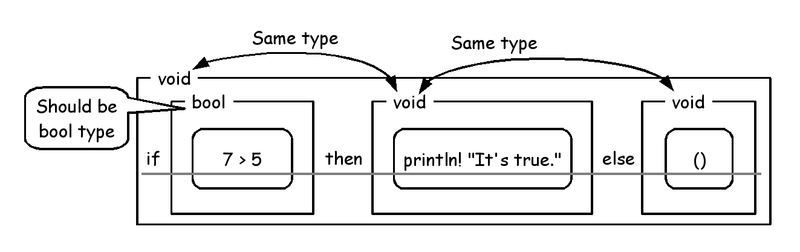
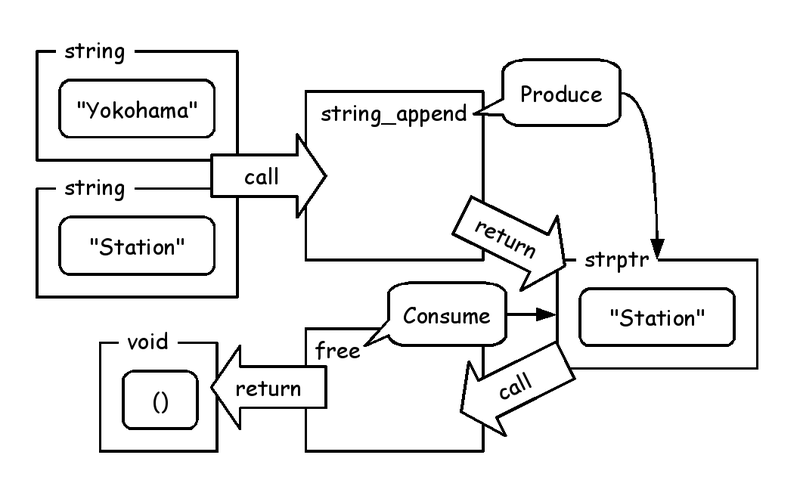

# ATSプログラミングチュートリアル

Kiwamu Okabe

# 準備はできましたか？

ATS2コンパイラはインストール済みですか？
もし未だなら、次のマニュアルを参考にATS2をインストールしてください:

* http://bit.ly/instatsj

# ATSって何でしょう?

http://www.ats-lang.org/

* MLのような文法
* 依存型
* 線形型
* GCなしでも動作
* ランタイムを持たない
* Dependent MLの後継

# ATSを使うと何ができるの？

* 依存型を使ってコードに証明を与えられる
* 線形型を使ってmallocを安全に扱える
* 線形型を使ってポインタを安全に扱える
* 強い型をOSなしに使える
* ベアメタルの上でコードを書ける
* Linux kernel内のコードを書ける

# 今日のゴール

ATSには既に良いドキュメントがあります。

~~~
* ATSプログラミング入門
  http://jats-ug.metasepi.org/doc/ATS2/INT2PROGINATS/
* ATSプログラミングチュートリアル
  http://jats-ug.metasepi.org/doc/ATS2/ATS2TUTORIAL/
* Effective ATS
  https://github.com/jats-ug/translate/blob/master/Manual/EffectiveATS.md
* Wiki for ATS2
  https://github.com/githwxi/ATS-Postiats/wiki
~~~

けれどもこれらは初心者に難しい面があります。
今日のゴールは自分自身で"ATSプログラミング入門"を読めるようになることです。

# Hello Worldから始めよう

~~~
$ vi helloworld.dats
val () = println! "Hello, world!"

implement main0 () = ()
$ patscc helloworld.dats
$ ./a.out
Hello, world!
~~~

直接 println! を呼び出すこともできます。

~~~
$ vi helloworld2.dats
implement main0 () = () where {
  val () = println! "Hello, world!"
}
~~~

もしくはもっとシンプルに...

~~~
$ vi helloworld3.dats
implement main0 () = println! "Hello, world!"
~~~

# 整数型

"share/atspre_staload.hats" はオーバロードされた演算子のために必要です。

~~~
$ vi int_op.dats
#include "share/atspre_staload.hats"

val () = println! (3 + 4 * 2)
val () = println! ((3 + 4) * 2)
val () = println! (2 - 3)
val () = println! (7 / 2)
val () = println! (7 % 2)

implement main0 () = ()
$ patscc int_op.dats
$ ./a.out
11
14
-1
3
1
~~~

# ゼロ除算の検出

ゼロ除算はコンパイルエラーになります。

~~~
$ vi divmod.dats
#include "share/atspre_staload.hats"

val () = println! (7 / (2 - 2))

implement main0 () = ()
$ patscc divmod.dats
/home/kiwamu/tmp/tmp/divmod.dats: 60(line=3, offs=22) -- 61(line=3, offs=23): error(3): unsolved constraint: C3NSTRprop(main; S2Eapp(S2Ecst(!=); S2EVar(4177->S2Eapp(S2Ecst(sub_int_int); S2EVar(4173->S2Eintinf(2)), S2EVar(4174->S2Eintinf(2)))), S2Eintinf(0)))
typechecking has failed: there are some unsolved constraints: please inspect the above reported error message(s) for information.
exit(ATS): uncaught exception: _2home_2kiwamu_2src_2ATS_2dPostiats_2src_2pats_error_2esats__FatalErrorExn(1025)
~~~

でもこのエラー、すごく読み難い...

# 内部の型表現を理解しよう

次の内部型で表わされたエラーメッセージを解釈しましょう:

~~~
https://github.com/githwxi/ATS-Postiats/wiki/Internal-types

* S2Eapp - 関数適用の項
* S2Ecst - (例えば int, bool, list などのような) 型定数
* S2Eeff - 関数の作用
* S2Eexi - 存在量化型
* S2Eint - マシン精度整数
* S2Eintinf - 任意精度整数; 殆どのpatsoptで整数種として使われます
* S2Evar - (通常、全称量化の)変数
* S2Etop (0; T) - T? を意味する
* S2Etop (1; T) - T?! を意味する
* S2EVar - 型検査器によって導入された(存在量化の)変数
~~~

# ゼロ除算の意味は...

~~~
unsolved constraint: C3NSTRprop(main; S2Eapp(S2Ecst(!=); S2EVar(4177->S2Eapp(S2Ecst(sub_int_int); S2EVar(4173->S2Eintinf(2)), S2EVar(4174->S2Eintinf(2)))), S2Eintinf(0)))
  ↓ つまり...
命題 "2 - 2 != 0" が解決できない、と言っている
~~~

これは依存型の力によっていて、ATS言語のpreludeライブラリで使われています。

~~~
$ vi ATS-Postiats/prelude/SATS/integer.sats
typedef
g1int_div_type
  (tk:tk) =
  {i,j:int | j != 0}
  (g1int (tk, i), g1int (tk, j)) -<fun0> g1int (tk)
--snip--
fun g1int_div_int : g1int_div_type (intknd) = "mac#%"
fun g1int_div_lint : g1int_div_type (lintknd) = "mac#%"
fun g1int_div_llint : g1int_div_type (llintknd) = "mac#%"
fun g1int_div_ssize : g1int_div_type (ssizeknd) = "mac#%"
~~~

# 実数型

~~~
$ vi double_op.dats
#include "share/atspre_staload.hats"

val () = println! ((3.0 + 5.0) * 8.0 / 3.0)

implement main0 () = ()
$ patscc double_op.dats
$ ./a.out
21.333333
~~~

演算子はオーバーロードされています。

~~~
$ vi double_int_op.dats
#include "share/atspre_staload.hats"

val () = println! ((3 + 5.0) * 8 / 3.0)

implement main0 () = ()
$ patscc double_int_op.dats
$ ./a.out
21.333333
~~~

# 真偽値

~~~
$ vi bool_op.dats
#include "share/atspre_staload.hats"

val () = println! (true && false)
val () = println! (not (false || not false && not false))
val () = println! (2 < 3)
val () = println! (2 < 3 && 2.0 >= 3.0)
val () = println! (2 < 3 || 2.0 = 3.0)
val () = println! (not (3 < 2))

implement main0 () = ()
$ patscc bool_op.dats
$ ./a.out
false
false
true
false
true
true
~~~

# 定数定義

~~~
$ vi val_overwrite.dats
#include "share/atspre_staload.hats"

implement main0 () = {
  val a = 1
  val b = a
  val () = println! a
  val () = println! b
  val a = 2
  val () = println! a
  val () = println! b
}
$ patscc val_overwrite.dats
$ ./a.out
1
1
2
1
~~~

# 関数定義

~~~
$ vi two_arguments.dats
#include "share/atspre_staload.hats"

fun g (x:int, y:int): int = x * x + y * y - 4

implement main0 () = println! (g (3, 2))
$ patscc two_arguments.dats
$ ./a.out
9
~~~

# 型検査

~~~
$ vi f_takes_double.dats
#include "share/atspre_staload.hats"

fun f (x:int): int = 3 * x

implement main0 () = {
  val r  = f 4.0
  val () = println! r
}
$ patscc f_takes_double.dats
/home/kiwamu/tmp/tmp/f_takes_double.dats: 103(line=6, offs=14) -- 106(line=6, offs=17): error(3): the dynamic expression cannot be assigned the type [S2Eapp(S2Ecst(g0int_t0ype); S2Ecst(int_kind))].
/home/kiwamu/tmp/tmp/f_takes_double.dats: 103(line=6, offs=14) -- 106(line=6, offs=17): error(3): mismatch of static terms (tyleq):
The actual term is: S2Eapp(S2Ecst(g0float_t0ype); S2Ecst(double_kind))
The needed term is: S2Eapp(S2Ecst(g0int_t0ype); S2Ecst(int_kind))
~~~

関数 "f" はint型の値を取るべきでした。

# 条件分岐

~~~
$ vi if_then_else.dats
#include "share/atspre_staload.hats"

implement main0 () = {
  val a  = if 1 < 2 then 3 else 4
  val () = println! (a:int)
}
$ patscc if_then_else.dats
$ ./a.out
3
~~~

# else節は省略できます

~~~
$ vi println_expr.dats
#include "share/atspre_staload.hats"

implement main0 () = if 7 > 5 then println! "It's true."
$ patscc println_expr.dats
$ ./a.out
It's true.
~~~

# 型を表示するには$showtype

~~~
$ vi showtype_int.dats
val () = println! 3
val _ = $showtype 3

implement main0 () = ()
$ patscc showtype_int.dats
**SHOWTYPE[UP]**(/home/kiwamu/tmp/tmp/showtype_int.dats: 39(line=2, offs=19) -- 40(line=2, offs=20)): S2Eapp(S2Ecst(g1int_int_t0ype); S2Ecst(int_kind), S2Eintinf(3)): S2RTbas(S2RTBASimp(1; t@ype))
$ ./a.out
3
~~~

# 不変の文字列

~~~
$ vi print_foo.dats
#include "share/atspre_staload.hats"

val () = println! "foo"

implement main0 () = ()
$ patscc print_foo.dats
$ ./a.out
foo
~~~

けれども、不変の文字列では次のような関数を使えません:

* 連結
* 逆順

# 可変の文字列を使ってみよう

~~~
$ vi try_string_append.dats
#include "share/atspre_staload.hats"

implement main0 () = {
  val s3 = string_append ("Yokohama", "Station")
  val () = println! s3
}
$ patscc try_string_append.dats
/home/kiwamu/tmp/try_string_append.dats: 60(line=3, offs=22) -- 135(line=6, offs=2): error(3): the linear dynamic variable [s3$3509(-1)] needs to be consumed but it is preserved with the type [S2Eapp(S2Ecst(strptr_addr_vtype); S2EVar(4175))] instead.
patsopt(TRANS3): there are [1] errors in total.
exit(ATS): uncaught exception: _2home_2kiwamu_2src_2ATS_2dPostiats_2src_2pats_error_2esats__FatalErrorExn(1025)
~~~

なぜエラーになったのでしょうか？

# 可変の文字列はfreeする必要がある

~~~
$ vi string_append.dats
#include "share/atspre_staload.hats"

implement main0 () = {
  val s3 = string_append ("Yokohama", "Station")
  val () = println! s3
  val () = free s3
}
$ patscc string_append.dats -DATS_MEMALLOC_LIBC
$ ./a.out
YokohamaStation
~~~

"ATS_MEMALLOC_LIBC"フラグはlibcのmallocを使うために必要です。

どうやってATS2はfree忘れを検出したのでしょうか？

# 線形型はリソースを監視する

# リストの型

# リストの生成

~~~
$ vi make_pair.dats
#include "share/atspre_staload.hats"

implement main0 () = {
  val l = list_vt_make_pair (1, 2)
  val () = print_list_vt<int> l
  val () = list_vt_free<int> l
}
$ patscc make_pair.dats -DATS_MEMALLOC_LIBC
$ ./a.out
1, 2
~~~

テンプレート関数を使うために "\<int\>" が必要です。

# リストの生成を図で

# リストの連結

~~~
$ vi append_list.dats
#include "share/atspre_staload.hats"

implement main0 () = {
  val l1 = list_vt_make_pair (1, 2)
  val l2 = list_vt_make_sing 3
  val l3 = list_vt_append (l2, l1)
  val () = print_list_vt<int> l3
  val () = list_vt_free<int> l3
}
$ patscc append_list.dats -DATS_MEMALLOC_LIBC
$ ./a.out
3, 1, 2
~~~

# リストの連結を図で

# Japan ATS User Groupどうですか

http://jats-ug.metasepi.org/
