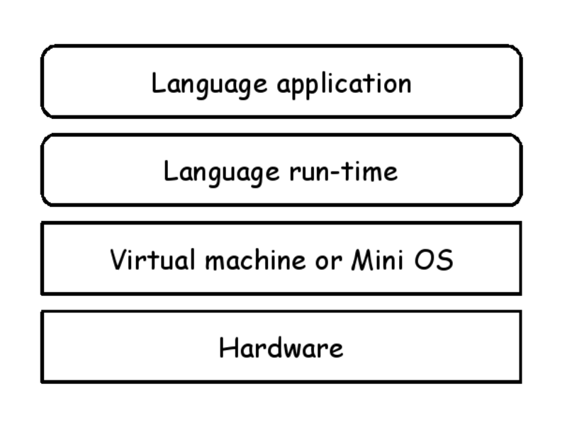
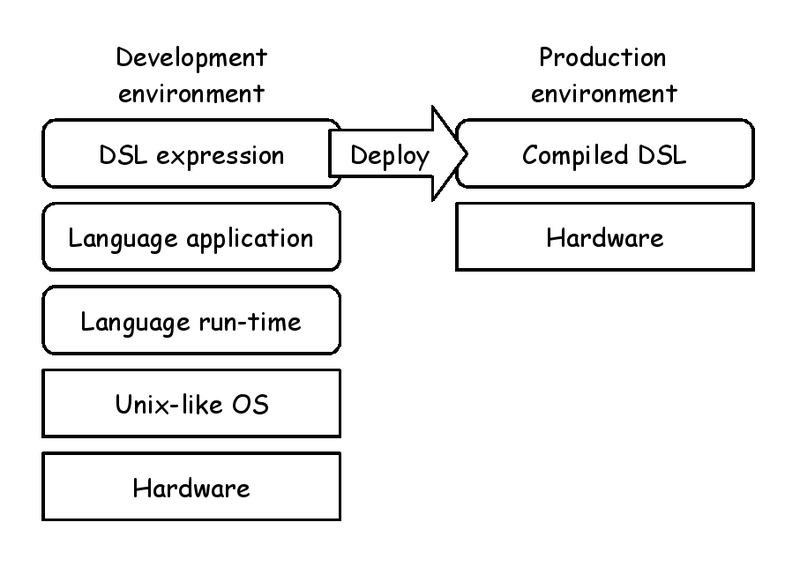
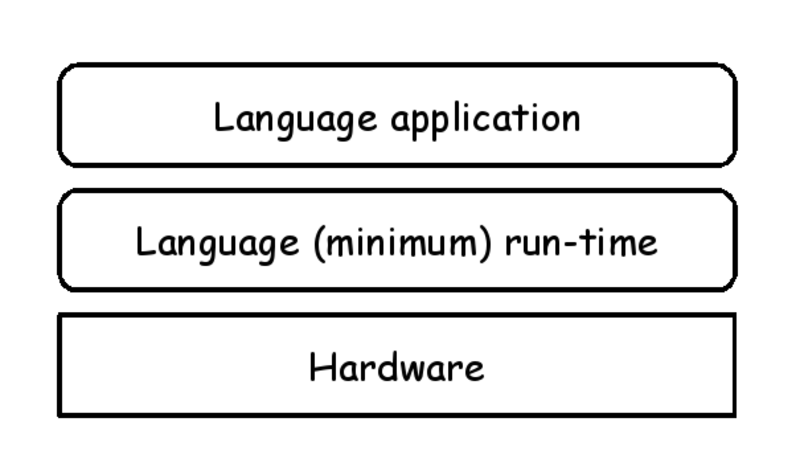
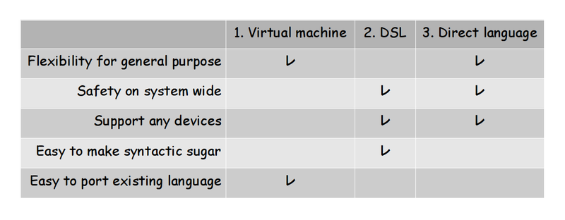
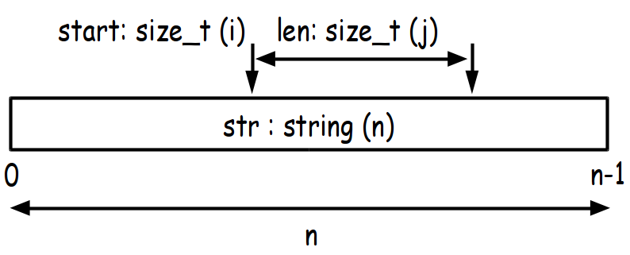
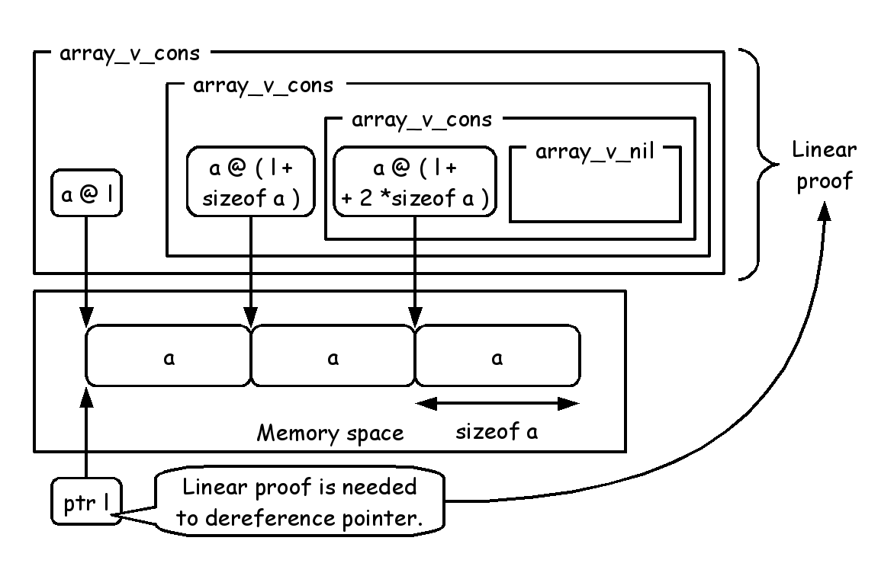

# Arduino programming of ML-style in ATS

Kiwamu Okabe @ METASEPI DESIGN / Hongwei Xi @ Boston University

# Demo: Video

* LED fadein
* ⇒ xxx
* LCD greeting
* ⇒ http://youtu.be/5uPue0Jo1nc

# Demo: Software Architecture

https://github.com/fpiot/arduino-ats


# Arduino Uno hardware

It's poor.

* 8-bit Harvard architecture
* Flash Memory: 32 KB
* SRAM: 2 KB

Many people use C language on the hardware.

# Problem of C language

* Memory/Resource leak
* Out of bounds
* Weak type

We need functional language for embedded system!

# Approach 1: Virtual machine



# Approach 2: DSL



# Approach 3: Direct language



# Comparison of the approaches

We choose the 3rd approach.



# ATS language


* http://www.ats-lang.org/
* Dependent types
* Linear types
* Optional GC
* Optional malloc/free
* Optional run-time

# Functional style programming

* Functional style programming can be used with ATS on embedded system?
* Yes.
* But only use some of functional style technique in ATS without GC and malloc/free.
* Let's see some examples.

# Style 1. Envless function


* Environment less function.
* Not closure.
* C language function is also envless function.

```
%{^ // C language code
int cfunc(int a, int b) {
        return (a + b);
}
%}
// ATS language code
extern fun cfunc (a: int, b: int): int = "mac#"

implement main0 () = println! (cfunc (1, 2)) // => 3
```

# Style 2. Stack closure


Stack closure is allocated on stack.
It can use free variable.

```
fun run (f: &int -<clo1> int): int = f 1

implement main0 () = {
  val b = 2
  var plus = lam@ (a: int):int => a + b
  val () = println! (run plus) // => 3
}
```

# Style 3. Template function


The template is functorial style that has lexical scoping.

```
extern fun{} base (): int

fun{} plus (a: int): int = a + base ()

implement main0 () = {
  implement{} base () = 2
  val () = println! (plus 1) // => 3
}
```

# Safety shaped by ATS

* ATS is a better C language.
* "Better" is meaning "more safe".
* Let's see some examples.

# Safety 1. Termination metrics


".<255 - n>." is termination metric that grows smaller on each recursive call, for termination-checking.

```
fun loop_fadein {n:nat | n <= 255} .<255 - n>. (i: int n): void = {
  val () = analogWrite (LED, i)
  val () = delay_ms (BLINK_DELAY_MS)
  val () = if i < 255 then loop_fadein (i + 1)
}
...
val () = loop_fadein 0
```

# Safety 2. Dependent types


"size_t (i)" is a type that depends on static value "i".
"i" has constraint "i < n".
If the constraint is not solved, it causes compile error.

```
fun lcd_print {n:int}{i:nat | i < n}{j:nat | i + j <= n}
      (lcd: !lcd_t, str: string (n), start: size_t (i),
       len: size_t (j)): void
```



# Safety 3. View


View is Prop that should be produced and consumed.

If produced View was not consumed, it causes compile error.

```
// lcd.sats - Library interface
absvtype lcd_t = ptr
fun lcd_open (rs: int, rw: int, enable: int, d0: int, d1: int,
              d2: int, d3: int): lcd_t // Produce view
fun lcd_close (lcd: lcd_t): void // Consume view

// main.dats - Application code
implement main () = {
  val lcd = lcd_open (8, 13, 9, 4, 5, 6, 7)
  // ...Do something...
  val () = lcd_close lcd // <= If not, compile error occurs.
}
```

# Safety 4. At-view


```
dataview array_v (a:t@ype+, addr, int) =
  | {l:addr} array_v_nil (a, l, 0)
  | {l:addr}{n:nat} array_v_cons (a, l, n+1) of
                    (a @ l, array_v (a, l+sizeof(a), n))
```



# Demo code: LED fadein


```
#define LED 9
#define DELAY_MS 10.0
typedef analog_w_t = natLt(256)

fun{} int_foreach_clo{n:nat}
(n: int(n), fwork: &natLt(n) -<clo1> void): void =
  loop(0, fwork) where {
  fun loop{i:nat | i <= n} .<n-i>.
    (i: int(i), fwork: &natLt(n) -<clo1> void): void =
    if i < n then (fwork(i); loop (i+1, fwork))
}

implement main () = {
  fun fadein() = let
    var fwork = lam@ (n: analog_w_t) =>
      (analogWrite (LED, n); delay_ms(DELAY_MS))
  in
    int_foreach_clo(256, fwork)
  end // end of [fadein]
  val () = pinMode (LED, OUTPUT)
  val () = (fix f(): void => (fadein(); f()))()
}
```

# Demo code: LCD greeting (cont.)


```
#define MY_DELAY_MS 400.0
#define LCD_WIDTH 16

val g_str_atsrun = "<ATS running!>"
val g_str_message = "...Greeting message..."

implement main () = {
  fun loop {n:int}{i:nat | i < n} .<n-i>.
         (lcd: !lcd_t, str: string (n), pos: size_t (i)): void = {
    val () = if pos + i2sz LCD_WIDTH <= length str then {
      val () = lcd_setCursor (lcd, 1, 0)
      val () = lcd_print (lcd, g_str_atsrun, i2sz 0,
                          length g_str_atsrun)
      val () = lcd_setCursor (lcd, 0, 1)
      val () = lcd_print (lcd, str, pos, i2sz LCD_WIDTH)
      val () = delay_ms (MY_DELAY_MS)
      val () = loop (lcd, str, pos + 1)
    }
  }
```

# Demo code: LCD greeting


```
  fun forever {n:int}{i:nat | i < n}
              (lcd: !lcd_t, str: string (n), pos: size_t (i)):
              void = {
    val () = loop (lcd, str, pos)
    val () = forever (lcd, str, pos)
  }
  val lcd = lcd_open (8, 13, 9, 4, 5, 6, 7)
  val () = forever (lcd, g_str_message, i2sz 0)
  val () = lcd_close lcd
}
```

# Binary size efficiency

For examples on "Getting Started with Arduino", ATS has good binary size efficiency as well as C.


# Conclusion

xxx

# License of photos

```
* Title xxx
  https://xxx
  Copyright: 20xx Name / License: CC
```
