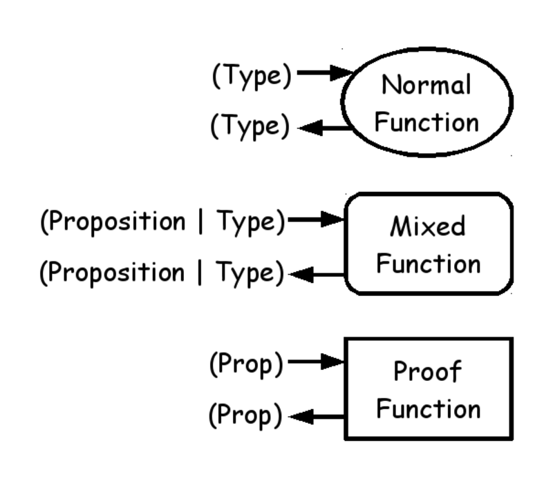
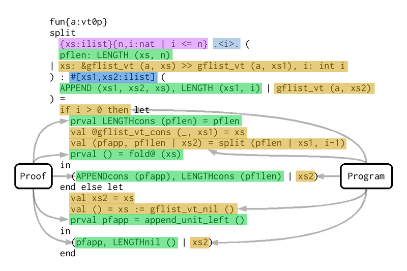
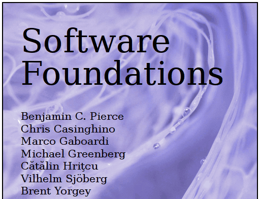
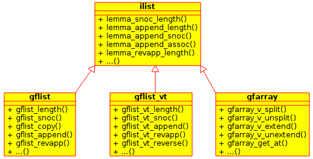
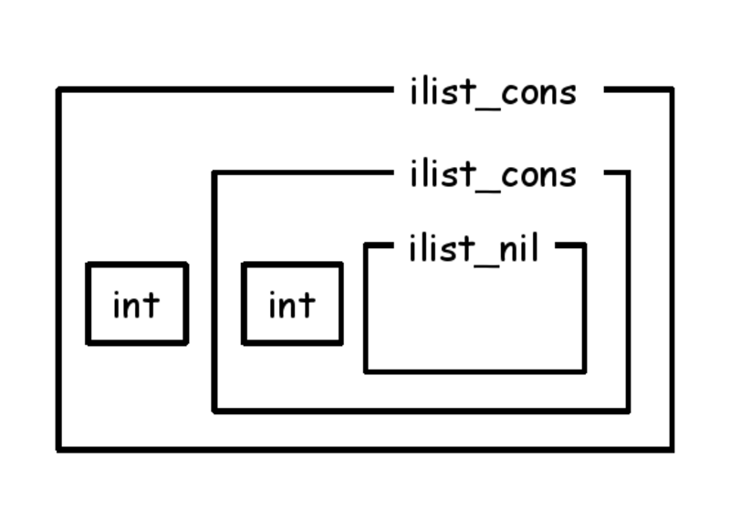
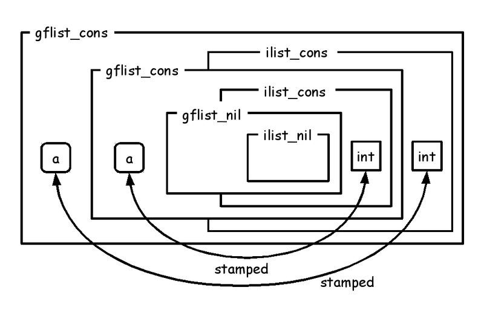
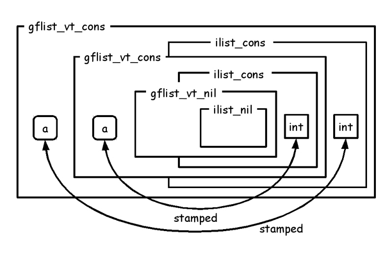
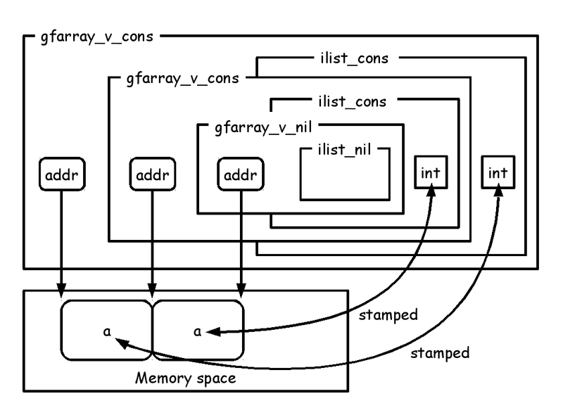

# ATS/LF for Coq users

Kiwamu Okabe

# What is ATS?


* http://www.ats-lang.org/
* DML-style dependent types
* Linear types
* Optional GC
* Optional malloc/free
* Optional run-time

# Author: Hongwei Xi


# What is ATS/LF?

* Subsystem for therorem-proving
* Construct proofs as total functions
* Without tactic
* Can mix proof with implementation
* Programming with Theorem-Proving (PwTP)

# Curry–Howard in ATS

* Type: Function signature introduced by keyword "fun"
* Program: Function body introduced by keyword "implement"
* Proposition: Proof function signature introduced by keyword "prfun"
* Proof: Proof function body introduced by keyword "primplement"

# Style of functions on ATS



# Grammar of function signature


# Application before compiling


# Application after compiling

Proof is erased at compile time.


# Grammar of function body



# Pros of mixed function

You can write following application:

* Program without garbage collection
* Proof to prove the program

Good news for low-level programming!

# Start at Software Foundations

```
http://www.cis.upenn.edu/~bcpierce/sf/current/
http://proofcafe.org/sf-beta/
Chapter "Prop: Propositions and Evidence"
```



# Day of week on Coq

```
(* Coq *)
Inductive day : Type :=
  | monday : day
  | tuesday : day
  | wednesday : day
  | thursday : day
  | friday : day
  | saturday : day
  | sunday : day.

Inductive good_day : day -> Prop :=
  | gd_sat : good_day saturday
  | gd_sun : good_day sunday.

Theorem gds : good_day sunday.
Proof. apply gd_sun. Qed.
```

# Day of week on ATS/LF

```
(* ATS/LF *)
datasort Day =
  | Monday
  | Tuesday
  | Wednesday
  | Thursday
  | Friday
  | Saturday
  | Sunday

dataprop Good_Day (Day) =
  | Gd_Sat (Saturday) of ()
  | Gd_Sun (Sunday) of ()

extern prfun gds: Good_Day Sunday
primplement gds = Gd_Sun ()
```

# To typecheck ATS/LF code

```
$ patsopt -tc -d main.dats
```

The command only does type check.
It's useful to check proof.

Also you can use flymake on Emacs.

```
https://github.com/githwxi/ATS-Postiats/blob/master/utils/emacs/ats2-flymake.el
```

# More proof on Coq (cont.)

```
(* Coq *)
Inductive day_before : day -> day -> Prop :=
  | db_tue : day_before tuesday monday
  | db_wed : day_before wednesday tuesday
  | db_thu : day_before thursday wednesday
  | db_fri : day_before friday thursday
  | db_sat : day_before saturday friday
  | db_sun : day_before sunday saturday
  | db_mon : day_before monday sunday.

Inductive ok_day : day -> Prop :=
  | okd_gd : forall d,
      good_day d ->
      ok_day d
  | okd_before : forall d1 d2,
      ok_day d2 ->
      day_before d2 d1 ->
      ok_day d1.
```

# More proof on Coq

```
Definition okdw : ok_day wednesday :=
  okd_before wednesday thursday
    (okd_before thursday friday
       (okd_before friday saturday
         (okd_gd saturday gd_sat)
         db_sat)
       db_fri)
    db_thu.
```

# More proof on ATS/LF

```
(* ATS/LF *)
dataprop Day_Before (Day, Day) =
  | DB_Tue (Tuesday, Monday) of ()
  | DB_Wed (Wednesday, Tuesday) of ()
  | DB_Thu (Thursday, Wednesday) of ()
  | DB_Fri (Friday, Thursday) of ()
  | DB_Sat (Saturday, Friday) of ()
  | DB_Sun (Sunday, Saturday) of ()
  | DB_Mon (Monday, Sunday) of ()

dataprop Ok_Day (Day) =
  | {d:Day} Okd_Gd (d) of (Good_Day d)
  | {d1,d2:Day} Okd_Before (d1) of (Ok_Day d2, Day_Before (d2, d1))

prfun okdw: Ok_Day Wednesday = let
  prval okd_sat = Okd_Gd (Gd_Sat ())
  prval okd_fri = Okd_Before (okd_sat, DB_Sat ())
  prval okd_thu = Okd_Before (okd_fri, DB_Fri ())
  prval okd_wed = Okd_Before (okd_thu, DB_Thu ())
in
  okd_wed
end
```

# Proof using recursion

```
(* Coq *)
Inductive ev : nat -> Prop :=
  | ev_0 : ev O
  | ev_SS : forall n:nat, ev n -> ev (S (S n)).

Theorem ev_ev_even : forall n m,
  ev (n+m) -> ev n -> ev m.
Proof.
  (* FILL IN HERE *) Admitted.
```

```
(* ATS/LF *)
dataprop Ev (int) =
  | Ev_0 (0) of ()
  | {n:nat} Ev_SS (n+2) of Ev n

prfun ev_ev_even {n,m:nat} .<n>. (enm: Ev (n+m), en: Ev n): Ev m =
  case+ en of
  | Ev_0 () => enm
  | Ev_SS en' => let
      prval Ev_SS enm' = enm
    in
      ev_ev_even (enm', en')
    end
```

# Proved list



# Abstract list

Defined at libats/SATS/ilist_prf.sats.

```
datasort ilist =
  | ilist_nil of ()
  | ilist_cons of (int, ilist)
```



# Proposition without proof

```
dataprop LENGTH (ilist, int) =
  | LENGTHnil(ilist_nil, 0) of ()
  | {x:int}{xs:ilist}{n:nat}
    LENGTHcons(ilist_cons (x, xs), n+1) of LENGTH (xs, n)

dataprop SNOC (ilist, int, ilist) =
  | {x:int} SNOCnil (ilist_nil, x, ilist_sing (x)) of ()
  | {x0:int}{xs1:ilist}{x:int}{xs2:ilist}
    SNOCcons (ilist_cons (x0, xs1), x, ilist_cons (x0, xs2))
      of SNOC (xs1, x, xs2)
```

# Proposition with proof

```
prfun lemma_snoc_length
  {xs:ilist}{x:int}{xsx:ilist}{n:int}
  (pf1: SNOC (xs, x, xsx), pf2: LENGTH (xs, n)): LENGTH (xsx, n+1)

primplmnt lemma_snoc_length (pf1, pf2) = let
  prfun lemma
    {xs:ilist}{x:int}{xsx:ilist}{n:int} .<xs>.
    (pf1: SNOC (xs, x, xsx), pf2: LENGTH (xs, n)): LENGTH (xsx, n+1) = let
  in
    case+ pf1 of
    | SNOCnil () => let
        prval LENGTHnil () = pf2 in LENGTHcons (LENGTHnil ())
      end
    | SNOCcons (pf1) => let
        prval LENGTHcons (pf2) = pf2 in LENGTHcons (lemma (pf1, pf2))
      end
  end
in
  lemma (pf1, pf2)
end
```

# Concrete list

* libats/SATS/gflist.sats - with GC
* libats/SATS/gflist_vt.sats - without GC, with malloc/free
* libats/SATS/gfarray.sats - without GC and malloc/free

# gflist

```
datatype gflist (a:t@ype+, ilist) =
  | gflist_nil (a, ilist_nil) of ()
  | {x:int} {xs:ilist}
    gflist_cons (a, ilist_cons (x, xs)) of (stamped_t (a, x), gflist (a, xs))
```



# gflist_vt

```
datavtype gflist_vt (a:vt@ype+, ilist) =
  | gflist_vt_nil (a, ilist_nil) of ()
  | {x:int} {xs:ilist}
    gflist_vt_cons
      (a, ilist_cons (x, xs)) of (stamped_vt (a, x), gflist_vt (a, xs))
```



# gfarray

```
dataview gfarray_v (a:vt@ype+, addr, ilist) =
  | {l:addr}
    gfarray_v_nil (a, l, ilist_nil) of ()
  | {x:int}{xs:ilist}{l:addr}
    gfarray_v_cons (a, l, ilist_cons (x, xs)) of
      (stamped_vt (a, x) @ l, gfarray_v (a, l+sizeof(a), xs))
```



# Prove palindrome

```
dataprop PAL (ilist) =
  | PALnil (ilist_nil) of ()
  | {x:int} PALone (ilist_sing (x)) of ()
  | {x:int}{l,ll:ilist}
    PALcons (ilist_cons (x, ll)) of (PAL (l), SNOC (l, x, ll))
```

# For more detail

Read "Functional Ikamusume" book!

```
http://www.paraiso-lang.org/ikmsm/books/c88.html
```


