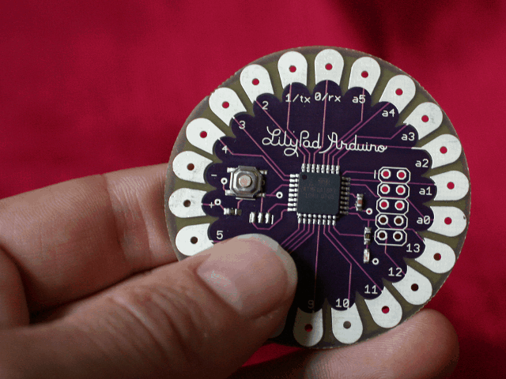
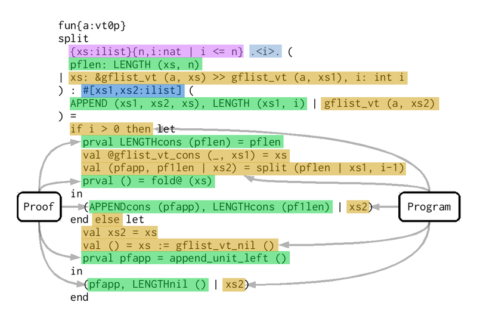
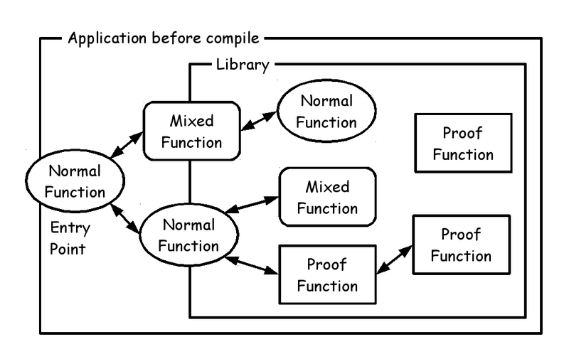
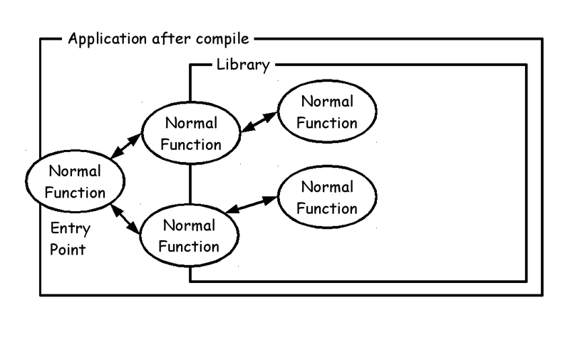
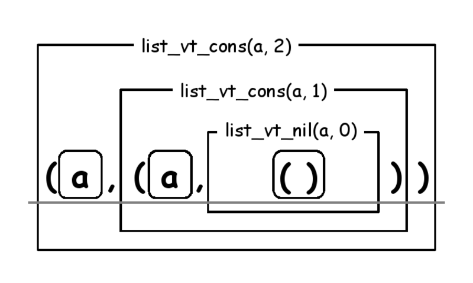
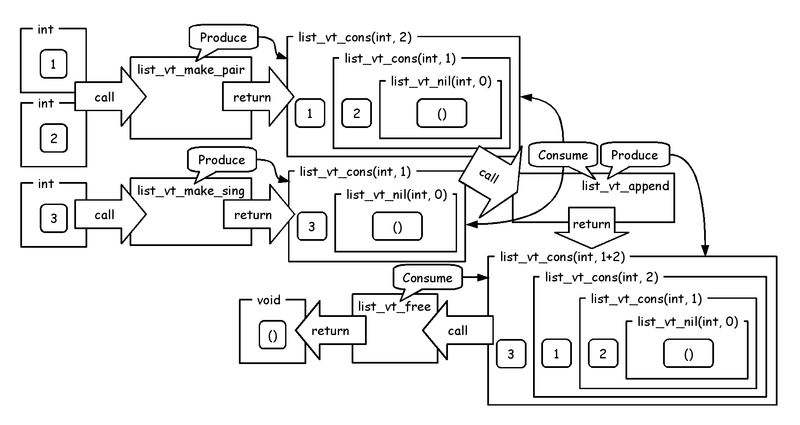

# ATS language overview


Kiwamu Okabe

# Remember Heartbleed bug?


Should we use safer language than C?

~~~
== In English ==
"Preventing heartbleed bugs with safe programming languages"
http://bluishcoder.co.nz/2014/04/11/preventing-heartbleed-bugs-with-safe-languages.html

== In Japanease ==
"安全なプログラミング言語を使って heartbleed を防ぐには"
https://github.com/jats-ug/translate/blob/master/Web/bluishcoder.co.nz/2014/04/11/preventing-heartbleed-bugs-with-safe-languages.md
~~~

"A safer systems programming language could have prevented the bug."

# What is ATS?


* http://www.ats-lang.org/
* Syntax like ML
* DML-style dependent types
* Linear types
* Optional GC
* Optional malloc/free
* Optional run-time

# Author: Hongwei Xi


# Fizzbuzz on Standard ML


```


(* http://rosettacode.org/wiki/FizzBuzz#Standard_ML *)
local
  fun fbstr i =
    case (i mod 3 = 0, i mod 5 = 0) of
        (true , true ) => "FizzBuzz"
      | (true , false) => "Fizz"
      | (false, true ) => "Buzz"
      | (false, false) => Int.toString i

  fun fizzbuzz' (n, j) =
    if n = j then ()
      else (print (fbstr j ^ "\n"); fizzbuzz' (n, j+1))
in
  fun fizzbuzz n = fizzbuzz' (n, 1)
  val _ = fizzbuzz 100
end
```

# Fizzbuzz on ATS


```
#include "share/atspre_define.hats"
#include "share/atspre_staload.hats"

local
  fun fbstr (i:int): string =
    case (i mod 3 = 0, i mod 5 = 0) of
        (true , true ) => "FizzBuzz"
      | (true , false) => "Fizz"
      | (false, true ) => "Buzz"
      | (false, false) => tostring_int i

  fun fizzbuzz' (n:int, j:int): void =
    if n = j then ()
      else (println! (fbstr j); fizzbuzz' (n, j+1))
in
  fun fizzbuzz (n:int): void = fizzbuzz' (n, 1)
  val _ = fizzbuzz 100
end

implement main0 () = ()
```

# How to compile it


```
$ patscc -DATS_MEMALLOC_LIBC -o fizzbuzz fizzbuzz.dats
$ ls
fizzbuzz*  fizzbuzz.dats  fizzbuzz_dats.c
$ size fizzbuzz
   text    data     bss     dec     hex filename
   6364     796      40    7200    1c20 fizzbuzz
$ ldd fizzbuzz
        linux-vdso.so.1 (0x00007ffefef06000)
        libc.so.6 => /lib/x86_64-linux-gnu/libc.so.6 (0x00007fd024f9b000)
        /lib64/ld-linux-x86-64.so.2 (0x00005623ca0a6000)
$ ./fizzbuzz | head
1
2
Fizz
4
Buzz
Fizz
7
8
Fizz
Buzz
```

# ATS compile flow


# What can ATS do?



* Write code on bare metal hardware
* Write code in Linux kernel
* Use strong type without any OS
* Prove code using dependent types
* Safely use malloc using linear types
* Safely use pointer using linear types

# Demo running on bare metal


http://youtu.be/5uPue0Jo1nc

Arduino Uno hardware:

* 8-bit Harvard architecture
* Flash Memory: 32 KB
* SRAM: 2 KB

# Demo software architecture


# Proof: Curry–Howard in ATS


* Type: Function signature introduced by keyword "fun"
* Program: Function body introduced by keyword "implement"
* Proposition: Proof function signature introduced by keyword "prfun"
* Proof: Proof function body introduced by keyword "primplement"

# Proof: style of functions


# Proof: function signature


# Proof: function body




# Proof: before compiling




# Proof: after compiling


Proof is erased at compile time.



# Proof: pros of mixed function


You can write following application:

* Program without garbage collection
* Proof to prove the program

Good news for low-level programming!

# Linear type: type of list




# Linear type: create list


Linear type watches your resource.


# Linear type: append list




# Please read our fanzine !


Read "Functional Ikamusume" book!

```
http://www.paraiso-lang.org/ikmsm/books/c88.html
```


# Join "Japan ATS User Group" !


http://jats-ug.metasepi.org/

We translate following ATS documents into Japanese.

~~~
* ATSプログラミング入門
  http://jats-ug.metasepi.org/doc/ATS2/INT2PROGINATS/
* ATSプログラミングチュートリアル
  http://jats-ug.metasepi.org/doc/ATS2/ATS2TUTORIAL/
* Effective ATS
  https://github.com/jats-ug/translate/blob/master/Manual/EffectiveATS.md
~~~

Join us and review it!
