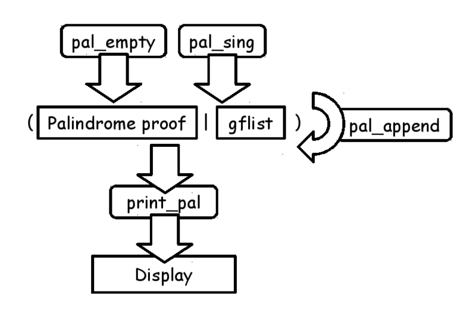
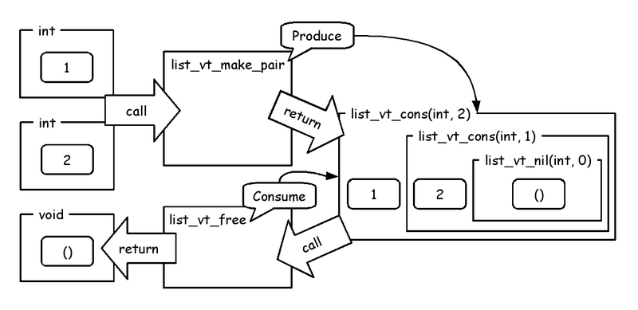
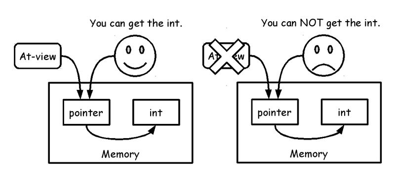

# ATS language overview'


Kiwamu Okabe

# Remember Heartbleed bug?


Should we use safer language than C?

~~~
== In English ==
"Preventing heartbleed bugs with safe programming languages"
http://bluishcoder.co.nz/2014/04/11/preventing-heartbleed-bugs-with-safe-languages.html

== In Japanease ==
"安全なプログラミング言語を使って heartbleed を防ぐには"
https://github.com/jats-ug/translate/blob/master/Web/bluishcoder.co.nz/2014/04/11/preventing-heartbleed-bugs-with-safe-languages.md
~~~

"A safer systems programming language could have prevented the bug."

# Want the safer language... It's ATS!


* http://www.ats-lang.org/
* Syntax like ML
* DML-style dependent types
* Linear types
* Optional GC
* Optional malloc/free
* Optional run-time

# How to install ATS compiler


* In English: http://bit.ly/instats
* In Japanese: http://bit.ly/instatsj

# Install ATS compiler into Debian #1


* Get source code of ATS compiler compiler

~~~
$ wget http://downloads.sourceforge.net/project/ats2-lang/ats2-lang/ats2-postiats-0.2.4/ATS2-Postiats-0.2.4.tgz
$ wget http://downloads.sourceforge.net/project/ats2-lang/ats2-lang/ats2-postiats-0.2.4/ATS2-Postiats-contrib-0.2.4.tgz
~~~

* Install packages needed by the ATS compiler

~~~
$ sudo apt-get install gcc libgc-dev libgmp-dev make
~~~

# Install ATS compiler into Debian #2


* Compile the ATS compiler compiler

~~~
$ tar xf ATS2-Postiats-0.2.4.tgz
$ export PATSHOME=`pwd`/ATS2-Postiats-0.2.4
$ export PATH=${PATSHOME}/bin:${PATH}
$ tar xf ATS2-Postiats-contrib-0.2.4.tgz
$ export PATSHOMERELOC=`pwd`/ATS2-Postiats-contrib-0.2.4
$ cd ${PATSHOME}
$ ./configure
$ make
~~~

* Ready to compile ATS code!

~~~
$ patsopt --version
ATS/Postiats version 0.2.4 with Copyright (c) 2011-2015 Hongwei Xi
~~~

# Fizzbuzz on C language


```c
#include <stdio.h>

void print_fb(int i) {
	if (i % 3 == 0 && i % 5 == 0) {
		printf ("FizzBuzz\n");
	} else if (i % 3 == 0) {
		printf ("Fizz\n");
	} else if (i % 5 == 0) {
		printf ("Buzz\n");
	} else {
		printf ("%d\n", i);
	}
}

void fizzbuzz(int n, int j) {
	if (n != j) { print_fb(j); fizzbuzz(n, j+1); }
}

int main(void) {
	fizzbuzz(100, 1);
	return 0;
}
```

# Fizzbuzz on ATS language


```ats
#include "share/atspre_define.hats"
#include "share/atspre_staload.hats"

fun print_fb (i:int): void =
  case+ (i mod 3 = 0, i mod 5 = 0) of
    | (true , true ) => println! "FizzBuzz"
    | (true , false) => println! "Fizz"
    | (false, true ) => println! "Buzz"
    | (false, false) => println! i

fun fizzbuzz (n:int, j:int): void =
  if n != j then (print_fb j; fizzbuzz (n, j+1))

implement main0 () = {
  val () = fizzbuzz (100, 1)
}
```

# How to compile the ATS code


```
$ patscc -o fizzbuzz fizzbuzz.dats
$ ./fizzbuzz | head -20
1
2
Fizz
4
Buzz
Fizz
7
8
Fizz
Buzz
11
Fizz
13
14
FizzBuzz
16
17
Fizz
19
Buzz
```

# ATS binary is portable


* File size is 13 kB

```
$ ls -lh fizzbuzz
-rwxr-xr-x 1 kiwamu kiwamu 13K Nov  6 21:45 fizzbuzz*
```

* Number of undefined symbols is 6

```
$ nm fizzbuzz | grep 'U '
                 U __libc_start_main@@GLIBC_2.2.5
                 U exit@@GLIBC_2.2.5
                 U fflush@@GLIBC_2.2.5
                 U fprintf@@GLIBC_2.2.5
                 U fwrite@@GLIBC_2.2.5
                 U longjmp@@GLIBC_2.2.5
```

* Only depends on three libraries

```
$ ldd fizzbuzz
        linux-vdso.so.1 (0x00007ffe263d9000)
        libc.so.6 => /lib/x86_64-linux-gnu/libc.so.6 (0x00007fc3c363f000)
        /lib64/ld-linux-x86-64.so.2 (0x000055d77ccd1000)
```

# ATS compile flow


# What can ATS do?


* Write code on bare metal hardware
* Write code in Linux kernel
* Use strong type without any OS
* Prove code using dependent types
* Safely use malloc using linear types
* Safely use pointer using linear types

# Demo running on bare metal


http://youtu.be/5uPue0Jo1nc

Arduino Uno hardware:

* 8-bit Harvard architecture
* Flash Memory: 32 KB
* SRAM: 2 KB

# Demo software architecture


https://github.com/fpiot/arduino-ats


# The world of ATS programming


# Dynamics: ML-style programming


* Dynamics of ATS is similar to Standard ML.
* You should represent type signature of function, because ATS can't inference everything.
* You should introduce main function, because ATS code is compiled into C language.

# Fizzbuzz on Standard ML


```ocaml

(* http://rosettacode.org/wiki/FizzBuzz#Standard_ML *)

local
  fun fbstr i =
    case (i mod 3 = 0, i mod 5 = 0) of
        (true , true ) => "FizzBuzz"
      | (true , false) => "Fizz"
      | (false, true ) => "Buzz"
      | (false, false) => Int.toString i

  fun fizzbuzz' (n, j) =
    if n = j then ()
      else (print (fbstr j ^ "\n"); fizzbuzz' (n, j+1))
in
  fun fizzbuzz n = fizzbuzz' (n, 1)
  val _ = fizzbuzz 100
end
```

# Fizzbuzz on ATS


```ats
#include "share/atspre_define.hats"
#include "share/atspre_staload.hats"

local
  fun fbstr (i:int): string =
    case (i mod 3 = 0, i mod 5 = 0) of
        (true , true ) => "FizzBuzz"
      | (true , false) => "Fizz"
      | (false, true ) => "Buzz"
      | (false, false) => tostring_int i

  fun fizzbuzz' (n:int, j:int): void =
    if n = j then ()
      else (println! (fbstr j); fizzbuzz' (n, j+1))
in
  fun fizzbuzz (n:int): void = fizzbuzz' (n, 1)
  val _ = fizzbuzz 100
end

implement main0 () = ()
```

# Proof: Curry–Howard in ATS


* Type: Function signature introduced by keyword "fun"
* Program: Function body introduced by keyword "implement"
* Proposition: Proof function signature introduced by keyword "prfun"
* Proof: Proof function body introduced by keyword "primplement"

# Proof: Style of functions


# Proof: Function signature


# Proof: Function body


# Proof: Before compiling


# Proof: After compiling


Proof is erased at compile time.


# Proof: Pros of mixed function


You can write following application:

* Program without garbage collection
* Proof to prove the program

Good news for low-level programming!

# Prop is similar to Coq


* Coq is an interactive theorem prover.
* ATS also has subsystem for theorem-proving.
* But ATS doesn't have tactics.
* ATS constructs proofs as total functions.

# Prop: Coq code


```ocaml
(* Coq *)
Inductive day : Type :=
  | monday : day
  | tuesday : day
  | wednesday : day
  | thursday : day
  | friday : day
  | saturday : day
  | sunday : day.

Inductive good_day : day -> Prop :=
  | gd_sat : good_day saturday
  | gd_sun : good_day sunday.

Theorem gds : good_day sunday.
Proof. apply gd_sun. Qed.
```

# Prop: ATS code


```ats
(* ATS *)
datasort Day =
  | Monday
  | Tuesday
  | Wednesday
  | Thursday
  | Friday
  | Saturday
  | Sunday

dataprop Good_Day (Day) =
  | Gd_Sat (Saturday) of ()
  | Gd_Sun (Sunday) of ()

extern prfun gds: Good_Day Sunday
primplement gds = Gd_Sun ()
```

Coq and ATS have same structure.

# Prop: Design palindrome library


```
https://github.com/jats-ug/practice-ats/tree/master/atslf_palindrome
```



# Prop: Structure of palindrome


```ats
dataprop PAL (ilist) =
  | PALnil (ilist_nil) of ()
  | {x:int} PALone (ilist_sing (x)) of ()
  | {x:int}{l,ll:ilist}
    PALcons (ilist_cons (x, ll)) of (PAL (l), SNOC (l, x, ll))
```


# Prop: Proposition on palindrome


```ats
dataprop PAPPEND (ilist, ilist, ilist) =
  | {pxs:ilist} PAPPENDnil (pxs, ilist_nil, pxs) of PAL (pxs)
  | {pxs,pxsx,ys,pzs:ilist}{x:int}
    PAPPENDcons (pxs, ilist_cons (x, ys), pzs)
      of (SNOC (pxs, x, pxsx),
        PAPPEND (ilist_cons (x, pxsx), ys, pzs))

prfun pal_app {l,lr,m:ilist}
  (pf1: REVERSE (l, lr), pf2: APPEND (l, lr, m)): PAL (m)
```

# Prop: Some lemma


```ats
extern prfun
lemma2_reverse_scons {x:int}{xs:ilist}{ys1:ilist}
  (REVERSE(ilist_cons(x,xs), ys1)):
  [ys:ilist] (REVERSE(xs, ys), SNOC(ys, x, ys1))

extern prfun
lemma2_append_scons {x:int}{xs,ys:ilist}{ys1,zs1:ilist}
  (APPEND(xs, ys1, zs1), SNOC(ys, x, ys1)):
  [zs:ilist] (APPEND(xs, ys, zs), SNOC(zs, x, zs1))
```

# Prop: Prove palindrome append


```ats
primplement
pal_app {l,lr,m} (pf1, pf2) = let
  prfun lemma  {l,lr,m:ilist} .<l>.
      (pf1: REVERSE (l, lr), pf2: APPEND (l, lr, m)): PAL (m) =
    case+ pf2 of
    | APPENDnil () => let prval REVAPPnil () = pf1 in PALnil () end
    | APPENDcons(pf2) => let
        prval (pfrev, pfsnoc) = lemma2_reverse_scons (pf1)
        prval (pfapp, pfsnoc2) = lemma2_append_scons (pf2, pfsnoc)
        prval pfpal = lemma (pfrev, pfapp)
      in
        PALcons (pfpal, pfsnoc2)
      end
in
  lemma (pf1, pf2)
end
```

# Prop: Function signature using PAL


```ats
fun{a:t@ype} pal_empty
  (): (PAL (ilist_nil) | gflist (a, ilist_nil ()))
fun{a:t@ype} pal_sing
  {x:int} (x: stamped_t (a, x)):
  (PAL (ilist_sing(x)) | gflist (a, ilist_sing(x)))
fun{a:t@ype} pal_pappend
  {pxs,xs:ilist}
  (pf: PAL (pxs) | pxs: gflist (INV(a), pxs), xs: gflist (a, xs)):
  [pxsx:ilist] (PAL (pxsx), PAPPEND (pxs, xs, pxsx) |
    gflist (a, pxsx))
fun{a:t@ype} print_pal
  {xs:ilist} (pf: PAL (xs) | xs: gflist (INV(a), xs)): void
```

# Prop: Application using PAL


```ats
implement main0 () = {
  // Pullup
  val (pfpal | lpal) = pal_empty ()
  val (_ | l) = list2gflist $list{char}('L', 'U', 'P')
  val (pfpal, _ | lpal) = pal_pappend (pfpal | lpal, l)
  val () = print_pal<char> (pfpal | lpal)
  val () = print "\n"
  // Devil never even lived.
  val (pfpal | lpal) = pal_sing<char> (stamp_t 'R')
  val (_ | l) = list2gflist
    $list{char}('E', 'V', 'E', 'N', 'L', 'I', 'V', 'E', 'D')
  val (pfpal, _ | lpal) = pal_pappend (pfpal | lpal, l)
  val () = print_pal<char> (pfpal | lpal)
  val () = print "\n"
}
```

```
$ patscc main.dats -DATS_MEMALLOC_LIBC
$ ./a.out
P, U, L, L, U, P
D, E, V, I, L, N, E, V, E, R, E, V, E, N, L, I, V, E, D
```

# View is linear type


* View is linear type in ATS
* View manages producing and consuming resource
* Example of resource: memory chunk, array, list, queue, lock/unlock, session, ...
* At-view is a ticket to permit dereferencing pointer

# View: Type of list


List defined with linear type.


# View: Figure of create list




# View: Code of create list


```ats
#include "share/atspre_staload.hats"

implement main0 () = {
  val l = list_vt_make_pair (1, 2)
  val () = print_list_vt<int> l
(*val () = list_vt_free<int> l *) (* Compile-time error! *)
}
```

# View: Figure of append list


# View: Code of append list


```ats
#include "share/atspre_staload.hats"

implement main0 () = {
  val l1 = list_vt_make_pair (1, 2)
  val l2 = list_vt_make_sing 3
  val l3 = list_vt_append (l2, l1)
  val () = print_list_vt<int> l3 (* => 3, 1, 2 *)
(*val () = list_vt_free<int> l3 *) (* Compile-time error! *)
}
```

# At-view: Figure of using pointer




# At-view: Code of using pointer


```ats
#include "share/atspre_staload.hats"

implement main0 () = {
  val (pfat, pfgc | p) = ptr_alloc<int> () (* The pfat is an at-view *)
  val () = !p := 9                         (* Store value into pointer *)
  val () = println! !p                     (* Show value in the pointer *)
  val () = ptr_free (pfgc, pfat | p)
  val () = println! !p                     (* Compile-time error! *)
}
```

# Join "Japan ATS User Group" !


http://jats-ug.metasepi.org/

We translate following ATS documents into Japanese.

~~~
* ATSプログラミング入門
  http://jats-ug.metasepi.org/doc/ATS2/INT2PROGINATS/
* ATSプログラミングチュートリアル
  http://jats-ug.metasepi.org/doc/ATS2/ATS2TUTORIAL/
* Effective ATS
  https://github.com/jats-ug/translate/blob/master/Manual/EffectiveATS.md
~~~

Join us and review it!
