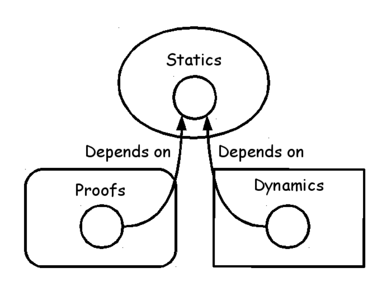
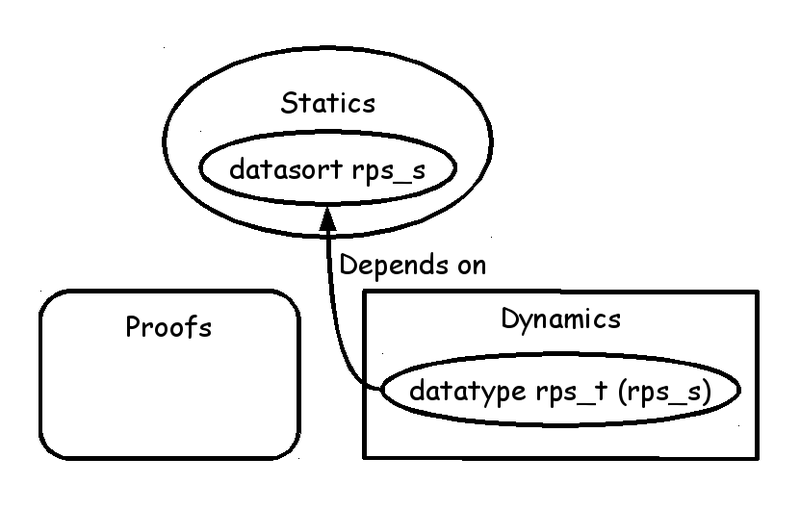
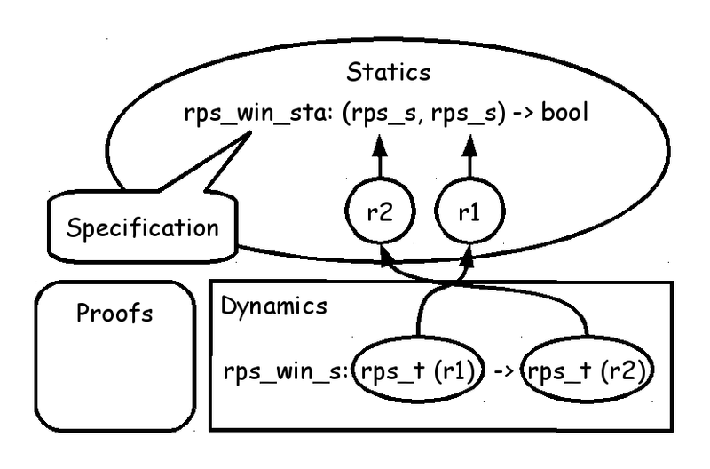
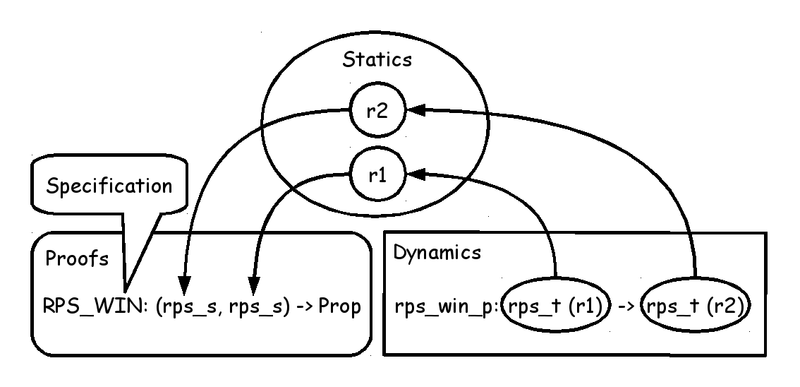
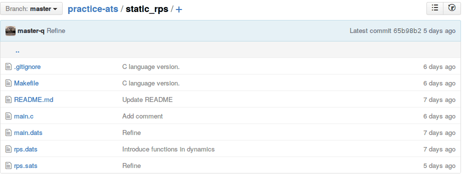

# Static typing and proof on ATS language

Kiwamu Okabe

# Let's make Rock-paper-scissors library

* "じゃんけん" in Japanese.


# RPS in C language #1


```c
#include <stdio.h>
#include <stdlib.h>

typedef enum {
	R_RPS_T = 0, /* Rock */
	P_RPS_T,     /* Paper */
	S_RPS_T      /* Scissors */
} rps_t;

void print_rps(rps_t x) {
	switch (x) {
	case R_RPS_T:
		printf("Rock"); break;
	case P_RPS_T:
		printf("Paper"); break;
	case S_RPS_T:
		printf("Scissors"); break;
	}
}
```

# RPS in C language #2


```c
rps_t rps_win_d(rps_t x) {
	switch (x) {
	case R_RPS_T:
		return P_RPS_T;
	case P_RPS_T:
		return S_RPS_T;
	case S_RPS_T:
		return R_RPS_T;
	default:
		abort();
	}
}

#define PACK(X,Y) ((X)<<4 | (Y))

rps_t rps_even_d(rps_t x, rps_t y) {
	switch (PACK(x, y)) {
	case PACK(P_RPS_T, R_RPS_T):
	case PACK(S_RPS_T, P_RPS_T):
	case PACK(R_RPS_T, S_RPS_T):
		return rps_win_d(x);
	default:
		abort();
	}
}
```

# RPS in C language #3


```c
int main() {
	rps_t paper_d = P_RPS_T;
	rps_t win_d = rps_win_d (paper_d);
	print_rps(win_d); printf(" win "); print_rps(paper_d); printf(".\n");
	/* => Scissors win Paper. */
	rps_t even_d = rps_even_d(win_d, paper_d);
	print_rps(even_d); printf(" is even between "); print_rps(win_d);
	printf(" and "); print_rps(paper_d); printf(".\n");
	/* => Rock is even between Scissors and Paper. */
}
```

# However you can make run-time error


```c
rps_t rps_win_d(rps_t x) {
	switch (x) {
	case R_RPS_T:
		return R_RPS_T; /* Run-time error! */
	case P_RPS_T:
		return S_RPS_T;
	case S_RPS_T:
		return R_RPS_T;
	default:
		abort();
	}
}

rps_t rps_even_d(rps_t x, rps_t y) {
	switch (PACK(x, y)) {
	case PACK(P_RPS_T, R_RPS_T):
	case PACK(S_RPS_T, P_RPS_T):
	case PACK(R_RPS_T, S_RPS_T):
		return rps_win_d(y); /* Run-time error! */
	default:
		abort(); /* We would like to avoid exception. */
	}
}
```

# ATS language


* http://www.ats-lang.org/
* DML-style dependent types
* Linear types
* Optional GC
* Optional malloc/free
* Optional run-time

More strong type can be used on the ATS.

# DML-style dependent types on ATS



# Type of RPS on ATS


```ats
datasort rps_s =
  | r_rps_s (* Rock *)
  | p_rps_s (* Paper *)
  | s_rps_s (* Scissors *)
datatype rps_t (rps_s) =
  | r_rps_t (r_rps_s) (* Rock *)
  | p_rps_t (p_rps_s) (* Paper *)
  | s_rps_t (s_rps_s) (* Scissors *)
typedef rps_t_any = [x:rps_s] rps_t (x)
```



# Only use Dynamics of ATS


```ats
fun{} rps_win_d (x: rps_t_any): rps_t_any
fun{} rps_even_d (x: rps_t_any, y: rps_t_any): rps_t_any (* The x should win the y. *)

implement{} rps_win_d (x) =
  case+ x of
  | r_rps_t() => p_rps_t()
  | p_rps_t() => s_rps_t()
  | s_rps_t() => r_rps_t()

implement{} rps_even_d (x, y) =
  case+ (x, y) of
  | (p_rps_t(), r_rps_t()) => rps_win_d (x)
  | (s_rps_t(), p_rps_t()) => rps_win_d (x)
  | (r_rps_t(), s_rps_t()) => rps_win_d (x)
  | (_, _) => $raise GenerallyExn("The x should win the y.")
```

# Also you can make run-time error


```ats
implement{} rps_win_d (x) =
  case+ x of
  | r_rps_t() => r_rps_t() (* Run-time error! *)
  | p_rps_t() => s_rps_t()
  | s_rps_t() => r_rps_t()

implement{} rps_even_d (x, y) =
  case+ (x, y) of
  | (p_rps_t(), r_rps_t()) => rps_win_d (x)
  | (s_rps_t(), p_rps_t()) => rps_win_d (y) (* Run-time error! *)
  | (r_rps_t(), s_rps_t()) => rps_win_d (x)
  | (_, _) => $raise GenerallyExn("The x should win the y.") (* We would like to avoid exception. *)
```

It's caused by having no specification in the implementation.
ATS language can have specification as Statics or Proofs.

# Specification using Statics of ATS


```ats
stacst rps_win_sta: (rps_s, rps_s) -> bool

fun{} rps_win_s
  {r1:rps_s} (x: rps_t (r1)):
  [r2:rps_s | rps_win_sta (r2, r1)] (rps_t (r2))
```



# Implementation using Statics of ATS


```ats
extern praxi rps_win_r_s_pf (): [rps_win_sta(r_rps_s, s_rps_s)] void (* Spec: Paper wins Rock *)
extern praxi rps_win_p_r_pf (): [rps_win_sta(p_rps_s, r_rps_s)] void (* Spec: Scissors win Paper *)
extern praxi rps_win_s_p_pf (): [rps_win_sta(s_rps_s, p_rps_s)] void (* Spec: Rock wins Scissors *)

implement{} rps_win_s (x) = let
  prval () = rps_win_r_s_pf() (* Introduce specification *)
  prval () = rps_win_p_r_pf()
  prval () = rps_win_s_p_pf()
in
  case+ x of
  | r_rps_t() => p_rps_t()
  | p_rps_t() => s_rps_t()
  | s_rps_t() => r_rps_t()
end
```

# Statics can catch error at compile-time


```ats


implement{} rps_win_s (x) = let
  prval () = rps_win_r_s_pf() (* Introduce specification *)
  prval () = rps_win_p_r_pf()
  prval () = rps_win_s_p_pf()
in
  case+ x of
  | r_rps_t() => r_rps_t() (* Compile-time error! *)
  | p_rps_t() => s_rps_t()
  | s_rps_t() => r_rps_t()
end
```

```
$ patscc main.dats -DATS_MEMALLOC_LIBC
/home/kiwamu/src/practice-ats/static_rps/rps.dats: 933(line=36, offs=18) -- 942(line=36, offs=27): error(3): unsolved constraint: C3NSTRprop(C3TKmain(); S2Eapp(S2Ecst(rps_win_sta); S2EVar(4434->S2Eapp(S2Ecst(r_rps_s); )), S2Evar(r1$2870(7929))))
```

# Specification using Proofs of ATS


```ats
dataprop RPS_WIN (rps_s, rps_s) =
  | RPS_P_WIN_R (p_rps_s, r_rps_s) (* Spec: Paper wins Rock *)
  | RPS_S_WIN_P (s_rps_s, p_rps_s) (* Spec: Scissors win Paper *)
  | RPS_R_WIN_S (r_rps_s, s_rps_s) (* Spec: Rock wins Scissors *)

fun{} rps_win_p
  {r1:rps_s} (x: rps_t (r1)):
  [r2:rps_s] (RPS_WIN (r2, r1) | rps_t (r2))
```



# Implementation using Proofs of ATS


```ats
implement{} rps_win_p (x) = case+ x of
  | r_rps_t() => (RPS_P_WIN_R() | p_rps_t())
  | p_rps_t() => (RPS_S_WIN_P() | s_rps_t())
  | s_rps_t() => (RPS_R_WIN_S() | r_rps_t())
```

# Proofs can catch error at compile-time


```ats
implement{} rps_win_p (x) = case+ x of
  | r_rps_t() => (RPS_R_WIN_S() | r_rps_t()) (* Compile-time error! *)
  | p_rps_t() => (RPS_S_WIN_P() | s_rps_t())
  | s_rps_t() => (RPS_R_WIN_S() | r_rps_t())
```

```
$ patscc main.dats -DATS_MEMALLOC_LIBC
/home/kiwamu/src/practice-ats/static_rps/rps.dats: 1199(line=45, offs=18) -- 1226(line=45, offs=45): error(3): the dynamic expression cannot be assigned the type [S2Eexi(r2$2876(7935); ; S2Etyrec(flt0; npf=1; 0=S2Eapp(S2Ecst(RPS_WIN); S2Evar(r2$2876(7935)), S2Evar(r1$2875(7934))), 1=S2Eapp(S2Ecst(rps_t); S2Evar(r2$2876(7935)))))].
```

# The code is found at GitHub

```
https://github.com/jats-ug/practice-ats/tree/master/static_rps
```



# License of photos

```
* A chart showing how the three game elements of "Rock-paper-scissors" interact.
  https://en.wikipedia.org/wiki/Rock-paper-scissors#/media/File:Rock-paper-scissors.svg
  Copyright: Antonsusi / License: CC BY-SA 3.0
```
