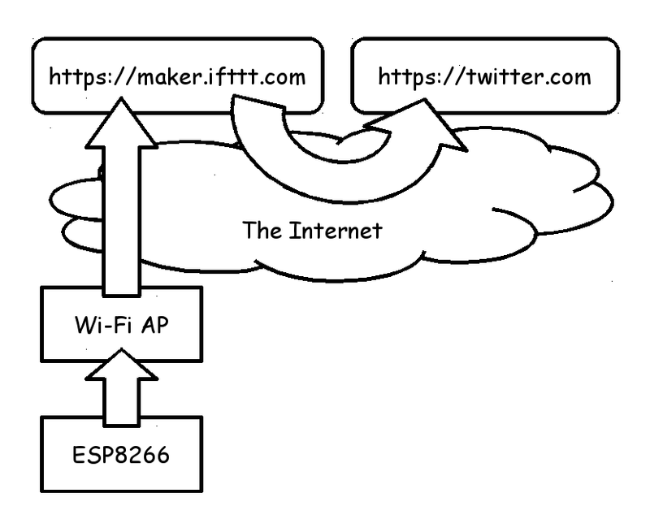
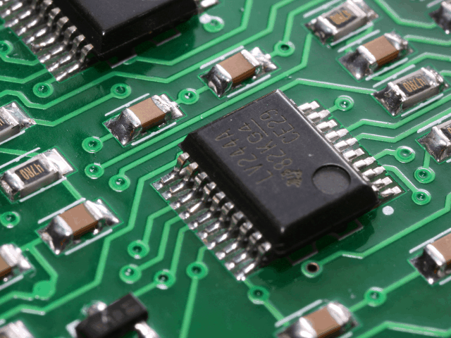

# ATS programming on ESP8266


Kiwamu Okabe

# ESP8266 module


* http://espressif.com/en/products/wroom/
* 32-bit low power MCU Wi-Fi Module
* Having integrated TCP/IP network stacks
* Including ADC, SDIO, UART, PWM, I2C ...
* Small form factor of only 18mm x 20mm

# ATS language


* http://www.ats-lang.org/
* DML-style dependent types
* Linear types
* Optional GC
* Optional malloc/free
* Optional run-time

# Demo

The code is found at following:

https://github.com/fpiot/esp8266-ats

# Demo environment



# Software architecture


# Example of ATS interface


```ats
(* https://github.com/fpiot/esp8266-ats/blob/ats/SATS/gpio.sats *)
%{#
#include "ets_sys.h"
#include "gpio.h"
%}

macdef BIT2 = $extval(uint, "BIT2")
macdef GPIO_OUT_ADDRESS  = $extval(int, "GPIO_OUT_ADDRESS")

macdef PERIPHS_IO_MUX_GPIO2_U = $extval(ptr, "PERIPHS_IO_MUX_GPIO2_U")
macdef FUNC_GPIO2 = $extval(uint, "FUNC_GPIO2")

fun GPIO_REG_READ (x: int): uint = "mac#"
fun PIN_FUNC_SELECT (p: ptr, v: uint): void = "mac#"
fun PIN_PULLUP_EN (p: ptr): void = "mac#"

fun gpio_init (): void = "mac#"
fun gpio_output_set (set_mask: uint, clear_mask: uint,
                     enable_mask: uint, disable_mask: uint): void = "mac#"
```

# Example of ATS application


```ats
(* https://github.com/fpiot/esp8266-ats/blob/ats/blinky_ats/user/user_main.dats *)
extern fun some_timerfunc (arg: ptr): void
implement some_timerfunc (arg) = {
  val () = println! "some_timerfunc() called."
  (* Do blinky stuff *)
  val v = GPIO_REG_READ(GPIO_OUT_ADDRESS) land BIT2
  val () = if v != 0 then
             (* Set GPIO2 to LOW *)
             gpio_output_set (0U, BIT2, BIT2, 0U)
           else
             (* Set GPIO2 to HIGH *)
             gpio_output_set (BIT2, 0U, BIT2, 0U)
}

extern fun user_init (): void = "mac#"
local
  var some_timer: os_timer_t
in
  implement user_init () = {
    val () = uart_div_modify(0, UART_CLK_FREQ / 115200)
    val () = println! "\nuser_init() start."
    val _  = wifi_set_opmode_current NULL_MODE
    (* Initialize the GPIO subsystem. *)
    val () = gpio_init ()
    (* Set GPIO2 to output mode *)
    val () = PIN_FUNC_SELECT (PERIPHS_IO_MUX_GPIO2_U, FUNC_GPIO2)
    (* Set GPIO2 low *)
    val () = gpio_output_set (0U, BIT2, BIT2, 0U);
```

# Functional IoT Meetup at December 12



# License of photos


```
* JTAG board 1 | Flickr - Photo Sharing!
  https://www.flickr.com/photos/amagill/2877921712/
  Copyright: Andrew Magill / License: CC BY 2.0
* Creative Commons BBB | Flickr - Photo Sharing!
  https://www.flickr.com/photos/steren/2732488224/
  Copyright: Steren Giannini / License: CC BY 2.0
```
