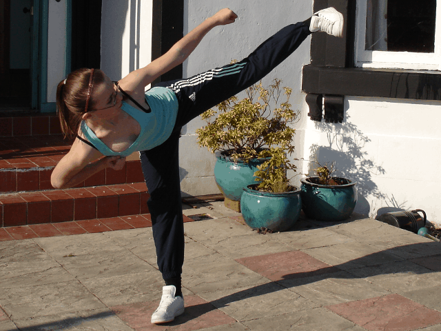
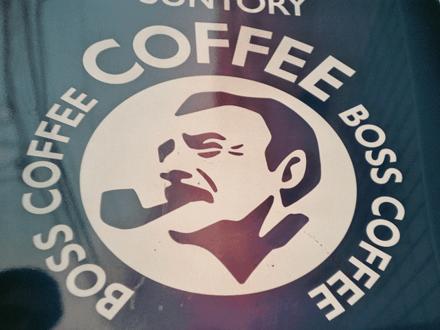
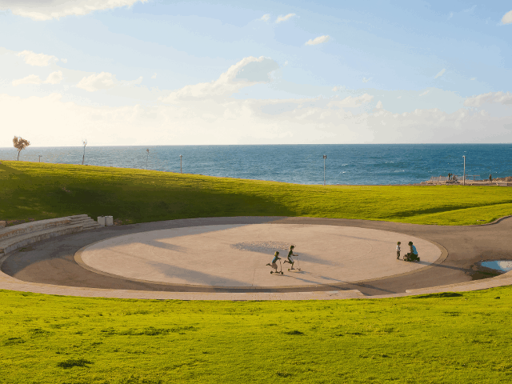
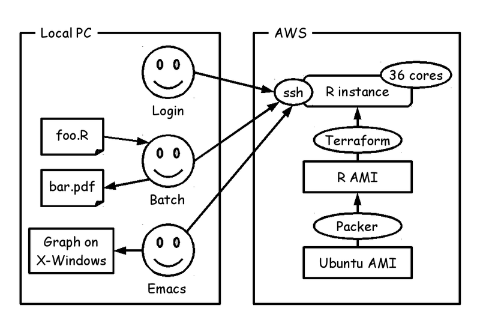
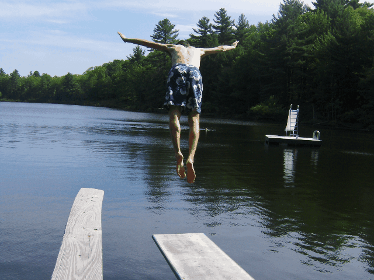

# Kick-R: Get your own R instance with 36 cores on AWS


Kiwamu Okabe @ Centillion Japan Co.,Ltd.

# One day, my boss said...


* Boss: "Hey, my R script needs much time to run..."
* Me: "O.K. I'll try to fix it using AWS!"

# My solution named "Kick-R"




# Demonstration


# How to build?


```
$ sudo apt-get install git make bundler unzip
$ cd /usr/local/bin
$ wget https://releases.hashicorp.com/packer/0.8.6/packer_0.8.6_linux_amd64.zip
$ wget https://releases.hashicorp.com/terraform/0.6.7/terraform_0.6.7_linux_amd64.zip
$ sudo unzip -x packer_0.8.6_linux_amd64.zip
$ sudo unzip -x terraform_0.6.7_linux_amd64.zip
$ export AWS_ACCESS_KEY_ID=XXXXXXXXXXXXXXXXXXXX
$ export AWS_SECRET_ACCESS_KEY=YYYYYYYYYYYYYYYYYYYYYYYYYYYYYYYYYYYYYYYY
$ cd ~/src
$ git clone https://github.com/centillion-tech/kick-r.git
$ cd kick-r
$ make setup
```

# How to run?


```
$ make
$ make ssh-config > ~/.ssh/config
$ ssh kick-r
ubuntu@ip-10-189-135-202:~$ R --version | head -1
R version 3.0.2 (2013-09-25) -- "Frisbee Sailing"
```

# How to use on Emacs?


```
M-x R
/ssh:kick-r:
```

X forwarding is available.

# How to cleanup all of environment?


```
make distclean
```

# Try it!


https://github.com/centillion-tech/kick-r

# License of photos #1


```
* Side Kick Cara | Flickr - Photo Sharing!
  https://www.flickr.com/photos/davishaw/442139414/
  Copyright: David Farrell-Shaw / License: CC BY 2.0
* Boss Coffee Vending Machine | Flickr - Photo Sharing!
  https://www.flickr.com/photos/chrishimself/3490002460/
  Copyright: Christian H. / License: CC BY 2.0
* Kicking scooters | Flickr - Photo Sharing!
  https://www.flickr.com/photos/amira_a/10597007134/
  Copyright: amira_a / License: CC BY 2.0
* amazon.co.jp Credit Card. | Flickr - Photo Sharing!
  https://www.flickr.com/photos/mujitra/2527994700/
  Copyright: MIKI Yoshihito / License: CC BY 2.0
* Dive | Flickr - Photo Sharing!
  https://www.flickr.com/photos/joeshlabotnik/516341295/
  Copyright: Peter Dutton / License: CC BY 2.0
```

# License of photos #2


```
* Creative Commons BBB | Flickr - Photo Sharing!
  https://www.flickr.com/photos/steren/2732488224/
  Copyright: Steren Giannini / License: CC BY 2.0
```
